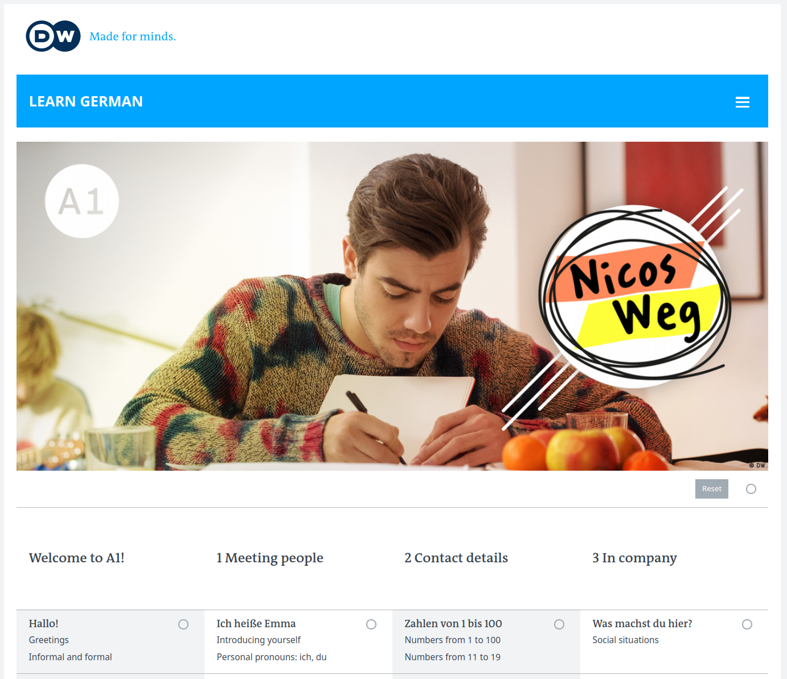
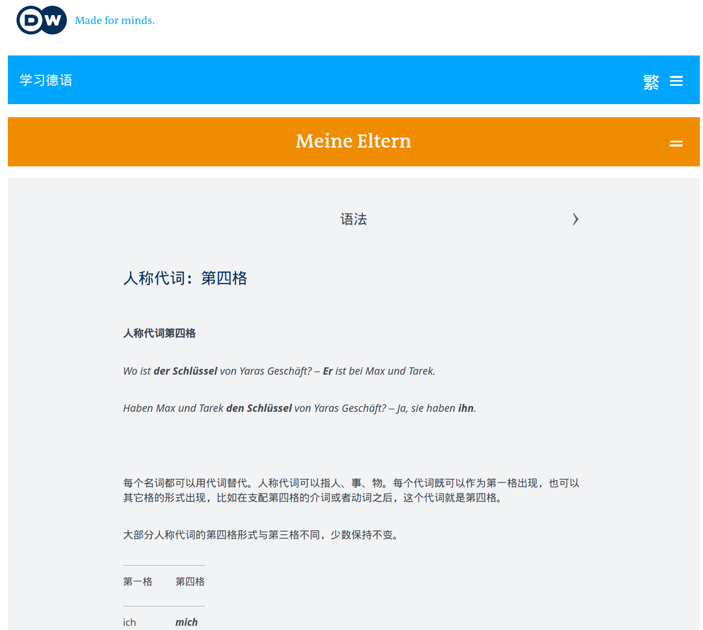
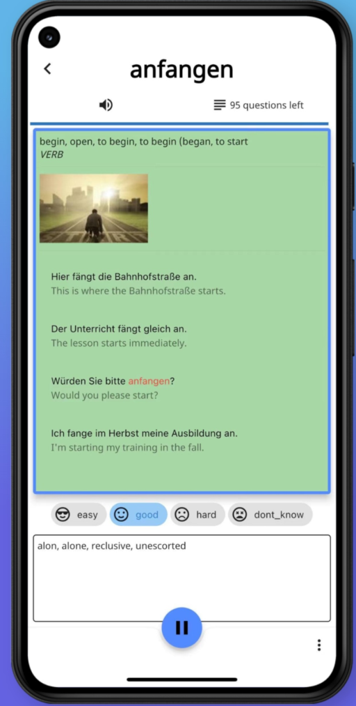
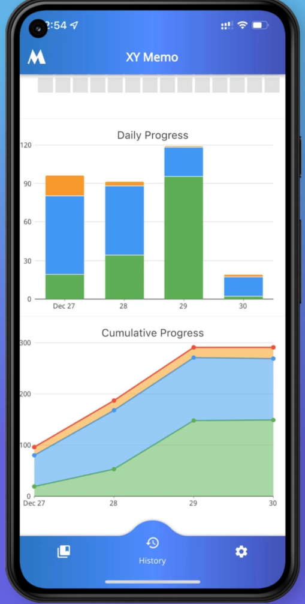
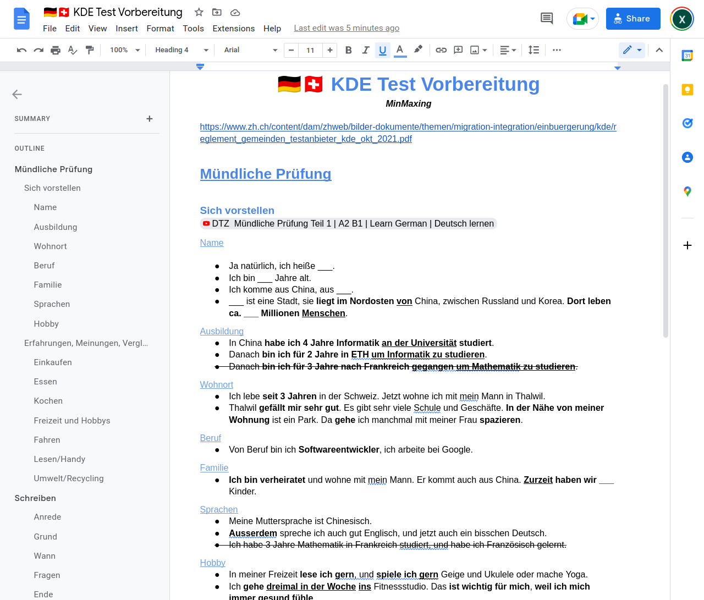

Title: 最水德语考试 -- 瑞士KDE考试速通攻略
Slug: kde-test-summary
Date: 2022-10-02
Tags: german, swiss

前一阵考过了KDE的德语B1/A2考试, 我和老婆一致认为这可能是最水的德语考试. 简单总结一下考试经验.

## 学德语的误区 
之前断断续续在Swissing上了两三年的德语课, 但是一直没敢去考试. 原因有三:

1) 平时上课不咋认真, 一周一次课的效果很差(作业没咋做, 过一周就忘了);  
2) 总感觉德语的语法太复杂了, 各种时态语态后缀, 搭配单词的阴阳中性总是记不住, 平时德语小测的成绩也一般;  
3) 感觉标准的TELC/Goethe考试难度很大.  

而真实的情况是:

1) 与其每周被动的上课听老师讲, 其实有更有效更实用的学德语方法(后面讲), 断断续续学一年的效果很可能不如突击两三个周末;  
2) 平时德语课的小测注重的是语法点, 实际上对于考试而言, 语法是最不重要的, 而主要在于是否能够理解日常对话/阅读场景. 与其花时间记忆词性/时态的各种"转换矩阵", 增加**词汇量**才是最有用的.  
3) TELC/Goethe比较偏学术, 大多是面向学生设计的. 其实在瑞士有面向来瑞工作的外籍人士的更简单实用的考试, 不但考试时间短而且难度相对较低, 比如接下来要介绍的KDE考试--

## KDE考试简介

[KDE考试](https://www.zh.ch/de/migration-integration/einbuergerung/kantonaler-deutschtest.html)是苏黎世州政府对外籍人士推出的德语认证, 难度为`听,说-B1; 读,写-A2` -- *正好是申请瑞士C-permit的最低语言要求*.

考试的内容一点也不学术, 反而更加侧重日常生活的理解交流能力. 比如听力考试可能是电话语音信箱或者火车上的播报, 阅读可能是市政府门口贴的活动宣传或者学校寄给家长的信件.

和KDE考试类似的还有[**SDS考试**](https://deutschtest.ch/), 难度和KDE相似, 而且它是平板电脑答题, 而且考试可以得到不同的等级(A1-B2), 对于一些家属签证想快速拿到A1成绩的也比较友好.

## 德语学习

由于KDE考试对语法的考察接近于0, 而且只要拿到60%的分数就算考试通过, 所以完全没必要学完德语B1才去考. 我感觉只要上完了德语的A1课程, 了解基本的语法点, 就可以准备考试了.

关于德语学习: **强烈推荐https://learngerman.dw.com上的免费德语自学课程**, 上面有非常丰富的学习资源, 各种难度都有. 备考时把"Nicos-Weg"的A1部分看完就基本上够了.

而且网站也提供中文界面, 其中语法的部分也是用中文解释的, 效果可能比瑞士老师用德语或者英语解释要好的多:

课程形式是几分钟的短视频加练习题和语法解释. 可以注册一个他们网站的帐号保存学习进度. 而且所有课程的视频合在一起是一个多小时的电影剧情, 在Youtube上就有.

花几个周末看完A1课程(没必要做完所有的课后练习), 基本掌握了语法以后, A2以上的内容就可以不看了. 接下来更重要的可能是积累德语词汇量以及语感.

>🚀**关于词汇量, 这里推荐我自己做的背单词app**: 市面上的都不太满意, 所以我自己做了个结合发音和图片, 重复记忆练习的app: 

 

*虽然目前还有一些功能没做, 但是用来积累几千的词汇量还是没问题的. 我自己和几个同事就是用它背单词, 效果还不错, 欢迎试用以及提供反馈!

> - [**安卓: PlayStore链接**](https://play.google.com/store/apps/details?id=io.github.x_wei.xymemo)
> - [**iOS: AppStore链接**](https://apps.apple.com/app/id1582381132)

总之词汇量积累到大约2000左右基本考试就够用了.

## 备考资料

KDE考试除了[官方样题](https://www.zh.ch/de/migration-integration/einbuergerung/kantonaler-deutschtest.html#-169484588)基本找不到别的资料, 这里分听说读写四部分说说KDE备考.

### 口语
**口语是考试最难的部分, 需要花最大精力去准备**, 但是KDE的口语和TELC比还是简单不少.

**第一部分是自我介绍**, 大约半分钟到一分钟, 这些都是可以提前准备的. 介绍完以后考官会根据你说的内容再问一两个问题, 比如你提到喜欢徒步, 考官可能就问你经常去哪里徒步; 或者提到自己喜欢美食, 考官可能问你知道瑞士哪些美食之类的.

这个自我介绍的部分完全可以参考TELC的口语考试第一部分, 比如:

<iframe width="560" height="315" src="https://www.youtube.com/embed/kiJgnx7qVk0" title="YouTube video player" frameborder="0" allow="accelerometer; autoplay; clipboard-write; encrypted-media; gyroscope; picture-in-picture" allowfullscreen></iframe>

**第二部分是讨论某个话题**, 考官会给你几个选项, 比如住房, 旅行, 购物, 工作, 家庭, 宠物, 娱乐. 然后你要就这个话题发表一下自己的看法, 然后考官再问一些问题. 比如聊到旅行, 考官可能会问在中国大家用什么交通工具旅行, 或者你最喜欢的宠物之类的.这一部分可以就几个常见话题提前准备一到两句话说熟练, 然后考试时再临场发挥一下.

同样可以参考TELC的口语模拟训练(Youtube上有许多), TELC口语第二部分包含图片描述和讨论, 取消图片描述, 只看后半段("Erfahrungen, Meinungen, Vergleichen")就和KDE考试类似. 搜"TELC DTZ mündliche prüfung B1"就可以找到很多模拟考的视频, 拿来磨耳朵.

为了准备KDE考试, 我**把常用句型和常见的主题做了一个GoogleDoc**, 大约三页A4纸:

>**🚀微信公众号中回复`KDE`即可获得GoogleDoc链接.**

### 听力
除了官方的听力题以外, 可以用TELC DTZ B1的听力来练习. Youtube上搜"telc b2 hören prüfung"就有一大堆, 完全可以平时坐车的时候用来磨耳朵.

而且KDE的听力考试远没有TELC那么难: 只有4段对话, 12道判断题(只要回答对/错), 答对60%就能过关. 所以稍微听懂一点, 剩下的蒙一下也就差不多了...

### 阅读
KDE的阅读题型都是固定的, 所以要**好好看官方例题**: 前两题是活动海报的信息, 三选一的选择题；第三题是好几个报纸的小广告然后连线匹配场景；最后一题是海报或者政府的信件, 题型是判断题.

这个还是比较简单的, 只要词汇量够了, 再稍微猜一下就可以.

### 写作
A2的写作长度大约是50个单词就好了, 内容一般或者是邀请函, 或者是回复朋友的邀请函, 套路还是比较固定的.

感觉只要稍微看看TELC A2的信件写作视频, 记住一些固定句式就OK了:

<iframe width="560" height="315" src="https://www.youtube.com/embed/Y-s4SWMfy8o" title="YouTube video player" frameborder="0" allow="accelerometer; autoplay; clipboard-write; encrypted-media; gyroscope; picture-in-picture" allowfullscreen></iframe>

## KDE考试流程
**报名**:  有不少网站可以报名, 直接搜"KDE test"即可. 我用的[sprachzentrum-zuerich.ch](https://sprachzentrum-zuerich.ch/deutschtest-einbuergerung-kde/)
- 报名费250, 如果上次只有口语没过, 可以只考口语(150)
- 报名时可以选择他们的备考课程, 一个小时要99CHF (我没用过, 感觉没必要).
- 报名时留下邮箱, 过几天就会收到账单的邮件

**模拟考**
  - 在考试前一周他们*有可能*会组织一下模拟考, 这个是完全免费的, 自愿参加, 注意查邮箱
  - 模拟考的内容其实和真正的KDE考试很不一样, 更多的是做一做练习拿到个分数心里有底.

**考试当天**
- 带上身份证件去就可以了, 大约有二三十人考, 分成两组: 一半先考笔试, 一半先考口试.
- **口试**:
  - 工作人员会发一些号码牌, 相邻号的两人一起考口语
  - 口试期间只需要和考官交流, 不用和同一组的人配合
- **笔试**:
  - 他们会提供纸笔, 统一把手机放到一个角落里
  - 先考听力, 就用一个普通的蓝牙音箱播放, 可以坐的离前排近一点听得更清楚
    - *四段听力的最后一段是瑞士德语, 听不懂是正常的, 就随便蒙一下吧...*
  - 剩下的一小时时间阅读和写作绰绰有余, 快的人可能半小时内就答完交卷, 毕竟只要60%答对就算过了, 没必要太认真

**考试结果**
  - 和TELC不同, KDE考试的结果出的很快 -- 基本上考完两三天的功夫, 考试结果就会通过信件的方式送到手上了
  

**最后祝大家德语流利, 考试顺利!**