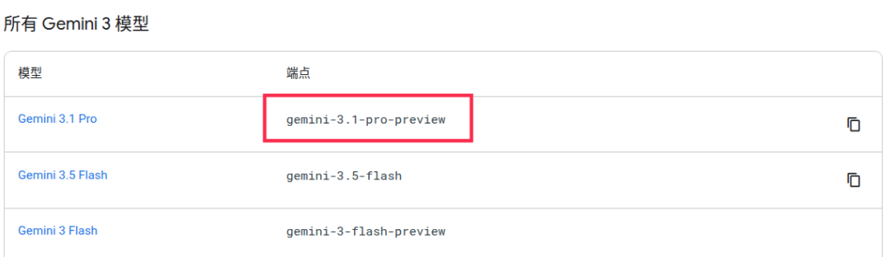
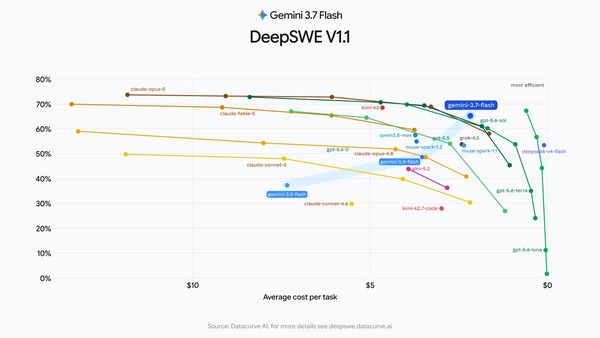
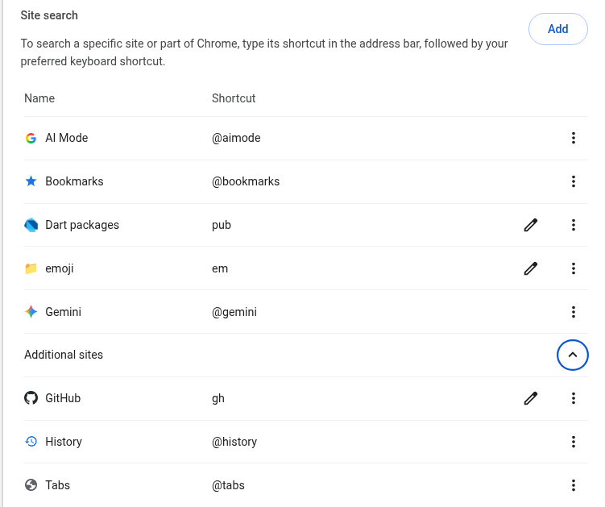
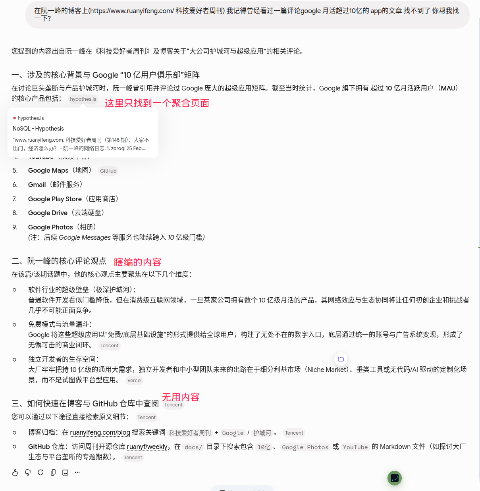
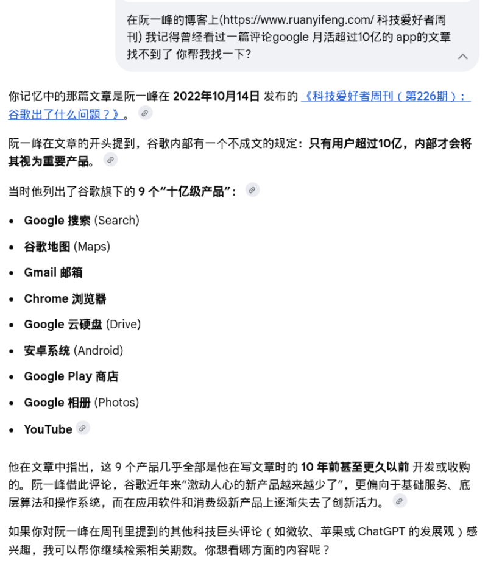

Title: Maxing周刊 EP3 2026w33
Date: 2026-08-15
Category: misc
Tags: weekly
Slug: maxing-weekly-ep3-2026w33

## news / 新闻

### AI 新闻
新模型像放鞭炮一样发布: 
- DeepseekV4Pro发布
  - 好像一手测评显示效果一般? 仅仅比V4flash强点有限?
  - 同时api涨价好几倍, 梁圣评级下调至梁子
  - 但至少DS说到做到 flash发布两周后就发布了pro -- 反观🐶家, 现在pro版本的官方endpoint依旧是["gemini-**3.1**-pro-**preview**"](https://ai.google.dev/gemini-api/docs/models) 让人如何绷得住啊😹

- [Deepseek Harness](https://github.com/deepseek-ai/deepseek-harness) 发布
  - 不知道对比pi和opencode到底怎么样
  - 目前来看可定制化能力非常非常强 还可以可视化debug agent的执行思考过程
    - 但暂时观望 不去尝试了 感觉如果开始尝试会是一个时间黑洞...
  - 确实 harness对实际任务的表现情况影响很大, deepseek开始发力了是好事
- Grok4.6发布
  - Fable5的新廉价平替? 看来整合了cursor的海量数据确实有效果, 再加上推特上的实时消息, 感觉grok变得非常有吸引力了...
  - Gemini Pro再不发出来, 以后御三家OAG里的G就要变Grok了
- GLM5.3发布
  - Fable5的开源平替? 开源SOTA? 
  - 完全基于GLM5.2后训练而来, 提升巨大 -- 国内好多后训练仙人!
- Qwen3.8-27b发布
  - 原生支持多模态, 1M上下文, (据说)大约是opus4.6水平...
  - 太疯狂了, 本地消费级显卡能跑起来的模型能力能达到这个水平
  - 应该还会出一个moe版本的 速度更快 qwen现在在小模型领域真是领先
- *而在无人在意的角落👉...*
  - [Gemini 3.7-flash发布](https://blog.google/innovation-and-ai/models-and-research/gemini-models/introducing-gemini-3-7-flash/)
  - 看官方的"trust-me-bro benchmark"分数 效果还不错 -- 超过了opus4.8和sonnet5 ?
  - 工作中也用了一段时间3.7了 说实话体感没有太大变化... 

### AI for math
- [Claude在黎曼猜想上取得进展](https://36kr.com/p/3934278945029505)
  - > Anthropic 披露，这个尚未发布的 Claude 研究版本，将黎曼 ζ 函数中已知至少位于临界线上的零点比例下界，由 41.6% 提高到了 67.2%。
  - > 而在此前 37 年里，数学家们总共只把这个数字提高了 0.8 个百分点。

- [协和医生用GPT证明22年的猜想](https://36kr.com/p/3937408047053960)
  - 似乎这作者还是之前备受争议的协和4+4培养出来的医生 业余数学爱好者
  - > 更令人钦佩的是，金医生将这一过程完全开源。他的[GitHub仓库](https://github.com/jinshanmu)里不仅有最终论文，还有那段神级提示词、历次迭代的手稿、Lean 4形式化证明代码以及公理审计报告。一切都在阳光下，接受全人类的检验。
  - B站看到一条评论:
  - > 所以现在的现实问题是。大家赶紧找问题让ai试。在旧的数学评价体系崩溃的前夜赶上最后一顿晚餐。能捞一笔算一笔，先留个名字

### 其他新闻
- 朱镕基总理去世🕯️
- [欧洲日食](https://www.timeanddate.com/eclipse/in/switzerland/zurich?iso=20260812)
  - 还很兴奋的跑到天台上去看 结果在日食的时候太阳已经被西边的山挡住了...

## gems / 分享

- **Excited!** [12集文献纪录片《江泽民》在央视播出](https://tv.cctv.com/2026/08/10/VIDAyvlbtef7S0hvvDsLVwtt260810.shtml?spm=C55924871139.PGHhECZjcTkS.0.0)
  - 吃饭的时候看 目前看了两集 很棒的纪录片

- **UP主分享**: (B站) [神烦老狗](https://space.bilibili.com/46377861/)
  - 一个不太正经的AI测评博主 适合下饭看
  - 为啥推荐他呢, 原因有二:
    1. 这次周刊准备用他做的一个[微信公众号排版工具](https://github.com/laogou717/md-wechat)来搞
    2. 他那期[介绍这个工具的视频](https://www.bilibili.com/video/BV1Y6uC6TE1m/), 说自己就是一个在大模型和命令行之间复制粘贴消息的**能工智人** 笑死我了😹

- **chrome tip**: 自定义搜索 实现快搜emoji
  - 效果就是在chrome搜索栏输入`em foobar`的时候, 直接打开emojidb.org 搜索"foobar"
  - 实现这个效果很简单:
    - 打开`chrome://settings/searchEngines`
    - 在"Site search"下点击"Add"
    - `shortcut=em` / `URL=https://emojidb.org/%s-emojis`
  - 用这个方式可以随意增加自定义的搜索, 比如我就添加了`pub`和`gh`的搜索快捷方式
    - 另外chrome还自带了`@gemini`/ `@aimode`用来快速提问

## misc / 杂记
**运动**
- 五个工作日都有运动: 两次瑜伽, 一次力量, 剩下两天算比较摸鱼
  - 上周忘记写了 也是五次运动 强度比这周大
- 臀推100kg (6次x3组, 感觉还有余力) -- 第一个重量超过体重的项目
- 这周测试不借力的引体向上 现在满状态下可以勉强做到6个了
  - 上周测试了一下借力引体(*连蹬带踹那种*) 可以做到9个 -- 时至今日我仍未达到中考体测满分标准🥬

**[GeminiApp月活超过10亿](https://blog.google/innovation-and-ai/products/gemini-app/one-billion-monthly-users/)**
- 这是Google旗下[**第14款**月活超过10亿的产品](https://www.news18.com/photogallery/tech/gemini-crosses-1-billion-users-here-are-14-other-google-products-with-billions-of-users-ws-l-10270001-14.html)
- 这让我想起了一篇旧文: "[科技爱好者周刊（第 226 期）：谷歌出了什么问题？](https://www.ruanyifeng.com/blog/2022/10/weekly-issue-226.html)" -- 那是2022年, 当时Google月活10亿的app只有9个
- 我用AImode查了一下, 这几年多出来的五个产品分别是: calendar(日历), discover(信息流), lens(谷歌镜头), messages(谷歌信息) 和Gemini
  - 说实话discover和messages只能说是借了GoogleApp和安卓的东风而已吧? 实际体验很一般

**AImode vs Gemini**
- 写作上面这一段时, 为了找上面那个旧文 GeminiApp给了一个非常糟糕的答案(基本就是瞎编), 反而AImode可以准确的找到那篇文章的原文
- 感觉有点无语, 也就是说, search虽然有非常好的网络数据和RAG能力, 但是由于组织架构的问题, Gemini非要自己造一套轮子, 而且(在我这个usecase上)效果非常拉垮

