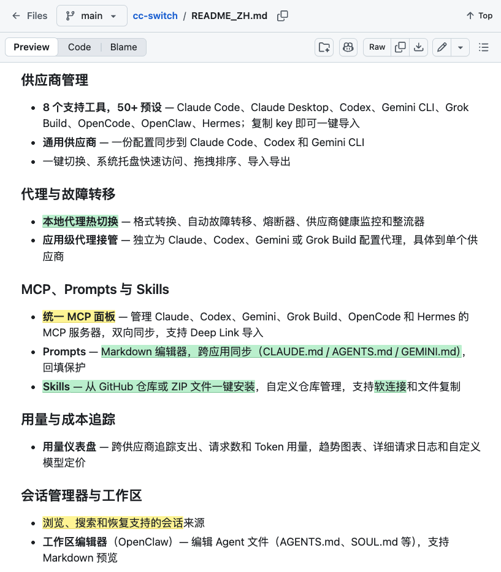

Title: Maxing周刊 EP4 2026w34
Date: 2026-08-23
Category: misc
Tags: weekly
Slug: maxing-weekly-ep4-2026w34

## news / 新闻

- **朱雀三号回收成功** 🚀
  - 国内商业可回收火箭第一家, 未来就是中美两个玩家了.
  - 同时也要expect一些挫折 -- 上周长征七号甲发射失利
- [许家印审判](https://www.court.gov.cn/fabu/xiangqing/509281.html)
- **莫德纳癌症疫苗技术突破**
  - 根据病人特质由mRNA技术针对每个人定制, exciting! 

**抽象新闻**

- [柯洁找到了战胜AI的方法](https://m.hupu.com/bbs/641947798)
  - TLDR: 先装弱智麻痹对方, 然后一波带走
  - > 不要试图战胜一个傻x, 他会把你的智商拖到和他一个水平, 然后再他丰富的经验打败你!
- **<<牛来>>爆火**
  - *我见识过不少抽象, 但仍未理解抽象*
  - 另外最近openrouter上有个[神秘牛来模型"ox-alpha"](https://36kr.com/p/3949075883916416) -- 总不能是Gemini吧 

---

## gems / 分享

### 软件分享
- **[cc-switch](https://github.com/farion1231/cc-switch)**
  - 最开始用它是为了在Claude Code里使用其他模型, 那时opencode/pi还不存在, cc还是独一档的harness
  - 后来发现它可以管理和同步不同agent的skill, 体验非常顺手
  - 这周才偶然发现, 它还可以用来集中**管理历史对话**和自定义**system prompt**
  
- **[Rectangle](https://github.com/rxhanson/rectangle)**
  - 在mac上快速分屏排布窗口的软件. 尤其是[我自己的fork版本](https://github.com/maxing-labs/Rectangle/releases/tag/v0.99-halvesPreserveOtherAxis-b112), 补全了一些missing的功能(1/4分屏+最大化点两次恢复原有窗口), 我自己用起来极度顺手, 已经向上游提了PR希望未来版本能合并.
- **[WhichSpace](https://github.com/gechr/whichspace)**
  - 可以在mac顶部状态栏直观展示当前处于第几个虚拟桌面, 方便快速识别与切换.
- *顺便吐槽一句: 以上两个功能在Linux/Cinnamon里原本都是系统自带的开箱即用功能, 到了mac系统居然还要专门折腾第三方工具...*

### 播客分享: [知行小酒馆](https://www.xiaoyuzhoufm.com/)
- 上下班路上经常听的博客节目
- 这周(重)听了两期节目, 顺手记几点感受

**[E235 与其担心 AI 改变你，不如今天就用它做一件小事](https://www.xiaoyuzhoufm.com/episode/6a06c4b91b7bd50295331e94?utm_source=rss)**  
- > 需要有足够的语料让AI知道你是谁  
    
    -- 所以持续的写作和输出还是很有必要的.
- > 如果我对AI的结论没有反馈, 不是因为我同意, 很可能是我根本没看懂  

  -- 就像我`/grill-me` session进行到后面, 只能一路点「同意」😹.
- > **能把话说明白**变成了很重要的技能, 很多人做不好  

- > **玩游戏哪有AI好玩!**  
  - 这让我想到了为啥我不怎么爱玩游戏: 远不如写代码那种**创造一个东西,成为造物主/魔法师**的感觉有意思. 以前唯一的痛点是写代码的feedback loop太长了, 但程序成功跑起来的那一刻感觉太爽了
  - 这大概也能解释了为什么自从2018年发现Flutter以来我就超喜欢: Flutter的hot reload(热重载)把从修改到见效的反馈周期压缩到了极致. 而现在的各种AI写代码工具, 更是把这个反馈循环进一步缩短 -- 当然屎山堆积是另一回事.
  - btw, 这周有 **[Dart 3.13 大更新](https://mp.weixin.qq.com/s/SSViSaYK4Eb8M1iNzrfnUg)**: 简单看了一下确实很多非常棒的语法和功能(Dart一直很行的), 如果是三四年前看到我会很兴奋. 不过现在已经很少手写代码了...

**[E244 对话李筱懿：站在人生中场，我为我自己鼓掌](https://www.xiaoyuzhoufm.com/episode/6a62ce226356eb2d9be786e0?utm_source=rss)** 
- 这期就是第一遍听感觉也没啥 就记住了两三句话 但是会为了这两三句话再听一次
- > 管理就是激发人的善意
- 关于主体性:
  - > 不要落入所谓的强者叙事或者体面叙事, 不顾一切的表达. 都活了半辈子了, 还不能按照自己的心意生活, 那才是真正的苦.
  - > 我自己的快乐是第一位的. 如果我做不到让自己快乐, 我也没有本事让你们快乐. 我不喜欢做的事情我就不做了, 我不喜欢结交的人我就不结交了.
- 关于自洽(consistency):
  - > **「假装是很消耗人的」** 你不可能假装热爱的去做一件事. 如果一个人是不割裂的, 那他做的事情也是不割裂的.

## misc / 杂记

**运动**
- 两次瑜伽, 一次力量训练.
- **Box squat** (下放时完全坐到凳子上的"浅蹲"): 
  - 可以做85kg做组还有余力, 接近体重的重量.
  - 这个动作和上周的臀推, 都是对腰比较友好的项目 -- 对这个教练很满意
- 单杠悬挂90秒! 初步目标达成!! 🎯
  - 进步的原因归因于每周练一次[克里斯的6分钟悬吊挑战](https://www.bilibili.com/video/BV1EeFWz7ErY).
  - 不过这次是在瑜伽课前满状态测试的 (三周前那次测了85秒, 是在瑜伽课之后). 

**开源 & 折腾**
- 微信公众号排版工具
  - 上次用神烦老狗的[微信公众号排版工具](https://github.com/laogou717/md-wechat), 发布以后才发现有各种问题
  - 怒而提交了两个issue ([issue#3](https://github.com/laogou717/md-wechat/issues/3) & [issue#4](https://github.com/laogou717/md-wechat/issues/4)). 一周后老狗回复并修复了👍, 那这期... 还是不用他的工具排版了, 主题太丑
- [打包两个自用的macOS App](https://mp.weixin.qq.com/s/jSnWMSToS-qicyGZ8KmzNw)
  - 被苹果薅了这么久, 趁着账号过期前, 用Claude打包了两个自用的App安装包.
  - 关于vibe coding的心态发生了变化:
    - 在和agent规划&写代码测试的时候: **感觉自己强得可怕**, 以前完全不敢想的东西都可以实现了
    - 在真正发布出去&提交PR以后: 意识到我其实对其中细节一窍不通, **感觉出卖了灵魂**...
