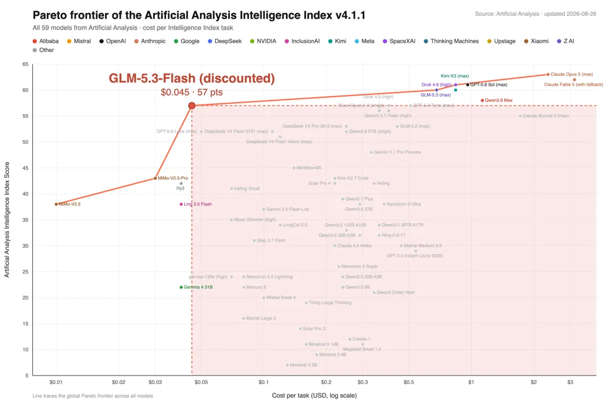
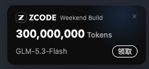

Title: Maxing周刊 EP5 2026w35
Date: 2026-08-30
Category: misc
Tags: weekly
Slug: maxing-weekly-ep5-2026w35

## news / 新闻
- 尼泊尔山洪淹没吉隆口岸
  - 现场视频太可怕了 山洪来了根本无处可躲 太惨了...
  - 不知为啥想起了Grindelwald的瀑布
  - 不是现在卫星监测已经可以识别地表的微小位移 并预警山体滑坡和泥石流了么? 瑞士有个[SwissAlert app](https://www.alert.swiss/en/app.html), 哪里发洪水或者有火灾就会预警, 希望国内能推进一下类似的项目.
- 大白菜蘸甲醛
  - 无语了, 去年食用油混装事件也过去没多久吧
  - 除了道德上的谴责 能不能把监督举报机制做好 让黑心商贩成本无限高, 让举报属实的人大赚一笔?
- 孙宇晨景甜
  - 不想了解 但还是闯入了我的信息流... 
  - 还能说啥呢? 不花费过多时间吃瓜是我对自己注意力的尊重. I don't give a shit 🗿.

### AI新闻
- 英伟达129亿收购hugging face
  - AI界的GitHub, 创始人好像还是X校友👍
  - 类似的巨头收购今年已经看到很多了, 比如openrouter, cursor, windsurf, manus, bun...
  - 还有LMarena和OpenCode也在融资或者谈收购 -- 站在风口上 猪已经漫天飞起来了
- [hy4-preview发布](https://www.leiphone.com/category/industrynews/r1n2DqDnYM9CiY9L.html):
  - benchmark上超过了deepseekv4Pro/KimiK3/GLM5.3, 大约是opus5水平, 价格是几十分之一
- [Qwen3.8-Flash发布](https://m.leiphone.com/category/industrynews/VOpEHzb65rOMv793.html)
  - 接近DSv4flash的价格, 超过opus4.6-max的智能 -- 那可是五六个月前全球最顶尖的模型啊! -- 现在用6B激活的MoE模型就可以达到了!!
- **牛来模型(ox alpha)被认领** -- [GLM5.3-flash](https://mp.weixin.qq.com/s/O7RCVME1Kut-Z2oFYhgrkw)
  - GLM的第一个全模态模型 有了视觉加持
  - 上周牛来模型让人疯狂, 是在一些开发者的测试任务上碾压了fable5, 不过官方的评测对标的是Opus4.8和GPT-5.6Terra
  - 所以之前GDM的人在X上故弄玄虚是要干啥呢? 不是哥们 就硬蹭啊?? 害得我产生了不该有的期待...
    - [谷歌的人集体暗示 Ox Alpha 模型是 Gemini ？](https://mp.weixin.qq.com/s/cd2olA53IpSTK35Ov3oc3Q)
  - 之前有人猜Gemini的原因是 这个匿名模型太慷慨了 连续一周每天**100万亿token**免费蹬, 国内公司没有那么多算力. 而实际上*这些流量全部用国产芯片支持, 运行在10万张国产卡上💪*
  - 为了体验GLM5.3-flash 我专门下载安装了zcode, 据说可以薅3亿token, 可是总领不到, angry!😡

  
 


## gems / 分享

- android软件: [DetoxDroid](https://github.com/flxapps/DetoxDroid#installation) -- 我用来设置每天晚上把手机变黑白显示 -- 这样小红书就没那么有吸引力了
- macOS软件: [CyberDuck](https://github.com/iterate-ch/cyberduck) -- 开源的macOS FTP客户端
  - 再吐槽一次, 这种基本的功能在linux上都是自带的, 到了mac上就得到处找专门的软件
- chrome插件: [Zoom Per Tab](https://chromewebstore.google.com/detail/zoom-per-tab/mnoadkhbinhiblijcedoifbejfmmkdke?hl=en) -- 作用是在chrome里放大页面的时候 不会弄得所有页面全局放大 -- 对于经常开会present的人很有用.

## misc / 杂记

**运动**
- 两次瑜伽, 一次力量, 一次30min核心, 一次30min mobility(体验了一把动物流)
- 上周日开始嗓子有点不舒服 还好没有发烧, 仍然坚持每天运动 -- 最大宗旨就是"不受伤" -- 而且运动完洗个澡以后感觉还更好一些
- 瑜伽老师Joelle经常说一些金句, 这里随手记录几句:
  - > Just breathe through the discomfort.
  - 在她提供一个困难的optional动作的时候:  
    > ask yourself: how much of the struggling is from the ego, and how much is that you want to explore yourself?
  - 每次课结束时:  
    > Let's put the hands in front of our forehead for **clear thoughts**, to the lips for **speaking the truth**, and to the heart **to feel love and give love**.❤️

**带娃的周末活动**
这周末好多活动!

- [苏黎世戏剧节](https://www.myswitzerland.com/zh-hans/experiences/events/zurich-theater-spectacle/) 
  - 湖边的非常chill的活动, 可以看杂技表演, 还有全人力+人工演奏的怀旧旋转木马
- [消防队开放日](http://kirue.ch/jubilaeum/)
  - 在Kilchberg的一个学校, 各种警车/消防车/救护车, 甚至有救援直升机都来了, 小朋友们还可以坐上去体验
- [苏黎世华人基督教会](https://www.ccczurich.ch/) 好像每周日下午都有活动
  - 有专门的房间托管娃 和其他小朋友一起玩, 还有好吃的中餐
  - 能认识各行各业的同胞, 还有好吃的中餐
  - 可以给爸妈拓展一下社交范围, 还有好吃的中餐😋
  - 结束以后还可以坐tram去湖边bellevue看看风景 喂喂大鹅🪿 一下午就过去了

**draft prompt**

在工作上, 为了运行实验或者跑pipeline的时候, 以前我会在我的notes里写要跑的draft command, 修改好了以后复制运行. 这周开始尝试写**draft prompt**, 修改好了可以粘贴给agent:

```
[one-liner简单介绍要干啥]
[好几行介绍具体内容, 包括context, 常用的命令, 涉及的文件, 输入/输出等]
最后: first write a plan with the steps and commands you plan to run, I'll check before you actually start doing it
```

agent给的计划审阅感觉OK以后, 发送这个prompt来执行+监控+总结: 

```
Looks good, let's start ! 
Please keep monitoring the jobs (e.g. check every 20mins). If any job failed, try to fix the issue yourself. Be proactive and make decisions on your own.
You should keep updating an artifact to reflect latest status.

Write a walkthrough when all jobs are finished, with: the command you ran; job links; output paths; output stats (e.g. output size/number, important counters); and any pitfalls or learnings that future agents might benefit from.
/goal
```