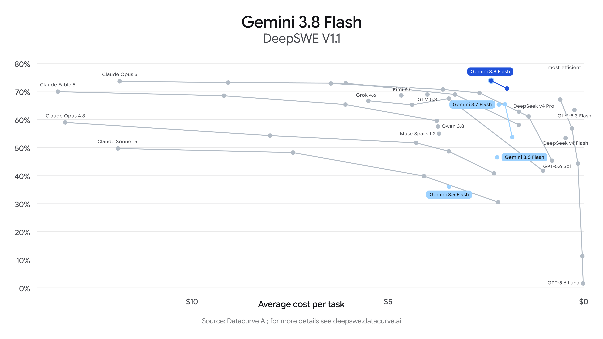

Title: Maxing周刊 EP6 2026w36
Date: 2026-09-06
Category: misc
Tags: weekly
Slug: maxing-weekly-ep6-2026w36

## news / 新闻

- openclaw2.0发布 但是无人在意...: [龙虾之父，困在了龙虾里](https://mp.weixin.qq.com/s/VAYxacsQlfpnJRGt9RLvpw)
- [GPT-6 Astra发布](https://mp.weixin.qq.com/s/AwCaQXooJ-Hry7yhesIcYQ)
  - 号称真正的AGI来了
  - 看测评文章 好像是在3D生成以及computeruse上有了很大的突破, 可以操作电脑上的软件干活了? 暂时观望中...
  - 但也有声音指出, 现有的模型已经很能打了: [https://mp.weixin.qq.com/s/gg2u2oMKiI8YUN-jTZV8kw](https://mp.weixin.qq.com/s/gg2u2oMKiI8YUN-jTZV8kw) -- 希望这次也是一样的剧本, OA的模型领先世界, 几个月后被国产模型赶上来
- fable5.1发布: 好像风头都被Astra抢走了... 😆
- [Gemini3.8-flash发布](https://blog.google/innovation-and-ai/models-and-research/gemini-models/3-8-flash-and-3-8-flash-cyber/)
  - 所以现在flash是三周一版的节奏了么? 你别管好不好 你就说迭代的快不快吧! 🐶
  - 看benchmark超过了opus5? 但这周工作中有被3.8气到 一个简单的colab来来回回搞了好几遍 血压都上来了! 😡

## gems / 分享

- 软件分享: [herdr](https://herdr.dev/)
  - tmux的现代替代品, 非常好用的终端复用器! 这周在工作电脑上上手安装以后, 配合antigravity CLI 感觉生产力提高很多!
    - 终于可以直接鼠标点击拖动操作了, 而且鼠标上翻就可以回看以前的内容, 以前tmux总要有个快捷键才可以回看非常不方便
    - 还可以新建好多个workspace, 每个workspace有多个tab, 每个tab可以多个pane, 切换也很方便
  - 有专门的agent视图, 可以看到所有agent的运行情况(哪些闲置, 哪些在运行, 哪些需要输入)
    - 好像"herdr"是牧羊人的意思, 比喻的就是程序员管理N个agent, 很像牧羊人放一群羊的感觉...
  - 稍微复杂一点的用法 是*让一个agent来控制其他的herdr tabs* (只需要告诉agent读一下`herdr skill`的输出就好了)
    - 比如我会建立一个"agent-playground"的workspace, 里面的tab/pane都是agent在跑命令.

- UP主分享: [程序员老王](https://space.bilibili.com/16433002)
  - 好像是Google的同事, 风格是吐字清楚, 慢条斯理, 视频浅显易懂, 容易follow
  - 最早发现他 是有一系列介绍各种实用工具的视频(fish/uv/fzf/etc.)
  - 最近他开始介绍AI相关的内容, 最新一期[介绍KV cache的视频](https://www.bilibili.com/video/BV1BY4o6cEXE)还不错

- 网站分享: https://www.canirun.ai/
  - 可以检测你现在的硬件设备 告诉你什么模型可以在本地跑起来
  - 最近在找本地模型发现了这个网站 不过好像我的16G macmini也没啥好挑的, 只能跑Qwen3.5-9B或者Gemma4(用[omlx](https://omlx.ai/))

**gmail邮箱名tip**  
如果你有一个gmail邮箱 (例如`foo@gmail.com`), 那么以下两种都是指向同一个邮箱:
- `foo@googlemail.com`
- `foo+bar@gmail.com` -- 也就是说可以在"+"后面加任何东西, 都指向原来的邮箱
这样的好处就是, 可以同一个网站注册不同的邮箱, 但其实只在一个地方收邮件. 
而且这样还方便整理, 可以通过收件人的地址判断是谁发来的, 或者添加自动过滤规则. ✅️

## misc / 杂记

### 周末遛娃
- [Zug 国际日 / Fest der Nationen](https://www.fmzug.ch/en/fest-der-nationen-2)
  - 三年一次的活动, 各个国家上台表演特色节目, 可以看到好多民族特色服装和舞蹈, 台下吃吃喝喝非常chill
  - 有中国功夫和小朋友的中文儿歌表演
  - 还有小朋友的手工活动, 不知不觉一天就过去了

### 运动
- 这周没有瑜伽课, 周五完全没有动, 感觉身体很僵硬...
- 两次力量训练:
  - 周一: box squat 90kg 5reps x 4
  - 周三:
    - 卧推: 5reps x (60kg-65kg-70kg-68kg)
      - 感觉70kg还是有点勉强, 以后可以在68kg推, 不做ego lifting
    - 硬拉: 85kg 5reps x 4
    - 结束后还划船机2km(8分钟多)
- 自己探索了一个*不用换衣服,不出汗的 不到20分钟的锻炼计划*, 带着耳机就可以做：
  - [6分钟悬吊挑战](https://www.bilibili.com/video/BV1EeFWz7ErY)
  - 用[8min腹部锻炼](https://www.bilibili.com/video/BV1QM4m1U7Fc)的音频, 交替做90秒靠墙静蹲和平板支撑各两组
  - 灵感来自: [最无聊的三个动作，撑起你全部的训练](https://www.bilibili.com/video/BV1z5426YEKH)

### 开源项目贡献
有了AI的加持, 现在我感觉我(加AI)强的可怕, 不管啥project我都敢掺和一下了.

- [md-wechat PR#7](https://github.com/laogou717/md-wechat/pull/7)
  - 给神烦老狗的公众号排版项目加了我认为好看点的主题
  - 比较搞的是看到自己上电视了 -- 在[老狗测评Gemini3.8flash的视频](https://www.bilibili.com/video/BV1BKtZ6aEiW)里 他用3.8审阅并merge了我这个PR
- [rectangle](https://github.com/rxhanson/Rectangle)
  - 之前提交的 [PR#1824](https://github.com/rxhanson/Rectangle/pull/1824)已经被merge到了主仓库🎉 -- 效果是更方便的1/4分屏
  - 我还提交了一个[新的PR](https://github.com/rxhanson/Rectangle/pull/1837) -- 效果是两次全屏时返回之前的位置和大小(类似两次双击的行为 更符合直觉), 也收到了owner的反馈
  - 从仓库作者(`rxhanson@`)的回复来看, 在AI code满天飞的时代, 似乎他还在坚持手搓, 令人钦佩!👍
- [memos PR#6273](https://github.com/usememos/memos/pull/6273#pullrequestreview-5116232894)
  - 这个是我每天都在用的笔记工具(类似flomo)
  - 之前就感觉这个行为有点不爽, 某天晚上派GPT-5.6-luna去修(来自github送的copilot), 感觉luna也很能打啊其实
- [paseo PR#4397](https://github.com/getpaseo/paseo/pull/4397)
  - Paseo就是我现在每天用的AI工具 超级推荐, 很奇怪为啥没怎么看到有人提到它
  - 这个PR就是双击重命名的逻辑(来自antigravity)搬到Paseo上面, 用到了GPT-5.6-luna和Gemini-flash-3.8
  - 与此同时我也想把工作中每天用的antigravity改的更像Paseo, 让gemini跑了一个通宵以后似乎有戏, 就是不知道CL好不好发...