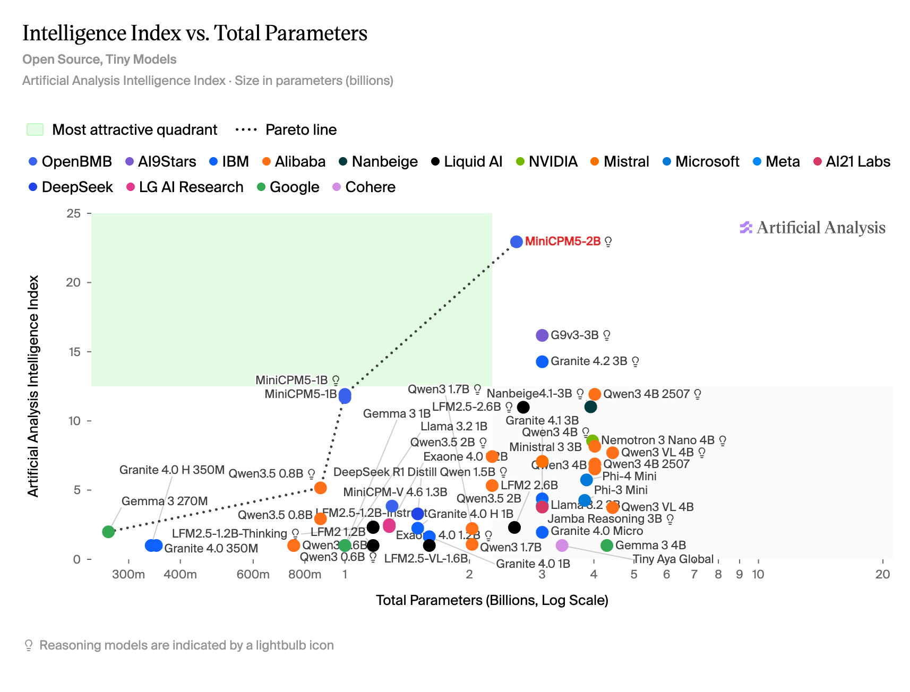

Title: Maxing周刊 EP7 2026w37
Date: 2026-09-13
Category: misc
Tags: weekly
Slug: maxing-weekly-ep7-2026w37

## news / 新闻
- 两个千禧年问题疑似被OA解决
  - NS方程被解决: 好像还有drama, 似乎是OpenAI看到数学家的对话 然后开启了一万个agent并行攻坚, 抢在A家前面发布了成果
  - 另一个霍奇猜想取得重大突破, 连这个猜想是什么我都不懂 就不评论了
  - 另外一两周前还有的两件数学进展值得一写: 
    - Claude给出费马大定理的形式化证明
    - OpenAI突破孪生素数间隙下限: 最初张益唐突破性找到7000万, 后来到陶哲轩改良到246, 如今GPT提高到了186
- DeepSeek V4.1-flash发布
  - 性能更好, 价格调低, 还是多模态的
- [MiniCPM5-2B模型发布](https://mp.weixin.qq.com/s/ua8piZ1G_S1r-0sz3Grkdw)
  - 测评的某些benchmark上超过了参数量大几倍的模型, 断档领先其他小模型
  - 正好最近在看本地隐私友好的模型(主要处理一些隐私文件的总结翻译工作), 试用了一下确实效果强很多(相比qwen3.8-9B和gemma4-12B), 而且速度飞快
  - 他们还发布了数据和训练框架, 真全面开源

## gems / 分享

### 播客分享
[纵横四海: EP74《随他们去》：重建人生掌控感的7堂课](https://www.xiaoyuzhoufm.com/episode/691b0381cbba038b42f6933c)
- 这一期很早就缓存了 但是一直没听, 这周目前只听了一半 感觉很不错
- 其实就是斯多葛哲学里的经典内容: 接受一切不能控制的事物(**let-them**), 只关注于能够控制的事物(**let-me**)
- 比较touch我的是提到 **"简单"** 和 **"容易"** 是两回事
  - 就比如上面的那条斯多葛哲学, 理解起来简单, 真正实践到生活中却不容易, 需要反复练习 (aka. **知行合一**).
  - 我还想起电影《致命魔术》里的台词, 电影最后安吉说"I thought it was too easy, too simple...", 然后伯顿告诉他: "simple might be, but not easy"

顺便分享一下我日常听播客的软件: [**AntennaPod**](https://github.com/AntennaPod/AntennaPod)
- 开源的安卓播客客户端
- 可以搜索和缓存播客在手机里 没网的时候也可以听
- 其他倒也没什么特色, 开源,简洁, 干净

### Gmail tip两则
- 上次提到过, 可以在邮箱名后缀加号+任意内容, 都指向你的邮箱, 例如`yourname+foobar@gmail.com`
  - 上次忘记提的一点: 在你的账号中任意增加删除点号`.`, 也通通会指向同一个邮箱, 例如`your.name@gmail.com` / `yo.ur.name@gmail.com`
- 从[simonwillison的博客](https://til.simonwillison.net/google/gmail-compose-url)看到的不同账号URL技巧: 
  - Chrome上登录多个gmail账号的时候, URL默认采用`u/1`/`u/2`/...的方式区分不同账号的页面
  - 但这样不稳定 -- 完全取决于你登录不同账号的顺序, 每台机器采用这样的URL, 有可能对应不同的账号
  - 采用 `/u/youremail@gmail.com`的方式, 就规避了这个问题, 可以把某个账号的对应邮箱URL做成书签, 方便直达

### 瑞士生活tips两则

**便宜的临时数据包**  
调研了一圈, 发现最便宜的是SBB旗下的这个服务: [Zim by SBB](https://www.sbb.ch/en/travel-information/apps/zim-sbb-app.html)
- 30天3GB的流量只要5CHF
- 优点: 便宜, 而且是eSIM(安装个app就能用); 缺点是只有eSIM, 很多国内手机可能不支持.

**瑞士海关申报App**: [QuickZoll](https://www.bazg.admin.ch/en/quickzoll-app-declare-goods-for-private-use)
- 用来自主海关申报的app
- 在过边境前的两小时内, 填上人数和货物总价就可以, 手机直接付款(数额 = 约8.1%的进口税 - 每人150CHF免税额度)

## misc / 杂记

### 运动
五天运动, 两次瑜伽两次力量
- 周一: 弹力绳辅助引体 6reps x 4
- 周二: 瑜伽解锁了"三脚架倒立"(腿还不能伸直, 膝盖架在手肘上)
- 周三: 实力推(Overhead Press) 5reps x 40kg x 4 ; 硬拉5reps x 75kg x 4
- 周四: 瑜伽课以后测试单杠悬挂 85秒
- 周五: 上周探索的"20分钟不出汗极简锻炼计划"(见周刊EP6)

### 开源项目贡献
在测试MiniCPM5-2B的时候, 发现我常用的[omlx](https://omlx.ai/)对MiniCPM的工具调用支持有问题, 把工具调用的xml当成了普通输出.
在opus5+Gemini3.8的帮助下, 顺利修正了这个问题, 然后提交了一个PR: [jundot/omlx#3530](https://github.com/jundot/omlx/pull/3530), 并且得到了作者的回复.

### 拉胯的Gemini
一个很简单的生活场景: 之前在国内买了点东西寄到德国, 商家给了一个pdf的清关清单 包含货物数量和价值什么的. 我把这个pdf发给Gemini 问商品总价值是多少.
- 问3.5-flash-lite: 先说510刀, 最后核算以后说是1660刀
- 问3.8-flash: 回答1740刀
- 问3.1-pro: 回答670刀

我感觉不靠谱, 于是问了手机里别的AI:
- GPT: 750刀
- Claude: 750刀
- DeepSeek: 说不知道 (好像我用的默认模型不能读取pdf信息)
- Kimi: 750刀(回答速度很慢)

==> 所以显然答案应该是750刀!!

后来我不死心, Gemini连这么基础的问题也搞不定? 于是把app里剩下两个模式也问了一遍(所有提示词完全一样)
- 问3.1-pro-deep-think: 1000～1250刀
- 问3.1-pro-extended-thinking: 1000刀

...麻了, 还能说什么好? Gemini满门忠烈了可以说是...