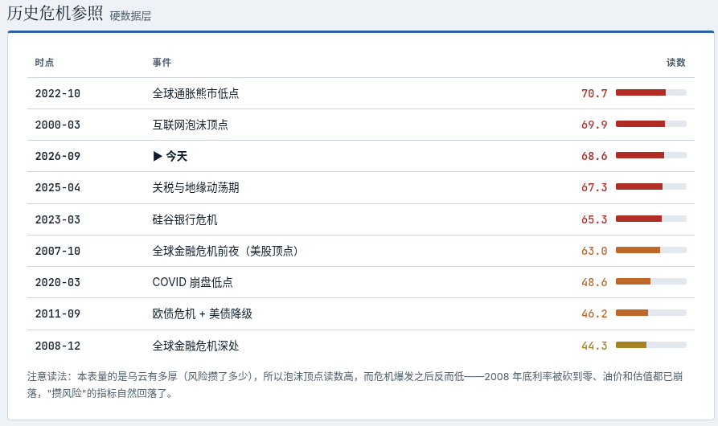

Title: Maxing周刊 EP8 2026w38
Date: 2026-09-20
Category: misc
Tags: weekly
Slug: maxing-weekly-ep8-2026w38

## news / 新闻

- [Jev模型发布: 不说话只做选择题](https://mp.weixin.qq.com/s/hmQyC29AljDAyJEd0nMJuQ)
  - 一个新的范式? 输入的prompt里提供所有可能选项, 然后这个模型直接告诉你结果(概率分布), 不说一句话
  - 看宣传好像能力和主流大模型差不多 但是速度和价格便宜100倍??
  - 高度关注, 网上已经出现了[许多jev的神奇玩法](https://mp.weixin.qq.com/s/lnWrTGbsLO59w_7cK_rTqQ), 我也第一时间注册了一下 不过最近比较忙 还没功夫尝试
  - 高度关注的另一个原因是, 这个模型解决的问题似乎是Google内部很多组都在做的事情 -- 用一个小模型做打分和分类工作. 但是Google用的是[Encoder-only模型](https://developers.googleblog.com/en/t5gemma/), 依赖特定任务数据的finetune, 而这个jev似乎可以generalize得很好 根本不用finetune??
  - 不过目前这个模型既没有开源也没有发论文, 希望开源社区能够快点跟上.
  - 如果这类模型以后成为主流, 真的就是赛博算命了, 还没有注解...
- [谷歌给全员工程师开放ClaudeOpus](https://ip.net.coffee/claude/news/20260915c.html)
  - 上周就开始了, 试用一下以后 我的体感和在个人项目上类似 -- opus5比gemini3.8flash强点有限, 普通任务基本上看不到什么区别, 而且opus还更慢, quota更低. 所以现在不管是工作还是个人项目 我的首选牛马模型依旧是3.8flash 遇到复杂问题或者进行规划的时候用一下opus
- 北京Hyrox窜稀事件
  - 再加上上周的ChinaGT赛车起火事件, 感觉很多活动的组织方都对突发事件没什么应对预案
- [赵家驹夺得欧洲巨人之旅越野赛冠军 打破纪录](https://app.xinhuanet.com/news/article.html?articleId=202609173ec97afdd52b4b519e96c2b6987f8932)
  - "在全长336.1公里的赛程中，他的累计睡眠时长仅约一小时" 人类意志力的巅峰

## gems / 分享

**播客分享**: [纵横四海: EP74《随他们去》：重建人生掌控感的7堂课](https://www.xiaoyuzhoufm.com/episode/691b0381cbba038b42f6933c) -- 这周听了下半部分 touch我的点也不少, 所以继续分享
- 前半部分主要介绍了"`let them` / `let me`" 这个基本的框架, 后半部分则是用这个框架处理一些常见类型的问题
- 关于别人的眼光/负面评价:
  - `let me` **做符合自己价值观北极星的事情**，得到自己的认可，为自己感到自豪
- 关于和情绪不稳定的人相处:
  - `let them`: 管理他人的情绪并非我们的责任
  - > **大多数人的情绪处理能力只有8岁**, 这是他们的课题, 我没有免他人受情绪之苦的义务
    - 这句话太戳我了, 理解了这一点其实很多事情就可以看开了, 很多人只不过是用8岁孩子的情绪做成年人的事情, 而且还没有监督和约束
    - 我想到, 也应该允许/包容自己的偶尔情绪不稳定
  - 追求*情绪成熟*而不是情绪稳定 -- **情绪能和情境匹配**, 就像四季一样, 有喜怒哀乐都是正常而健康的
    - `let them` 理解感受自己的原始情绪, `let me` 不立刻做出反应, 由我来对自己的情绪负责
- 关于比较和嫉妒
  - 嫉妒本质是对自己的愤怒, *同时也是一种信号*, 也可以是自我学习的机会
- 关于成年人的友谊:
  - *责怪别人 沉浸在自己的愤怒中 比为自己负责容易多了*
  - `let me` 主动去寻找朋友, 由我来迈出第一步
    - 我想到自从来了瑞士以后 很少有本地人的朋友, 社交圈主要都还是中国人或者其他expats, 会吐槽瑞士人不如法国人适合融入(符合刻板印象), 但是应该`let me`为我的社交圈负责, 由我来主动寻找community
   
**网站分享**: [今天，世界离金融危机有多远？](https://globalcrisisindex.co.uk/zh/)
- 每天根据全球形势更新的报告
- 最近的风险比较高...

**软件分享**: [gocryptfs](https://github.com/rfjakob/gocryptfs)
- 一款开源的文件加密工具, 作用是把一个加密文件夹挂载为一个文件夹, 然后就可以像普通文件夹那样读写内容
- 可以用来存放敏感信息 比如身份证件之类的文件, 加密以后即使放到云盘也比较安心(没有密码就没人可以破解)
- Linux上直接用命令行就可以了, 安卓客户端是开源的[DroidFS](https://github.com/hardcore-sushi/DroidFS)
- 之前macOS上一直没有客户端, *所以我自己vibe了一个* -- 见后文!!

## misc / 杂记

### 运动
五天锻炼, 两次瑜伽, 一次力量
- 周三力量:
  - 实力推8rep：35-33-33-30
  - 卧推8rep：60-65-60-50 (倒数第二组崩了 中间休息了两次)
  - 硬拉8rep：75-85-85-85
- 周四瑜伽: 三脚架倒立解锁了腿伸直(靠墙)的版本!
- 周五在拉伸以后**划船机5公里** -- 用时21分16秒
  - 公司最近有年度"global5k"的活动, 用各种方式完成5公里即可 我选择用划船机
  - 平均配速是每500米2分07秒左右 比我预计的要好 我之前觉得做到2分10秒以内就不错了 -- 毕竟很多年没划船了🚣‍♀️🚣‍♀️

### 🔒GocryptKit: 我的第一个mac app!

- 也就是上面提到的gocryptfs的macOS客户端
- 代码开源在: https://github.com/maxing-labs/GocryptKit
- 在这之前 mac上要用这个, 需要先安装macFUSE然后重启并解锁一些安全设置, 非常不方便; 要么就是用有人开发的免费闭源版本, 没有一个使用mac原生FSKit技术的开源方案
- 赶在开发者认证过期前 **疯狂迭代了20多版** 应该有上百个对话session了 -- deadline就是生产力
- 主力模型用的opus5+gemini3.8, 很给力. 我负责提出feature, 试用后反馈, 以及反复拷打AI 避免代码的安全漏洞... 现在的版本已经非常完善了 我个人在使用了
- 接下来就是推广宣传, 之前(古法编程时代)我做得很不好, 希望下周用各种marketing skills试试水!
