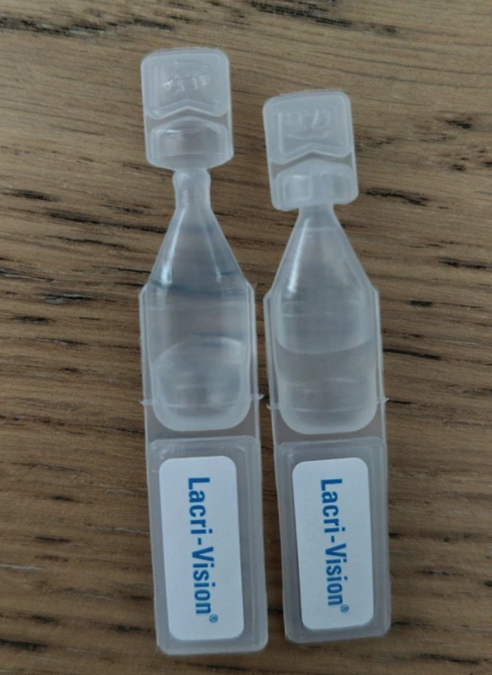
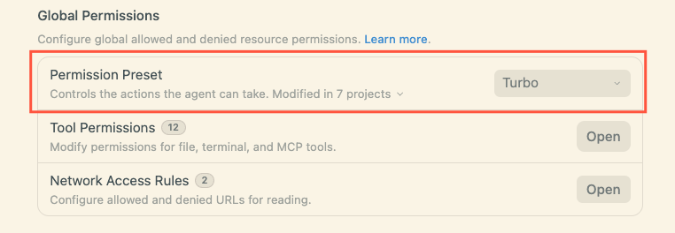
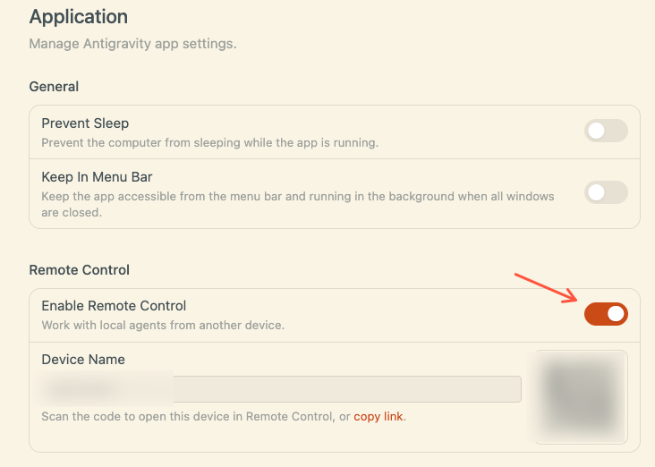

Title: Maxing周刊 EP9 2026w39: 前沿模型更新, 哥德巴赫猜想, Antigravity实用Tips
Date: 2026-09-27
Category: misc
Tags: weekly
Slug: maxing-weekly-ep9-2026w39

## news / 新闻
- 前沿模型更新: Opus5.5 & GPT-6-sol&luna
  - 看评测就是智能的前沿又推进一步 但是对我的日常任务来说已经都一样了 我的任务已经测不出来顶级模型有啥区别了...
  - GPT6-luna在能力和成本上面反杀了DeepSeek! 这个确实相当remarkable
  - 最近几周感觉国外模型发力了 希望国产模型未来能快速跟上
  - 与此同时: Gemini4Pro可能又要陷入发布即落后的窘境?
- RSI相关
  - 最近几周出现频率比较高的一个词汇 大意就是模型自己参与迭代, 自主进化.
  - 上周还有Anthropic和OpenAI两家呼吁放缓前沿模型研究 结果这周这两家就反手纷纷更新了旗舰模型 (只有Gemini真的是放缓了前沿模型 都放缓一年多了)
  - 现在看来除非现有理论框架/数据/算力撞墙 否则放缓是不可能的 就好像跌入黑洞一样 无法阻止, 人类要加速跌入技术奇点
  - 今天的旗舰模型在未来回头看 永远是最弱的
  - 但感觉另一个方向是本地AI 如果未来能把智慧浓缩在一个10B以下的小模型里 可以本地运行 应该大有可为(类似当年的IBM服务器 vs 个人PC); 另一个方向可能是Jev这种新的范式
- [Claude在DNA中发现全新的酶系统](https://mp.weixin.qq.com/s/OCpa097QxItWl7fVX7tOaQ)
  - 畅想一下: 如果AI可以急剧加速解决前沿科学问题 之前那些几十年未解决的问题取得突破 该是多么令人兴奋!
  - wishlist: 可控核聚变 / 太空电梯 / 室温超导 / 衰老、癌症、阿尔茨海默 / ...
- [Astra取得哥德巴赫猜想进展 只用两页纸的优雅证明](https://mp.weixin.qq.com/s/gbjDsY7AJv9hXxstGvPY3A)
  - 这次不一样的是证明过程非常简洁优雅, 李永乐还做了[视频讲解Astra的证明过程](https://www.bilibili.com/video/BV1X4hx6BEFd)
  - 只要高中水平就能听懂 看完的感想: 一个是感觉这个刘维尔弱形式有点过于弱了? 离哥德巴赫猜想还挺远? 另一个是证明用到一个引理 具体引理怎么证明的就直接忽略了...
  - 当然最主要的感想还是, 啊难得有个我们普通人也能看懂的数学进展, 跟着过一遍脑子也稍微锻炼一下 -- 数学是思维的体操🤸
  - 转念一想, 我们晚期智人搁这黑板上慢吞吞推导和理解这个证明过程 在注意力惊人的AI大人看来 可能就像武林高手看小学生耍军体拳一样可笑...

## gems / 分享

**软件分享: [Marta -- macOS上的文件管理器](https://sspai.com/post/112934)**
- macOS上的Finder使用真不习惯 甚至ctrl+c/v的功能都没有 需要拖拽我真是服了...
- Marta至少能在某种程度上降低我的不适 而且界面简洁 开源免费

**Gemini Live的实时翻译功能**
- 上周[Gemini推出了3.8 live模型](https://blog.google/innovation-and-ai/models-and-research/gemini-models/gemini-3-8-live-gemini-3-8-live-extended-thinking/) 表现达到了SOTA水平
- 这周在一个德语讲座的场合才在Gemini app里看到了这个选项, 点击"gemini live"的按钮 然后右上角会出现实时翻译的菜单
- 另一个trigger方式是直接告诉Gemini: "帮我实时翻译"

**日抛眼药水的设计**
- 原来这种日抛的眼药水 拧下来的部分是可以当作盖子的!!之前一直不知道 还抱怨这种眼药水打开了就不好保存...

**antigravity的使用tips**
工作上用antigravity蛮长时间了 简单分享几条
- antigravity用免费账号就有不少的额度 只要不是高强度coding普通人日常使用足够了
- 设置->General里 启用"turbo mode"就可以避免每次点击"允许"按钮了

- 设置->Application里 启用远程控制 -- 会拿到一个URL 用这个网址在任何登录了同一个Google账号的机器上都可以打开 随时随地远程就可以继续工作了! (不过网页没有适配手机版)

- 常用的斜杠命令:
  - `/btw` 用于在agent执行任务期间 不打断正在运行的任务也不污染上下文时, 询问一些简单的问题
  - `/grill-me` 让agent向你提问 挖掘真正的意图 对齐需求

## misc / 杂记

### 运动
四天运动 两次瑜伽一次力量
- 周四瑜伽以后测试吊杠只坚持了70秒, 周五不甘心, 拉伸以后再测 也只有80秒了 比前几周下降了10秒...
- 感觉这周疲劳度有点高, 吊杠测试可以作为衡量疲劳指数的一个proxy measurement
- 另一方面也应该放平心态, 允许有退步, 不强求每次都进步, 顺其自然就好...

### vibe coding: marketing & 开源贡献
- 上周高强度vibe弄的[macOS加密app](https://github.com/maxing-labs/GocryptKit), 本来这周想要进入宣传推广的phase
  - 结果弄完录屏和截图以后就力竭了... marketing的进度滞后了.. 希望下周能有进展
- 不过值得庆祝的是, 上上周为了修复MiniCPM的[omlx PR#3530](https://github.com/jundot/omlx/pull/3530)被作者merge了 已经加入到了最新release里面!
  - 安装最新版的omlx可以正常支持miniCPM5的调用 很高兴
  - MiniCPM5-2B模型已经是我处理本地敏感数据的主力了 速度快内存占用少, 效果也相当可以