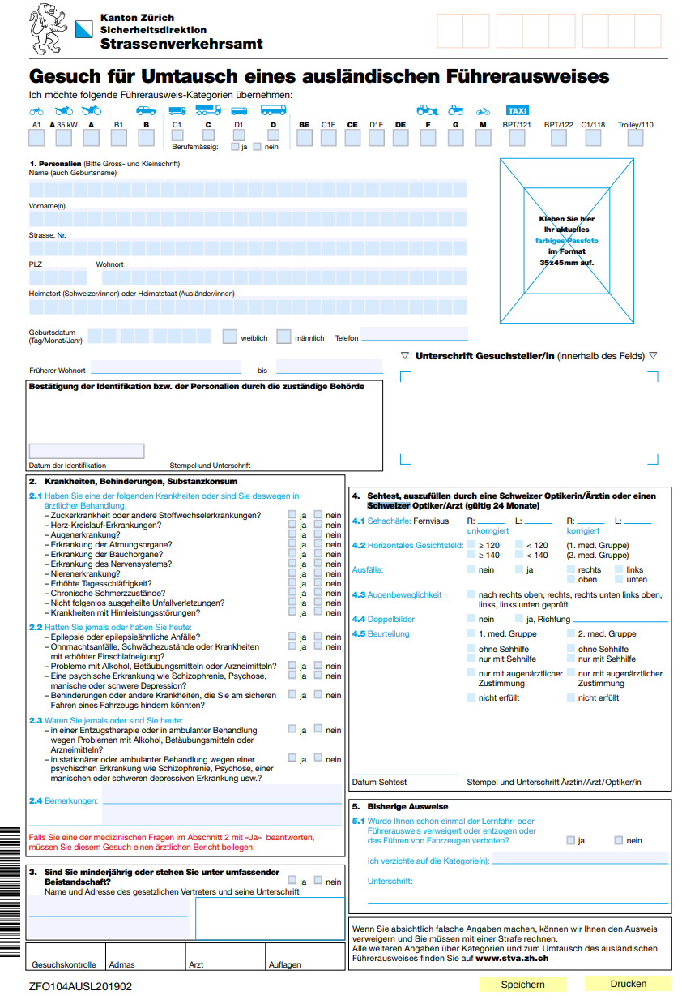

Title: 瑞士学车记1 - 国内驾照换瑞士驾照
Date: 2022-03-26
Tags: swiss
Slug: swiss-driving-test-1

去年四月份我提交了国内驾照换瑞士驾照的申请, 经历了将近一年时间, 考挂了三次才终于在今年三月拿到了瑞士驾照... 计划写几篇文章记录一下我学车和考驾照的过程, 把遇到的坑和各种注意事项列一下, 希望能帮助到更多人.

如果你已经是个老司机, 只要通过了瑞士的换驾照考试, 立马就可以拿到瑞士驾照了. 本篇就介绍申请国内驾照换成瑞士驾照的流程. 

苏黎世交管局("Strassenverkehrsamt", 简称stva)[官网](https://www.zh.ch/de/sicherheitsdirektion/strassenverkehrsamt.html)上有一个[介绍外国驾照转换的页面,](https://www.zh.ch/de/mobilitaet/fuehrerausweis-fahren-lernen/auslaendischer-fuehrerausweis.html) 一切信息以官方网页为准.

1-打印&填写表格
---------
关于外国驾照在瑞士开车: 

* 欧盟或者日本驾照: 可以直接在瑞士开车
	* 交管局官网上有一个[pdf文件](https://www.zh.ch/content/dam/zhweb/bilder-dokumente/themen/mobilitaet/fuehrerausweis-fahren-lernen/ASTRAlaenderlisteKontrollfahrt.pdf) 列出了所有不需要考试的国家/地区
* 国内驾照: 
	* **在来瑞士的第一年, 可以用原先的驾照(加翻译件)在瑞士开车**
	* 超过一年以后, 原驾照不再有效, 需要通过换驾照考试

要报名换驾照考试, 首先去官网下载«Gesuch Umtausch eines ausländischen Führerausweises»表格.
><https://www.zh.ch/content/dam/zhweb/bilder-dokumente/themen/mobilitaet/fuehrerausweis-fahren-lernen/ZFO104AUSL201902.pdf>

表格长这样:

主要内容包括: 

* 顶部: 车辆类型 — 普通私家车都是 "category B"
* **1.Personalien**— 个人信息,最好用大写字母填写(其实检查也没有那么严格)
* **2.Krankheiten** — 疾病信息, 一般都是全部选"nein"
* **3.** 回答是否未成年 
* **4. Sehtest** — 视力测试, 这个需要找眼科医生填写
* **5.** — 回答之前是否有过违章或者驾照被吊销过

2-视力测试
------
上面那个申请表的第四项视力测试需要找医生填写.

其实也简单, 街边随便找个眼镜店, 带上这个表格说需要换驾照, 店员就会给你测试然后填写+盖章.

3-现场提交材料
--------

去交管局报名需要提供的材料包括:

* 打印并填好的申请表("Request for exchange of a foreign driver's license" form)
* 证件照(Colored passport photo) — 好像带一张照片就可以了, 保险起见最好带上两张
* 瑞士居住证(For foreign nationals: original foreigner identity card)
	* 保险起见最好也带上护照
* 国内驾照原件(Foreign driver's license in the original)
* 驾照翻译件Translation (consulate or embassy) if the driver's license is not in Latin script
	* 只承认在瑞士公证处提供的翻译件, 国内带来的翻译件可能不好使 
	* 其实没有翻译件也没关系, 交管局提供翻译服务的(瑞士价格)

交管局的地址和开门时间: 
>Uetlibergstrasse 301  
8036 Zürich  

>opening hours  
Monday and Tuesday  
7:15 a.m. to 5:00 p.m.  
Wednesday to Friday  
7.15 a.m. to 4 p.m.  

>+41 58 811 30 00  
[info@stva.zh.ch](mailto:info@stva.zh.ch)

4-练车&准备考试
---------
收到交管局的回信以后, 就可以把它作为临时驾照,在瑞士练车了(当然如果到瑞士短于一年的话是可以凭国内驾照开的).
交管局的回信还包含一个考试通知, 如果感觉时间不够可以打电话过去问问能不能改时间. 

⚠️⚠️这里有一点比较坑: **换驾照考试的日期最晚不超过提交表格日期以后的三个月!**
所以要做好准备充分利用好这段时间多练一下. (我在提交表格以后回国了一个多月, 准备严重不足...)

**驾校教练**
跟中国同事聊天打听了一圈, 听说过这些教练:

* Christian Schulz: <https://www.fahrschulz.ch/> 
	* 据说非常成体系, 每节课都有侧重点
* Anne Lauer <https://fahreschlauer.ch/en/>
	* 女教练 据说风格比较严厉, 已经会开车的人找她比较合适
* 然后是我的教练Markus: 
	* 有不少中国同事都很推荐, 平易近人的老头
	* 他好像没有网站, 直接google "Fahrschule Markus Würgler"能找到他的电话号码, WhatApp联系

5-换驾照考试
-------
然后就到了路考的那一天. 

瑞士的路考大约要45分钟, 考点非常多, 从交管局出来以后会在市区开, 郊区山路等各种路段开, 上下高速, 也有可能考停车, 紧急刹车甚至有可能让你倒着开一段... 所以一定要好好准备.

考试是要用德语, 不过都是简单词汇("左拐, 右拐, 变道, 停车"之类的), 网上也有一些常见的考试词汇表, 比如这个:
<https://www.e-fahrschule.ch/img/pdf/Die-wichtigsten-Ausdruecke-zum-Autofahren.pdf>

* **如果考试通过**: 恭喜你, 可以在瑞士开车了!
* **如果考试没过**: 
	* 需要重新从科目一开始学起 — 注意, ***在科目一通过之前你就不再能练车了***
	* 而且***国内驾照原件也被扣下***, 需要考试通过或者要永远离开瑞士的时候才能退回

显然我这次没有考过...

(接下来几篇会聊一下瑞士的交规, 路考考点和注意事项, 以及总结一些常见的考试路线.)

