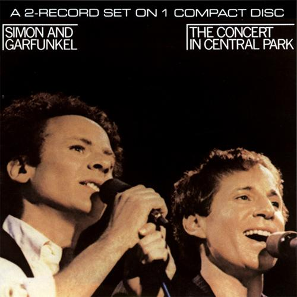
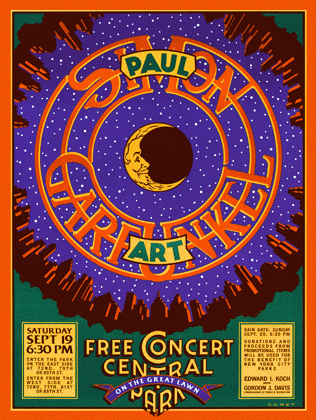

Title: 寂静之声The Sound of Silence[Simon&Garfunkel]
Slug: TheSoundofSilence
Tags: Simon&Garfunkel
Date: 2012-06-05

所有事都完成, 开始写歌评.

##intro引子
本来我是计划从老鹰的一首歌开始写的, 昨天甚至计划好了第一首就写Hotel California. 

BUT SOMEHOW, 决定第一首写它, 寂静之声(SoS).

如果把硬盘里的歌全部删了, 只能留十首歌的话, 我是肯定会留下这一首.

>+ 歌名: The Sound of Silence
+ 专辑: The Graduate
+ 歌手: Simon&Garfunkel
+ 年代: 1967

不必多说, 这首歌应该知名度很高的吧, 西蒙与加芬科的成名作. Simon&Garfunkel组合凭借电影<<毕业生>>的两首配乐被许多人所熟知(另一首是Scarborough Fair). 

以下摘自百度百科:

>《寂静之声》旋律飘缓低迷，歌词充满了一种幻觉般的意境。细细听来，仿佛在诉说着年轻无助的一种宣泄。眼前似乎看到一个懵懂无知的女孩，独自一人行走在铺着鹅卵石的狭窄、清冷的小巷里，喧嚣的人群在她身后渐渐远去，前面是没有尽头的黑夜……歌曲如果说是属于民谣的话似乎太深邃，如果说随着强劲的乐曲而震荡的节奏是摇滚的话，却太细腻，音乐上它造就了类的中和体，这应该是它成功的最大原因。

##lyrics歌词

    Hello darkness, my old friend,
    I’ve come to talk with you again,
    Because a vision softly creeping,
    Left its seeds while I was sleeping,
    And the vision that was planted in my brain
    Still remains
    Within the sound of silence.

    In restless dreams I walked alone
    Narrow streets of cobblestone,
    Neath the halo of a street lamp,
    I turned my collar to the cold and damp
    When my eyes were stabbed by the flash of a neon light
    That split the night
    And touched the sound of silence.

    And in the naked light I saw
    Ten thousand people, maybe more.
    People talking without speaking,
    People hearing without listening,
    People writing songs that voices never share
    And no one deared
    Disturb the sound of silence.

    “Fools” said I,”You do not know
    Silence like a cancer grows.
    Hear my words that I might teach you,
    Take my arms that I might reach you.”
    But my words like silent raindrops fell,
    And echoed
    In the wells of silence

    And the people bowed and prayed 
    To the neon god they made.
    And the sign flashed out its warning,
    In the words that it was forming.
    And the signs said, The words of the prophets
    are written on the subway walls
    And tenement halls.
    And whisper’d in the sounds of silence. 

    黑暗，老朋友，我来了
    又想同你谈谈
    突然有一种幻觉悄悄来临
    趁着我入睡时播下了种子
    那些个在我脑海中不停滋生的幻觉啊
    还仍然滞留在寂寞之声中

    在永无休止的梦里
    我孤独地行走在
    狭窄的布满圆石的路上
    行走在路灯的光晕下
    感到有点寒冷潮湿
    于是我翻竖起衣领
    那盏刺痛我双眼的霓红灯
    划破了夜晚
    触到了寂寞的音符

    在那无遮蔽的灯光下
    我看见成千上万的人
    也许更多
    人们无声地诉说着
    人们无语地倾听着
    他们写出一首首歌曲
    却没有一个人去唱
    没有人敢
    惊扰寂寞沉睡时的轻梦

    我说：你们这群傻子啊
    难道不知道寂寞的癌细胞正在扩散吗
    好好记住我教你们的话
    握紧我伸给你们的手臂
    可惜我的话只如同雨滴无声地落下
    回荡在寂静的深井里

    看人们朝着象征神圣的氖灯低头祈祷
    而霓红灯广告牌却在讽刺地一闪一闪
    发出这样的警告：
    “先哲的预言就在地道下的墙上
    就写在贫民们的住房里”
    还依旧在一片祷告的寂静中喃喃地低语

##remark简评

这首歌的主题好像是"人与人之间交流的障碍", 但是我听出来的却是年轻人关于未来的迷茫. 在电影<<毕业生>>的开头, 随着清脆的吉他前奏, 达斯汀霍夫曼一脸迷离的坐在回家的飞机上, 下飞机拿行李向我们走来...... 不过我是先听的歌后看的电影, 也许是歌太好听了, 电影没我预期的好看...

歌一开头, "我"去找darkness谈话, 这首歌的内容就是"我"向黑暗讲述"我"的一个"vision", 一个诡异的幻觉或一种感觉:

>In restless dreams I walked alone  
Narrow streets of cobblestone,  
Neath the halo of a street lamp,  
I turned my collar to the cold and damp  

这也是我比较喜欢的几句歌词, 几句话就描述了一个让人难忘的典型的restless dream, 一种压抑无助的的气氛. 狭小的鹅卵石街道, 路旁昏暗的路灯, 一个人不安的独行, 禁不住竖起领子, 试图抵御让人难受的cold and damp...

就在这时, 出现了一束刺眼的neon light, 划过长空. 这是"我"看到了人, 成千上万的人, 像一种仪式一样, 他们在做什么?

>People talking without speaking,  
People hearing without listening,  
People writing songs that voices never share  
And no one deared  
Disturb the sound of silence.  

"talking without speaking", "hearing without listening", 我觉得翻译成"说而不言, 听而不闻"比较好, 人们是怎么了? 这是一种什么状态? "我"有一种"众人皆醉我独醒"的感觉. 但当我要试图劝阻人们的时候, 却发现:

> But my words like silent raindrops fell,  
And echoed  
In the wells of silence  

结果就是"我"的声音回荡在寂静的深井中...

接下来更是诡异的一幕: 人们像被催眠一般, 对neon god顶礼膜拜, 此时牌子上却闪现出了一行warning:

>The words of the prophets  
are written on the subway walls  
And tenement halls.  
And whisper’d in the sounds of silence.    

然后歌曲就以这样一句让人迷惑的句子戛然而止.

整个歌曲就是一个人的喃喃自语, 向darkness慢慢道来他的诡异见闻. 不过我觉得这种诡异和eagles歌曲里的诡异是两种完全不同的感觉, 这里的"诡异", 没有恐怖的气息, 有的只是**迷茫和无助**......

所以, 突然觉得这首歌是不是很合现在毕业的气氛呢? 人生的又一段重头戏就这样结束了, 下一段的路是什么样子, 会发生什么事会遇到什么人? 都是未知的, 已经年纪不小的我们, 还没有找到人生的目标和事业的轨迹...... 

**于是, 有时在独行的时候, 想着一些事情, 没来由地, Sound of Silence就会从耳边响起......**

所以这首歌一直在我心目里占据一个特殊的位置.

##versions版本

关于SoS, 版本实在太多了, 包括各种翻唱以及他们早年的表演, 我就只写几个让我印象深刻的吧...

+ 电影原声配音

这个是把整个电影剪辑一下, 配上的电影原声. 剪辑的很好, 但是我不觉得西蒙与加芬科这一版唱的很好...

<embed src="http://player.youku.com/player.php/sid/XMTY0MTg3MDg0/v.swf" allowFullScreen="true" quality="high" width="480" height="400" align="middle" allowScriptAccess="always" type="application/x-shockwave-flash"></embed>

+ "那个"版本的寂静之声

这个版本我没有查到到底是谁唱的(原文件里没有这个信息?), 当时妈从单位上一个人那里拷来一些英语歌, 这首就在里面. 也许是先入为主吧, 总是觉得这首才最好听, 把那种迷茫的诡异的感觉演绎得淋漓尽致. `And the people bowed and prayed, to the neon god they made.`简直就是一种宗教的仪式...

(优酷上这个视频的配乐刚好就是"那个"版本, 就拿来了)

<embed src="http://player.youku.com/player.php/sid/XMjc0NDgxOTM2/v.swf" allowFullScreen="true" quality="high" width="480" height="400" align="middle" allowScriptAccess="always" type="application/x-shockwave-flash"></embed>

+ Yao Shi Ting版

一个中国人的翻唱版, 总觉得这个版本和其他的翻唱版有点区别, 姚斯婷的声音很空灵, 别有一番滋味.

<embed src="http://player.youku.com/player.php/sid/XODE1MTM4NTI=/v.swf" allowFullScreen="true" quality="high" width="480" height="400" align="middle" allowScriptAccess="always" type="application/x-shockwave-flash"></embed>

+ concert in central park

>1981年9月19日，在美国纽约中央公园上演了一场摇滚史上着名的音乐会，那就是Simon & Garfunkel举行的免费音乐会，这也是两人各自单飞11年后的首度合作，约50万歌迷前来捧场，场面蔚为壮观，虽然当时两人都已年过40，但是和声依旧美妙。 

当年非常激动下载到了这个演唱会, 找了很久才找到...... 可以说这个演唱会的Sound of Silence以及Scarborough Fair是最最经典的版本. 那时的Simon&Garfunkel都四十几岁, 和声依旧美妙无比, 后来(2002?)格莱美颁奖时, 他们不仅苍老, 嗓子也已经变得沙哑...

SoS是演唱会快结束是才唱到的, 西蒙的吉他响起, 全场顿时一阵骚动, 但又很快安静下来. 只有西蒙的吉他伴奏, 寂静之声就这样慢慢蔓延开来...... 有几个镜头给了台下观众, 有的低头并把手插在口袋里默默的听, 有的情侣相互依偎着跟着哼唱. 大家都像被催眠了一样, 沉浸在这寂静之声中...

有一个细节, 其实在他们唱的时候, 观众是在拍手打节拍的, 而其实我看了很多次也没有注意到. 然后, 高三时某天晚上放学回家的路上, 脑海里回放这首歌的时候, 突然, 那些掌声变的异常清晰, 仿佛那些掌声也是伴奏的一部分... 觉得观众的掌声和喊声实在是和西蒙的吉他配合得天衣无缝, 恰到好处, 堪称完美(另一首我觉得现场观众的喊声与歌声配合完美的歌, 大概是94年老鹰的木吉他加州旅馆)......

这也许就是为什么这一个版本的SoS让我百看不厌的原因吧. 

<embed src="http://player.youku.com/player.php/sid/XMjQ0NjU5MTE2/v.swf" allowFullScreen="true" quality="high" width="480" height="400" align="middle" allowScriptAccess="always" type="application/x-shockwave-flash"></embed>

---
第一篇... 终于写完了, 写得好累啊, 以后可能不能每首都写那么多了, 我觉得有可说的就说, 不想说的就不写那么多, 不能让写这些东西变成一种负担...
