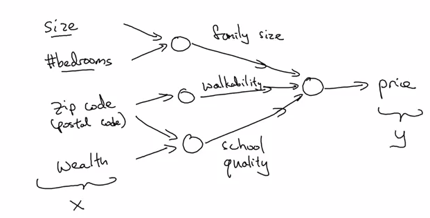
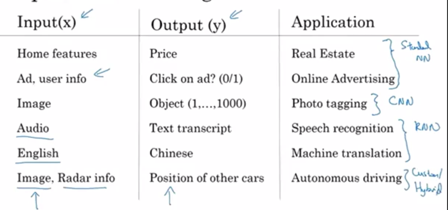
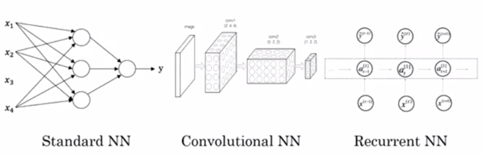
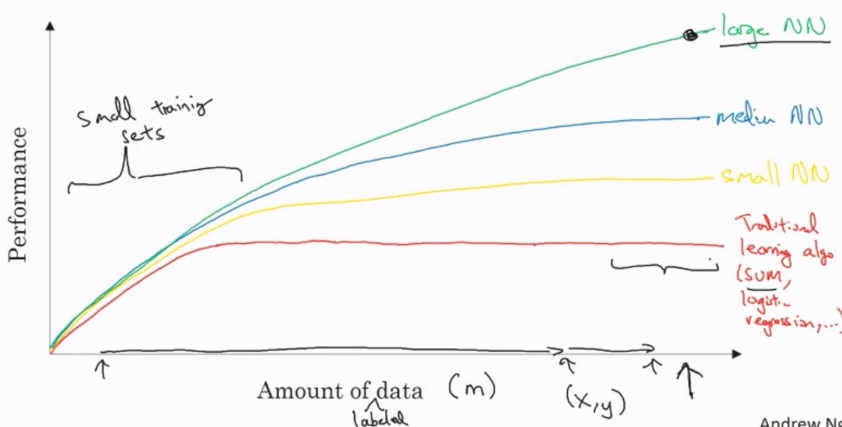
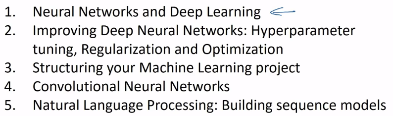
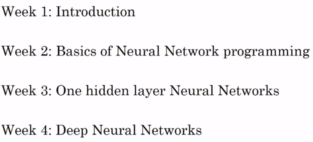

Title: [Neural Networks and Deep Learning] week1. Introduction to deep learning
Date: 2017-09-11  
Slug:  Ng_DLMooc_c1wk1  
Tags: deep learning  
Series: Andrew Ng Deep Learning MOOC  
 
[TOC]

What is a neural network?
-------------------------
Example: housing price prediciton. 

Each neuron: ReLU function

Stacking multiple layers of neurons: hidden layers are concepts more general than input layer — found automatically by NN.  

Supervised Learning with Neural Networks
----------------------------------------
supervised learning: during training, always have output corresponding to input.

Different NN types are used for different problems:  

structured data: database, each feature/column has a well-defined meaning.
unstructured data: audio/image/text, no well-defined meaning for pixels/tokens

Why is Deep Learning taking off?
--------------------------------
**scale** drives deep learning progress.
(scale: both of NN and of data)

trandition methods: pleateaus as amount of data grows further. 
NN: grows with data.  

* data scales up 
* computation faster
* new algorithms, e.g. from sigmoid to ReLU, which in turn speeds up computation too. 

About this course
-----------------

This course: **implementing** NN.  

