Title: [Neural Networks and Deep Learning] week2. Neural Networks Basics
Date: 2017-09-13  
Slug:  Ng_DLMooc_c1wk2  
Tags: deep learning  
Series: Andrew Ng Deep Learning MOOC  
 
[TOC]

This week: **logistic regression**.

Binary Classification & notation
--------------------------------
ex. cat classifier from image
image pixels: 64x64x3 
⇒ unroll(flatten) to a feature vector ``x`` dim=64x64x3=12288:=``n`` (input dimension)

**notation**

* superscript ``(i)`` for ith example, e.g. ``x^(i)``
* superscript ``[l]`` for lth layer, e.g. ``w^[l]``
* ``m``: number of data
* ``n_x``: input dimension, ``n_y``: output dimension.
* ``n_h^[l]``: number of hidden units for layer l.
* ``L``: number of layers
* ``X``: dim=(``n_x``,``m``), each *column* is a training example x^(i).
* ``Y``: dim=(``1``,``m``), one single ``row`` matrix.

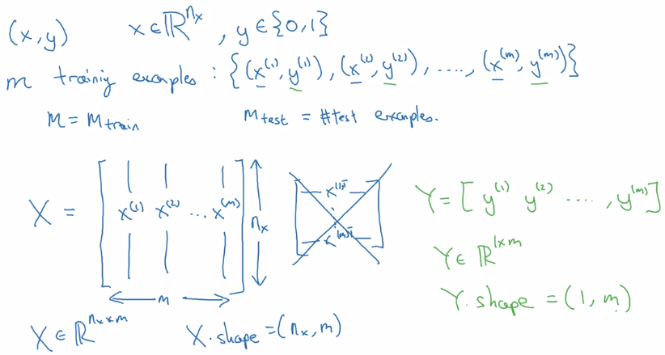

Logistic Regression as a Nueral Network
=======================================

Logistic Regression
-------------------

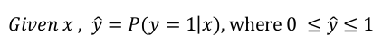  
dim(x) = n_x
parameters: w (dim=n_x) , b (dim=1)
(alternative notation: adding b to w → add x_0 = 1 to feature x. → will NOT use this notation here
keeping w and b separate make implementation easier )

linear regression: ``y_hat = w^T*x + b``
logistic regssion: ``y_hat = sigmoid(w^T*x + b)``
sigmoid function: S-shaped function 
``sigmoid(z) = 1 / ( 1 + e^-z)``
z large → sigmoid(z) ~= 1
z small → sigmoid(z) ~= 0  
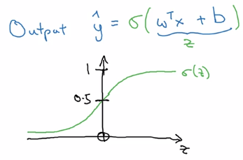

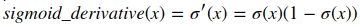

Logistic Regression Cost Function
---------------------------------
To train model for best parameters (w, b), need to define loss function.  
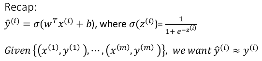   
y_hat: between (0,1)
training set: {(x^(i), y^(i)))), i = 1..m}
want: y_hat(i) ~= y(i)

**Loss function** ``L(y_hat, y)``: on a *single* training example (x, y)

* square error: ``L(y_hat, y) = (y_hat - y)^2/2`` 
	* ⇒ *not convex*, GD not work well, uneasy to optimize
* loss function used in logistic regression: 

``L(y_hat, y) = -[ylog(y_hat) + (1-y)log(1-y_hat)]``

* convex w.r.t. w and b
* when y = 1, loss = -log(y_hat)  → want y_hat large → y_hat ~=1
* when y = 0, loss = -log(1-y_hat) → want y_hat small → y_hat ~=0

**Cost function** ``J(w,b)``: average on all training sets, only depends on parameters w, b  
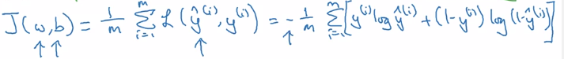  

Gradient Descent
----------------
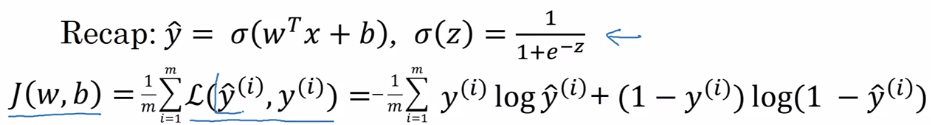  
⇒ minimize ``J(w,b)`` wrt. w and b

* ``J(w,b)`` is convex ⇒ gradient descent
* Initialization: for logistic regression, any init works because of convexity of J, usually init as 0

Gradient descent: 

* ``alpha`` = learning rate
* derivative ``dJ(w)/dw`` 

~= slope of function ``J`` at point ``w`` 
~= direction where ``J`` *grows* fastest at point ``w``
*denote this as '*``dw``*' in code*

* algo: 'take steepest descent'
	* from an init value of w_0
	* repeatedly update w until converge ``w := w - alpha*dw``

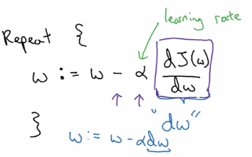  
	  
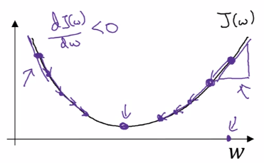  

In the case of logistic regression, >1 params (``w`` and ``b``) to update:  
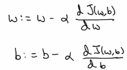  

Intuitions about derivatives: ``f'(a)`` = slope of function ``f`` at ``a`` .

Computation Graph
-----------------
example: function ``J(a,b,c) = 3(a+b*c)``

**Forward propagation**: compute J(a,b,c) value:

* internal u := b*c
* internal v := a+u
* J = 3 * v

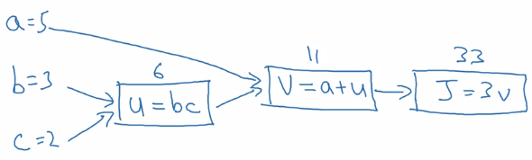

**Backward propagation**: compute derivatives dJ/da, dJ/db, dJ/dc:

* J = 3*v → compute dJ/dv
* v = a + u → compute dv/da, dv/du
* u = bc → compute du/db, du/dc

⇒ chain rule*: dJ/da is multiplying the derivatives along the path from J back to a*

* dJ/da = dJ/dv * dv/da
* dJ/db = dJ/dv * dv/du * du/db
* dJ/dc = dJ/dv * dv/du * du/dc

* In code: *denote '*``dvar``*' as d(FinalOutput)/d(var) for simplicity. i.e. da = dJ/da, dv = dJ/dv, etc.*

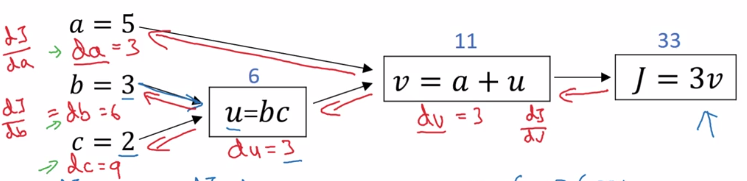

Logistic Regression Gradient Descent (&computation graph)
---------------------------------------------------------
logistic regression loss(on a single training example x,y) L.
as computation graph:

* z = wx + b
* a := sigmoid(z) (=y_hat, 'logit'?)
* loss function L(a,y) = - [y(loga) + (1-y)log(1-a)]

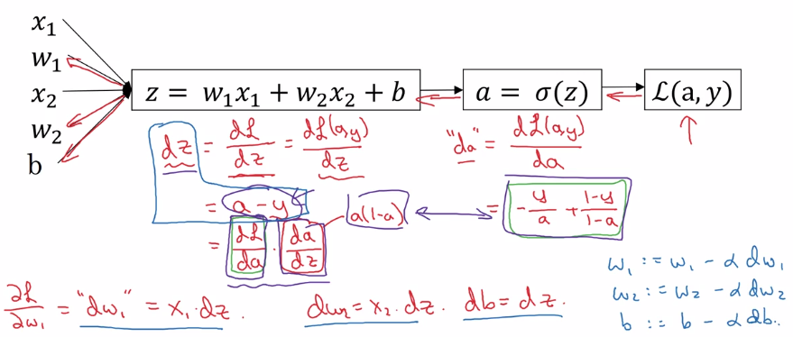

Gradient Descent on m Examples
------------------------------
*cost function*, i.e. on all training sets.  
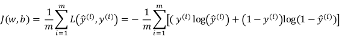  
J(w,b) = avg{L(x,y), for all m examples}
→ by linearity  of derivative: dJ/dw = avg(dL/dw), just average dw^(i) over all indices i.

In implementation: use **vectorization** as much as possible, get rid of for loops.

Python and Vectorization
========================

Vectorization
-------------
*avoid explicit for-loops whenever possible*
e.g. z = w^T * x + b
in numpy:
``z = np.dot(w, x) + b``
*~300 times faster than explicit for loop*

more examples:
u = A*v matrix multiplication
→ ``u =`` ``np.dot(A, v)``
note: ``A * v`` would element-wise multiply
u = exp(v) element-wise operation: exponential/log/abs/...
→ ``u = np.exp(v)`` ``/ np.log(v) / np.abs(v) / v**2 / 1/v``
	

Vectorizing Logistic Regression
-------------------------------
implementation before: two for-loops( 1 for each training set, 1 for each feature vector).

* training input ``X = [x(1), ... , x(m)]``, X.dim = (n_x, m)
* weight ``w^T = [w_1, ... , w_nx]``, w.dim = (n_x, 1)

**Fwd propagation**  
z(i) = w^T * x(i) + b, i = 1..m,
→ Z := [z(1)...z(m)] = w^T * X + [b...b], Z.dim = (1, m), stack horizentally
→ ``Z = np.dot(w.T, X) + b`` (scalar b *auto broadcasted* to a row vector)
a(i) = sigmoid( z(i) ) = y_hat(i)
→ A := [a(1)...a(m)] = sigmoid(Z), sigmoid is vectorized

**Bkwd propagation: gradient computation**  
``dz(i)  = a(i) - y(i)``
→ stack horizentally:
Y = [y(1)...y(m)]
dZ := [dz(1)...dz(m)] = A - Y
graidents:
``dw = sum( x(i) * dz(i) ) / m``, dw.dim = (nx, 1)
``db = sum( dz(i) ) / m``
→ 
db = 1/m * np.sum(dZ)
dw = 1/m * X*dz^T  
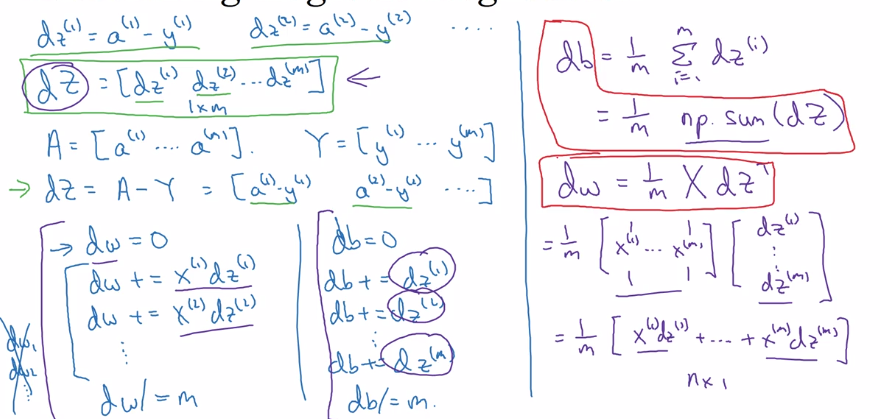

efficient back-prop implementation:  
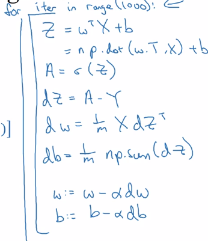

Broadcasting in Python
----------------------
example: calculate percentage of calories from carb/protein/fat for each food — without fooloop  
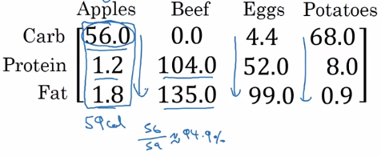  
two lines of numpy code:
	A = np.array([[...]..]) # A.dim = (3,4)
	cal = A.sum(axis=0) # total calories
	percentage = 100 * A / cal.reshape(1,4) # percentage.dim = (1,4)

* ``axis=0 ``→ sum *vertically, *``axis=1``* → sum horizentally*

  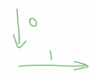

* ``reshape(a,b)`` → redundant here, just to make sure shape correct, *reshape call is cheap*. 
* ``A / cal`` → (3*4 matrix) / (1*4 matrix) → **broadcasting**

more broadcasting examples:  
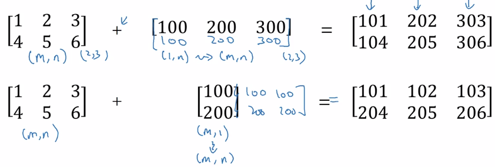  
General principle: computing (m,n) matrix with (1,n) matrix 
⇒ the (1,n) matrix is *auto expanded to a (m,n) matrix* by copying the row m times, to match the shape, calculate element-wise  
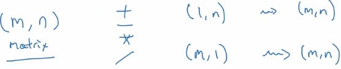

A note on python numpy vectors
------------------------------
flexibility of broadcasting: both advantage and *weakness*.
example: adding column vec and a row vec → get a matrix instead of throwing exceptions.
	>>> a
	array([1, 2, 3])
	>>> b
	array([[1],
	       [2]])
	>>> a + b
	array([[2, 3, 4],
	       [3, 4, 5]])

**Tips and trick to eliminate bugs**

**avoid** **rank-1 array**:   
``a.shape = (x,)``
this is *neither row nor column vector*, have non-intuitive effects.
	>>> a = np.array([1,2,3])
	>>> a.shape
	(3,)  # NOT (3,1)
	>>> a.T
	array([1, 2, 3])
	>>> np.dot(a, a.T)  # Mathematically would expact a matrix, if a is column vec
	14
	>>> a.T.shape
	(3,)

⇒ *do ***not*** use rank-1 arraies, use column/row vectors*
	>>> a2 = a.reshape((-1, 1))  # A column vector -- (5,1) matrix.
	>>> a2
	array([[1],
	       [2],
	       [3]])
	>>> a2.T
	array([[1, 2, 3]])  # Note: two brackets!

**add assertions**  
``assert(a.shape == (3,1))``

Explanation of logistic regression cost function (optional)
-----------------------------------------------------------
Justisfy why we use this form of cost function:
y_hat ~= chance of y==1 given x
want to express P(y|x) using y_hat and y
P(y|x) as func(y, y_hat) at different values of y:

* if y = 1: P(y|x) = P(y=1|x) = y_hat
* if y = 0: P(y|x) = P(y=0|x) = 1 - y_hat

⇒ wrap the two cases *in one single formula*: using exponent of y and (1-y)  
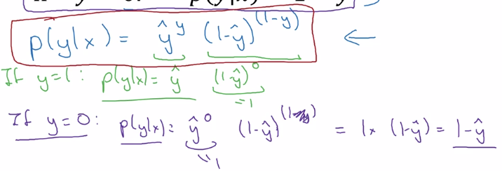  
⇒ take log of P(y|x) ⇒ loss function (for a single training example)  
  
⇒ aggregate over all training examples i = 1..m:
(assume: data are iid)
P(labels in training set) = multiply( P(y(i)|x(i) )
take log → log(P(labels in training set)) = sum( log P(y(i)|x(i) ) = - J
**maximizing likelihood = minimizing cost function**

Assignments
===========

python / numpy basics
---------------------

* np.reshape() / np.shape
* calculate norm: ``np.linalg.norm()``

  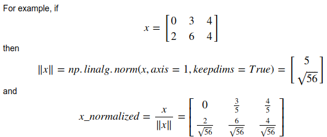

* ``keepdims=True``: 

  axes that are reduced will be *kept* (with size=1)

      >>> a
      array([[ 0.01014617,  0.08222027, -0.59608242],
            [-0.18495204, -1.50409531, -1.03853663],
            [ 0.03995499, -0.67679544,  0.11513247]])
      >>> a.sum(keepdims=1)
      array([[-3.75300795]])
      >>> a.sum()
      -3.7530079538833663

* [broadcasting](https://docs.scipy.org/doc/numpy/user/basics.broadcasting.html)
* softmax: 

  softmax for row vec:
  x.shape = (1,n), x = [x1,...xn]
  y = softmax(x), y.shape = (1,n), ``yi = exp(xi) / sum( exp(xi) )``
  softmax for matrix
  X.shape = (m,n)
  Y = softmax(X) = [softmax(row-i of X)], Y.shape = (m, 1)

Logistic Regression with a Neural Network mindset
-------------------------------------------------

* input preprocessing

  input dataset shape = (m, num_px, num_px, 3)
  → *reshape* to one column per example, shape = (num_px*num_px*3, ~~m~~)
  → *center & standardize* data: ``x' = (xi - x_mean) / std(x)``, 
  but *for images:* just divide by 255.0 (max pixel value), convenient and works almost as well.

* params initialization

  For logistic regression (cost function convex), just init to zeros is OK. 
    w = np.zeros((dim,1))
    b = 0.0

* Fwd prop: compute cost function

  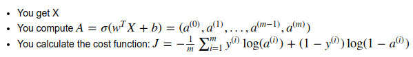  
  input ``X`` (shape = nx*m, one column per example)→ logits ``Z`` → activations ``A=sigmoid(Z) ``→ cost ``J``

* Bkwd prop

  

* Optimization

gradient descent: w := w - alpha*dw

* Predict: using learned params

  Yhat = A = sigmoid(wT * X + b)
