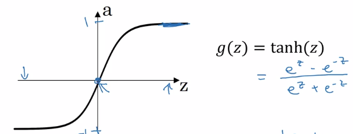

Title: [Neural Networks and Deep Learning] week3. Shallow Neural Network
Date: 2017-09-19  
Slug:  Ng_DLMooc_c1wk3  
Tags: deep learning  
Series: Andrew Ng Deep Learning MOOC  
 

Neural Networks Overview
------------------------
new notation: 

* superscript ``[i]`` for quantities in layer i. (compared to superscript ``(i)`` for ith training example).
* subscript ``i`` for ith unit in a layer

Neural Network Representation
-----------------------------
notation: 

* ``a^[i]``: activation at layer i.
* input layer: x, layer 0.
* hidden layer
* output layer: prediction (yhat)
* don't count input layer as a layer

a 2 layer NN:  

Computing a Neural Network's Output
-----------------------------------
each node in NN: 2 step computation

* z = wx + b
* a = sigmoid(z)

``z^[1]`` = stacking ``z[1]_i``s vertically
``a^[1]`` = sigmoid(``z^[1]``)
vectorize computing ``z^[1]``: W = *stacking rows of wi.T*  
  
W.shape = (4,3)
b.shape = (4,1)

* input at layer i = ``a^[i-1]`` (``x = a[0]``)
* output of each layer: ``a[i] = sigmoid(W[i] a^[i-1] + b[i])``

Vectorizing across multiple examples
------------------------------------
vectorize the computation acrosse m examples.
training examples: x^(1)...x^(m)  
  
computing all yhat(i) using forloop:  

X = *stacking columns of x(i)*, ``X = [x(1)...x(m)]``
Z[1] = stacking columns of z[1](i) = [z[1](1)...z[1](m)]
A = stacking columns of a(i)

  
  
**horizontal index = training example** ``^(i)``  
**vertical index = nodes in layer **``_i ``**/ input feature**`` x_i``
⇒ 

* Z[1] = W[1] * X + b[1]
* A[1] = sigmoid(Z[1])
* Z[2] = W[2] * A[1] + b[2]
* A[2] = sigmoid(Z[2]) = Yhat

Explanation for Vectorized Implementation
-----------------------------------------

**Recap**:
stacking columns of training examples ``x(i)`` and activations ``a[l](i)``  
  
⇒   
  

Activation functions
--------------------
general case: ``a = g(z)``, where g() is a nonlinear function.

* sigmoid: ``a = 1 / (1 + exp(-z))``

    
  a ∈ [0,1]

* tanh: ``a = (exp(z) - exp(-z)) / (exp(z) + exp(-z))``

    
  a ∈ [-1, 1] — shifted sigmoid function 
  ⇒ data is *centered, learning for next layer easier*
  *almost always better than sigmoid*, except for output layer (yhat = probability ∈[0,1])

downside of sigmoid and tanh: *slope very small when |z| is large* — GD slow.
⇒ ReLU

* ReLU ``a = max(0, z)``

  da/dz = 1 or 0
  NN learns faster because slope is constant when |z| large
  disadvantage: da/dz = 0 when z<0
  → leaky ReLU: small slope when z<0  
    
  

**Rules of thumb**:

* output layer: sigmoid for binary classification (output probability), *otherwise never use sigmoid*
* hidden layer: use ReLU activation by default

Why do you need non-linear activation functions?
------------------------------------------------
use a linear activation function g(z) = z ?
⇒ ``yhat`` will just be a *linear function* of ``x``. ``yhat = Wx+b``  
  
one single place when using linear activation: in output layer ( y∈R )when doing regression

Derivatives of activation functions
-----------------------------------
*formulas for g'(z)*

### g = sigmoid
  
⇒ ``g'(z) = g(z) * (1 - g(z)) = a * (1-a)``

* when z = +inf, g(z) = 1, g'(z) = 1*(1-1) = 0
* when z = -inf, g(z) = 0, g'(z) = 0
* when z = 0, g(z) = 0.5, g'(z) = 0.25

### g = tanh
  
⇒ ``g'(z) = 1 - tanh(z)^2 = 1 - a^2``

* when z = +inf, tanh(z) = 1, g' = 0
* when z = -inf, tanh(z) = -1, g' = 0
* when z = 0, tanh(z) = 0, g' = 1

### g = ReLU / Leaky ReLU
**ReLU**:
g(z) = max(0, z)
g' is *subgradient:*

* g' = 0 when z<0
* g' = 1 when z>=0

**Leaky ReLU**:
g(z) = max(0.01z, z)

* g' = 0.01 when z<0
* g' = 1 when z>=0

Gradient descent for Neural Networks
------------------------------------
NN with single hidden layer: n[0] = nx, n[1] = hidden layer size, n[2] = 1
params: w[1], b[1], w[2], b[2]

* ``w[1].shape=(n[1], n[0]), b[1].shape=(n[1], 1)``
* ``w[2].shape=(n[2], n[1]) , b[2].shape=(n[2],1)``
* output: yhat = a[2]

cost function J(w[1],b[1],w[2],b[2]) = 1/m * sum(L(yhat, y))

Gradient descent:

* random initialization
* repeat:
	* compute dw[1], db[1], dw[2], db[2]
	* w[1] := w[1] - alpha*dw[1], ...

Fwd prop:  
  
general formular for ``l``th layer:  
  

Bck prop: 
computing derivatives ``dw``, ``db``
note: use ``keepdims = True`` or  ``.rehape()`` to avoid rank-1 arraies.  

Backpropagation intuition (optional)
------------------------------------
Derive the formulas using computation graph + chain rule.  

gradient for a single example ``x=x(i), y=y(i)``:  

vectorized implementation for i=1,..,m:
**stacking columns**:``X = [x(1),..,x(m)]``, ``Z = [z(1)...z(m)]``, ``Y = [y(1)..y(m)]``, 
→   
  

Random Initialization
---------------------
Unlike logistic regression, needs init params randomly.

If we init all ``w`` and ``b`` to zeros: all activations ``a_i`` and ``a_j`` will be equal → ``dz_i = dz_j`` → *all hidden units completely identical*
⇒ needs to init all params *random, small* number (small because we want have larger derivatives for sigmoid, which is at small values, to speed up gd).
when w is init to small rand, b don't need random init.  

