Title: [Improving Deep Neural Networks] week1. Practical aspects of Deep Learning    
Date: 2017-10-21    
Slug:  Ng_DLMooc_c2wk1    
Tags: deep learning    
Series: Andrew Ng Deep Learning MOOC    
   
  
  
Setting up your Maching Learning Application  
============================================  
  
Train / Dev / Test sets  
-----------------------  
Applied ML: highly iterative process. *idea-code-exp loop*  
  
**splitting data**  
splitting data in order to speed up the idea-code-exp loop:    
*training set / dev(hold-out/cross-validataion) set / test set *  
  
**split ratio**:  
  
* with 100~10000 examples: 70/30 or 60/20/20  
* with ~1M examples: dev/test set can have much smaller ratio, e.g. 98/1/1  
  
  
**mismatched train/test distribution**  
training and test set don't come from the same dist.  
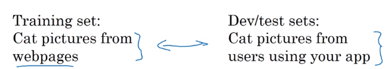  
  
  
* rule of thumb: **make sure** **dev and test set come from the same distribution.**  
* might be OK to only have dev set. — thought  in this case no longer have unbiased estimate of performance.  
  
  
Bias / Variance  
---------------  
  
* high variance: *overfitting*  
* high bias: *underfitting*   
  
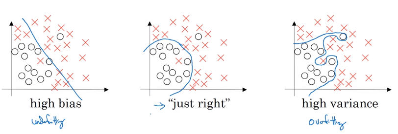  
high base and high variance (worse case): high bias in some region and high variance elsewhere  
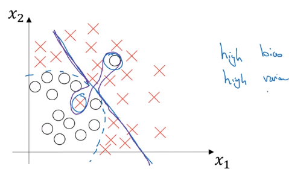  
  
**how to estimate bias&variance**  
→ *look at train and dev set error*  
  
* high variance: Err_train << Err_dev — not generalize well  
* high bias: Err_train ~= Err_dev, and Err_train >> Err_human — not learning well even on training set  
* high bias *and* high variance (worse): Err_train >> Err_human, Err_train >> Err_dev  
  
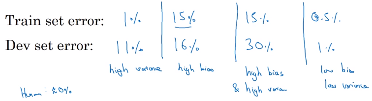  
  
Basic Recipe for Machine Learning  
---------------------------------  
  
basic recipe:  
  
1. does algo have high bias ? (look at Err_train)  
	* if yes → try bigger nn / other architecture  
	* until having low bias (fit well training set)  
2. high variance ? (look at Err_dev)  
	* if yes → get more data / regularization / other architecture  
  
  
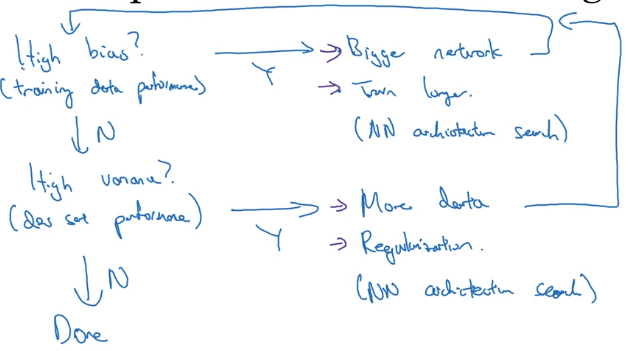  
  
  
**bias-variance tradeoff**  
  
* in pre-DL era, bias and variance are tradeoff (decrease one → increase the other)  
* in DL era: *if getting bigger nn and more data always possible*, *both can be reduced*  
  
  
(when well regularized,) *"training a bigger NN almost never hurts."*  
  
Regularizing your neural network  
================================  
2 ways to reduce variance: regularize, or get more data.  
  
Regularization  
--------------  
  
### example: logistic regression  
  
* params: ``w``, ``b``  
* cost function ``J(w,b) = 1/m * L(yhat_i, yi)``  
  
→ add one more term to cost ``J``: adding L2 norm of ``w``(*L2 regularization*)  
(lambda: regularization param)  
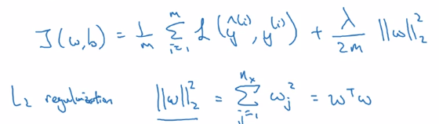  
*just omit regularizing b*: ``w`` is high dim, ``b`` is single number.  
  
L1 regularization: L1 norm of ``w`` → *w will be sparse → *compressing the model (just a little bit)  
⇒ *L2-reg is much often used*  
  
### example: NN  
  
* params: ``w[l]``, ``b[l]`` for l = 1..N  
* sum of the norms of each ``w[l]`` matrix.  
  
⇒ *"Frobenius norm"* of a matrix: sum (each element squared)  
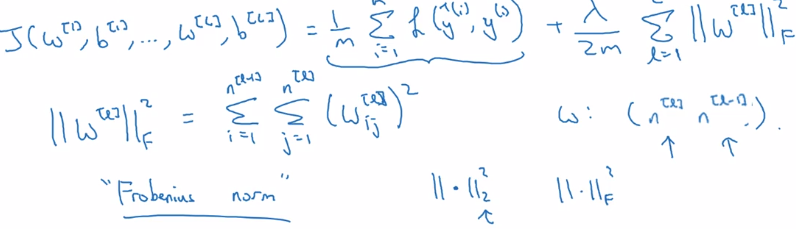  
  
**gradient descent**: adding one more term from backprop  
d(1/2m * ||w||) = lambda / m   
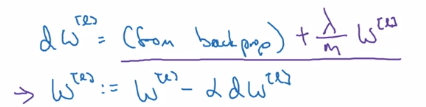  
  
L2-reg also called "**weight decay**":   
with L2-reg, looks as if doing the backprop updating, with w being w' = (1-alpha*lambda/m) * w (decayed w)  
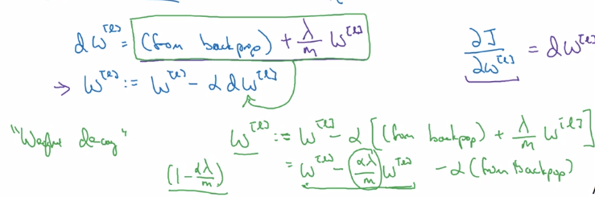  
  
Why regularization reduces overfitting?  
---------------------------------------  
*why imposing small params prevents overfitting?*   
  
**intuition 1**  
→ heavy regularization   
→ weight ~= 0   
→ many hidden units' impact are "*zeroed-out"*  
→ simpler NN  
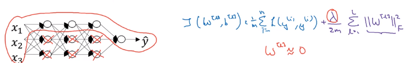  
  
**intuition 2**  
e.g. activation g(z) = tanh(z)  
small z → g(z) ~= linear,   
large z → g(z) flattend  
⇒ large lambda → small w   
→ z small   
→ every layer ~linear  
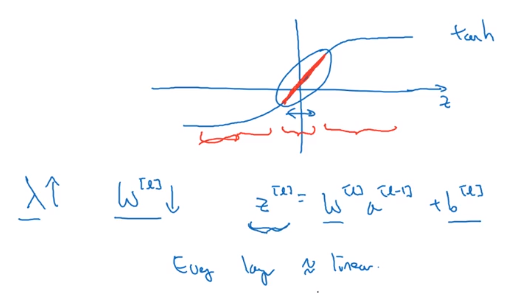  
  
Dropout Regularization  
----------------------  
another powerful method of regularization  
**dropout**: *For each training example*, in each layer, *eliminate randomly some of its output values.*   
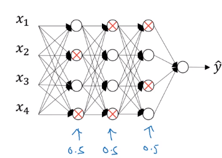 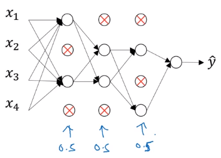  
  
### dropout implementation: "inverted dropout"  
example: dropout of *layer 3*, keep_prob = 0.8 (prob of keeping hidden unit)  
→ generate a rand matrix of shape the same shape as activation ``a[3]``  
  
	d3 = np.random.rand(a3.shape[0], a3.shape[1]) < keep_prob  # d3 is bool matrix  
	a3 = np.multiply(a3, d3)  # element-wise multiply  
	a3 /= keep_prob  # ****"inverted dropout"****  
  
**"inverted dropout": why a3 /= keep_prob (i.e. make a3 larger)?**  
  
* let's say layer 3 has 50 units, keep_prob = 0.8   
* → ~10 units shut off  
* ``z[4] = w[4] * a[3] + b[4]``  
  
⇒ a[3] have random 20% units shut off   
→ *w[4]*a[3] will be reduced by 20% in expection*  
  
* inverted dropout: a3 /= keep_prob, to *keep expected value a3 remains unchanged*.  
* (No dropout at test time) → inverted dropout *avoids scaling problem at test time*  
  
  
**making predictions at test time**  
NOT use dropout at test time ⇒ don't want output to be random at test time...  
  
Understanding Dropout  
---------------------  
*why randomly shut units prevents overfitting ?*  
  
**Intuition: can't rely on any one input feature → have to spread out weight**  
spread weights ~→ smaller L2 norm (shrink weights)  
Can be formally proven: dropout is equal to *adaptive* L2-reg, with penalty of different weight being different.  
  
For one hidden unit: any of it input features (from prev layer) can go out at random  
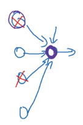  
  
**Implementation details**  
  
* vary keep_prob for different layer   
  
→ *smaller keep_prob for larger layer*  
  
* usually no dropout (or very small dropout) for input layer...  
  
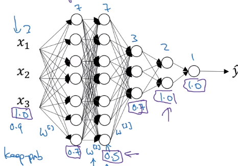  
  
**Downside of dropout**  
cost function J *no longer well-defined *(because output yhat is random)  
→ can no longer plot cost-iter curve  
→ turn off dropout before plotting the curve  
	  
  
Other regularization methods  
----------------------------  
  
### data augmentation  
adding more training example is expensive   
→ vary existing training data (e.g. flipping/rand-distortions of training image for cats)  
  
### early stopping  
plot Err or J to #iterations *for both train and dev set.*  
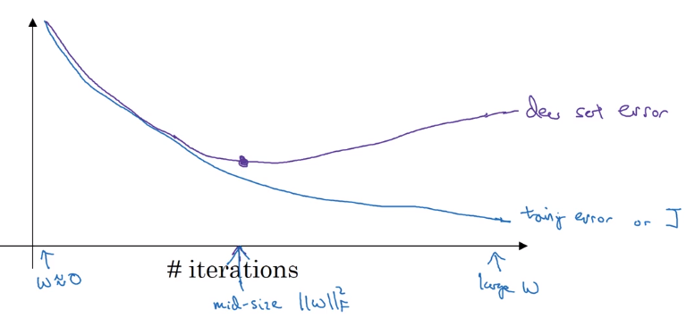  
  
**Downside of early-stopping**:   
*optimization cost J* and *not overfitting* should be separated task ("Orthogonalization")  
→ early-stopping couples the two jobs.  
  
upside of early stopping: no need to try different values of regularization param (lambda) → finds "mid-size w" at once.  
  
Setting up your optimization problem  
====================================  
How to speed up training (i.e. optimize J)  
  
Normalizing inputs  
------------------  
normalize input:  
  
1. substract mean   
2. normalize variance  
  
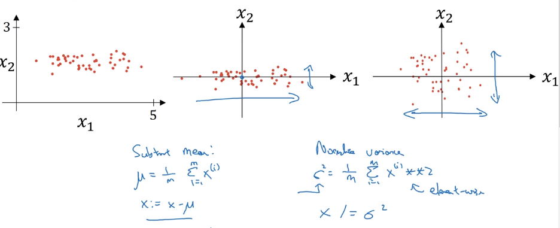  
detail: in data splitting, *use the same meu/sigma to normalize test set !*   
  
**why normalizing input ?**  
if features x1 x2 are on different scales → w1 and w2 not same scale  
J is more symmetric, easier to optimize  
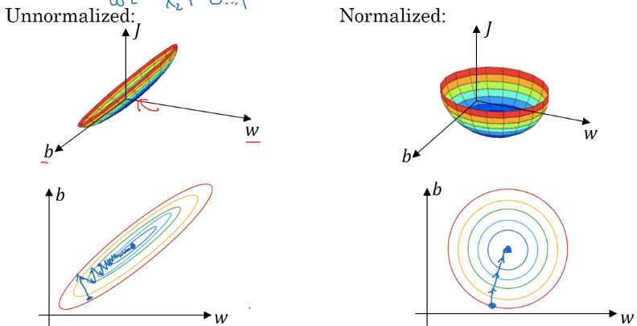  
  
  
### Vanishing / Exploding gradients  
One problem in training very deep NN: vanishing/exploding gradients.  
  
example: a very deep NN, each layer 2 units, linear activation g(z)=z, ignore bias b[l] = 0.  
 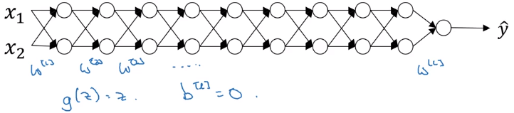  
linear activations → y is just a linear transformation of x  
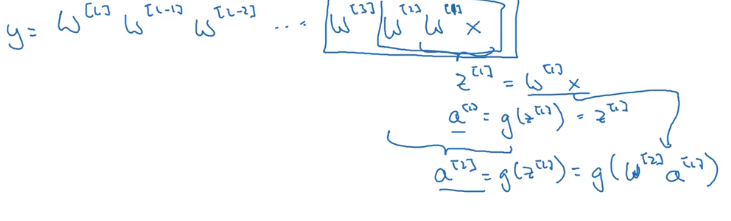  
  
  
* assuming each w[l] = 1.5 * Identity_matrix ⇒ activations increase exponentially  
* assuming each w[l] = 0.5 * Id ⇒ activations decrease exponentially  
  
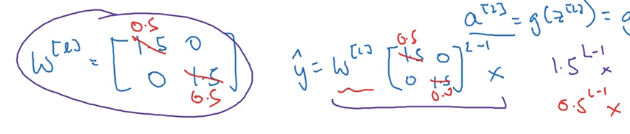  
yhat too large or too small → hard to train  
  
Weight Initialization for Deep Networks  
---------------------------------------  
A partial solution of vanishing/exploding gradient problem: *carefully initialize weights*.  
  
**single neuron example:**  
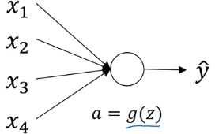  
  
* y = g(w*x), g = relu  
* n = # inputs for   
  
z = w1*x1 + ... + wn*xn,   
if wi are initzed randomly  
→ large ns ⇒ z will be large !   
⇒ **set var(wi) = 1/n** (2/n in practice) to keep z in similar scale for diffent #inputs  
initialization code:   
``w[l] = np.random.randn(shape[l]) * np.sqrt( 2 / n[l-1] )  # n[l-1] = #inputs for layer-l``  
  
**other variants**  
when activation function g = tanh   
⇒ use var(wi) = 1/n ("**Xavier initialization**")  
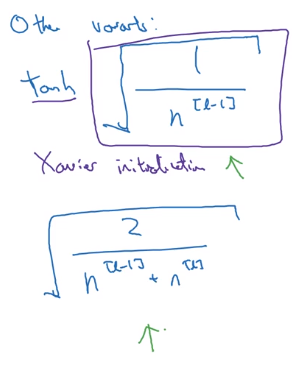  
  
Numerical approximation of gradients  
------------------------------------  
  
**checking the derivative computation**  
example: f(x) = x ^ 3  
→ *vary x by epsilon* to approximate f'(x), *use 2-sided difference*  
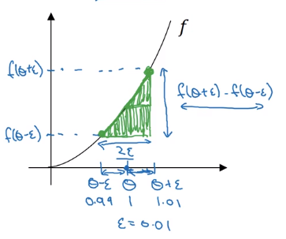    
  
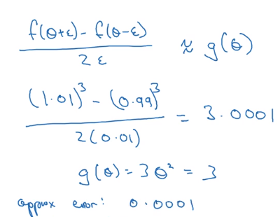  
  
error order = O(epsilon^2) for 2-sided difference  
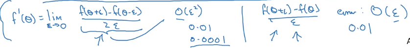  
  
Gradient checking  
-----------------  
**Verify** that your implementation is correct. — help finding out bugs in implementation early.  
  
  
* concat all params into a big vector ``theta``  
* concat all dW[l] db[l] into big vector ``d_theta``  
* to **check if d_theta is correct**: construct a ``d_theta_approx`` vector  
  
  
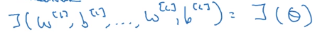  
⇒   
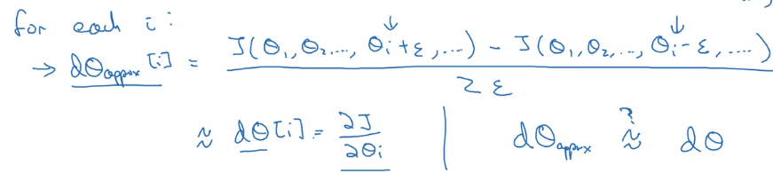  
  
How to check "approximate":  
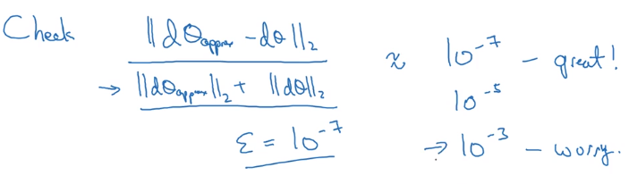  
  
  
Gradient Checking Implementation Notes  
--------------------------------------  
  
* Dont' use checking in training: constructing d_theta_approx is slow  
* When check fails: look at components to try to find bug  
* Remember regularization: J contains reg term as well  
* Doesn't work with dropout: J not well defined (random variable), turn dropout off before checking.  
* Run check at random initialization (w,b~=0), then again after some training(w,b~>0)  
  
  
  
