Title: [Improving Deep Neural Networks] week2. Optimization algorithms  
Date: 2017-10-23  
Slug:  Ng_DLMooc_c2wk2  
Tags: deep learning  
Series: Andrew Ng Deep Learning MOOC  
     
  
This week: optimization algos to faster train NN, on large dataset.  
  
Mini-batch gradient descent  
---------------------------  
  
### batch v.s. mini-batch GD  
Compute J on ``m`` examples: vectorization, i.e. stacking x(i) y(i) horizontally.  
``X = [x(1), ..., x(m)]``  
``Y = [y(1), ..., y(m)]``  
→ still slow or impossible with large ``m``.  
  
⇒ split all m examples into *mini-batches*. X^t^, Y^t^  
e.g. mini batch size = 1000.  
  
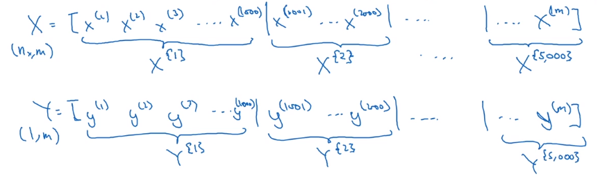  
  
Minibatch GD:  
each step, run one iteration of GD using X{t}, Y{t} instead of doing with full X, Y.  
one "**epoch**": one pass through all training set  
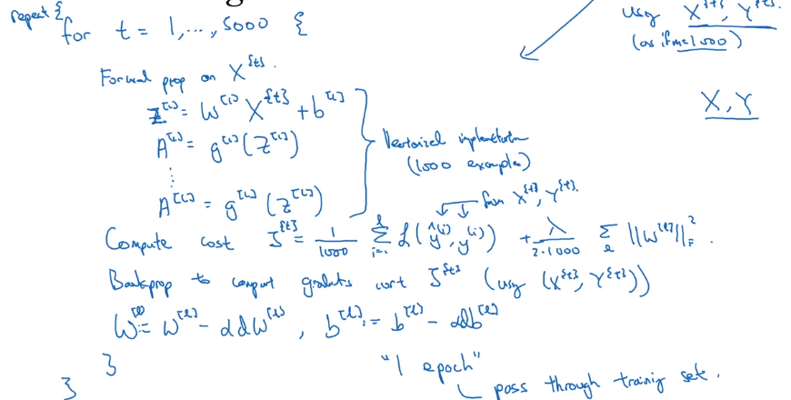  
  
  
Understanding mini-batch gradient descent  
-----------------------------------------  
with batch-GD: each iteration will decrease cost function.  
in mini-batch: cost J^t^ is computed on different dataset — noisy.  
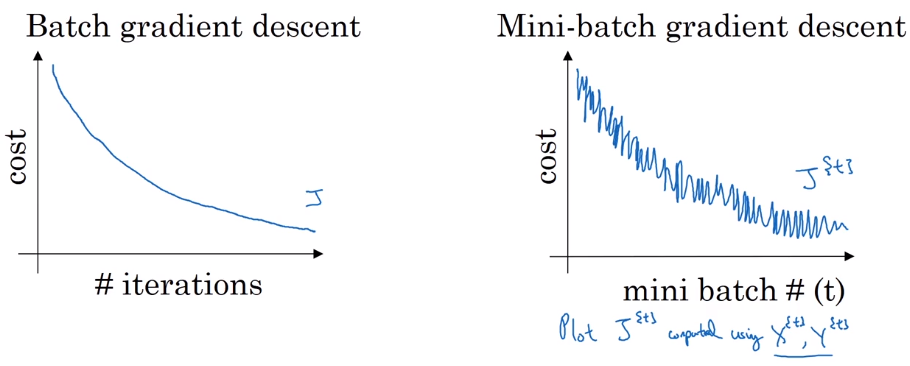  
  
How to choose minibatch size  
  
* extreme 1: minibatch size = m → batch GD  
  
	coverge fastest in each iter (*but too long time or impossible per iter*)  
  
* extreme 2: minibatch size = 1 → *stochastic GD*  
  
	noisy, never coverge, (*but loose all vectorization speedup)*  
	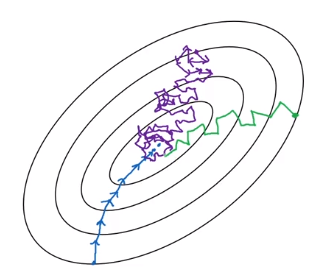  
  
**Guidelines on choosing batch size**:  
  
* small training set (m<2000) → just batch size  
* otherwise:   
  
	typical minibatch size = 64/128/256/512 (make sure minibatch size fits in CPU/GPU memory)  
  
  
Exponentially weighted (moveing) averages  
-----------------------------------------  
*In fact, exp-weighted-avg is an non-parametric estimator/smoother of a series of vlaues.*  
  
example: Temperature over the year  
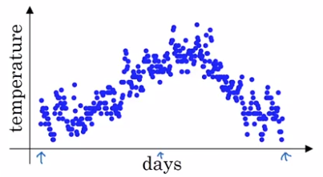  
→ use a *exp-weighted moving average* to model this:  
``theta[t]`` = temperature at day t, t = 1,2,3,...  
``v[t]`` = averaged(smoothed) estimate of theta, t = **0**,1,2,3,...  
**exp-weighted average**: *recursivly compute v[t].*  
``v[0] = 0, v[t] = 0.9 * v[t-1] + 0.1 * theta[t]``  
(param: beta = 0.9)  
⇒ v[t] ~= *average of theta[t] over the last 1/(1-beta) days*. (c.f. next section)  
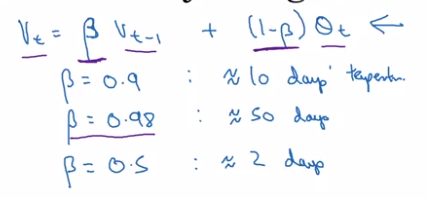  
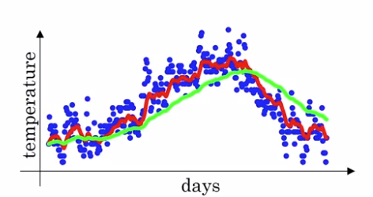  
  
Understanding exponentially weighted averages  
---------------------------------------------  
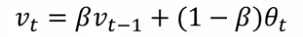  
Understanding the math of exp-weighted-average:  
→ unroll the recursive formula:  
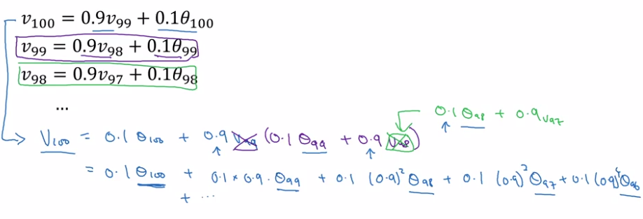  
  
⇔ v[100] = *a convolution of theta[t-100:t] and a exp-decaying function:*  
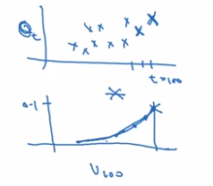  
  
A small trick on *estimating exps*:   
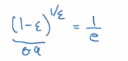  
That's why in previous section, we say this formula ~= averaging over last 1/(1-beta) (=1/epslon) days' theta.  
e.g. theta[t-10]'s weight is 0.9 ^ 10 ~= 1/e ~= 0.35, i.e. after 10 days, the weight of theta[t-10] is decayed to ~< 1/3.  
  
**Advantage** to just computing moving window averages:  in implementation, only keep updating a single variable v_theta — very small memory usage.  
  
Bias correction in exponentially weighted averages  
--------------------------------------------------  
To make exp-weighted averages more accurate by *bias correction.*  
Problem with previous implementation in initial phase:   
  
* v[0] = 0, beta = 0.98  
* v[1] = 0.98*0 + 0.02 * theta[1] ⇒ *v[t] starts lower than theta. *(purple curve VS green curve)  
  
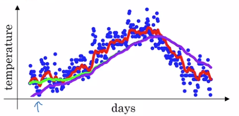  
⇒ **Correction**:  
take ``v[t] / (1 - beta^t)`` instead of v[t].  
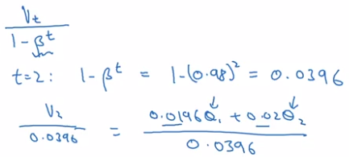  
  
In practice: *most people don't bother to implement bias correction* — just wait for the initial phase to warm up...  
  
Gradient descent with momentum  
------------------------------  
GD with momentum:   
  
* almost always faster than normal GD  
* in short: *compute exp-weighted-avg of the gradients as gradient to use*  
  
  
example:  if contour of loss is an ellipse, can't use too large step in GD, and oscillate. → average of steps will be faster.  
  
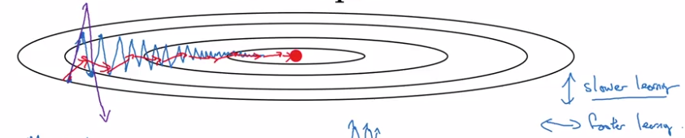  
  
**GD momentum**:  
Use exp-weighted-avg of dW (V_dW) and of db (V_db). — smooth out oscillation steps of normal GD.  
update params with the averaged value V_dW, V_db.  
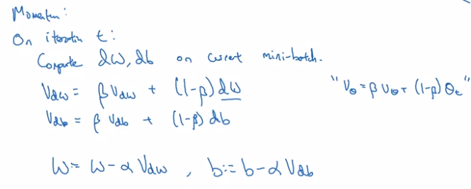  
    
Why the name "momentum": *rolling down a ball in a bowl*  
dW/db: ~accelation  
V_dW/B_db: ~velocity at current time (*this is why the smoothing average is called 'v'*)  
beta: ~friction  
  
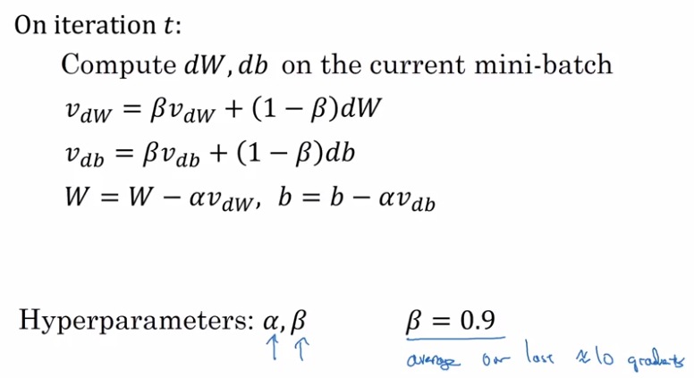  
  
in practice:   
  
* beta=0.9 works well for most cases  
* no bias correction implemented  
* can use beta = 0 →  ~V_dW is scaled by 1/(1-beta) → use a scaled alpha then.  
  
⇒ less intuitive, and couples the tuning of alpha and beta  
  
  
RMSprop  
-------  
"Root-Mean-Square-prop".  
  
* also for speedup GD  
* in short:   
  
	*S =* exp-weighted-avg of gradient *squared* *(that's why call param beta2);*  
	when updating params(W,b)*, scale dW,db by ***sqrt of S***. *``dW / sqrt(S_dW)``  
		
	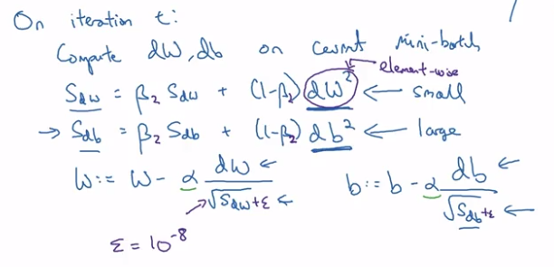  
		
	example: ellipse contour, want slow rate in ``b`` directrion and fast rate in ``w`` direction.  
		
	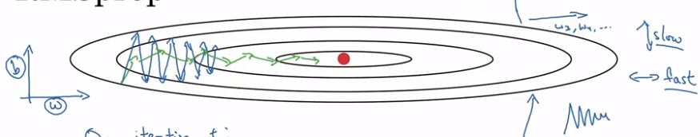  
		
	⇒ for each step (dW, db) = gradient of current minibatch:  
  
* db *large*, dW *small*  
  
	→ update w by dW/sqrt(S_dW), ⇔ *larger* step in W direction  
	→ db/sqrt(S_db) ⇔ *smaller* step in b direction → damping out oscillations in b direction  
  
Adam optimization algorithm  
---------------------------  
"Adaptive Moment-estimation"  
  
* A *combination* of RMSprop and momentum.  
* Proved to work well for a varity of problems.  
  
  
Algo:  
  
* maintain both V_dW, V_db (hyper-param=beta1) and S_dW, S_db (hyper-param=beta2)  
* implement bias correction: V_corrected, S_corrected — divid by (1-beta^t)  
* param update (W, b): ``V / sqrt(S)``  
	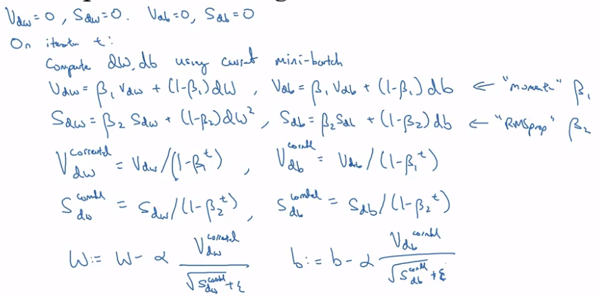  
  
hyperparameters:   
  
* alpha: learning rate, *needs tuning*  
* beta1: usually 0.9  
* beta2: usually 0.999  
* epsilon: 10e-8 (not important)  
  
  
  
Learning rate decay  
-------------------  
slowly reduce learning rate.  
  
In minibatch with fixed learning rate: *will never converge*.  
⇒ decay learning rate → oscillating around a smaller region of optima.  
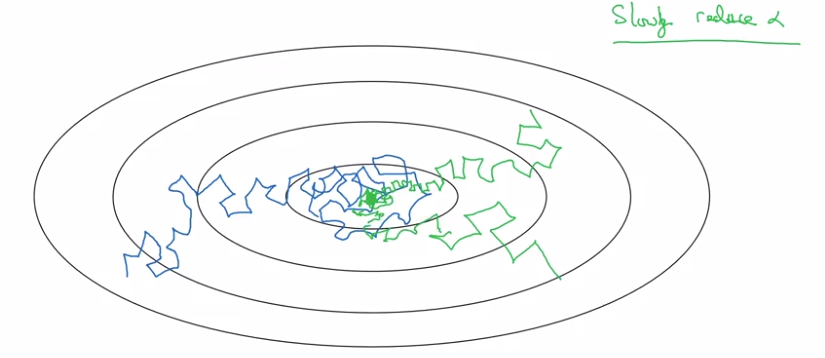  
  
Implementation:  
  
* 1 *epoch* = 1 pass through whole data.  
* decay learning rate alpha after each epoch (hyper-param *decay-rate*):  
  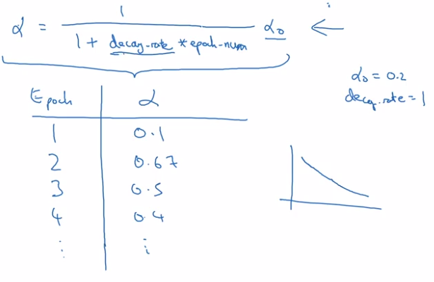  

other decay method:  
  
* exponentially decay alpha:   
  
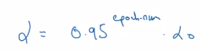  
  
* sqrt of epoch_num:  
  
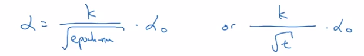  
  
* discrete staircase:  
  
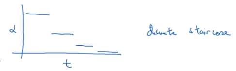  
  
* manual decay: when training takes *long time*  
  
  
The problem of local optima  
---------------------------  
low-dimention optimas:   
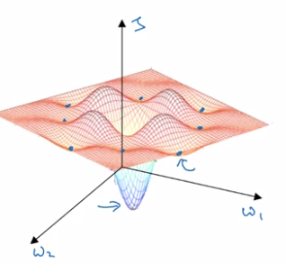  
  
This gives *wrong* intuition, in practice (high-dim), most 0-gradient points are *saddle points.*  
  
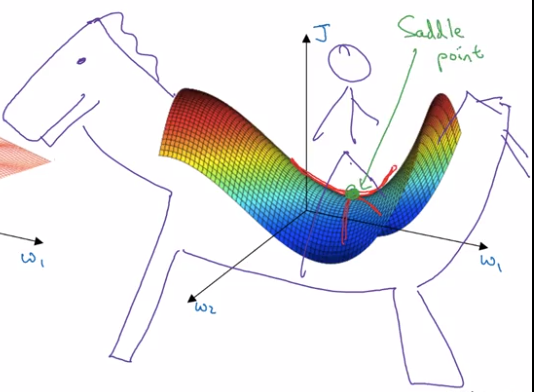  
  
**plateau**: region where gradient close to 0 for long time.  
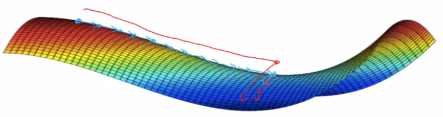  
  
take-away:  
  
* *unlikely* to stuck in bad local optima: D dimentional → ~2^(-D) of chance.  
* *plateaus* can make learning slow → use momentum/RMSprop/Adam to speedup training.  
  
  
assignment  
----------  
**implementing mini-batch GD**:  
shuffle data (note: X and Y's columns are sync-ed!):  
  
	permutation = list(np.random.permutation(m))  
			shuffled_X = X[:, permutation]  
			shuffled_Y = Y[:, permutation].reshape((1,m))  

→ partition data:  
kth mini batch:  

	mini_batch_X = shuffled_X[:, k*mini_batch_size:(k+1)*mini_batch_size]  
	     mini_batch_Y = shuffled_Y[:, k*mini_batch_size:(k+1)*mini_batch_size]  
  
  detail: when m % minibatch_size != 0: handle last batch (smaller than a regular batch)  
