Title: [Improving Deep Neural Networks] week3. Hyperparameter tuning, Batch Normalization and Programming Frameworks  
Date: 2017-10-23  
Slug:  Ng_DLMooc_c2wk3  
Tags: deep learning  
Series: Andrew Ng Deep Learning MOOC  
  
  
Hyperparameter parameters  
-------------------------  
Tips for hyperparam-tuning.  
  
### Tuning process  
Many hyperparams to tune, mark importance by colors (red > yellow > purple):  
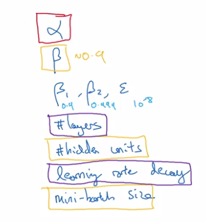  
  
How to select set of values to explore ?  
  
* Do **NOT** use grid search (grid of n * n)  
  
  — this was OK in pre-DL era.  
  
* **try random values.**  
  
  reason: difficule to know which hyperparam is most important, by randomization, *can try out n*n distinct values for each hyperparam.*  
In extreme case, one is ``alpha``, the other is ``epislon``.  
  
* in grid search: only n distinct values of alpha are tried  
* in random choice: can have n*n distinct values of alpha  
  
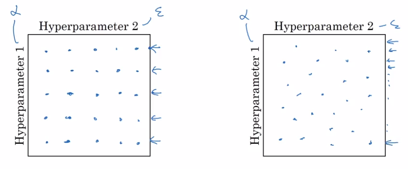  
  
* **Coarse to fine** sample scheme: zoom in to smaller regions of hyperparam space and re-sample more densely.  
  
  
  
  
### Using an appropriate scale to pick hyperparameters  
"Sampling at random", but at *appropriate scale, not uniformly.*  
example: choice of alpha in [0.001, 1]  
→ *sample uniformly at log scale* is more resonable: equal resources are used to search at each scale.  
  
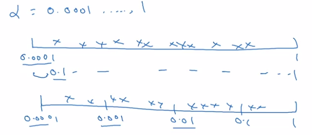  
  
implementation:  
  
	r = -4 * np.random.rand()  # -4 <= r <= 0, uniformly at randome  
	alpha = np.exp(10, r) # 10e-4 <= alpha <= 1.0  
  
  
*sampling beta for exp-weighted-avg: *sample in the range of [0.9, 0.999]  
→ convert to sampling 1-beta, which is in range [0.0001, 0.1]  
  
### Hyperparameters tuning in practice: Pandas vs. Caviar  
Tricks on how to *organize* hyper-param-tuning process.  
  
*re-test hyperparams occasionally:* intuitions get stale, re-evaluate hyperparams every several months.  
  
Two major schools of training  
  
* **Panda approach**: *babysitting one model*  
  
  Huge dataset, limited computing resources, can only train one model → babysit the model as it's training. Watch learning curve, try changing hyparams once a day.  
  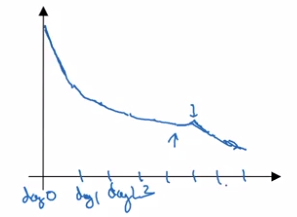  
  
* **Caviar approach**: *train many models in parallel*  
  
  Have enough computation power.  
  Different model/hyperparams being trained at the same time in parallel, pick the best one.  
  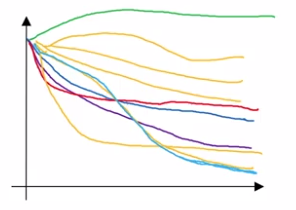  
  
  
Batch Normalization  
-------------------  
**Batch normalization**:  
(in some cases) *makes NN much more robust, and DNN much easier to train.*  
  
### Normalizing activations in a network  
In pre-DL: normalize inputs to speedup learning. "make contours round"  
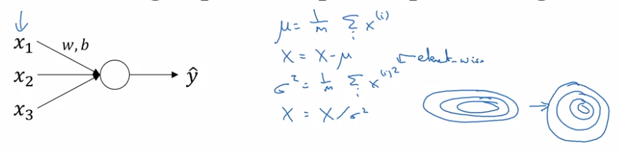  
In NN: normalize the activation ``a[l-1]`` from previous layer could help (in practice, usually normalize ``z[l-1]``.)  
 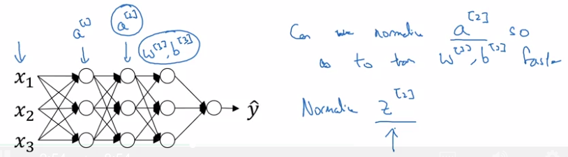  
  
**BatchNorm algo**:  
intermediate values at each layer: ``z[l]``  
→ compute mean & variance  
⇒ get normalized ``z[l]_normed``. (mean=0, std=1)  
→ **trasform** ``z[l]_normed`` to ``z_tilde[l]`` (mean=``beta``, std=``gamma``, *beta and gamma are learnable params*),  
reason: for hidden units, want to move/stretch the support of hidden inputs, so as to profit from non-linearity of activation function.  
  
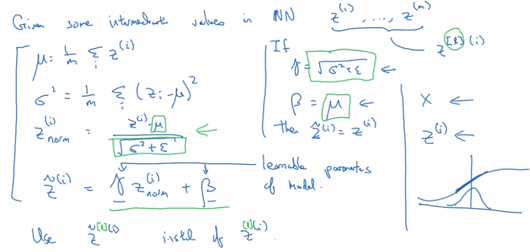  
  
### Fitting Batch Norm into a neural network  
Add batchnorm to NN: replace z[l] to z_tilde[l] at each layer before activation g[l].  
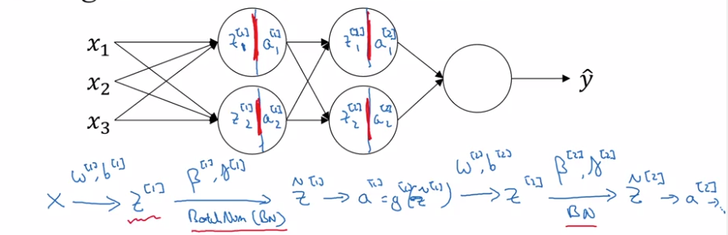  
  
Extra params to learn: ``gamma[l]`` and ``beta[l]`` at each layer.  
  
In practice: no need to implement all details of BN, use DL framework.  
  
**No bias term (b) in BN**:  
z[l] = W[l] * a[l-1] + b[l]  
but z[l] will be centered anyway → ``b[l]`` is not useful.  
→ ``b[l]`` is replaced by ``beta[l]``  
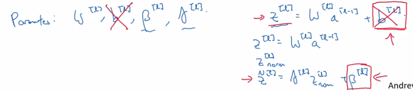  
Dimension of beta[l], gamma[l]: the same as b[l] ( = n[l] * 1).  
  
### Why does Batch Norm work?  
**intuition 1**: similar to normalizing input ("make contours round")  
  
**intuition 2**: weights in deeper layers are more robust to changes in ealier layer weights.  
i.e. Robost to *data distribution changing*. ("**covariant shift**")  
  
motivating example:  
cat-classification, *trained all with black cats, but applied to colored cats*.  
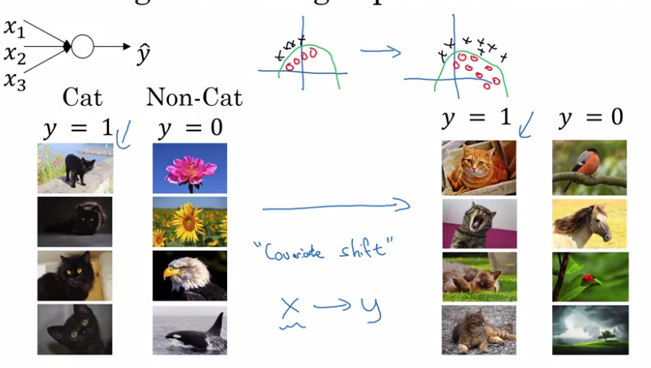  
  
For NN, consider the 3rd layer's units:  
input features: a[2],  
if cover the first 2 layers, this is a NN to map from a[2] to y_hat  
⇒ but when weights w[2],b[2] are updated in GD, *a[2]'s distribution is always changing*.  
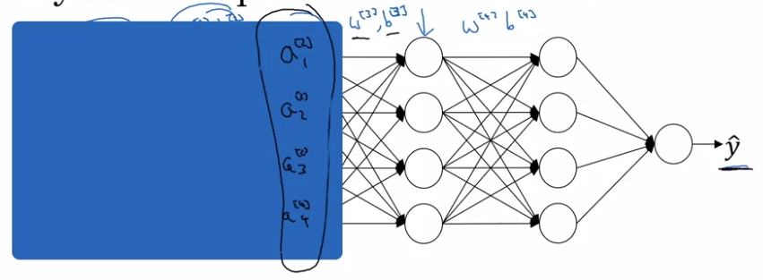  
**intuition**: With BN, a[2] are ensured to *always have the same mean/variance*  
  → "data distribution" is unchanged → later layers can learn more easily, independent of previous layer's weights' change.  
  
**intuition 2**: BN as *regularization*  
  each minibatch is scaled by mean/var of just that minibatch  
  → *add noise* to the transformation from z[l] to z_tilde[l].  
  ⇒ similar to dropout, add noise to each layer's activations.  
  therefore BN have (*slight*) regularization effect (thie regularization effect gets smaller as minibatch size grows).  
  (This is an unintended side effect.)  
  
### Batch Norm at test time  
*At training time*, z[l] is standarlized *over each minibatch*.  
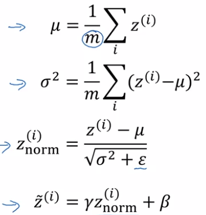  
⇒ But at test time needs to treat examples one at a time.  
→ estimate the value of meu/sigma2  
⇒ using* exp-weighted-avg* estimator across minibatchs (with beta close to 1 → ~running average).  
at test time, just use the latest value of this exp-weighted-avg estimation as meu/sigma2.  
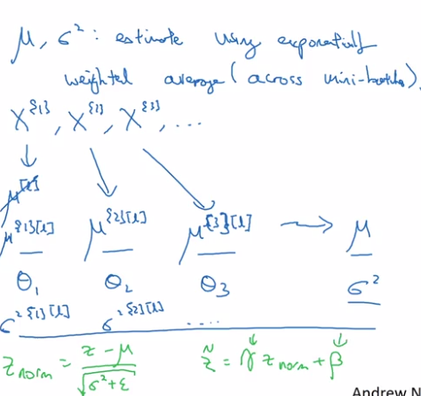  
  
Multiclass classification  
-------------------------  
  
### Softmax Regression  
So far: only binary classification  
generalize logistic regression to >2 classes ⇒ *softmax regression*.  
  
``C`` = #classes, = #units in output layer  
each component in y_hat is probability of one class, y_hat is normalized.  
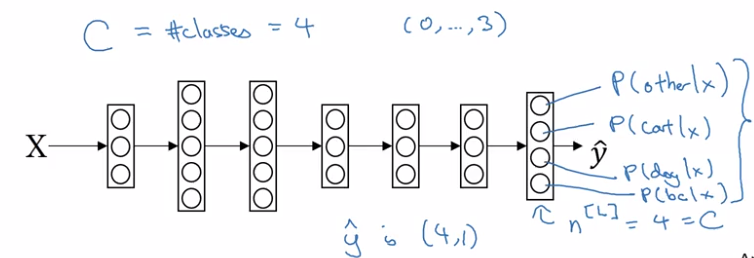  
  
  
**softmax layer**:  
  
* z[L] = W[L] * a[l-1] + b[L] — same as before  
* a[L] = y_hat = g(z[L])  
  
activation function: *softmax*  
take exp(z[L]) --element-wise, and then normalize:  
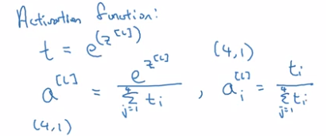  
  
The softmax activation function is unusual because it takes a *vector* instead of scalar.  
Softmax is generalization of logistic regression: decision boundary of a *single-layer (no hidden layer)* softmax is also *linear*:  
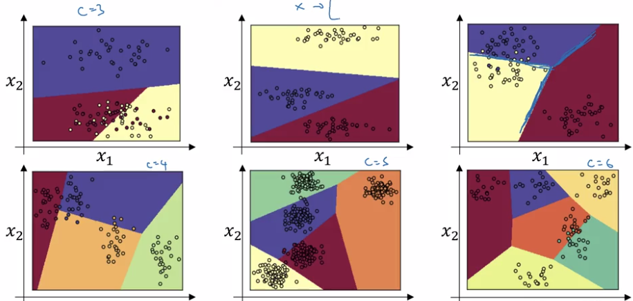  
  
  
### Training a softmax classifier  
**understanding softmax**  
  
* "softmax" is in contrast to "*hardmax*":  
  
  hardmax[i]= 1 if z_i=max else 0.  
  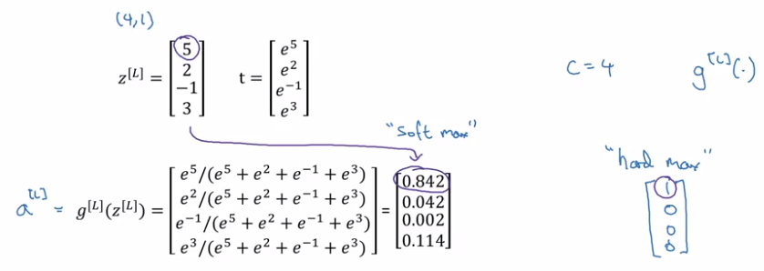  
  
* When C = 2, softmax reduces to logistic regression.  
  
  softmax(C=2) = [logistic-reg(), 1-logistic-reg]  
  
**loss function**  
recall: loss function in logistic regression  
L(y, y_hat) = -1 * sum( y_i * log yhat_i + (1-y_i) * log(yhat_i) )  
→ want y_hat big when y_i=1, small when y_i=0  
  
  
* training label y: one-hot encoding.  
* prediciton y_hat: probability vector  
  
loss function:  
  
* if y_k=1, want to make yhat_k big  
  
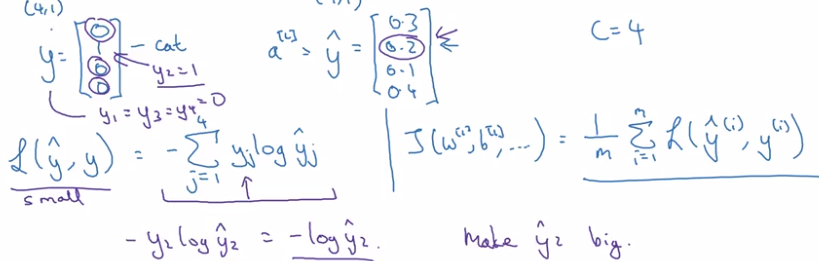  
→ max-likelihood estimation.  
  
**GD with softmax**  
fwdprop:  
Z[L] --(softmax)--> a[L]=y_hat → L(y_hat, y)  
backprop:  
*dZ[L] = y_hat - y*  
  
  
Introduction to programming frameworks  
--------------------------------------  
  
### Deep learning frameworks  
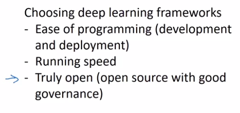  
  
### TensorFlow  
motivating problem: minimize cost function ``J(w) = (w-5)^2``  
  
* ``import tensorflow as tf``  
* define *parameter* to optimize:  
  ``w = tf.Variable(0, dtype=tf.float32)``  
  
* define cost function:  
  ```
  cost = tf.add(tf.add(w**2), tf.multiply(-10., w)), 25)  # w^2 - 10w + 25  
  # also possible to use tf-reloaded operators:  
  cost = w**2 - 10 * w + 25  ```
  
* tells tf to minimize the cost with GD optimizer:  
  
``train = tf.train.GradientDescentOptimizer(0.01).minimize(cost)``  
till now the *computation graph* is defined → backward derivatives are auto-computed.  
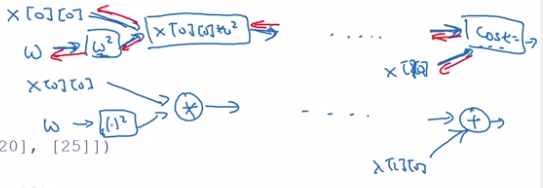  
  
* start the training  
  
Quite idiomatic process:  
initialize vars → create session → run operations in session  

	init = tf.global_variables_initializer()  
	session = tf.Session()  
	session.run(init)  
	session.run(train) # run 1 iteration of training  

alternative format:  

	with tf.Session() as session:  
	  session.run(init)  
	  session.run(train)  
	  
  
* To inspect the value of a parameter: ``print(session.run(w))``  
* Run 1000 iters of GD:  
  
	```
  for i in range(1000):  
	  session.run(train)
    ```
  
  
**Let loss function depends on training data:**  
  
* define training data as *placer holder*.  
  a placerholder is a variable whose value will be assigned later.  
  ```
	x = tf.placeholder(tf.float32, [3,1])  
	cost = x[0][0] * w**2 + x[1][0] * w + x[2][0]	  
	```
  
* feed actual data value to placerholder: use *feed_dict* in session.run()  

	```
  data = np.array([1., -10., 25.]).reshape((3,1)  
	session.run(train, feed_dict={x: data})  
  ```
  
  
