Title: [Structuring Machine Learning Projects] week1. ML Strategy (1)  
Date: 2017-11-15  
Slug:  Ng_DLMooc_c3wk1  
Tags: deep learning  
Series: Andrew Ng Deep Learning MOOC  
  
  
I-Introduction to ML Strategy  
-----------------------------  
  
### Why ML Strategy  
A lot of ideas of improving ML performance: *strategy on how to choose*.  
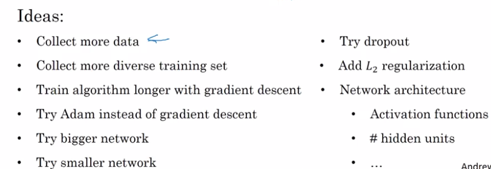  
  
→ how to figure out which ones to pursue and which ones to discard ?  
  
### Orthogonalization  
How to tune hyperparams & what to expect.  
  
TV tuning example: each knob does only one thing.  
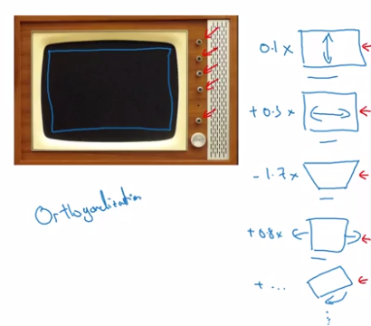  
  
**Chain of assumptions in ML**:  
training set performance → dev set → test set → real world  
  
* "one knob for each chain"  
* Will go through these "knobs" in this course.  
* Don't use early stopping: this is not orthogonalized enough  
  
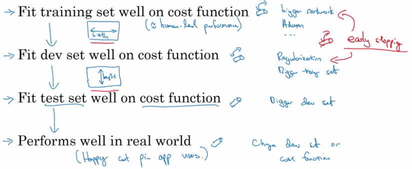  
  
II-Setting up your goal  
-----------------------  
  
### Single number evaluation metric  
Faster progress if only have *one single real number evaluation metric*. → more efficient in making decisions.  
  
example:  
Using both percision and recall as metric is not good → *difficule to pick the best model to keep on iterating from.*  
→ Use F1 score instead.  
  
### Satisficing and Optimizing metric  
When it's difficult to pick a single real number eval metric → *set up satisficing and optimizing metrics.*  
  
example: accuracy & running time trade-off  
Instead of doing a linear combination of the two, use this:  
	maximize accuracy  
	subject to running time <= 100 ms  
In this case: accuracy is *optimizing metric*, running time is *satisficing metric*.  
  
In general:  
if having N metrics → *pick 1 as optimizing metric, the N-1 rest as satisficing metric*.  
  
example: assistant wake-up word accuracy VS false positive.  
  
  
### Train-dev-test distributions  
How to setup dev/test sets.  
Idea: dev/test sets come from the same distribution.  
  
example: cat classification in different regions.  
This is bad dev/test setup:  
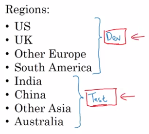  
Good practice: random shuffle data and split into dev/test sets.  
  
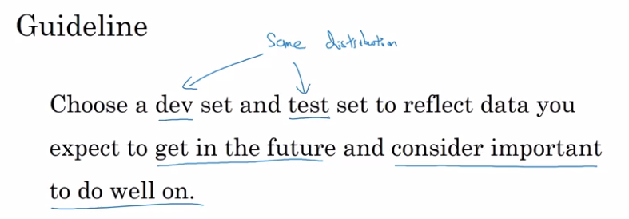  
  
### Size of the dev and test sets  
  
Pre-DL era, old way of splitting data: 70/30 or 60/30/10 split.  
→ resonable when datasets are small. (100~10k examples)  
  
In DL era: much more training (~1M) examples.  
⇒  98/1/1 split is more resonable.  
  
  
* **Size of test/dev set**: *big enough to give high confidence in system's performance*.  
* OK to not have a test set, but not recommended.  
  
  
### When to change dev/test sets and metrics  
**example 1**  
cat classification: algo A has pornographic false positives.  
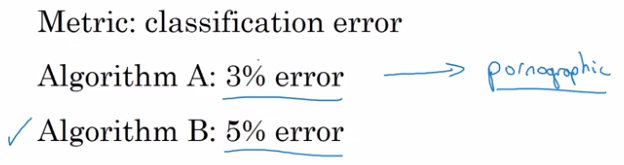  
→ change metric to penalize heavily pornographic FPs.  
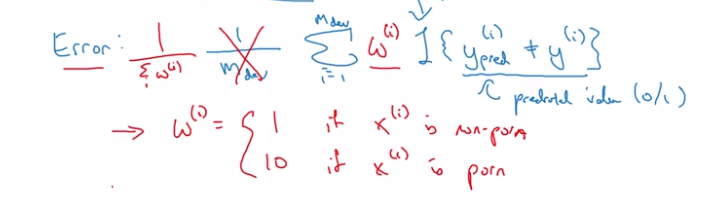  
to implement this weighting, need to go through dev/test sets.  
  
**example 2**  
Cat classification: user's upload is blury while trained on high quality images.  
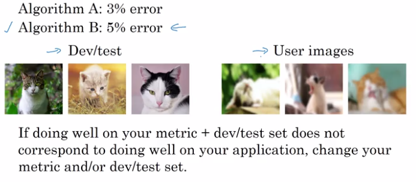  
  
III-Comparing to human-level performance  
----------------------------------------  
  
### Why human-level performance?  
Workflow ML can be more efficient when trying to match human level performance.  
  
Bayes optional error: best possible error, *theoritical optimal*.  
  
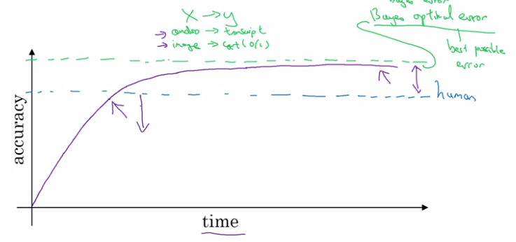  
ML progress usually slows down after surpassing human-level performance:  
  
* usually human-level is not far from Bayes optimal  
* as long as ML performace < human, there are tools to improve performance.  
  
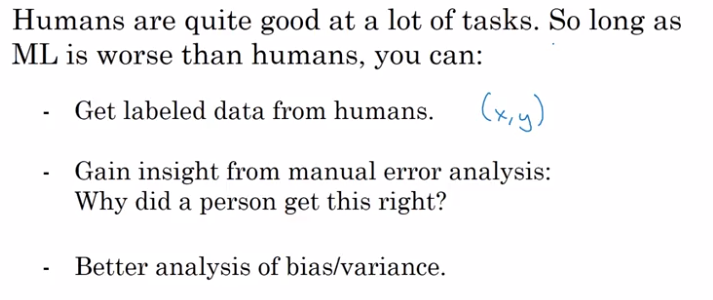  
  
### Avoidable bias  
Using human rating can prevent overfitting on training set.  
exapmle: compare training set error with human performance.  
  
* err_train > err_human ⇒ focus on reducing bias (e.g. bigger NN)  
* err_train ~= err_human ⇒ focus on reducing variance (e.g. regularize, more training data)  
  
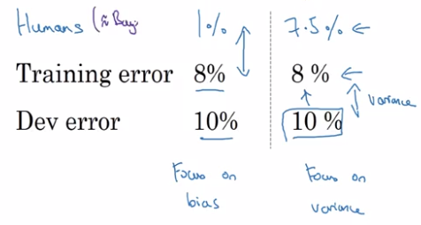  
→ Use human-level error as a proxy for Bayes error.  
  
Terminology:  
  
* **Avoidable bias** is the *gap* between training err and Bayes err.  
  (interpretataion: some errors are inavoidable because *Bayes err is not 0*.)  
  
* **Variance**: gap between training err and dev err.  
  
  
### Understanding human-level performance  
"*Human level error as proxy for Bayes error*"  
  
example: Medical image classification.  
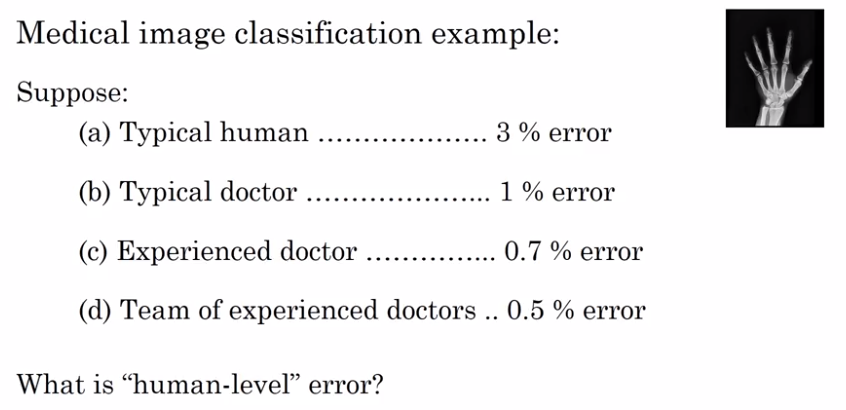  
⇒ Should pick lowest human error as an estimate (upper bound) of Bayes error.  
  
Error analysis example (which human-err to pick to estimate avoidable bias):  
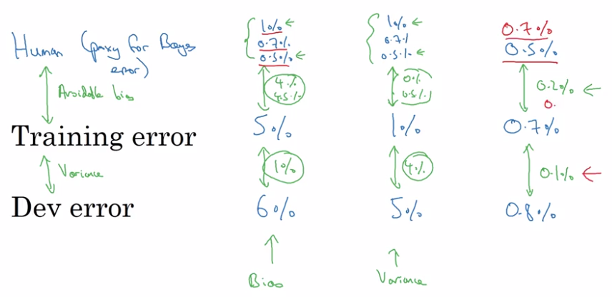  
  
### Surpassing human-level performance  
  
What's the avoidable bias when err_train and err_dev are smaller than err_human ?  
→ less clear in choosing directions.  
  
examples of tasks where ML >> human performance:  
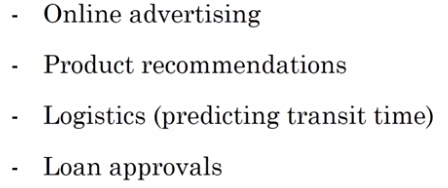  
⇒ all these tasks are:  
  
* learned from structured data  
* are not natural perception tasks  
* have processed huge amount of data  
  
  
### Improving your model performance  
Recall: two fundamental assumptions of supervised learning:  
  
* You can fit training set well (achieve to ~= avoidable bias)  
* The performance on training set generalize well to dev/test sets. (achieve low variance)  
  
  
The big roadmap:  
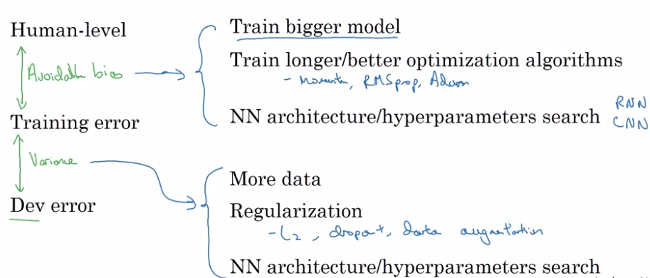  
