Title: [Structuring Machine Learning Projects] week2. ML Strategy (2)  
Date: 2017-11-17  
Slug:  Ng_DLMooc_c3wk2  
Tags: deep learning  
Series: Andrew Ng Deep Learning MOOC  
  
  
I-Error Analysis  
----------------  
  
### Carrying out error analysis  
"**Error analysis**": manually examine the mistakes → get insight of what's next.  
  
"*ceiling on performance*"  
  
example:  
cat classification, found some false-positives of dog pictures. → should you try to make ML system better on dog or not ?  
→ error analysis:  
  
* get ~100 false positive examples  
* count how many are dogs  
  
→ if only 5% of errors are dogs → performance can improve by <=5% even if totaly solved dog problem.  
→ if 50% are dos → might need to improve on dogs.  
  
example2 (evaluate multiple ideas in parallel):  
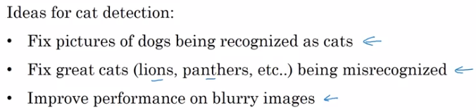  
Pick one idea to iterate on: *use a spreadsheet*  
  
  
### Cleaning up incorrectly labeled data  
What to do if there are *incorrect labels* in data ?  
  
* In training set:  
  
  *DL algos are quite robust to random errors in training set.*  
  → if incorrect labels is close to random errors (percentage not too high), it's OK to train.  
  caveat: Robust to *random* errors, not *systematic* errors. E.g. all white dogs are labeled as cats.  
  
* In dev/test set:  
  
  In error analysis, count cases of incorrect labels.  
  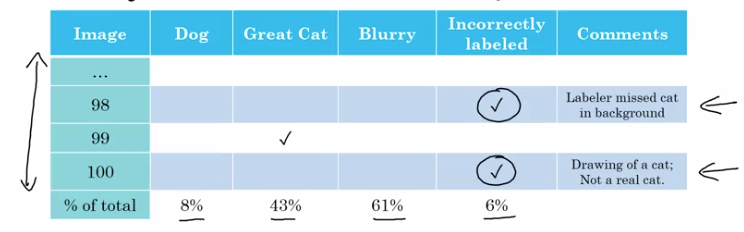  
  If #incorrect labels makes a significent different for evaluating, then fix it.  
  example:  
  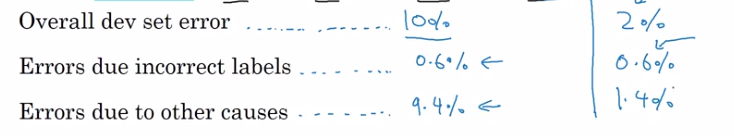  
  Remember: goal of dev set is to help selecting between two models.  
  
Correcting labels in dev/test sets:  
  
* apply the same process to test set — dev/test sets have the same distribution.  
* consider both false positive and false negatives. → to make estimate of performance unbiased. (might take longer time)  
* less important to correct training set: training set can come from slight different distribution, but important dev/test come from the same distribution.  
  
  
### Build your first system quickly, then iterate  
example: speech recognition  
many directions to go → which direction to pick ?  
  
Build system quickly and iterate.  
  
* set up dev/test set, set metric  
* build intitial system *quickly*: build something quick & dirty that works.  
* Bias/Variance analysis & Error analysis → prioritize next steps  
  
  
II-Mistmatched training and dev/test set  
----------------------------------------  
  
### Training and testing on different distributions  
When distribution of train and dev/test sets are different.  
  
example: cat app  
Two sources:  
  
* webpages (high resolution, a lot of data)  
* user uploaded (blury, relatively small amount).  
  
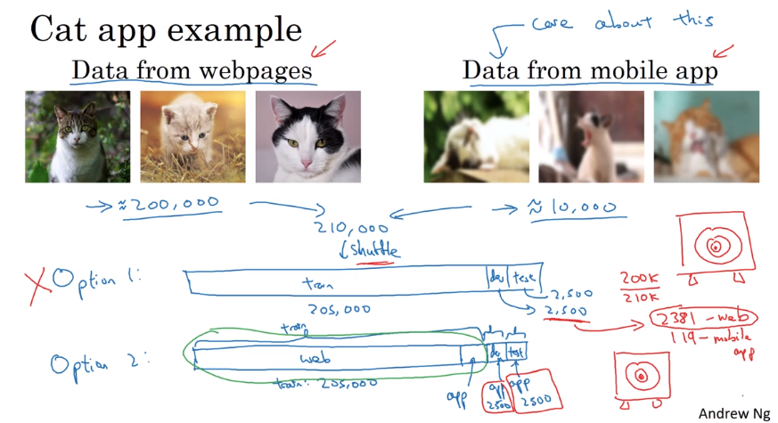  
**option1**. put both data together, randomly shuffle & split train/dev/test  
*advantage*: train/dev/test come from distribution  
*disadvantage*: many examples in dev/test set come from webpages — but cares more about performance on  user-uploaded examples → not recommended, target is not really what we care about  

**option2**. training set mostly from web, for dev/test all from user-uploaded.  
*advantage*: Err_dev/Err_test really reflects what the target is.  
  
example2: speech recognition (speech activated rearview mirror)  
  
* training data: many data coming from different sources of speech recognition.  
* dev/test: small amount, coming from speech activated rearview mirror.  
  
  
takeaway:  
  
* use large training set, even if distribution is different from dev/test set  
* dev/test data should reflect what to expect from the system.  
  
  
### Bias and Variance with mismatched data distributions  
B&V analysis changes when training set distribution is different from dev/test set.  
  
When distr(train)!=distr(dev/test):  
*No longer can say system has large variance problem when seeing Err_train < Err_dev*. (Poor performance on dev set may not come from overfitting, but may also from change of distrubtion in data).  
⇒ introduce **training-dev set**: *same distrubution as training set, but not used in training*.  
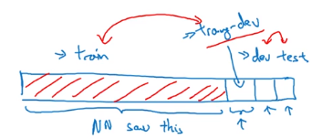  
Now can look at Err_traindev and see if model has variance/bias problem or data-mismatch problem:  
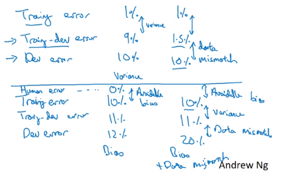  
  
**General principles**:  
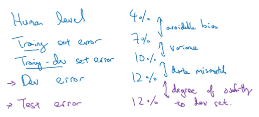  
(also possible to have Err_dev/Err_test < Err_train/Err_traindev, because of data mismatch)  
  
**More general formulation** (example: rearview mirror):  
include Err_human *on dev/test data*.  
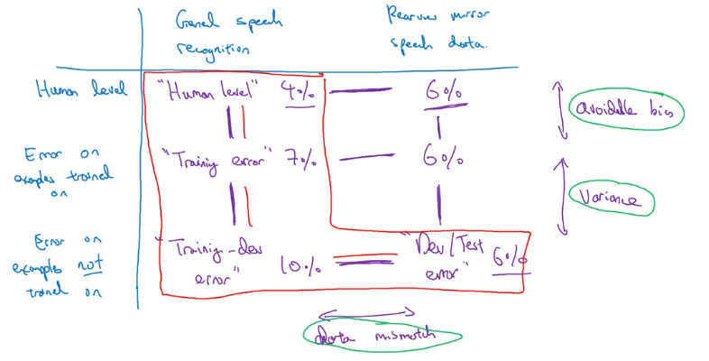  
  
  
### Addressing data mismatch  
How to address data-mismatch problem? → no systematic solution.  
  
* manual error analysis: understand difference between train and dev sets.  
  
e.g. noise in car  
  
* make training data more similar / collect more data similar to dev/test set.  
  
e.g. simulate noisy in-car data (*artificial data synthesis*)  
  
**Artificial data synthesis**  
caution: avoid synthesise only a small part of all possible examples.  
car noise example:  
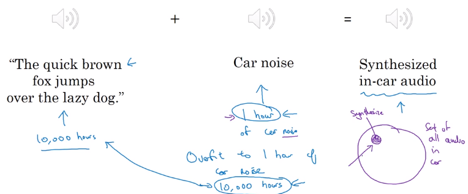  
car recognition example:  
synthesis car pictures from a video game  
problem: if there're only 20 different cars in video cars → overfit  
  
III-Learning from multiple tasks  
--------------------------------  
  
### Transfer learning  
Learned knowledge from one task applied to a second task.  
reason: some low-level features can be shared for different tasks.  
  
example 1. cat classifier applied to X-ray scans diagnosis.  
*change last output layer of original model*, initial w[L]/b[L] of last layer and retrain the params.  
if dataset small: only retrain last layer params (*pre-training*)  
else: retrain all params (*fine-tuning*)  
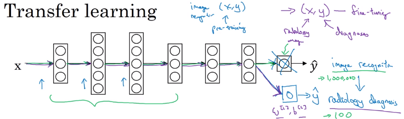  
example 2. speech recognition transfer to trigger word detection  
also possilbe to create more layers to NN  
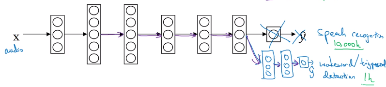  
**When to use transfer learning:**  
  
* task A ans B have the same input  
* a lot of data for task A, relatively small amount of data for task B  
* low level feature of task A could be helpful for task B  
  
  
### Multi-task learning  
transfer learning: task A and B are sequential  
multi-task learning: *in parallel*  
  
example: self-driving car  
multiple kind of objects to detect  
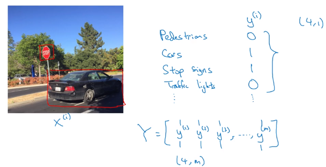  
multi-label problem (*each example can have multiple labels*):  
→ output layer should no longer be softmax  
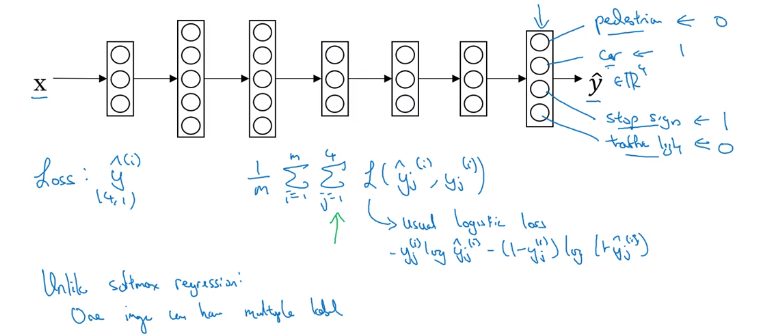  
  
Training on NN for 4 tasks instead of 4 separate NNs: early-layer features can be shared.  
  
With missing entries are in labels:  
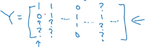  
⇒ in loss function, sum only on labeled entries.  
  
  
  
**When to use multi-task learning**:  
  
* lower-level features can be shared  
* similar amount of data for each task — data for other tasks could help learning of main task  
  
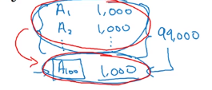  
  
* can train a *big enough* NN to do well on all tasks.  
  
in practice: multi-task learning is *much less common* than transfer learning.  
  
IV-End-to-end deep learning  
---------------------------  
  
### What is end-to-end deep learning?  
E2E: omit multiple stages in pipeline by a single NN.  
  
example: speech recognition.  
  
  
**note**: E2E can work well only when have *really large dataset*.  
  
example2: face recognition from camera.  
2-stage works better than E2E:  
image → face detection → face recognition.  
reason: a lot of data for each of the 2 tasks, but much less data for E2E.  
  
exapmle3: machine translation.  
E2E works well because of large amount of training data.  
  
example4: estimating child's age from X-ray img.  
separate stages works better.  
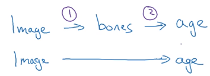  
  
### Whether to use end-to-end deep learning  
Pros and cons of E2E learning.  
**Pros**:  
  
* let the data speak, avoid intermediate values (e.g. phonemes in speech recognition)  
* less hand-designing of components needed  
  
**Cons**:  
  
* Need large amount of data (X, Y)  
* Excludes potentially useful hand-designed components  
  
  
Key question for applying E2E learning: *sufficient* data available to learn a function of the *complexity* needed to map from x to y?  
  
example: self-driving cars  
in practice: multi-stage system  
  
