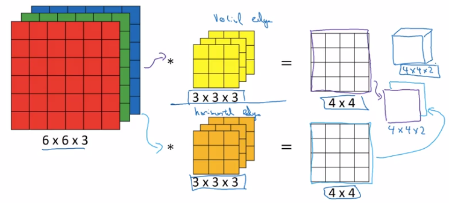

Title: [Convolutional Neural Networks] week1. Foundations of Convolutional Neural Networks  
Date: 2017-11-19  
Slug:  Ng_DLMooc_c4wk1  
Tags: deep learning  
Series: Andrew Ng Deep Learning MOOC  
  
  
### Computer Vision  
CV with DL: rapid progress in past two years.  
  
CV problems:  
  
* image classification  
* object detection: bounding box of objects  
* neural style transfer  
  
  
input features could be very high dimension: e.g. 1000x1000 image → 3 million dim input ⇒ if 1st layer has 1000 hidden units → *3 billion params for first layer...*  
  
foundamental operation: convolution.  
  
### Edge Detection Example  
Motivating example for convolution operation: detecting vertical edges.  
  
Convolve image with a **filter(kernel) **matrix:  
  
Each element in resulting matrix: sum(element-wise multiplication of filter and input image).  
  
Why the filter can detect vertical edge?  
  
  
### More Edge Detection  
**Positive V.S. negative edges**:  
dark to light V.S. light to dark  
  
  
Instead of picking filter by hand, the actual parameters can be *learned* by ML.  
Next: discuss some building blocks of CNN, padding/striding/pooling...  
  
### Padding  
Earlier: image *shrinks* after convolution.  
Input ``n*n`` image, convolve with ``f*f`` filter ⇒ output shape = ``(n-f+1) * (n-f+1)``  
downside:  
  
* image shrinks on every step (if 100 layer → shrinks to very small images)  
* pixels *at corner* are less used in the output  
  
⇒ *pad the image* so that output shape is invariant.  
  
if ``p`` = padding amount (width of padded border)  
→ output shape = ``(n+2p-f+1) * (n+2p-f+1)``  
  
Terminology: *valid* and *same* convolutions:  
  
* **valid** convolution: no padding, output shape = (n-f+1) * (n-f+1)  
* **same** convolution: output size equals input size. i.e. filter width ``p = (f-1) / 2`` (only works *when f is odd — *this is also a convention in CV, partially because this way there'll be a central filter)  
  
  
### Strided Convolutions  
Example ``stride = 2`` in convolution:  
  
(convention: stop moving if filter goes out of image border.)  
  
if input image ``n*n``, filter size ``f*f``, padding = ``f``, stride = ``s``  
⇒ output shape = ``(floor((n+2p-f)/s) + 1) * (floor((n+2p-f)/s) + 1)``  
  
  
  
**Note on cross-correlation v.s. convolution**  
In math books, "convolution" involves *flip filter in both direction* before doing "convolution" operation.  
  
The operation discribed before is called "cross-correlation".  
  
(Why doing the flipping in math: to ensure assosative law for convolution — (A*B)*C=A*(B*C).)  
  
### Convolutions Over Volume  
example: convolutions on RGB image  
image size = 6*6*3 = height * width * #channels  
filter size = 3*3*3, (convention: *filter's #channels matches the image*)  
output size = 4*4 (*1)  —  **output is 2D for each filter**.  
  
  
  
**Multiple filters:**  
  
* take >1 filters  
* stack outputs together to form an *output volume*.  
  
  
  
**Summary of dimensions**:  
input shape = ``n*n*n_c``  
filter shape = ``f*f*n_c``  
#filters = ``n_c``'  
⇒ output shape = ``(n-f+1) * (n-f+1) * n_c``'  
  
### One Layer of a Convolutional Network  
For each filter's output: *add bias b, then apply nonlinear activation function.*  
  
One layer of a CNN:  
  
  
with analogy to normall NN:  
  
* linear operation (matrix mul V.S. convolution)  
* bias  
* nonlinear activation  
* difference: Number of parameters *doesn't depend on input dimension*: even for very large images.  
  
  
**Notation summary:**  
  
note: *ordering* of dimensions: example index, height, width, #channel.  
  
### Simple Convolutional Network Example  
  
  
general trend: as going to later layers, *image size shrinks, #channels increases*.  
  
### Pooling Layers  
Pooling layers makes CNN more robust.  
  
**Max pooling**  
divide input into regions, take max of each region.  
  
* Hyperparams:  
  
(common choice) *filter size f=2 or 3, strid size s=2, padding p=0.*  
  
* note: *no params to learn* for max pooling layer, pooling layer not counted in #layers (conv-pool as a single layer)  
  
  
Intuition: a large number indicats a detected feature in that region → preseved after pooling.  
  
Formula of dimension ``floor((n+2p-f+1)/s + 1)`` holds for POOL layer as well.  
  
Output of max pooling: the same #channels as input (i.e. do maxpooling on each channel).  
  
**Average pooling**  
Less often used than max pooling.  
Typical usecase: collapse 7*7*1000 activation into 1*1*1000.  
  
### CNN Example  
*LeNet-5*  
  
  
  
  
### Why Convolutions?  
2 main advantages of CONV over FC: *param sharing; sparsity of connections.*  
  
**Parameter sharing**:  
A feature detector useful in one part of img is probably useful in another part as well.  
→ no need to learn separate feature detectors in different parts.  
  
**Sparsity of connections**:  
For each output value depends only on a small number of inputs (the pixels near that position)  
  
+ Invarance to translation...  
  
  
