Title: [Convolutional Neural Networks] week2. Deep convolutional models: case studies  
Date: 2017-11-22  
Slug:  Ng_DLMooc_c4wk2  
Tags: deep learning  
Series: Andrew Ng Deep Learning MOOC  
  
[TOC]  
  
I-Case studies  
--------------  
  
### Why look at case studies?  
Good way to get intuition of different component of CNN: case study & reading paper.  
**Outline**  
  
* classic networks:  
	* LeNet-5  
	* AlexNet  
	* VGG  
* ResNet (152-layer NN)  
* Inception  
  
  
### Classic Networks  
**LeNet-5**(1998)  
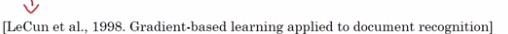  
Goal: recognize hand-written digits.  
image → 2 CONV-MEANPOOL layers, all CONV are valid (without padding) → 2 FC → softmax  
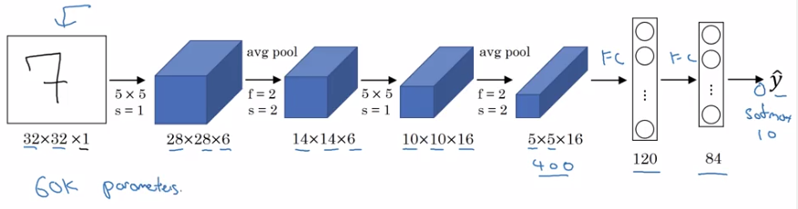  
takeaway (patterns still used today):  
  
* as go deeper, n_H, n_W goes down, n_C goes up  
* conv-pool repeated some times, then FC-FC-output  
  
  
sidenote:  
  
* used sigmoid/tanh as activation, instead of ReLU.  
* has non-linearity after pooling  
* orignial paper hard to read  
  
  
**AlexNet**  
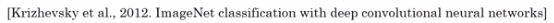  
Same pattern: conv-maxpool layers → FC layers → softmax  
but much more params.  
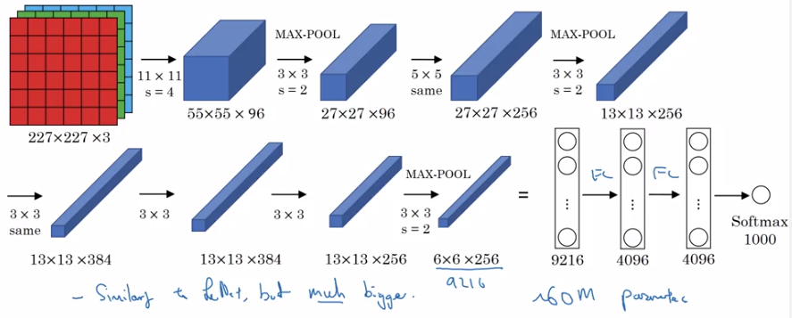  
sidenote:  
  
* use ReLU as activation  
* multi-GPU training  
* "local response normalization" (LRN): normalize across all channels (not widely used today).  
* a lot hparams to pick  
  
  
**VGG-16**  
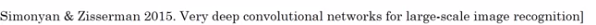  
Much less hparams:  
All **CONV: 3*3,s=1,padding=same, MAXPOOL: 2*2,s=2**  
→ e.g. "(CONV 64) * 2" meaning 2 conv layers (3*3,s=1,padding=same) of 64 channels.  
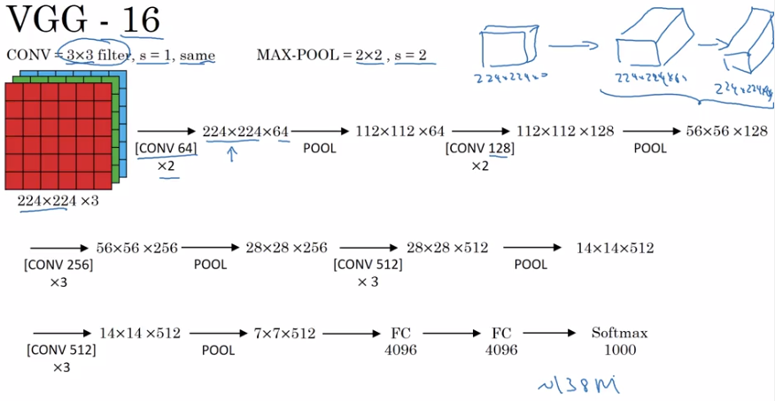  
  
note:  
  
* pretty large even by modern standard: 138M params  
* simplicity in architecture: POOL reduce n_H/n_W by 2 each time; CONV n_C=64->128->256->512 (increase by 2), very systematic.  
  
  
### ResNets  
Very deep NN are hard to train → ResNet: *skip connections*, to be able to train ~100 layers NN.  
  
**Residual block**  
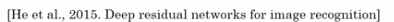  
Normal NN: from a[l] to a[l+2], two linear & ReLU operations. *"main path"*.  
ResNet: a[l] taks shortcut and *goes directly to a[l+2]'s non-linearity*. "*shortcut*" / "*skip connection*".  
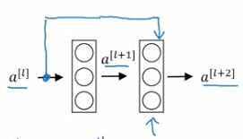  
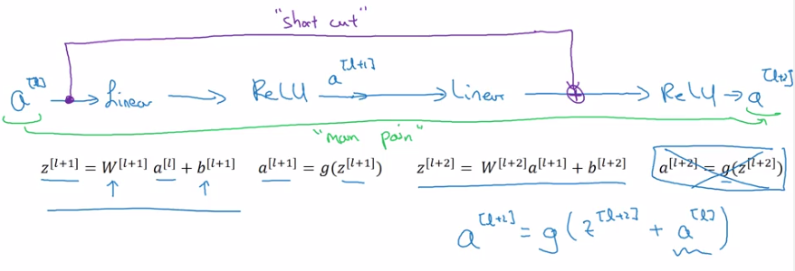  
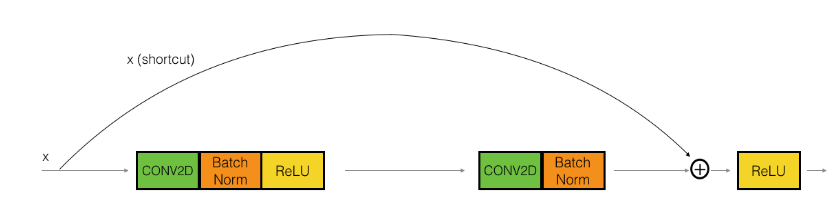  
  
Using residual block allows training *very deep* NN:  
stack them to get ResNet (i.e. add shortcuts to "plain" NN).  
  
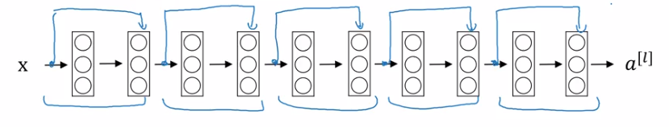  
  
Problem of training  plain NN: *training error goes up (in practice) when having deeper NN*.  
Because deeper NN are harder to train (vanishing/exploding gradients, etc.)  
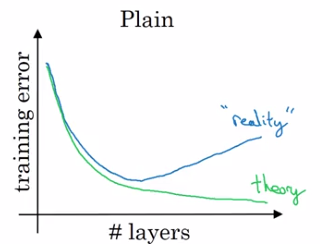  
With ResNet: training error goes down even with deeper layers.  
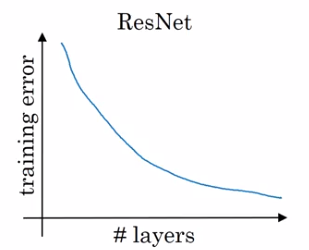  
  
### Why ResNets Work  
	a[l+2] = g(z[l+2] + a[l])  
	  = g(w[l+1] * a[l+1] + b[l+1] + a[l])  
  
→ note: when applying weight decay, w can be small (w~=0, b~=0)  
⇒ a[l+2] ~= g(a[l]) = a[l] (assume g=ReLU)  
⇒ it's easy to get a[l+2]=a[l], i.e. *identity function from a[l] to a[l+2] is easily learned*  
→ whereas in plain NN, it's difficult to learn an identity function between layers, thus more layers make result *worse*  
→ adding 2 layers doesn't hurt the network to learn a shallower NN's function, i.e. performance is not hurt when increasing #layers.  
→ when necessary can do even better than learning identity function  
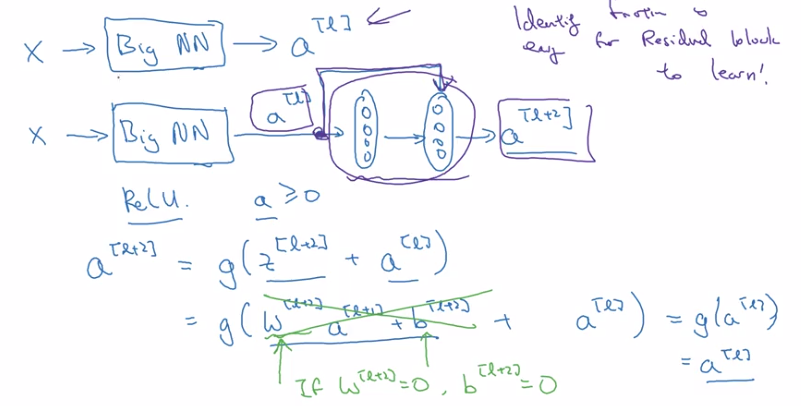  
  
Side note:  
  
* ``z[l+2]`` and ``a[l]`` have the same dimension (so that they can be added in g) → i.e. many "same" padding are used to preserve dimension.  
* If  their dimensions are not matched (e.g. for pooling layers) → add extra ``w_s`` to be applied on ``a[l]``.  
  
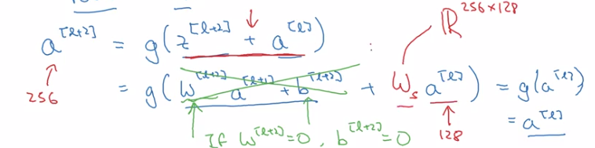  
  
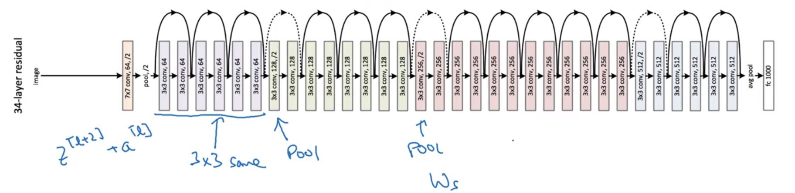  
  
### Networks in Networks and 1x1 Convolutions  
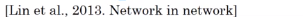  
Using 1*1 conv: for one single channel, just multiply the input image(slice) by a constant...  
But for >1 channels: each output number is inner prod of input channel "slice" and conv filter.  
  
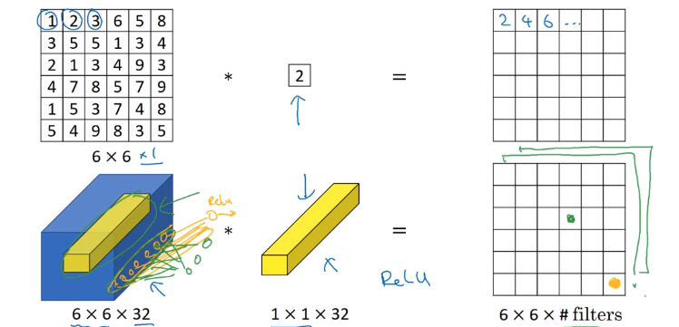  
  
  
1*1 conv: ~= fully-connected layer applied to each of n_H*n_W slices, adds non-linearity to NN.  
→ 1*1 conv also called "*network in network*"  
  
example:  
To *shrink* #channels via 1*1 conv.  
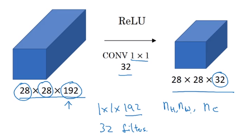  
  
### Inception Network Motivation  
  
Instead of choosing filter size, *do them all in parallel.*  
note: use SAME padding & stride=1 to have the same n_H, n_W  
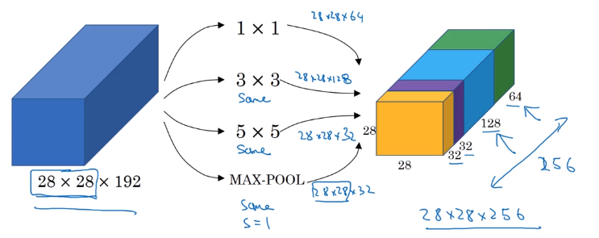  
  
Problem: computation cost.  
example: input shape = 28*28*192, filter 5*5*192, 32 filters, output shape = 28*28*32  
totoal #multiplication = 28 * 28 * 32 * 5 * 5 * 192 = 120M  
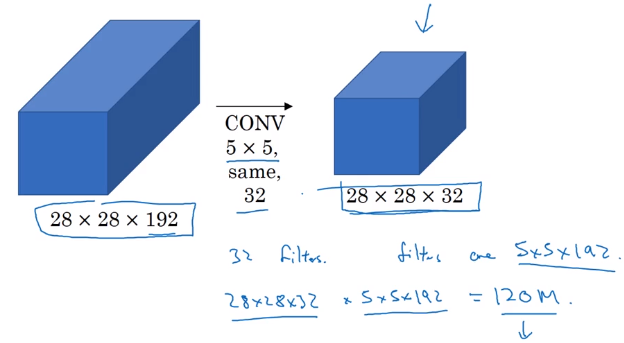  
→ **reduce #computation with 1*1 conv**  
Reduce n_C of input by 1*1 conv ("bottleneck-layer") before doing the 5*5 conv.  
#computation = 1*1*192 * 28*28*16 + 5*5*16 * 28*28*32 = 12.4M  
  
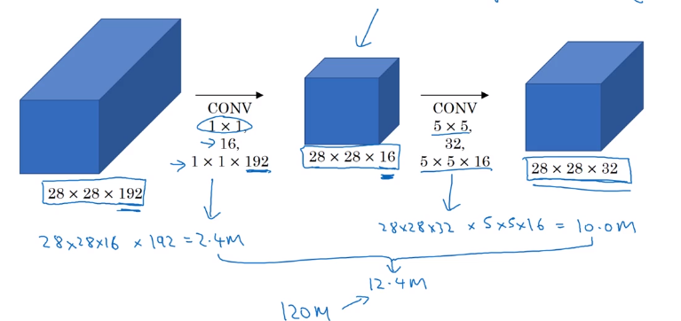  
Does bottleneck layer hurt model performance ? → no.  
  
### Inception Network  
**Inception module**:  
For max pooling layer, out n_C equals input n_C → *use a 1*1 conv to shrink n_C*.  
  
  
**Inception network:**  
  
* Putting inception modules together.  
* Have *side branches*: taking hidden layer and feed to FC for output.  
  
— ensure features from hidden units at intermediate layers are not too bad for prediction — kind of regularization  
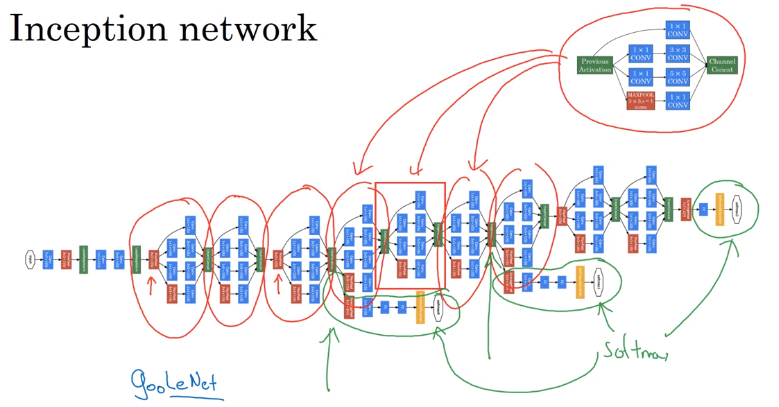  
  
The name "inception" come from: a meme...  
  
  
II-Practical advice for using ConvNets  
--------------------------------------  
Advices on how to use these classical CNN models.  
  
### Using Open-Source Implementation  
Difficult to replicate the work just from paper: a lot of details&hparams  
→ use open-sourced version.  
  
### Transfer Learning  
Download weights of other's NN as pretrained params.  
→ pretrained params are trained on huge datasets, and takes weeks to train on multiple GPUs.  
example: cat detector  
  
* 3 class: tigger/misty/neither  
* training set at hand is small  
* → download both code and weights online  
  
e.g. ImageNet NN  
→ change last layer's softmax  
→ all Conv/Pool layers set *frozen* (not trainable)  
→ only training softmax layer's weight with training set.  
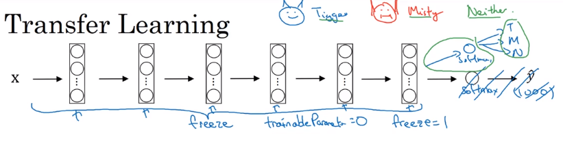  
OR:  
*Precompute* the hidden layer (fixed function mapping from x to feature vector) and save to disk.  
→ train a shallow model on top. → save computation.  
  
If have a large training set at hand ⇒ freeze a few layers and train the rest.  
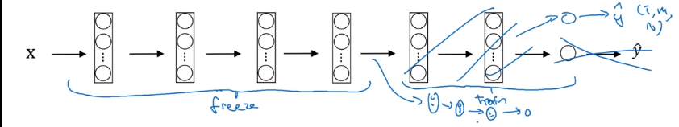  
  
If have a *huge*  dataset: train the whole NN.  
  
### Data Augmentation  
More data are alway welcome.  
**Common augmentation method**:  
  
* Mirroring  
* Randome cropping  
* Rotation/Shearing/Local warping: used a bit less in practice  
* Color shifting  
  
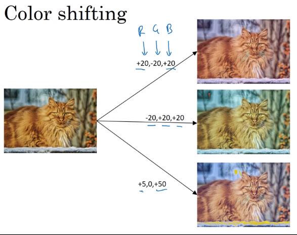  
In practice: shifts drawn from some random distribution.  
e.g. PCA-color-augmentation (details in AlexNet paper): ~keep overall color the same.  
  
**Implementaing distortions during training**  
If data is huge → CPU thread to get *stream* of images → add distortion for each image → form minibatch of data → pass to training.  
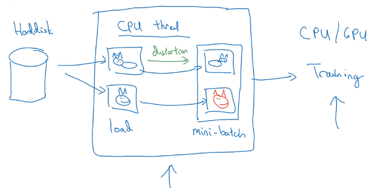  
  
### State of Computer Vision  
Observations for DL for CV.  
  
**Data VS. hand-engineering**  
As more data are available → simpler algo, less hand-engineering.  
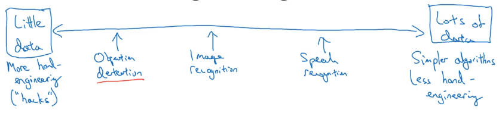  
Learing algo has 2 sources of knowledge:  
  
* labeled data  
* hand engineered features / network architecture / specialized components  
  
  
Transfer learning can help when dataset is small.  
  
**Tips for doing well on benchmarks/winning competitions**  
  
* Ensembling:  
  
Train several(3~15) NN independently, then *average their outputs*.  
  
* *Multi-crop at test time*  
  
Predict on multiple versions of test images and average results.  
e.g. 10-crop at test time  
  
	  
