Title: [Convolutional Neural Networks] week3. Object detection  
Date: 2017-11-27  
Slug:  Ng_DLMooc_c4wk3  
Tags: deep learning  
Series: Andrew Ng Deep Learning MOOC  
  
[TOC]  
  
### Object Localization  
Classification VS. Localization VS. Detection  
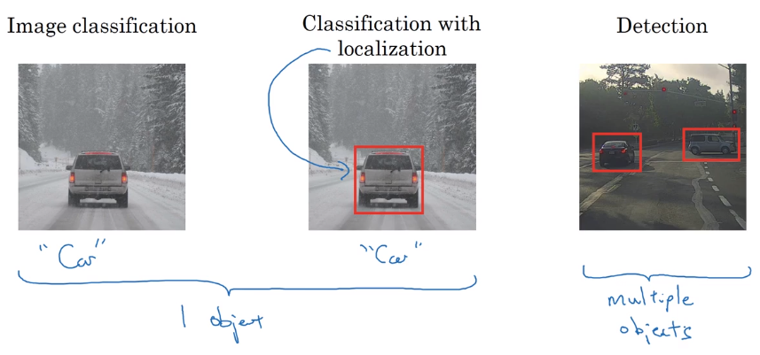  
  
**classification with localization**  
Apart from softmax output (for classification), *add 4 more outputs of bounding box*: ``b_x, b_y, b_h, b_w``.  
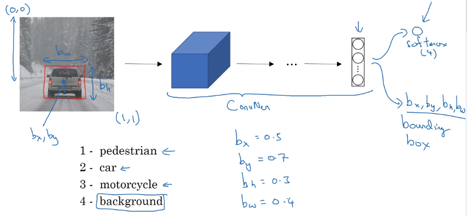  
  
**Defining target label y in localization**  
label format:  
``P_c`` indicating if there's any object  
bounding box: ``b_x, b_y, b_h, b_w``  
class proba: ``c_1, c_2, c_3``  
  
Loss function: squared error  
if y_1=P_c=1: loss = square error (y, y_hat)  
if y_1=P_c=0: loss = (y_1 - y_1_hat)^2  
can use different loss function for different components, but sq-loss works in practice.  
	  
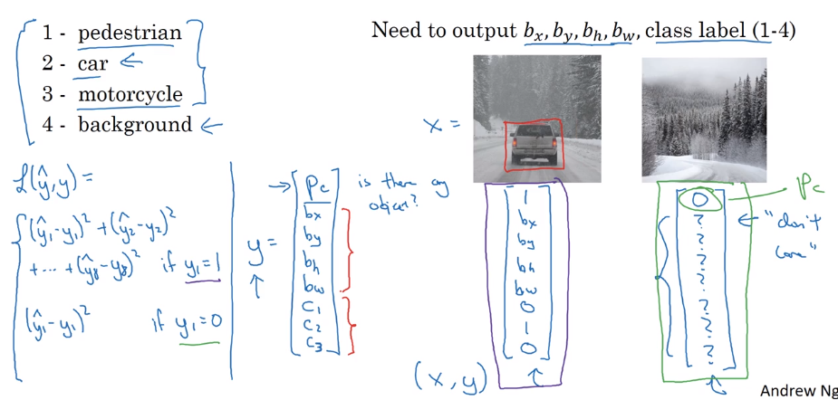  
  
  
### Landmark Detection  
"landmark": important points in image. → let NN output their coords.  
  
e.g. recognize coord of eye's corner or points along the eye/nose/mouth  
→ specify a number of landmarks  
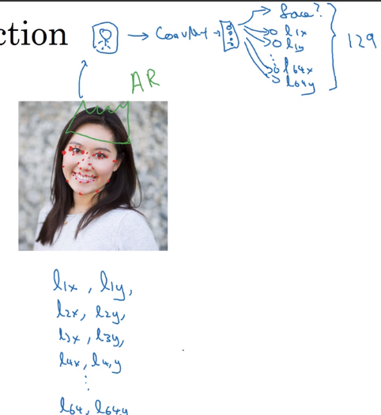  
  
### Object Detection  
**sliding windows detection**  
example: car detection.  
training image: *closely-croped* image  
in prediciton: use sliding window and pass to ConvNet; use window of different size.  
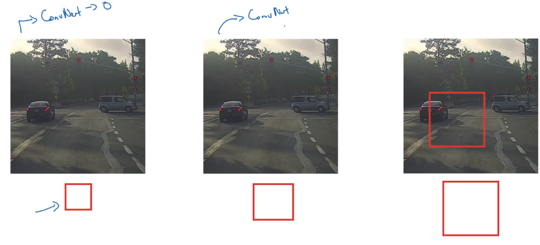  
Sliding window is OK with pre-DL algos.  
disadvantage: computation cost too high — each window's crop ran *independently* through ConvNet.  
→ sliding window also can be implemented "convolutionally" — some computation can be cached.  
  
### Convolutional Implementation of Sliding Windows  
**Turning FC layer into conv layers**  
example: last conv/maxpool layer: size=5*5  
→ *replace FC(output_dim=400) by 400 5*5 filters*  
→ replace next FC layer by 1*1 filters  
→ replace softmax layer by 1*1 filters and activation.  
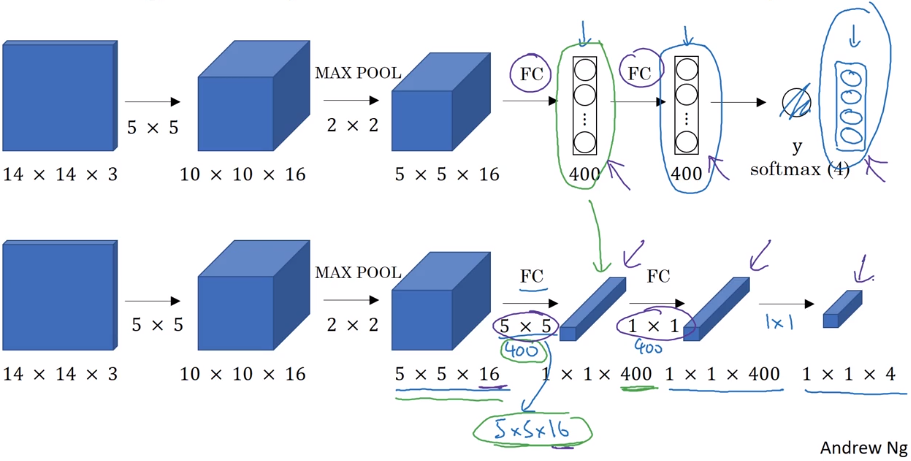  
  
**conv implementation of sliding window**  
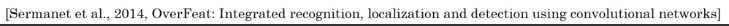  
example: training image 14*14*3, testing image 16*16*3  
instead of corping image to 14*14 and feed to ConvNet, *feed the larger picture directly to ConvNet*.  
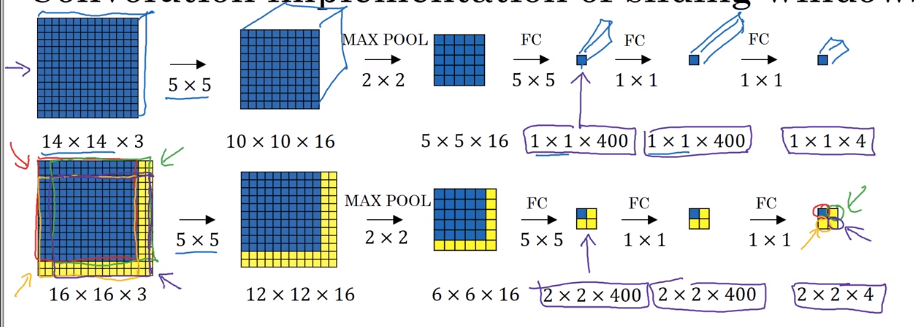  
  
→ *output contains results of all patches*!  
⇒ instead of computing each sliding window sequentially, can get all results with a single pass of the full image!!  
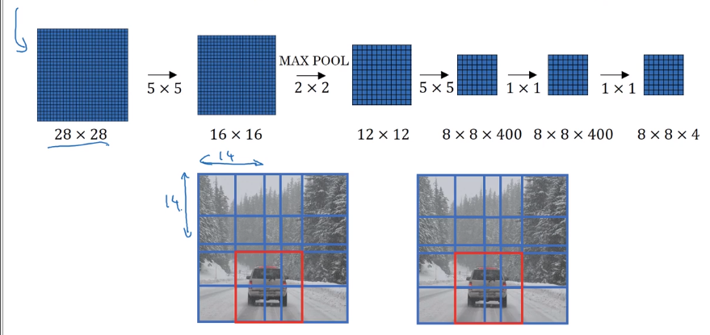  
problem: bounding box position is not accurate.  
  
### Bounding Box Predictions  
To output more accurate bounding boxes: aspect-ration no longer 1:1.  
**YOLO algorithm**  
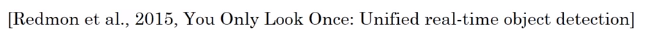  
"You Only Look Once"  
For each grid cell: apply image classification with bouding boxes (described in 1st section, 8 outputs).  
needs labelled data: assign each obj to the grid where its center is in.  
*output volume: 3*3*8*  
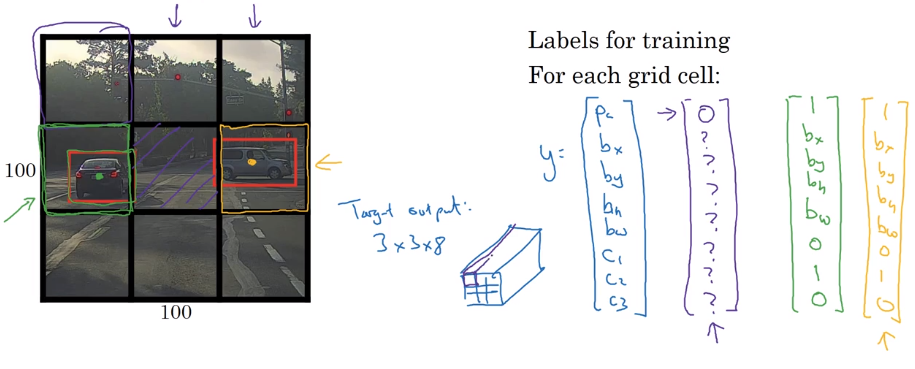  
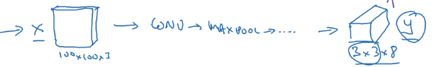  
  
Also: a lot of computation shared, efficient ⇒ possible to do real-time.  
  
note: bounding box annotation in YOLO *can be out of [0,1] range.*  
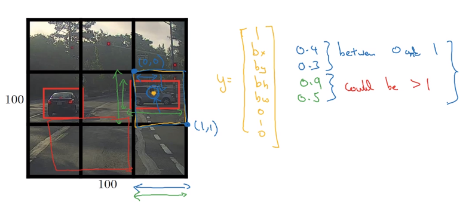  
  
### Intersection Over Union  
**Evaluating** object localization:  
→  intersection over union (IoU) function = size(intesection) / size(union) = *measure of overlap of two bounding boxes.*  
"correct" if IoU >= 0.5  
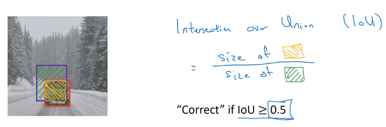  
  
  
### Non-max Suppression  
Problem: algo might detect the same obj multiple times.  
example:  
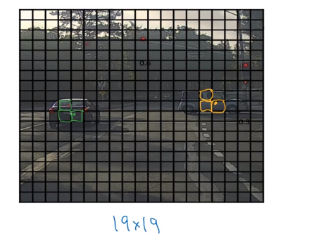  
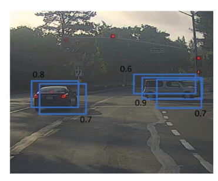  
each bouding box has a confidence score — keep the max bouding box, suppress the overlapping ones.  
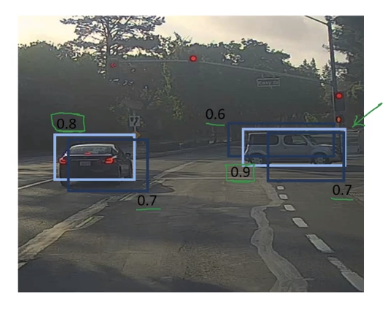  
  
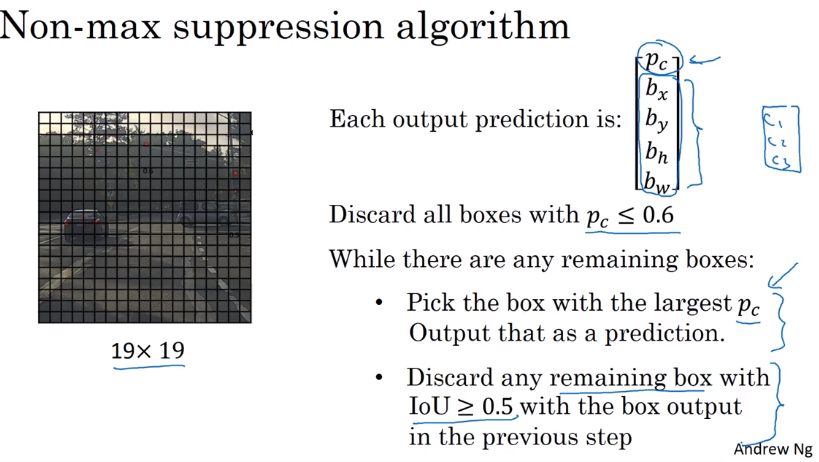  
  
### Anchor Boxes  
Problem: each grid detects only one obj → can a grid *detect multiple obj* ? → use anchor boxes.  
  
In data labeling: predefine 2 shapes (anchor boxes); use 8 sets of 8 outputs for each anchor box.  
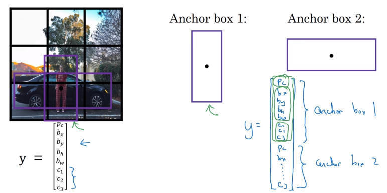  
  
Compare with previous:  
  
* previous: each obj assigned to the grid which contains its mid point  
* now each obj assigned to (cell, anchorbox): cell=the grid which contains its mid point; anchor_box=* the anchorbox that has highest IoU with the labelled bounding box*.  
  
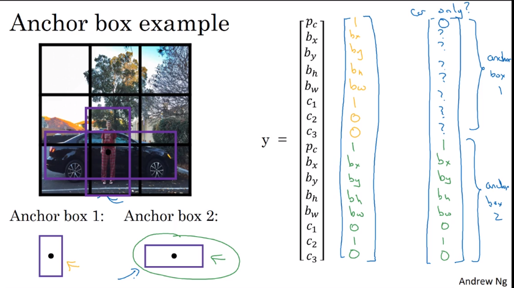  
  
In practice: choose 5~10 anchor boxes by hand; or use Kmeans on object's shapes.  
  
### YOLO Algorithm  
Put all components together.  
example:  
  
* detecting pedestrian/car/motercycle. (4 classes)  
* grid: 3*3  
* 2 anchor boxes  
  
→ **Preparing training set**  
y shape = 3\*3\*2\*8  
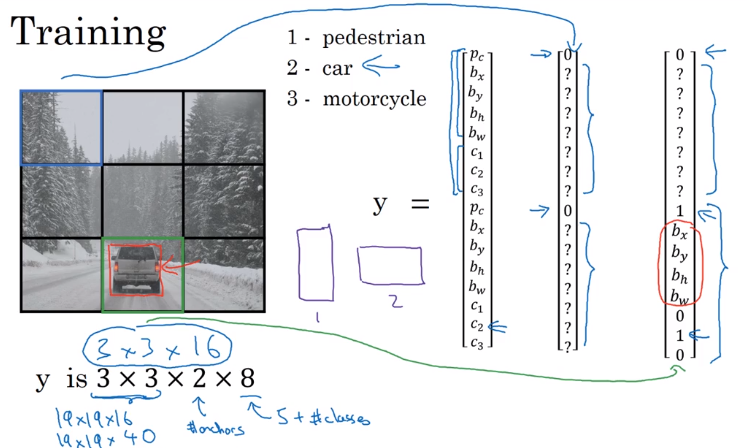  
  
train a ConvNet on this with output_dim = 3*3*16  
→ **making predictions**  
2*8 outputs for each of the 9 grids  
→ **nonmax supression for each class**  
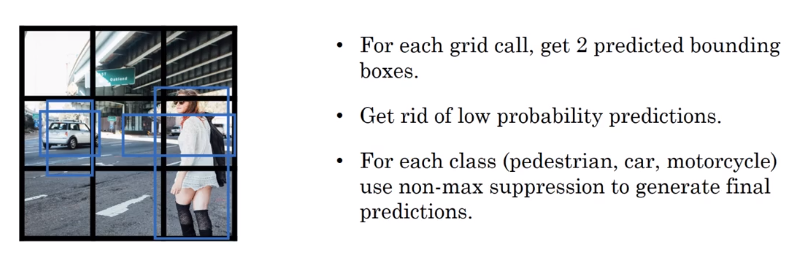  
  
### (Optional) Region Proposals  
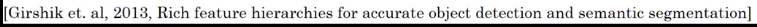  
Region proposal algo (R-CNN): less often than YOLO.  
Sliding window disadvantage: many regions are not interesting.  
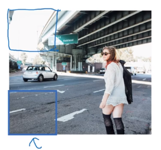  
⇒ select just a few windows  
first run segmentation algo, then run CNN on bounding box of blobs.  
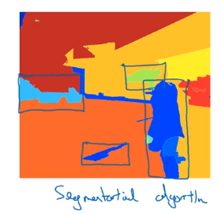  
→ still quite slow  
faster variants:  
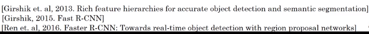  
  
