Title: [Convolutional Neural Networks] week4. Special applications: Face recognition & Neural style transfer  
Date: 2017-11-30  
Slug:  Ng_DLMooc_c4wk4  
Tags: deep learning  
Series: Andrew Ng Deep Learning MOOC  
  
  
  
This week: two special application of ConvNet.  
  
I-Face Recognition  
------------------  
  
### What is face recognition  
**Face verification & face recognition**  
  
* verification: input = image and ID → output whether the image and ID are the same.  
* recognition: database = K persons, input = image → output = ID of the image among the K person or "not recognized".  
  
→ the verification system's precision needs to be very high in order to be used in face recognition.  
  
  
### One Shot Learning  
"one shot": learn from just *one* example, and able to recognize the person again.  
A CNN+softmax is not practical, e.g. when new images are added to database, output_dim will change...  
  
⇒ instead, learn a *similarity* function.  
``d(img1, img2)`` = degree of difference between images. + threshold ``tau``  
  
### Siamese Network  
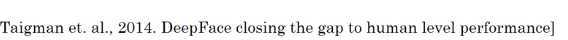  
To learn a disimilarity function: *Siamese Network*.  
  
Use CNN+FC to **encode*** a pic *``x``* into vector *``f(x)``*.*  
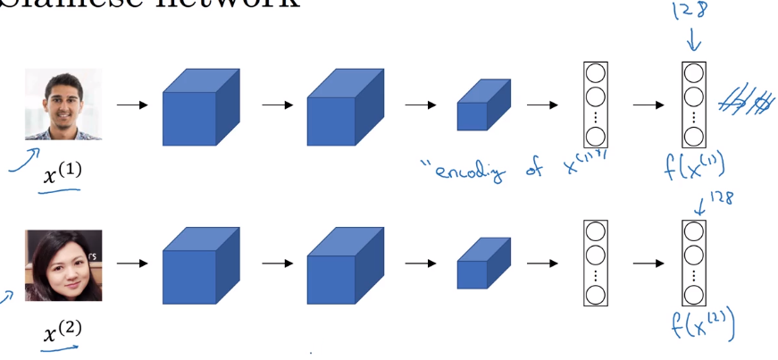  
⇒ define disimilarity function d(x1, x2) as distance between encoded vectors.  
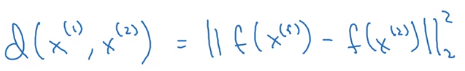  
  
More formally:  
want to learn NN params for the encoding f(x) such that:  
when x1 and x2 are same person, dist(f(x1), f(x2)) is small, otherwise large.  
  
### Triplet Loss  
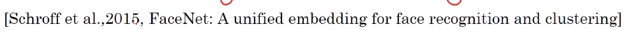  
triplet: (*anchor, positive, negative)*.  
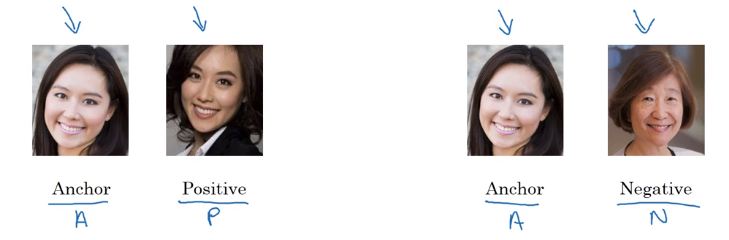  
want f(A) similar to f(P) and different from f(N):  
i.e. want ``d(A, P) - d(A, N) <= 0``  
⇒ to avoid NN from learning a trival output (i.e. all encodings are identical, d(A, P)=d(A, N)=0), *add margin *``alpha``.  
want ``d(A, P) - d(A, N) + alpha<= 0``  
  
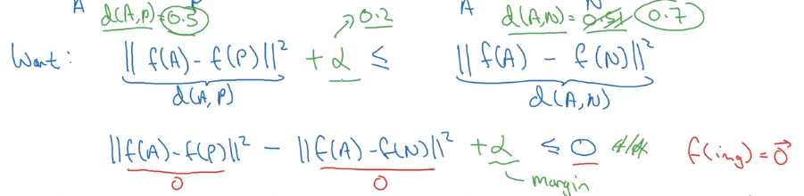  
  
**Loss function definition**:  
similar to hinge loss: ``L = max(0, d(A,P)-d(A,N) + alpha)``  
  
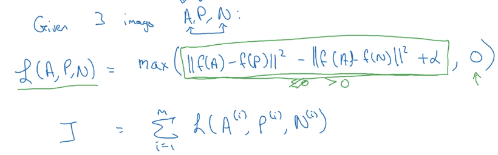  
→ Generate triplets from dataset, and feed to the NN.  
note: here we do need >1 pics of the same person (Anchor and Positive).  
  
**Choosing triplets A, P, N**  
If A,P,N are *randomly* chosen, the constraint is easily satisfied → NN won't learn much.  
→ *choose A,P,N that are "hard" to train on. *Computation efficiency of learning is improved.  
(*details presented in the FaceNet paper*)  
  
in practice: better download pretrained model.  
  
### Face Verification and Binary Classification  
  
Triplet loss is one way of doing face verification.  
another way that works as well: treat as a binary classification problem.  
  
Given input image x1 and x2 → feed f(x1) and f(x2) to a logistic regression unit.  
→ feed the *difference in encodings* and feed to logistic regression.  
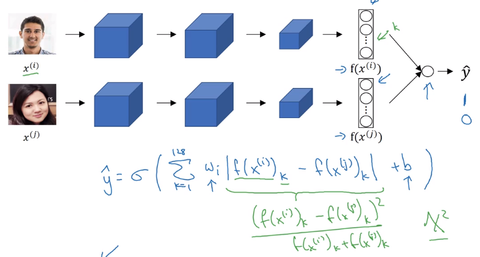  
  
computation trick: precompute encodings of imgs in database at inference time.  
  
II-Neural Style Transfer  
------------------------  
  
### What is neural style transfer?  
content image ``C``+ style image ``S`` → generated image ``G``  
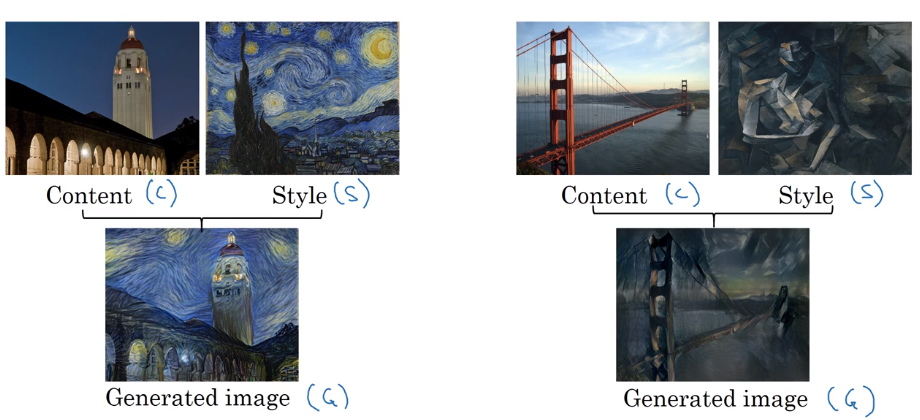  
  
### What are deep ConvNets learning?  
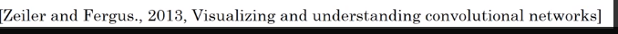  
**visualize hidden units of different layers**  
Pick *one unit* in 1st layer → find the *nine image patches that maximize the unit's activation*.  
  
In deeper layers: units can see larger image patches → gather nine argmax image patchs as before.  
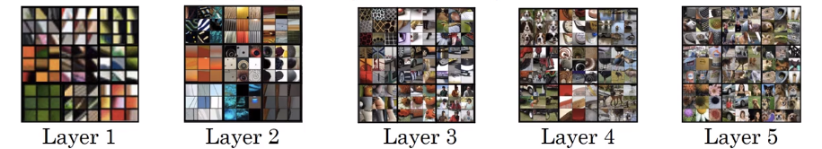  
  
deeper layers can detect higher level shapes:  
layer 3:  
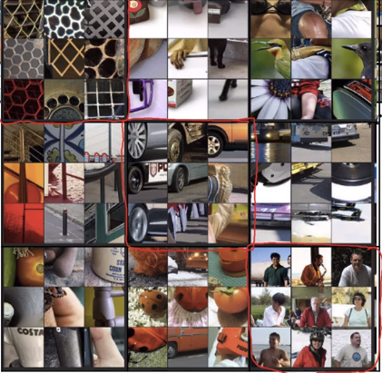  
layer 4:  
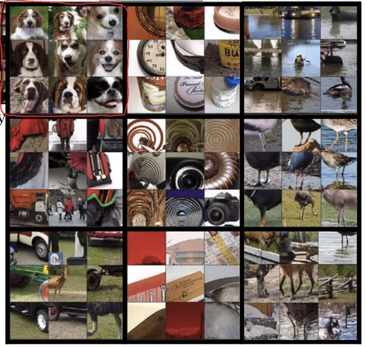  
  
### Cost Function  
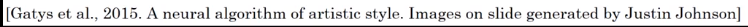  
Define a cost function *for the generated image*.  
``J(G)`` measure how good is an image, contains two parts:  
  
* ``J_content(C, G)``: how similar is G to C  
* ``J_style(S, G)``: how similar is G to S.  
  
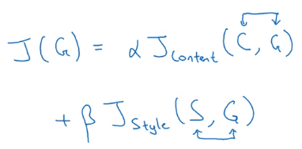  
**Find generated image G**  
(similar to embedding?)  
  
* initialize G randomly  
* Use gradient-descent to minimized J(G)  
  
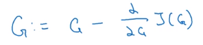  
  
  
### Content Cost Function  
``J_content(C, G)``  
  
*Given a pre-trained CNN*, use *hidden layer l* to compute J_content. The depth of *l* controls the level of details focuses on.  
  
Define J_content(C, G) = difference (e.g. L2-norm) between the activation of layer l of image C and image G.  
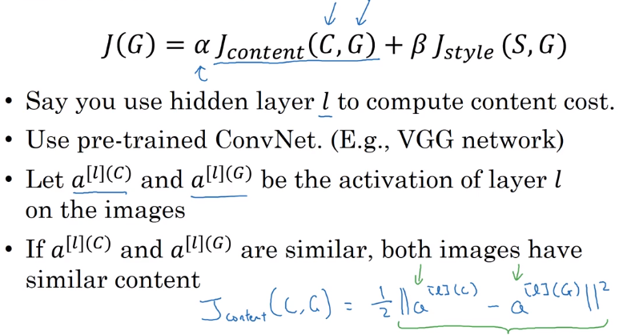  
  
### Style Cost Function  
Use layer ``l`` to measure "style".  
→ **style** defined as *correlation between activations across channels*.  
e.g. ``n_C=5`` channels of slices ``n_W * n_H``.  
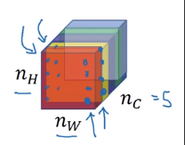  
correlation between 2 channel ~= *which high-level features tend to occur / not occur together in an image.*  
  
**style matrix**  
notation:  
  
* ``a_ijk`` = (scalar)activation at hight=``i``, width=``j``, channel=``k``  
* "Style matrix) ``G[l]``, (G for "Gram matrix") shape = ``n_C * n_C``, measures *how correlated any two channels are. *(i.e. G[l] measures the degree to which the activations of different feature detectors in layer l vary (or correlate) together with each other.)  
* ``G_kk``' = correlation between kth and k'th channel.  
  
  := sum_over_i_j( a_ijk * a_ijk')  
  
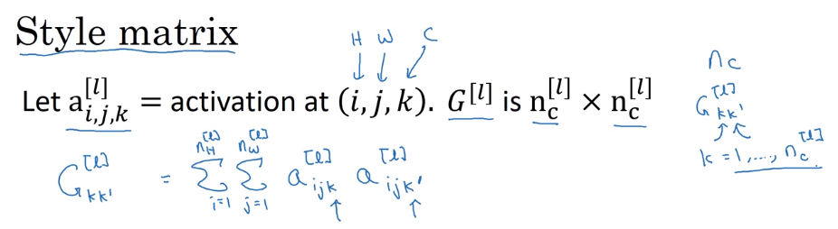  
mathematically, this "correlation" is unnormalized cross-covariance (without substracting the mean).  
  
Compute ``G`` for both the style image and generated image.  
→ J_style(Gen_img, Sty_img) = difference (Frobenius norm) between G(gen) and G(sty)  
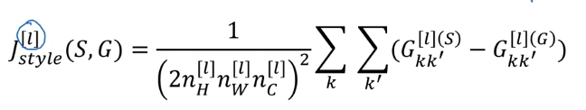  
In practice, take J_style for multiple layers:  
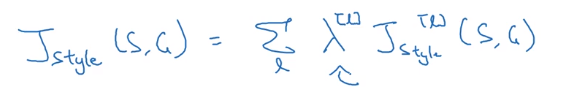  
  
### 1D and 3D Generalizations  
images: 2D data.  
→ *generalize convolution to 1D and 3D data.*  
  
**1D data**  
e.g. EKG data (heart voltage).  
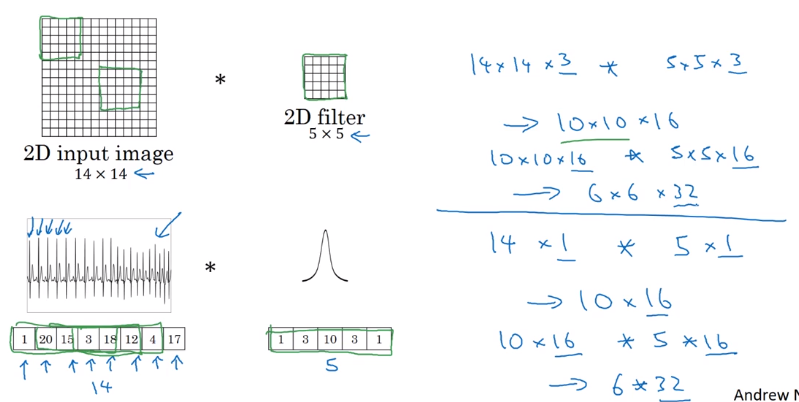  
  
(note: most 1D data use RNN...)  
  
**3D data**  
have height width and depth,  
e.g. C.T. data; movie date (frame by frame)  
→ generalized from 2D  
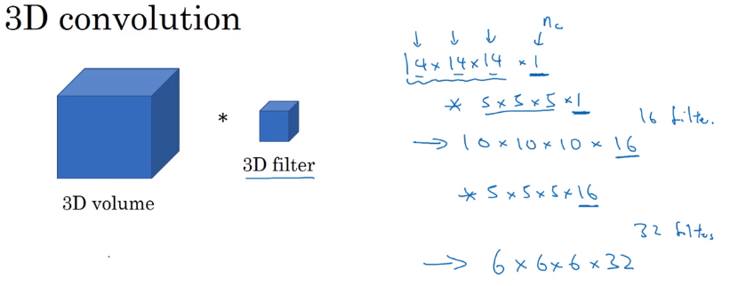  
  
  
