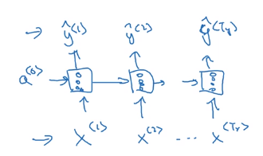
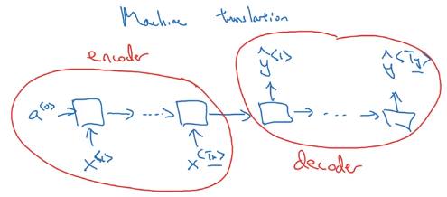

Title: [Sequential Models] week1. Recurrent Neural Networks     
Date: 2018-02-02    
Slug:  Ng_DLMooc_c5wk1    
Tags: deep learning    
Series: Andrew Ng Deep Learning MOOC    
    
[TOC]    
    
    
week1  
=====  
Created Friday 02 February 2018  
  
### Why sequence models  
examples of seq data (*either input or output*):  
  
* speech recognition  
* music generation  
* sentiment classification  
* DNA seq analysis  
* Machine translation  
* video activity recognition  
* name entity recognition (**NER**)  
  
→ in this course: learn models applicable to these different settings.  
  
### Notation  
motivating example: NER (Each word: whether the word is part of a person's name.)  
  
* ``x^<t>`` / ``y^<t>``: t-th element in input/output sequence.  
* ``X^(i)``: i-th training example  
* ``T_x^(i)``: length of i-th training example sequence  
  
  
**how to repr each words in a sentences (x<i>)**  
  
* *vocabulary*: list of ~10k possible tokens (+"<unk>" for unknown words)  
* *one-hot* repr for each word   
  
  
  
### Recurrent Neural Network Model  
**why not a standard NN**  
  
* input/output are of different length (padding might not be a good representation)  
* doesn't share features learned across different positions in text  
  
→ using a better representation helps to reduce number of parameters.  
  
#### RNN  
motivation example: output length = input length  
  
* for each input ``x<t>``, → feed to RNN → compute  *activation*(hidden state) ``a<t>``, and output ``y<t>``,  
* ``y<t>=f(a<t>)``, ``a<t>=f(x<t>, a<t-1>)``,  i.e. a<t> depends on previous state and current input.  
* parameters ``W_ax`` / ``W_aa`` / ``W_ya`` are shared across all time steps.  
  
⇒ ``y<t>`` depends on ``x<1>...x<t>``, limit: only depend on *previous* words ("unidirectional").  
  
Unrolled diagram:  
  
Or drawing a recurrent loop (harder to understand than unrolled version):  
  
  
#### RNN Forward prop  
formula to calculate ``a<t>`` and ``y<t>``:  
	a<t> = g(W_aa * a<t-1> + W_ax * x<t> + b_a)  
	y<t> = g(W_ya * a<t> + b_y)  
  
Simplified annotation: stack ``a<t-1>`` and ``x<t>``, ``W_a = [W_aa, W_ax]``  
  
  
### Backpropagation through time  
Parameters: ``W_y`` and ``W_a``  
loss function: log loss at each timestep (assume predictions y<t> are binary)  
  
→ backporp through the computation graph:  
  
  
### Different types of RNNs  
**many-to-many**:  
  
* T_x = T_y, one prediction per timestep.  
  
  
  
* T_x != T_y, e.g. machine translation  
  
having a *encoder* and a *decoder*:  
  
**many-to-one**:  
e.g. sentence classification  
  
**one-to-many**:  
e.g. music generation  
  
  
### Language model and sequence generation  
**Language model**  
motivation example: speech recognition,   
*"The apple and the pear salad" *VS* "The apple and the pair salad"*  
language model: *give probability of a sentence* P(sentence).  
  
**Building language model with RNN**  
Training set: large corpus of text.  
  
* tokenize  
* vocabulary size  
* unknow word "<unk>".  
  
  
**RNN for seq generation**  
  
* output ``y<t>``: softmax of *probability for each word*.  
* ``y<t+1>``: make prediction *given the correct previous word*   
* like this predict one word at a time.  
  
  
Loss function: cross entropy (*actual word VS probability of this word*) at each timestep.  
  
  
### Sampling novel sequences  
Get a sense of what's learned: sample nouvel seqs.  
From training, the RNN has a distribution of sequences ``P(y<t> | y<1...t-1>)``.  
In sample: let the model generate sequences  (``np.random.choice``):  
  
* feed previously gen word as input to next step  
* include <EOS> token in vocab to finish  
* reject <UNK> tokens  
  
  
**char-level language model**  
  
  
* pro: no <UNK> token  
* con: much longer sequences, more expensive to train.  
  
  
### Vanishing gradients with RNNs  
long-range dependencies are hard to capture:   
e.g. "*the cat ........ was full*" VS "*the cats ...... were full*"  
  
this is due to vanishing gradients:  
  
  
For exploding gradients: apply *gradient clipping* (restrict gradient norm).  
  
### Gated Recurrent Unit (GRU)  
Modification of RNN to capture long range dependencies.  
  
*Visualization of a RNN unit:*  
  
  
**(simplified) GRU**  
  
* Extra *memory cell*: ``c<t>=a<t>``, (replaces output activation).  
* *Candidate* value of c<t>: ``c_tilde<t>=tanh(Wc * [c<t-1>, x<t>] + b_c)``  
* **Gate*** (between 0 and 1, conceptually consider it as binary)*:   
  
``Gamme_u = sigmoid(W_u * [c<t-1>, x<t>] + b_u)``  
subscript "*u*" stands for "*update*", i.e. whether we want to update current memory cell  
  
* Actual value of ``c<t> = Gamme_u * c_tilde<t> + (1-Gamma_u) * c<t-1>`` (``*`` is element-wise multiplication)  
  
i.e. ``c<t>`` can be conserved for long range before being updated  
  
Visualization of GRU unit (maybe equations are more understandable...):  
  
  
**full GRU**  
for candidate ``c_tilde<t>``, add one more gate ``Gamme_r``: controlling how much ``c<t-1>`` contributes to ``c_tilde<t> ``("*r*" for "*relevance*", i.e. how relevant ``c<t-1>`` is for ``c_tilde<t>``)  
  
  
  
### Long Short Term Memory (LSTM)  
More powerful and general version of GRU.  
  
* output ``a<t>`` no longer equals to memory cell ``c<t>`` (but a *gated* version of it, see below)  
* candidate ``c_tilde<t>`` depends on ``a<t-1>`` instead of ``c<t-1>``  
* *two update gates*: ``Gamma_u`` (*update gate*) and ``Gamma_f`` (*forget gate*)  
* *output gate*: ``Gamma_o``  
* value of ``c<t> = Gamma_u * c_tilde<t> + Gamma_f  * c<t-1>``  
* value of ``a<t> = Gamma_o * c<t>``  
  
  
  
Visualization:  
  
Intuition: c<t> can be kept for long time if gates are set properly.  
  
  
Variant: let the gates depend on c<t-1> as well ("*peephole connection*")  
  
  
**GRU vs LSTM**  
  
* LSTM is proposed earlier  
* GRU as a simplified version of LSTM  
* GRU easier to train larger NN (2 gates instead of 3)  
* LSTM more powerful, recommended default choice to try  
  
  
### Bidirectional RNN  
Getting information from the future.  
motivation example:   
  
  
**Bidirectional RNN (BRNN)**  
  
* *forward and backword* recurrent components  
* computation graph is still acyclic  
* at t, both information from the past and the future are passed in  
* *BRNN with LSTM blocks* are typically the first thing to try in NLP problems  
  
  
  
### Deep RNNs  
Complex NN: stack multiple RNNs (having 3 RNN layers is already a lot).0  
notation: ``a[l]<t>`` for activation in layer ``l`` and time ``t``.  
  
