Title: [Sequential Models] week2. Natural Language Processing & Word Embeddings  
Date: 2018-02-26  
Slug:  Ng_DLMooc_c5wk2  
Tags: deep learning  
Series: Andrew Ng Deep Learning MOOC  
  
I - Introduction to Word Embeddings  
-----------------------------------  
**Word representation**  
So far: representing words with one-hot encoding → word relationships are not generalized.  
⇒ want to  learn a *featurized representatin* for each word as a high-dim vector  
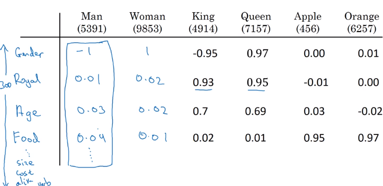  
→ visualize word embeddings in 2-dim space, e.g. via *t-SNE*  
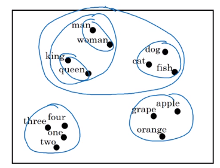  
  
### Using word embeddings  
example: NER  
transfer learning: using pretrained embeddings  
  
* learn word embeddings from large text corpus (or download pre-trained embeddings)  
* transfter embedding to new task with smaller training set  
* (optional) fine-tune word embeddings with new data  
  
  
Word embedding ~ face encoding(embedding) in previous words.  
  
### Properties of word embeddings  
*Analogy reasoning* of word embeddings.  
e.g. man->woman as king->?  
Embedding vectors have the relationship: ``e_man - e_woman ~= e_king - e_queen``  
Finding nearest neighbor (according to cosine-similarity).  
examples:  
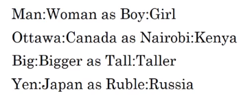  
  
### Embedding matrix  
learning an embedding matrix ``E`` of shape ``(embed_dim, vocab_size)``  
e.g. embed_dim=300, vocab_size=10000  
notataion:   
``o_w`` = one-hot encoding of a word ``w``, dim=(10000,1)  
→ ``e_w = E * o_w``, dim=(300,1)  
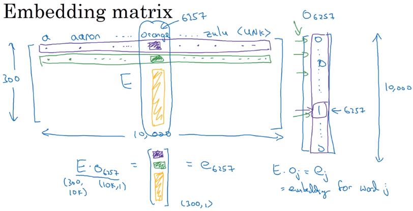  
→ Learn ``E`` by random-init & gradient descent.  
(In practice: use lookup function instead of matrix multiplication.)  
  
II - Learning Word Embeddings: Word2vec & GloVe  
-----------------------------------------------  
  
### Learning word embeddings  
Some concrete algos to learn embedding matrix E. Start with complex algos and show simpler algos with good result.  
e.g. Neural language model, i.e. *predict next word in the sequence*.  
with fixed window size(e.g. =4), predict next word. Context=last 4 words, target=next word.  
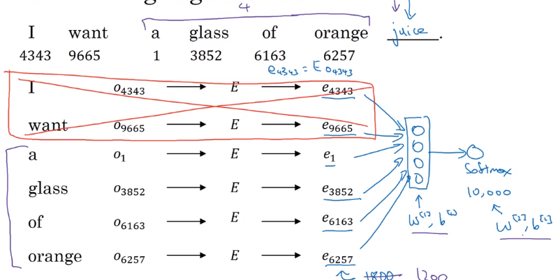  
→ Using gradient-descent to update params (``E, W, b``).  
  
Other kinds of (simpler) context/targets:  
  
* context=4 words to the left & right,  target=the word in the middle  
* context=previous word, target=next word  
* context=nearby 1 word (skip-gram model)  
  
  
### Word2Vec  
**Skip-grams**  
supervised problem: context/target pairs, given context word, predict target word   
(|v| classes in total) → softmax  
  
* context ``c``: *randomly* pick a context word  
* target ``t``: *randomly* pick a target word in +/- 4 word window.  
  
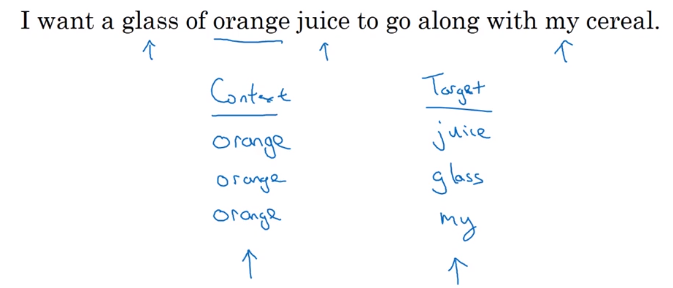  
**Skip-gram Model**  
model: context ``c`` -> onehot ``o_c`` -(``E``)-> embedding ``e_c`` → softmax → prediction ``yhat``  
→ target word ``y``  
loss = cross-entropy(y, yhat) / log-loss(y, yhat)  
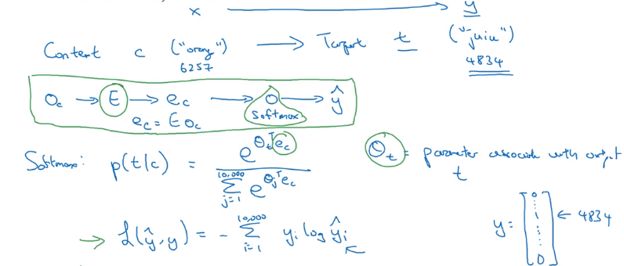  
**how to sample context c**  
uniform sampling for ``c``: frequent words might dominant the training set.  
→ heuristics to sample less common words via ``P(c)``.p  
  
**problem with skip-gram model**  
*slow speed*: to compute ``p(t|c)`` with softmax → involves *summing up all 10000(vocab_size) logits* in denominator of sotmax:  
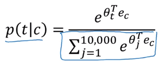  
  
* method 1: using hierachical softmax: split all vocabs into buckets/binary trees — ``log(|v|)`` instea of ``O(|v|)``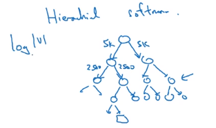  
* method 2: *negative sampling*, modify training objective  
  
  
### Negative Sampling  
To simplify the computation of softmax denominator: a different learning problem.  
**new learning problem**  
given a pair of word → predict *if this pair is a context/target pair*.   
— binary classification instead of |v| classes.  
  
* positive examples: sampled as before (sample context word ``c``, then sample target word ``t`` in word window)  
* negative examples: sample context word ``c``, then *pick rand word *``t``* from dictionary*. Sample *k=5~20* negative examples for each context word ``c``.  
  
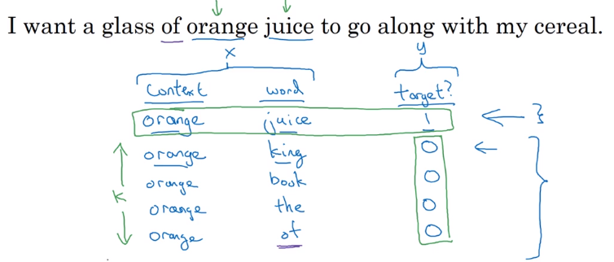  
Model: *logistic regression*  
For context word c, there are *|v|=10000 potential binary classification problems* to train  
→ *and we train only (k+1) of them*.  
**negative sampling**: trun 10000-way softmax problem into 10000 binary classification problems, and each iteration only train k+1 of them.  
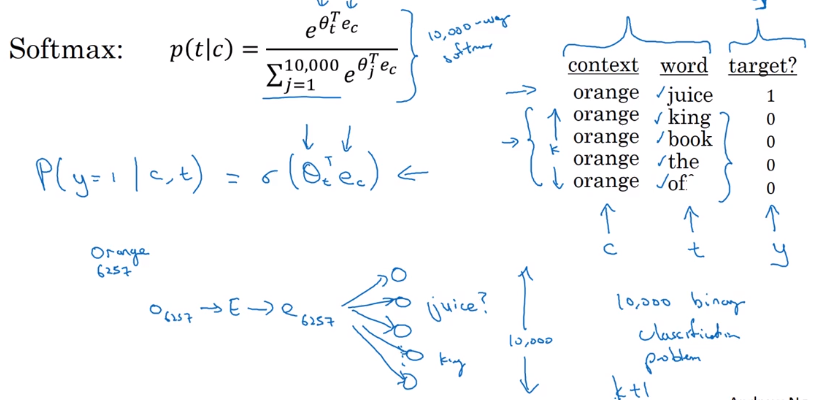  
**How to sampling negative examples**  
  
* sample according to empirical word frequence P(w) ~= tf(w) → might have a lot stop words sampled  
* sample uniformly: P(w)  = 1/|v|  
* empirical best-choice: P(w) = tf(w)^0.75 / sum(tf(w')^0.75)  
  
  
### GloVe word vectors  
GloVe(Global Vectors for word representation): even simpler than negative sampling.  
previously: sampling skip-grams, i.e. pairs of words (``c``,``t``)  
glove: Count appearance of co-occurrence, ``X_ij = #(i in the context of j)``.  
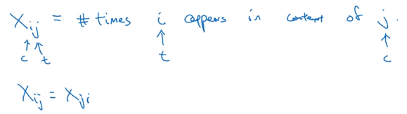  
**GloVe Model**  
Trying to approximate ``theta_i*e_j`` to ``-logX_ij``, by solving ``theta_i`` and ``e_j``.  
  
* add weighting term ``f(X_ij) = 0`` if ``X_ij=0``, (0*log0 = 0), and f gives more weight to less frequent words  
* ``theta_i`` and ``e_i`` are *symmetric* in optimization ⇒ final embedding ``e_i = (e_i+theta_i)/2``  
  
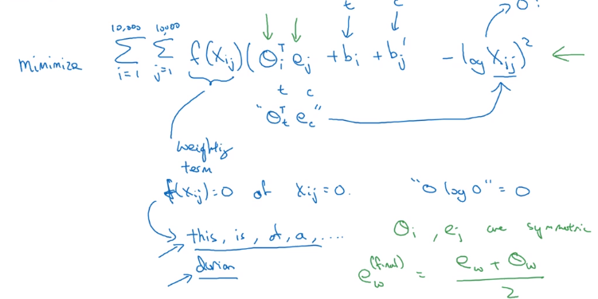  
  
**Featurization view of word embeddings**  
Learning embeddings are not guaranteed to align with featurized components in each axis.  
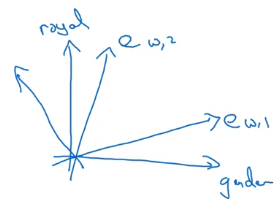  
  
III-Applications using Word Embeddings  
--------------------------------------  
  
### Sentiment Classification  
mapping a piece of text into a rating  
**simple model**  
sum/average all word embedding vectors as feature vector → pass to softmax clf.  
pb: ignoring all word order  
  
**RNN model**  
take embedding vectors → sequence embedding matrix → feed to RNN  
→ using last step output and feed to softmax.  
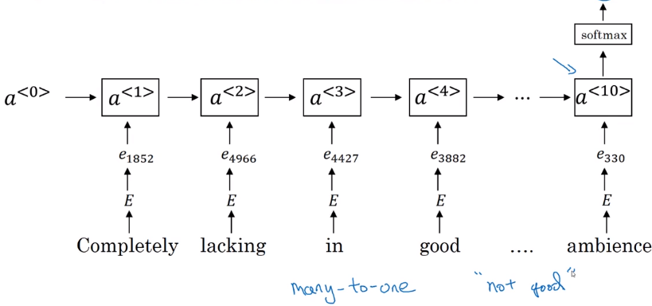  
  
### Debiasing word embeddings  
Eliminate biases in word embeddings, e.g. gender bias, due to biases in training text.  
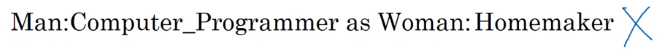  
  
* Dentify bias direction: e.g. gender bias  
  
take differences of vectors: e.g. ``e_he - e_she``, ``e_male - e_female``  
→ find bias and non-bias directions  
  
* Neutralization: project embeddings (of *non-definitional words*) to non-bias directions  
* Equalize pairs: for definitional words(e.g. grandmother/grandfather, boy/girl), let them be equally-distant to axis  
  
→ How to find defnitional words: train a classifier.  
