Title: [Sequential Models] week3. Sequence models & Attention mechanism  
Date: 2018-02-28  
Slug:  Ng_DLMooc_c5wk3  
Tags: deep learning  
Series: Andrew Ng Deep Learning MOOC  
  
This week: seq2seq.  
  
I-Various sequence to sequence architectures  
--------------------------------------------  
  
### Basic Models  
e.g. Machine translation  
**encoder network**: many-to-one RNN  
**decoder network**: one-to-many RNN  
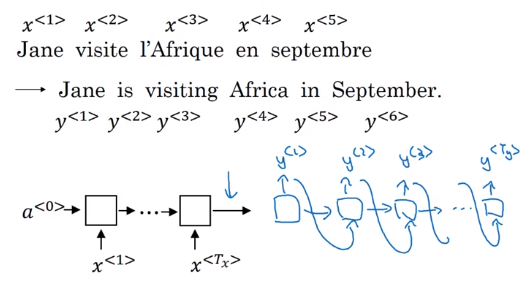  
This architecture also works for image captioning: *use ConvNet as encoder*  
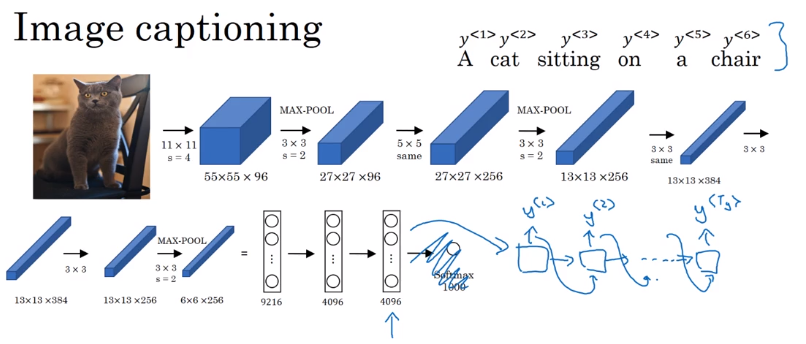  
Difference between seq2seq and generating new text with language model: seq2seq don't *randomly* choose a translation, but choose *most likely* output sequence.  
  
### Picking the most likely sentence  
Machine translation (or seq2seq in general): a *conditional* language model.  
  
* language model: ``P(y<1>,...,y<T>)``, ``x<i> = y<i-1>``, initial activation = ``a<0>``  
* seq2seq: feed encoder output as initial activation → ``P(y<1>...y<T>|x=input seq)``  
  
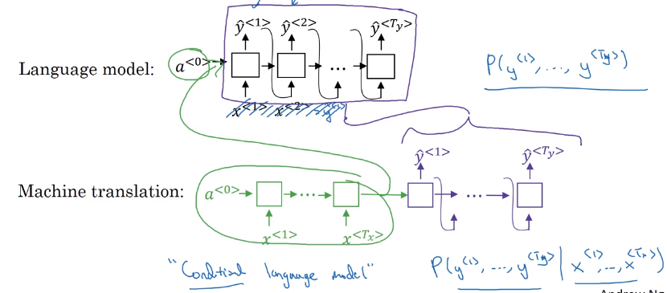  
Want to sample most likely output sequence (instead of random sampling)   
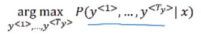  
  
  
* For output sequence of length L, there are |V|^L possiblilities.  
* greedy search: pick most likely word at each step → doesn't work well  
* → *approximate(not guaranteed)* search algo: beam search (next section).  
  
  
### Beam Search  
Approximately find most likely output sequence.  
**algo**  
parameter: beam width ``B`` = 3 (beam serach = greedy for B=1)  
  
* step 1: find ``B`` most likely choices for first word argmax ``P(y<1>|x)``  
* step 2: for each of ``B`` previous choices → compute second word probabilities  
  
→ compuate ``P(y<1>, y<2>|x)`` by Bayes  
  
initialize **B** copies of the network, hardwiring each of the B choices of first word from last step  
⇒ keep top ``B`` most likely first 2 words {y<1>,y<2>}  
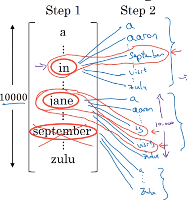  
  
* step 3: similar  
  
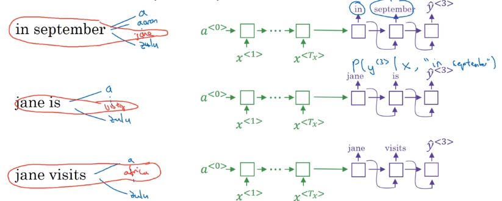  
  
  
### Refinements to Beam Search  
**Length normalization**  
original object to optimize:   
P(y<1>...y<T>) = product of conditional proba: P(y<1>|x)*P(y<2>|y<1>,x)*...  
(in practice: taking log → sum of log-probas, more numerically stable)  
with original object function, tends to prefer shorter output sequences  
⇒ normalize the probability by output length, i.e. average proba of each word  
"**normlized log-likelihood**"  
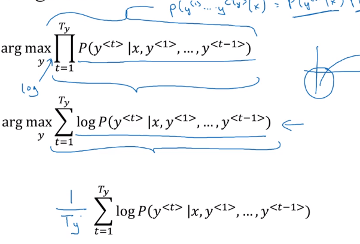  
In practice: use a softer normalization: normalize by ``T^alpha`` (typical value: alpha=0.7)  
  
* alpha=1: fully normalizing by length  
* alpha=0: no normalization  
  
  
**Beam width choice**  
  
* large B: better approximation, better result, slower  
* small B: worse result, but faster  
  
In production: B=10  
In research: B=~1000  
  
### Error analysis in beam search  
When error occurs: figure out whether it's due to beam search or RNN model.  
Given ``yhat`` and ``y*``(human result):  
→ feed ``yhat`` and ``y*`` to RNN language model, compute the *probability of each sequence*   
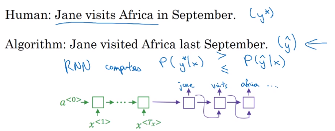  
  
* If ``P(y*)>P(yhat) ``⇒ beam seach needs improvement  
* If ``P(y*)<P(yhat)`` ⇒ RNN needs improvement  
  
  
### Bleu Score (optional)  
How to evaluate machine translation systems (multiple correct answers).  
→ **BLEU **(bilingual evaluation understudy): pretty good single-number eval metrics.  
**Precision**  
  
* (word-level) Precision: fraction of words in MT output that appears in reference translation  
* Modified precision: each word has a *credit*: max number of appearance in reference sentences (i.e. clip the count of a word)  
  
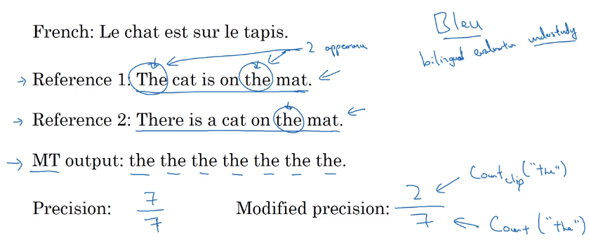  
**Precision on bigrams**  
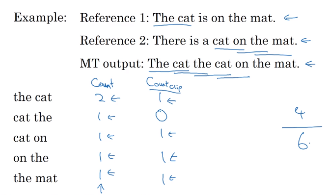  
For n-grams:  
``Pn = sum(count_clip of ngram in yhat) / sum(count of ngram in yhat)``   
  
**Bleu score**  
Combined Bleu score: exp of avearged precision.  
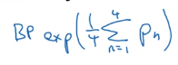  
**BP**: brevety penalty (penalize short translations)  
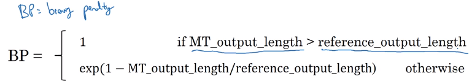  
  
### Attention Model Intuition  
Human translator: generate translation one part after another, instead of memorize (encode) whole sentence before translate.  
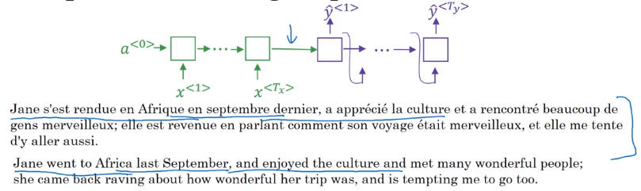  
  
  
* Input: run B-RNN to get hidden features for each word ``a<t>``  
* Output: also an RNN,   
  
at each step, using **context** with **attention weights** ``alpha`` to focus on only parts of input features.  
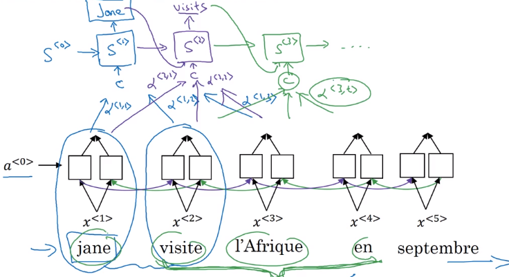  
Attention ``alpha<t,t'>``: how much attention to pay to ``t``'th input word when generating ``t``th output word: depends on previous output ``s<t-1>``, and RNN input feature ``a<t'>``.  
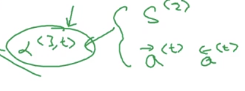  
  
### Attention Model  
Recap of attention model:  
Feature vector at ``t``'th input word: ``a<t'>``  
*context*: input features, weighted by attention weights  
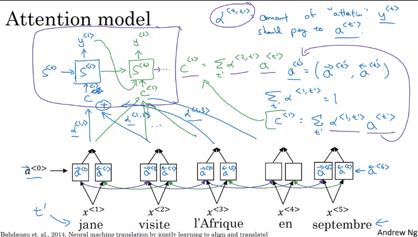  
  
**Computing attention alpha<t,t'>**  
Use ``a<t,t'>=softmax(e<t,t'>)`` to ensure attention is normalized (over all ``t``'s) to one.  
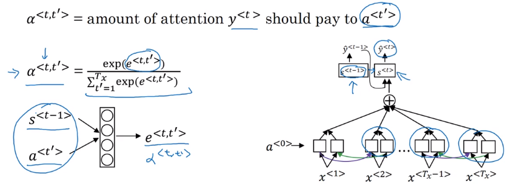  
⇒ The mapping function from ``a<t'>`` and ``s<t-1>`` to attention logits ``e<t,t'>`` is unknown  
→ plug in a NN: ``e<t,t'> = W * (s<t-1>, a<t'>)``— and trust backprop !  
  
downside: quadratique time complexity (``Tx * Ty``) → acceptable in MT, since input/output seqs are not that long...  
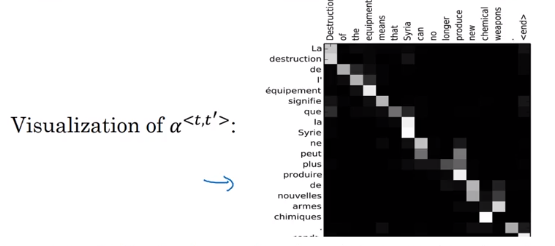  
  
II-Speech recognition - Audio data  
----------------------------------  
  
### Speech recognition  
seq2seq, where x = audio clip / spectrum gram, y=transcript  
pre-DL era: phonemes (hand-engineered basic unit of sound) → no longer necessary with end-to-end learning on large dataset.  
Dataset: 300~3000 hours  
  
**CTC cost** : "Connectionist temporal classification".  
Pb in speech recogintion with many-to-many RNN: number of input timesteps are *much longer* than output.  
→ blank and repeated characters are considered correct (collapse repeated characters afterwards)  
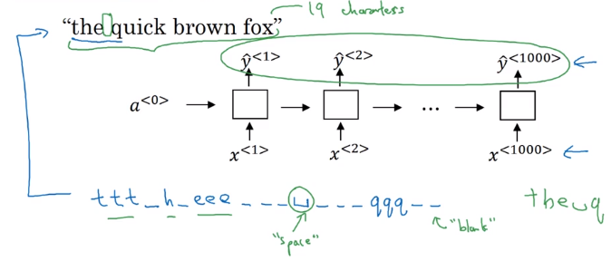  
  
### Trigger Word Detection  
Train with an RNN.  
Data: audio clips  
→ set label 1 right after the trigger word.  
pb: unbalanced dataset (a lot of 0s) → label = 1 for several timesteps after trigger word.  
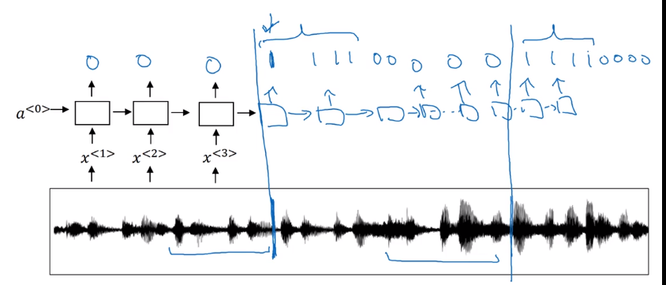  
  
  
Conclusion and thank you  
------------------------  
*Deep learning is a super power.*  
  
