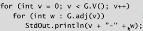
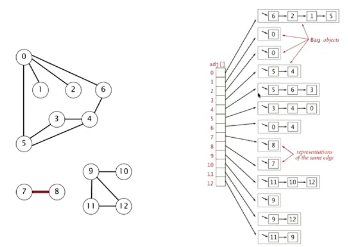
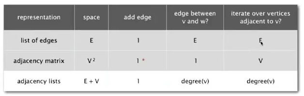
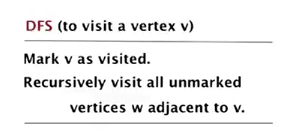
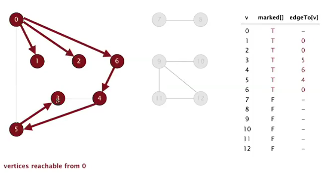

Title: [Algorithms II] Week 1-1 Undirected Graphs   
Date: 2015-11-08   
Slug:  algoII_week1_1   
Tags: algorithm   
Series: Algorithms Princeton MOOC II 
 
    
   
1. Intro to graphs   
==================   
Graph: vertices connected by edges.    
   
terminology:    
   
* **path**:  sequence of vertices connected by edges   
* **cycle**: path with same starting and ending vertex   
* two vertices are **connected**: if there is a path between     
   
   
ex of graph problems:    
   
* path: or connectivity   
* shortest path   
* cycle   
* Euler tour (ouii..)   
* Hamilton tour   
* MST   
* bi-connectivity: is there a vertex whose removal disconnects the graph?   
* planarity   
* isomorphism   
   
   
2. Graph API   
=========   
   
   
   
graph representation   
--------------------   
   
* vertex representation:  use integers *between 0 and V-1*   
* anormalies: self-loop and multiple edges are *possible*    

        public class Graph{   
            Graph(int V);   
            void addEdge(int v, int w);   
            Iterable<Integer> adj(int v);   
            int V();// nb of vertices   
            int E();// nb of edges   
        }   

   
print all edges:    
   
   
basic functions:   

	static int degree(Graph g, int v){   
		int deg = 0;   
		for(int w:G.adj(v)) deg++;   
		return deg;   
	}   
	static int nbOfSelfloops(Graph g){   
		int cnt = 0;   
		for(int v=0; v<G.V(); v++)   
			for(int w:G.adj(v))    
				if (w==v) cnt++;   
		return cnt/2;   
	}   

   
edge representation   
-------------------   
   
* set-of-edge implementation: a list of all edges ⇒ can lead to inefficient implementation   
* adj-matrix implementation: maintain a 2d (V*V) boolean array ⇒ space complexity too heavy   
* adj-list implementation: vertex-indexed array, each array entry is a ``Bag`` (类似桶bucket) ⇒ sutable for sparse graphs   
   
   
adj-list implementation:   

	private final int V;   
	private Bag<Integer>[] adj;   
	public Graph(int V){   
		this.V = V;   
		this.adj = (Bag<Integer>[]) new Bag[V];// java cannot create generic array   
		for(int v = 0; v<V; v++) adj[v] = new Bag<Integer>();   
	}   
	public addEdge(int v, int w){   
		adj[v].add(w);   
        adj[w].add(v);// if undirected graph   
    }    

   
   
3. Depth-First Search   
=====================   
Tremaux maze exploration: trace back when no unvisited vertices availiable.    
动画好看...   
DFS goal: systematically search through a graph.    
**design pattern**: *decouple* graph data and graph processing.    

	public class Paths{   
		Path(Graph G, int s);// graph G and source s   
		boolean hasPathTo(int v);   
		Iterable<Integer> pathTo(int v);   
	}   

algo:    
   
注意每次访问节点以前就将其mark.    
   
implementation   
--------------   
   
* 用一个boolean数组``visited[]``作为标记   
* 为了找到一条具体的路径(ie, 一系列节点), 维护一个``prev[]``数组, 存放当前节点是从哪个节点走过来的.    
   
  

    //public class DFSpaths extends Paths...   
    boolean[] visited = new boolean[V];   
    int[] prev = new int[V];   
    public void dfs(int v){   
        visited[v] = true;   
        for(int w: G.adj())   
            if(!visited[w]) {   
                prev[w]=v;   
                dfs(w);   
            }   
    }   
    public Iterable<Integer> pathTo(int v){   
        Stack<Integer> s = new Stack<Integer>();   
        for(int x = v; x!=s; x = prev[x])    
            s.push(x);   
        return s;   
    }   

   
properties   
----------   
**prop**.   
DFS visite all edges in time propotional to the sum of their degrees(ie. nb of edges).    
   
   
4. Breadth-First Search   
=====================   
   
   
**not** recursive algo.   
*maintain a queue, add to queue for all vertices not-marked.*    
   
implementation   
--------------   
   
* use ``visited[]`` to mark vertices   
* use a ``prev[]`` array to get explicit path   
* use a ``dist[]`` array to record the shortest dist from v to source (can use ``dist`` to replace ``visited``)   

        public void bfs(Graph G, int s){   
            boolean visited[] = new boolean[G.V()];   
            int prev[] = new int[G.V()];   
            int dist[] = new int[G.V()];   
            Queue<Integer> q = new Queue<Integer>();   
            visited[s] = true;   
            q.push(s);   
            while(!q.isEmpty()){   
                int v = q.dequeue();   
                for(int w:G.adj(v))   
                    if(!visited[w]) {   
                        prev[w] = v;   
                        visited[w] = true;   
                        q.enqueue(w);   
                    }	   
            }   
        }   

   
property   
--------   
**prop.**   
BFS computes the shortest path from s to all vertices using time propotional to E+V.    
   
intuition: BFS examines nodes by increasing distance    
   
5. Connected Components   
=======================   
dealing with connectivity(equivalence) queries ⇒ answer in constant time (with *preprocessing*).    

    public class CC{   
        boolean connected(int v, int w);   
        int count();// nb of CCs   
        int id(int v);//id for a CC   
    }   

⇒ Union-Find ? ⇒ *Use DFS!!*   
   
def. *connected component* is a maximal set of connected vertices.    
   
algo: for each unmarked vertex, run dfs(with increasing cc id)...   
after the preprocessing, we can get the array ``id[]`` and cc count ``cnt``...   
   
   
6. Graph Challenges    
==================
   
   
some typical pbs   
**pb1. bipartite graph**   
   
    
Can we  divide vertices into 2 subsets, where all edge go from one subset to other.    
⇒ can be done with dfs. *cf. booksite*   
   
**pb2. cycle detection**   
⇒ simple using dfs.    
   
**pb3. Euler cycle**   
Find a cycle that uses all edges exactely once.    
[Euler] a graph is Eulerian **iff** all vertices have even degree.    
⇒ typical diligent algo students can do. *cf. booksite*   
   
**pb4. Hamilton cycle**   
Find cycle that visits each vertex exactly once.    
⇒ intractable (typical NP-complete pb)   
   
**pb5. isomorphism of graphs**   
Are two graphs identical except for vertex names?   
⇒ no one knows...    
   
**pb6. planary graph**   
Lay out a graph in the plane without crossing edges?   
⇒ expert level. exists linear time algo based on DFS by Tarjan, but too complicated.    
