Title: [Algorithms II] Week 2-2 Shortest Paths      
Date: 2015-11-15      
Slug:  algoII_week2_2         
Tags: algorithm      
Series: Algorithms Princeton MOOC II 
 
[TOC]
    
1. Shortest Paths APIs   
======================   
context: *directe, weighted graphs*.     
   
### shortest path variants   
in terms of vertices:    
   
* source-sink: form one vertex to another   
* **single source**: from one vertex to all others (considered in this lecture)   
* all pairs   
   
   
constraints on edge weights:   
   
* nonnegative weights    
* arbitary weights   
* eculidean    
   
   
cycles:    
   
* no directed cycles   
* no negative cycles   
   
   
### APIs   
for weighted directed edge:   

	public class DirectedEdge{   
		DirectedEdge(int v, int w, double weight);   
		int from();   
		int to();   
		double weight();   
	}   
   
for edge-weighted digraph:   

	public class EdgeWeightedDigraph{   
		private final Bag<DirectedEdge>[] adj;    
		EdgeWeightedDigraph(int V);   
		void addEdge(DirectedEdge e);   
		Iterable<DirectedEdge> adj(int v);   
		int V();   
	}   
   
for single source shortest-path:   

	public class SP{   
		SP(EdgeWeightedDigraph G, int s);//s is the source node   
		double distTo(int v);//dist from s to v   
		Iterable<DirectedEdge> pathTo(int v);// shortest path from s to v   
	}   
   
   
2. Shortest path properties   
===========================   
goal: single-source shortest path   
**prop**. a **shortest-path-tree** (SPT) exists.    
这个结论以前没见过... 不太evident吧... 没有太想明白   
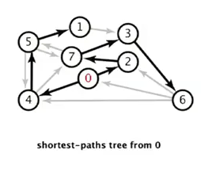   
⇒ consequence: can represent this SPT by 2 vertex-indexted arrays:   
   
* ``double distTo[v]`` = shortest path length s → v   
* ``DirectedEdge edgeTo[v]`` = last edge to v in shortest path, ``edgeTo[s] = null``   

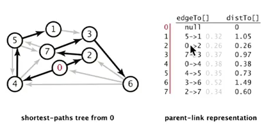   

	private int distTo[] = new int[V];   
	private DirectedEdge edgeTo[] = new DirectedEdge[V];   
	public double distTo(int v){   
		return this.distTo[v];   
	}   
	public Iterable<DirectedEdge> pathTo(int v){   
		Stack<DirectedEdge> path = new Stack<DirectedEdge>();   
		for(DirectedEdge e = this.edgeTo[v]; e!=null; e = edgeTo[e.from])   
			path.push(e);   
		return path;   
	}   
   
   
### Edge relaxation   
dynamic prog:   
   
* distTo[v] = length of **known** shortest path from s to v   
* distTo[w] = length of **known** shortest path from s to w   
* edgeTo[w] = last edge in the **known** shortest path form s to w   
   
   
(consider edges one by one)   
**def**. edge e = v-->w **relaxes** if e.weight+distTo[v] < distTo[w]. → update distTo[w] and edgeTo[w].   
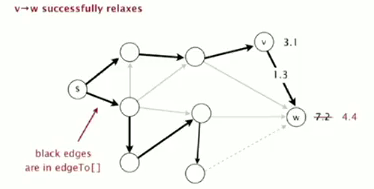   

	private void relax(DirectedEdge e){   
		int v = e.from(), w = e.to();   
		if(distTo[w]>distTo[v]+e.weight()){   
			distTo[w] = distTo[v]+e.weight();   
			edgeTo[w] = e;   
		}   
	}   
   
   
### optimality conditions   
**prop**. optimality conditions   
distTo[] is the solution *iff*:   
>* distTo[s] = 0   
* distTo[v] is the weight of some path from  s to v   
* for any edge e = v → w, distTo[w] <= distTo[v]+e.weight()   
   
   
### Generic algo   
just relax all edges...   
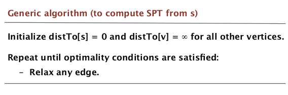   
**prop**. the above generic algo gives the SPT from s.    
   
implementations of the algo:    
   
* Dijkstra (nonnegative edge)   
* Topological sort (!) (no directed cycles)   
* Bellman-Ford (no negative directed cycles)   
   
   
3. Dijkstra's Algorithm   
=======================   
*(non-negative edges)*   
   
>* consider vertices in increasing distance from s.*    
* add vertex to the SPT, relax all edges from that vertex.    
* each time: take the closest vertex to s that is not in the SPT (ie. whose dist is not determined yet), add the vertex, and relax all its outgoing edges.    
   
**prop**. Dijkstra works.   
pf.    
* each edge e = v → w is considered exactly once (when vertex v is added to SPT). distTo[w] <= distTo[v]+e.weight() after relaxing e   
* ineq holds until algo terminates   
	* distTo[w] decrease monotonely,   
	* distTo[v] will not change because each time we choose distTo[v] smallest, and all edges non-negative.    
* CQFD by optimality condition.   
   
   
### implementation   
Use an ``IndexMinPQ`` to store vertices.   

	public class DijkstraSP{   
		private int dist[];   
		private DirectedEdge edgeTo[];   
		private IndexMinPQ<Integer,Double> pq;   
		DijkstraSP(EdgeWeightedDigraph G, int s){   
			this.dist[] = new int[G.V()];   
			this.edgeTo[] = new DirectedEdge[G.V()];   
			this.pq = new IndexMinPQ<Integer,Double>(G.V());   
			for(int v = 0; v<G.V(); v++)  dist[v] = 999999;   
            dist[s] = 0;		   
			pq.insert(s, 0.0);   
			while(!pq.isEmpty()){   
				int v = pq.delMin();   
				for(DirectedEdge e:G.adj(v))    
					relax(e);// decrease key or insert vertices to pq   
			}   
		}//constructor()   
		   
		private relax(DirectedEdge e){   
			int v = e.from(), w = e.to();   
			if(dist[w]<dist[v]+e.weight()){   
				dist[w] = dist[v]+e.weight();   
				edgeTo[w] = e;   
				if(pq.contains(w)) pq.decreaseKey(w, dist[w]);   
				else pq.insert(w, dist[w]);   
			}   
		}//relax()   
	}//class   
   
**Dijkstra is in fact a Prim algorithm ! ***Both are algos that compute a spanning tree.*     
   
* in Prim: each time takes the vertex *closest to the tree *(and is for undirected graph).   
* in Dijkstra: each time takes the vertex *closest to source s *(and is for directed graph).   
   
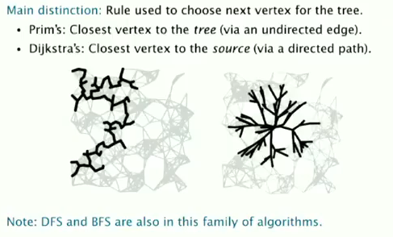   
DFS BFS are also computing spanning tree!    
...NB!!   
   
### complexity   
   
* V insertions to PQ (each vertex is added to the SPT)   
* V delMin from PQ    
* E decrease key   
   
→ depends on the PQ implementation.    
in our implementation, **O(ElogV)**   
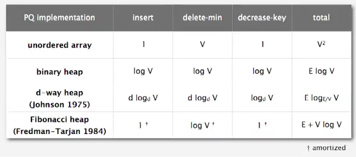   
   
4. Edge-Weighted DAGs   
=====================   
in a DAG, it's easier to find the shortest path ?   
⇒ yes!    
simple algo:    
> * consider vertices in topological order   
* relax outgoing edges form this vertex.    
   
   
### correctness   
**prop**.   
>topo-sort algo computes SPT in any DAG (*even with negative weights*) in time **O(E+V) ***(linear time!)*.    

*pf.*   
* each edge is relaxed exactely once. distTo[w] <= distTo[v]+e.weight() after relaxing e   
* ineq holds until the algo terminates because:    
	* distTo[w] decrease monotonely,   
	* distTo[v] will not change because of topo-order, no edge pointing to v after v is relaxed.    
* CQFD   
   
   
### implementation   
	public class AsyclicSP{   
		AsyclicSP(EdgeWeightedDigraph G, int s){   
			// init dist[] and edgeTo[]...   
			Topological topo = new Topological(G);   
			for(int v: topo.order())   
				for(DirectedEdge e:G.adj(v))   
					relax(e);   
		}   
	}   
   
   
### application   
   
* *seam-carving*   
   
Resizing images *non-uniformly* without distortion.    
   
好神奇!   
Grid DAG of pixels, edges are pointed to 3 downward neighbors.   
横向缩小: 删掉一个"seam"   
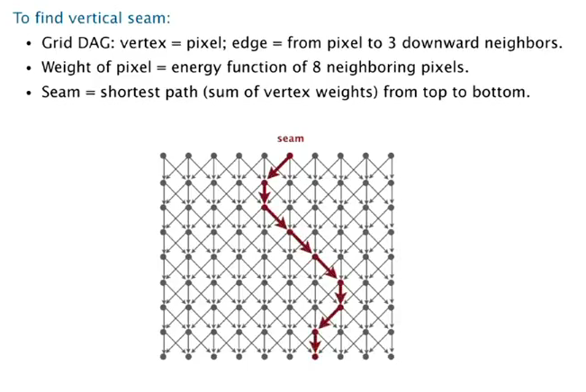   
   
* longest path in DAG → *just negate all edge weights*, as this algo is OK for negative edges.    
   
* parallel job scheduling   
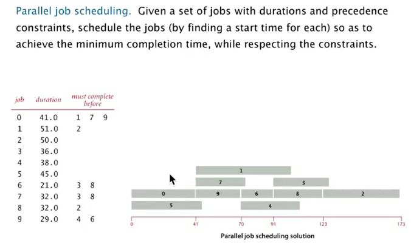   
感觉有点运筹的意思, 关键是建立一个DAG, 比较有技巧性:   
    * add source and sink    
    * split each job to 2 vertices (begin and end)   
   
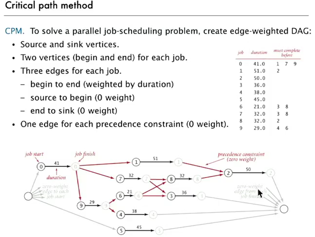   
⇒ use longest path to schedule jobs   
   
   
5. Negative Weights   
===================   
只是给所有边增加weight并**不能**解决负权边问题.    
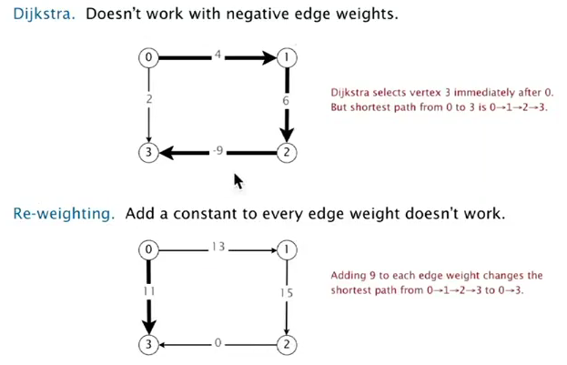   
⇒ need a different algo.   
   
prop. SPT exists *iff* there is no *negative cycles.*   
   
### Bellman-Ford   
一句话总结Bellman算法: 每次relax所有的边, 进行V次.   
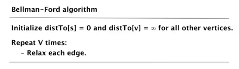   
(*因为relax k次以后, s到v的最短路径的长度小于等于k.*)   
   
**prop**. Bellman-Ford works, complexity is **O(EV)**.    
pf.    
after i passes, found shortest path contain at most i edges.    
   
code:   

	public class BellmanFordSP{   
		BellmanFordSP(EdgeWeightedDigraph G, int s){   
			// init dist[] and edgeTo[]...   
			for(int i=0;i<G.V();i++)   
				for(DirectedEdge e:G.edges())   
					relax(e);   
		}   
   
	}   
   
   
### improvement   
*if dist[v] is not changed during one pasee → no need to relax incoming edges any more.*    
    → much faster in practice.    
   
FIFO implementation: maintain a queue of vertices whoses dist is changed.    
   
   
### Finding negative cycle   
add two method to SP:   

	boolean hasNegCycle();   
	Iterable<DirectedEdge> negCycle();   
   
   
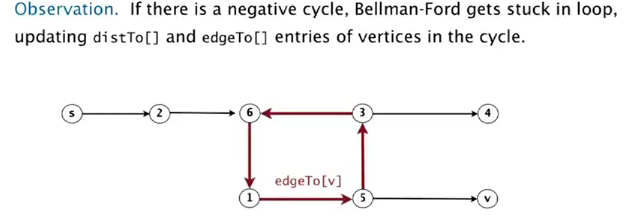   
   
**prop**.   
>if a vertex u is updated in phase V, there exists a negative cycle, and can track edgeTo[u] to find the cycle.    

原因是最短路径的长度小于V, 如果大于V则说明存在negative cycle.  
   
### negative cycle application   
*arbitrage detection*   
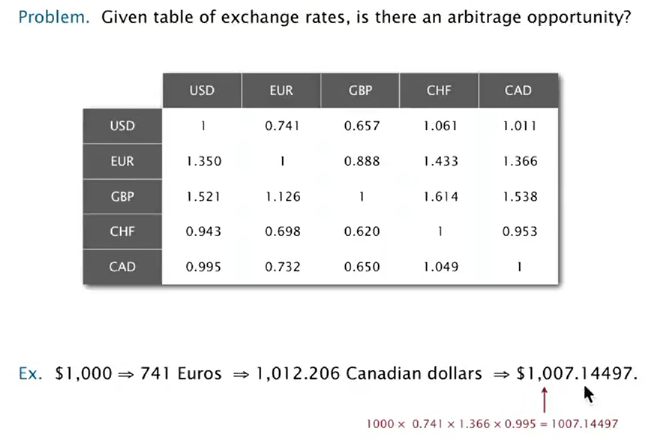   
建模: 
graph of currencies, edge weight = exchange weight (complete graph).   
    ⇒ *find a cycle whose product of edge is >1.*    
        ⇒ **take logs** to make a shortest-path pb.   
            ⇒ take minus log, then try to find a negative cycle.    
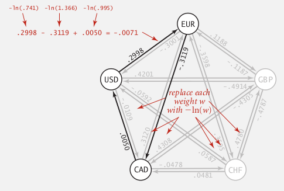   
NB!!   
   
   
Summery   
=======   
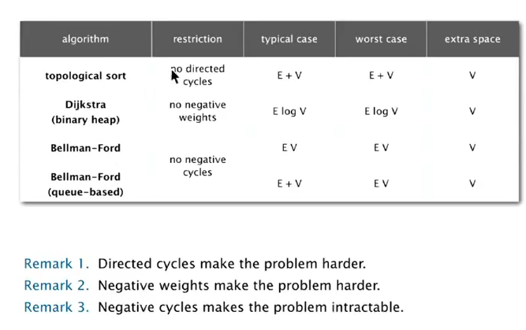   
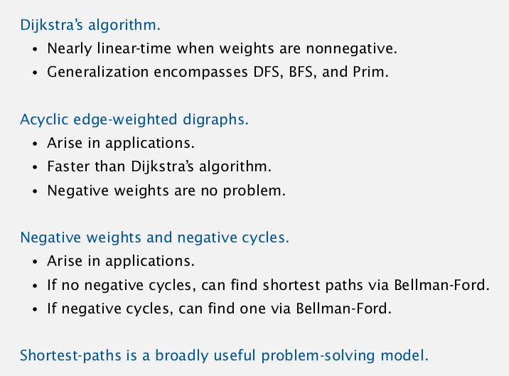   
