Title: [Algorithms II] Week 3-1 Maximum Flow     
Date: 2015-11-17         
Slug:  algoII_week3_1   
Tags: algorithm         
Series: Algorithms Princeton MOOC II 
 
[TOC]
    
1. Introduction to Maxflow   
==========================   
   
### Min-cut pb   
   
* input: edge-weighted digraph G, each edge ``e`` has weight(*"capacity"*) ``c[e]``>=0, a *source vertex* ``s``, a *target vertex* ``t``.    
* **def**. an **st-cut **``(A,B)`` is a partition of vertices into 2 disjoint sets A and B, with ``s`` in set ``A`` and ``t`` in set ``B``.    
* **def**. the **capacity** of a cut ``(A,B)`` is sum of capacities of edges going *from A to B* *(not considering B to A)*.    
   
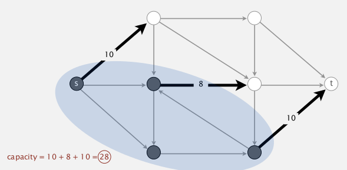   
⇒ min-cut pb: find the cut **(A,B)** with min-capacity.    
   
### Max-flow pb   
   
* same input: graph G, source s, target t   
* **def.** an **st-flow** is an assignment of values to edges ``f: e→f[e]`` such that:    
	* capacity constraint: ``0<=f[e]<=c[e]`` for any e;   
	* local equilibrium: for any vertex v (other than s or t), *inflow=outflow*;   
* **def.** the **value** of a flow ``f`` is the inflow at ``t``. (assume no ingoing edge to s or outgoing edge to t)   
   
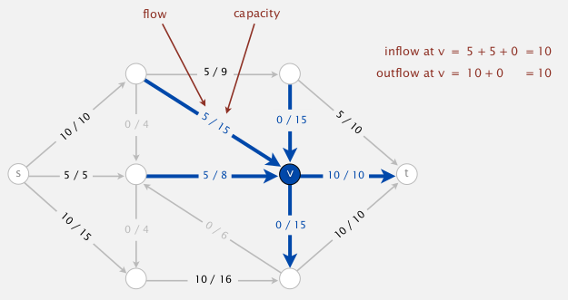   
⇒ max-flow pb: find ``f`` with max value.    
   
remark: max-flow and min-cut are dual problems.    
   
2. Ford-Fulkerson Algorithm   
===========================   
**def.** given a flow ``f`` for a graph, an **"augment path"** is an **undirected** path form ``s`` to ``t``, if there exist ``df>0`` (*"bottleneck capacity"*) such that:   
   
* for forward edges e: can augment flow by ``df`` (not full: ``f[e]+df<=c[e]``)   
* for backward edges: can decrease flow by ``df`` (not empty: ``f[e]-df>=0``)   
   
   
   
   
* def. **residual capacity**   
	* for forward edge e, *residual-cap = c[e]-f[e]*   
	* for backward edge e, *residual-cap = f[e]*   
   
⇒ an aug-path is a path where *each edge has residual capacity >0*.    
   
**blocking edges**: *full forward edge* or *empty backward edge.*   
   
→ idea: increase flow along augment paths.   
**[algo]**   
> * start: 0 flow: ``f[e]=0`` for all e.    
* find an augment path (and the corresponding ``df``) in graph, and change the flows along the path by ``+/-df``.   
* loop until no augment path exists. (ie. all path s→t are blocked either by a *full forward edge* or an *empty backward edge, *ie. by an edge with 0 residual capacity)   
   
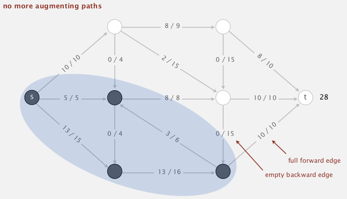   
   
FF is a gernel algorithm:    
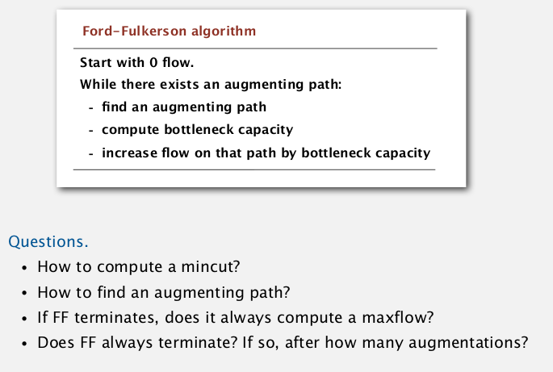   
   
3. Maxflow-Mincut Theorem   
=========================   
**def**. for a cut (A,B), the **net flow** across the cut (*netflow(A,B)*) is the sum of flows from A to B minus flows from B to A.    
   
>**[flow-value Lemma]**    
For any flow ``f`` and any cut ``(A,B) ``⇒  *netflow(A,B) = value(f).*    
*pf.*    
induction on the size of set B.   
* base case, when B={t}, by def we have *netflow(A,B) = value(f)*   
* when moving any vertex v from A to B:   
	* netflow(A, B) augment by *flow(A→v)+flow(B→v)=inflow(v)*,    
	* netflow(A, B) decrease by *flow(v→A)+flow(v→B)=outflow(v)*,    
	* by equilibrium of flow, *netflow(A',B')=netflow(A,B)=value(f)*   
   
   
ex. (A: gray vertices, B: white vertices)   
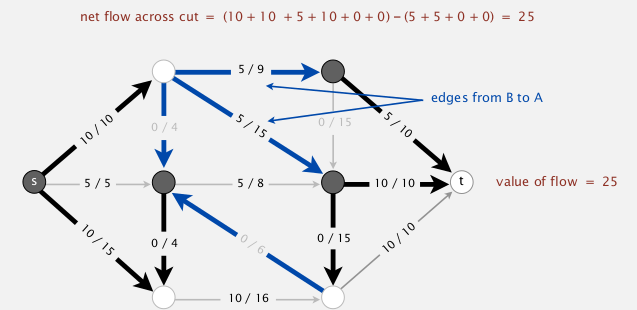   
   
[cor] *outflow(s)=inflow(t)=value(f)*   
   
>**[weak duality]**   
For *any* flow ``f`` and *any* cut ``(A,B)``, ⇒ *value(f) <= capacity(A,B).*   
   
>**[Augmenting path Th]**    
A flow ``f`` is maxflow *iff* there is no augment path.   
   
>**[maxflow-mincut Th]**   
**value(maxflow) = capacity(mincut).**   
   
*pf.*   
for any flow ``f``, prove the equivalence of the 3 following statements:   
i. there exists a cut st: *capacity(cut) = value(f).*   
ii. ``f`` is a maxflow.   
iii. there is no augmenting path wrt ``f``.   
   
* [i⇒ii]   
   
suppose cut(A,B) st: *capacity(A,B)=value(f)*   
⇒ by weak duality, for any other flow f', *vlaue(f')<=capacity(A,B)=value(f)*   
   
* [ii⇒iii] (eqv to prove ~iii⇒~ii)   
   
suppose there is an aug-path from s to t, of bottleneck capacity=df,   
⇒ by improving f with df, we get a f' > f   
   
* [iii⇒i]   
   
suppose there is no aug-path, ie, *all path from s to t are blocked by some full-forward edge or empty backward edge.*   
⇒ let A:=vertices connected with s by a path with no blocking edges, and B := the rest   
(*so* *once we get a maxflow, we can ***compute the mincut*** in this way*)   
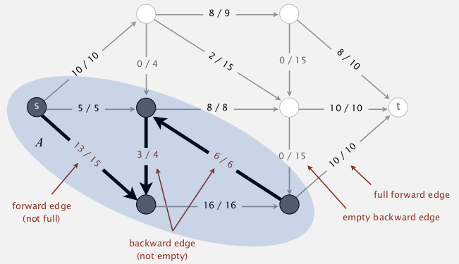   
→ for all edges across A and B, all forward edges are full, all backward edges are empty   
⇒ capacity(A,B) = netflow(A,B) = value(f) by flow-value lemma   
CQFD... 过瘾...   
   
4. Running Time Analysis   
========================   
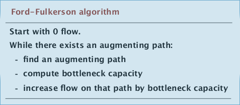   
   
* getting a mincut form maxflow? → easy (as discussed in the pf above)   
* computing an aug-path? → **BFS**   
* does FF algo always terminate? how many augmentations? → ...   
   
   
### integer capacity graphs   
*special case of FF algo*: edge capacities are *integers* between 1 and U.    
   
invariant: flow is always integer all along FF algo.   
   
[prop] nb of augmentations <= value of maxflow.   
pf. each augmentation will add flow by >=1.    
   
[integrality Th] There exist an integer-valued maxflow.    
   
### Bad case for FF   
nb of augmentation == value of maxflow   
(each time, the path through the middle edge is chosen as aug-path)   
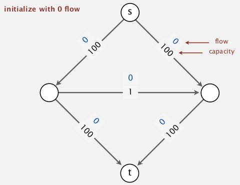   
**can be easily avoided**⇒  by using shortest(nb of edges)/fastest(biggest df) path    
   
   
Performance of FF depends on the algo for choosing aug-path:   
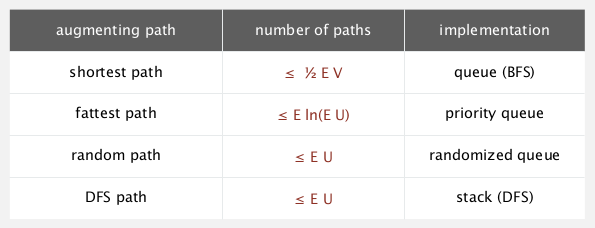   
   
5. Java Implementation   
======================   
   
### representation of flow graph   
   
* flow edge:   
   
each e= v→w, have flow f[e] and capacity c[e].   
   
* flow graph:   
   
put e in both v and w's adj-list.    
   
* flow augmentation (by delta)   
	* for forward edge e, f[e] += delta   
	* for backward edge e, f[e] -= delta   
   
   
### Residual graph Gr   
**def**. For a flow ``f`` and a graph ``G``,  the **residual graph** ``Gr`` is obtained by:   
>for each edge ``e=v→w``, (with ``c[e]`` and ``f[e]``) in ``G``, put in ``Gr``:   
* ``e1=v→w``, with weight=``c[e]-f[e]``   
* ``e2=w→v``, with weight=``f[e]`` (即两个方向上的weight都为residual capacity)   
   
   
(rmq: ``Gr`` is just a weighted digraph, not a flow graph)   
   
[prop] **Augment path in **``G``** is equivalent to a path in **``Gr`` (``df`` of aug-path in ``G`` = min edge weight in ``Gr``)**.**   
(但是实现的时候其实不用显式构造Gr, 只需BFS的时候修改一下即可)   
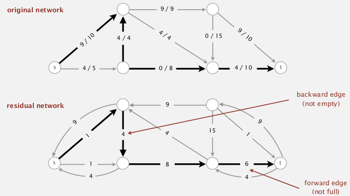   
   
### APIs   
这里的API设计的非常合理... 导致每一部分的代码量都不大... NB   
   
* flow-edge:    
rmq. both calculate residual-cap and augmentation need to specify a *direction*, so we need a index v as parameter for these 2 functions.    
  
        public class FlowEdge{   
            private final int v, w;   
            private final double capacity;   
            private double flow=0.0;   
            FlowEdge(int v, int w, double cap);   
            int from();   
            int to();   
            int other(int v);   
            double capacity();   
            double flow();   
            double residualCapTo(int v);// residual capacity   
            void addFlowTo(int v, double delta);// augment residual flow   
        }   

   
* flow graph:  

        public class FlowNetwork{   
            private Bag<FlowEdge>[] adj;//use adj-list representation for flow graph   
            FlowNetwork(int V);   
            void addEdge(FlowEdge e);   
            Iterable<FlowEdge> adj(int v);// both incoming and outgoing edges   
            ...   
        }   

   
* FF algo:    
	* use a function ``hasAugPath()`` to test termination   
	* use a function ``bottleNeck()`` to get delta   
	* if a augpath is found, use two arrays ``reached[]`` and ``edgeTo[]`` to get the augpath (find the path *backwards*).    

code:   
   
    public class FordFulkerson{   
    private boolean[] reached; //reached[v] indicates if a path s-->v exists in Gr, used in DFS   
    private FlowEdge[] edgeTo;// edgeTo[v] = last edge on the path s-->v   
    private double value=0.0;// value of flow   
    public FordFulkerson(FlowNetwork G, int s, int t){   
        while(this.hasAugPath(G,s,t)){   
            double delta = this.bottleNeck();   
            for(int v=t; v!=s; v=edgeTo[v].other(v))   
                edgeTo[v].addFlowTo(v, delta);   
            this.value += delta;// each time the flow value augments by delta   
        }   
    }   
    private double bottleNeck(){//bottleneck-cap = min residual flow on the aut-path   
        double bottleneck = 9999999;   
        assert(reached[t]);// the aug-path should exsit   
        for(int v=t; v!=s; v = edgeTo[v].other(v))   
            bottleneck = Math.min(bottleneck, edgeTo[v].);   
        return bottleneck;   
    }   
    private boolean hasAugPath(FlowNetwork G, int s, int t){   
        // perform a BFS    
        Queue<Integer> q = new LinkedList<Integer>();   
        this.reached = new boolean[G.V()];   
        this.edgeTo = new FlowEdge[G.V()];   
        q.add(s);   
        while(!q.isEmpty()){   
            int v = q.deque();   
            for(FlowEdge e:G.adj(v)){   
                int w = e.other(v);   
                if(!reached[w] && e.residualCapTo(w)>0){// modified BFS: valid edges are those with  residualCap>0   
                    edgeTo[w] = e;   
                    reached[w] = true;   
                    if(w==t) return true;// t is reached by BFS  
                    q.enqueue(w);   
                }   
            }   
        }// BFS while loop    
        return false;   
    }   
    }//class FF   
   

6. Maxflow Applications   
=======================   
关键是建模很巧妙...   
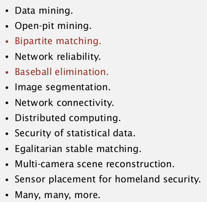   
   
### ex1. bipartite matching pb   
二分图的最大匹配问题. (有点像marriage stable问题...但是不一样 因为没有preference order)   
   
⇒ is there a way to match all students to a job?   
ie. *given a bipartite graph, find a perfect matching.*    
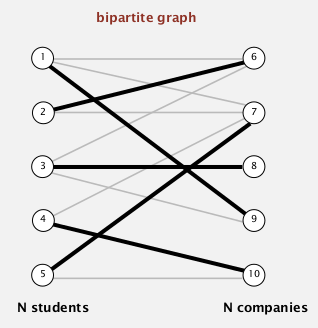   
**modeling**   
>* add source ``s`` and target ``t``   
* all edges from ``s`` to students: capacity=1   
* all edges from companies to ``t``: capacity=1   
* all edges from student to company: capacity=INF   
   
⇒ find maxflow in the graph   
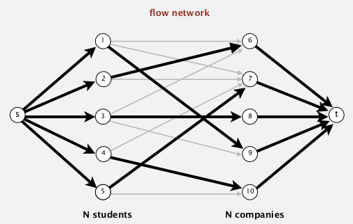   
   
**when no perfect matching: mincut can explain why**    
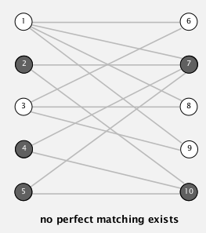   
in the above case, student 2,4,5 can only be matched to 7,10   
⇒ mincut can help us find such cases!   
   
*recall: how to get mincut from maxflow*   
>mincut = (A,B), where:   
A:=vertices connected with s by a path with non blocking edges,    
B := the rest   
(*blocking edges: full forward edge or empty backward edge on path*)   
   
ex.   
   
   
* let S=students on s side of mincut (in above case, *S={2,4,5}*)   
* let T=companies on s side of mincut (in above case, T*={7,10}*)   
* |S|>|T|, that's why no perfect matching!   
   
   
### ex2. baseball elimination   
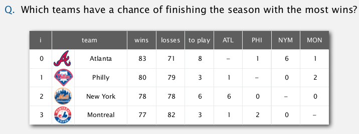   
(前三列是目前成绩, 后面四列是接下来赛程矩阵)   
Montreal is mathematically eliminated → easy to see   
→ Philly is mathematically eliminated also !   
   
* another case:   
   
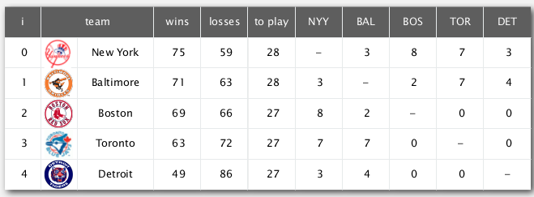   
Detroit is mathematically eliminated !   
   
whether team-4 still has a chance to win?   
**modelling**   
   
* remaining games flow from s to t.    
* use team-pairs ans teams as vertices   
* *carefully chosen capacities*(see below)   
   
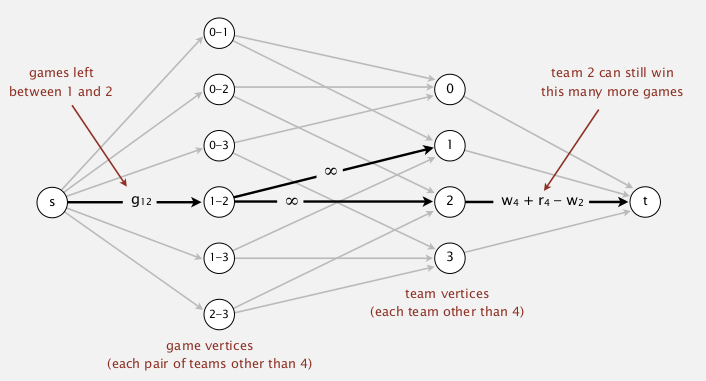   
⇒ team 4 could win iff all flow from s are full (ie. all match points can be repartitioned over other teams *without depassing team 4's maximum wins*).   
总之很巧妙....   
