Title: [Algorithms II] Week 3-2 Radix Sorts    
Date: 2015-11-23           
Slug:  algoII_week3_2     
Tags: algorithm           
Series: Algorithms Princeton MOOC II 
 
[TOC]
   
This week: string sort.  
  
1. Strings in Java  
==================  
  
### char data type  
  
* **char in C**  
  
8-bit integer, 256 characters, 7-bit ASCII code  
  
* **char in Java**  
  
*16-bit Unicode*    
  
### String data type  
``String``: *immutable* sequence of characters  
operations: lengthe, ith char, substring, concatenate  
  
implementation: using a ``char[]``, maintain a ``length`` and an ``offset.`` ⇒ substring methode is O(1) time.  
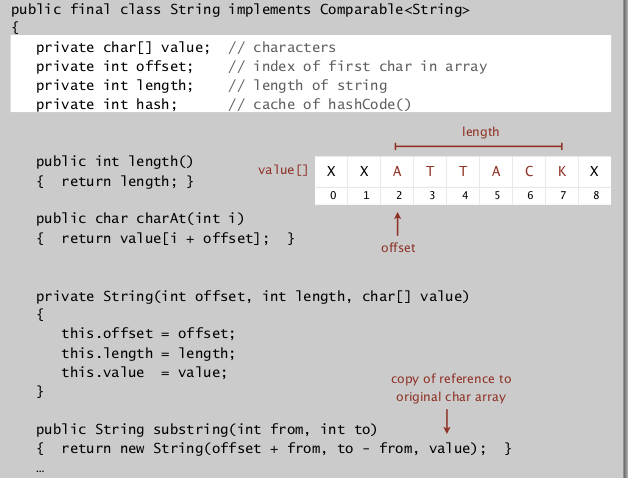  
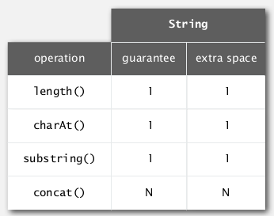  
  
### StringBuilder data type  
``StringBuilder``: *mutable* data type.  
implementation: using a resizing ``char[]`` array (ArrayList).   
⇒ contat in (amortized) constant time, *substring in linear time*!  
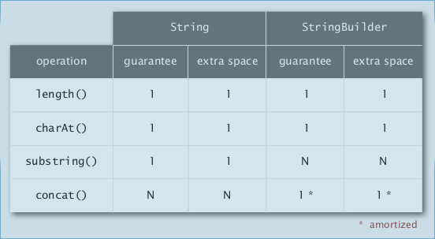  
  
ex.   
  
* reverse a string: linear using StringBuilder, quad using String.   
* form an array of suffixes: quad (time&space) using StringBuilder, linear (time&space) using String.   
  
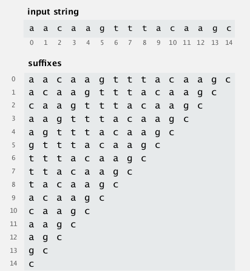  
**Longest Common Prefix:**  
runs in linear/subinear time ⇒ ``compareTo()`` for strings takes (sub)linear time!  
  
### Alphabet  
alphabet different for different type of string (ex. binary numbers, DNA, ...)  
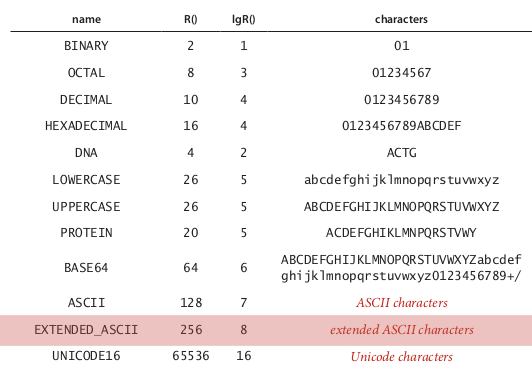  
def. **Radix** ``R`` is number of digits  in alphabet.   
  
2. Key-Indexed Counting  
=======================  
review of *compare-based* sorting algorithms:  
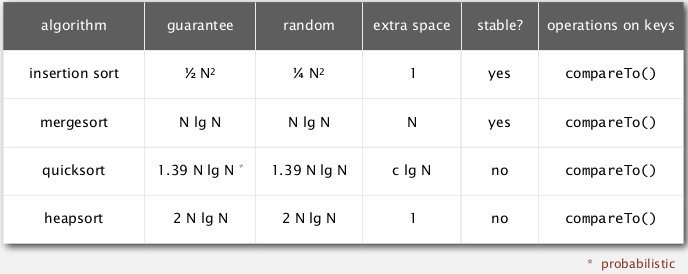  
lower-bound for compare-based algorithms: ~*NlgN* (=Lg(N!))  
⇒ goal: do better by avoiding using compares.   
  
### Key-indexed counting  
is an algorithm to sort *by character(ex. sort array of string by their 1st character).*   
Assumption: keys are integers between 0 and R-1 (<<N, small integer).  
⇒ use keys as array index, to sort an *array of N integers between 0 and R-1*.   
  
**[algo]**  
>* count freq of each key index (of size *R+1*)  
* using count array, compute a *cumulated freq* (cumsum of ``count[]``)  
* the ``cumsum[]`` array stores the **index range** of each key index:   
  
index range of key-i in sorted array is ``[cumsum[i], cumsum[i+1]]``  
  
* then get the sorted array by going through the array and using cumsum[] array  
  
  
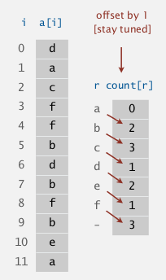⇒ 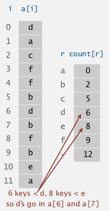  
  
	public void keyIndexCounting(int[] a, int R){// entries in a[] are in range [0,R-1]  
		int N = a.length;  
		int[] count = new int[R+1]; // count[i] = freq of key i-1, count[0] = 0  
		for(int ai:a)   
			count[ai+1]++;  
		int[] cumsum = count; //cumsum = cumulated freq  
		for(int i=0;i<R;i++)   
			cumsum[i+1] += cumsum[i];  
		// the ranges of key i in sorted array should be [cumsum[i], cumsum[i+1]]  
		int[] aux = new int[N];  
		for(int ai:a)  
			aux[cumsum[ai]++] = ai;  
		a = aux;	  
	}  
  
  
### analysis  
  
* running time: **linear** in time and in space.   
* **stable** sorting: that's why we need the cumsum and aux array...  
  
  
3. LSD Radix Sort  
=================  
LSD = least significant digit (for string sorting)  
(assume strings all of same length)  
idea:  
  
* consider chars from right to left   
* sort using dth character as key (using key-indexed counting)  
  
important: the key-indexed counting should be stable.  
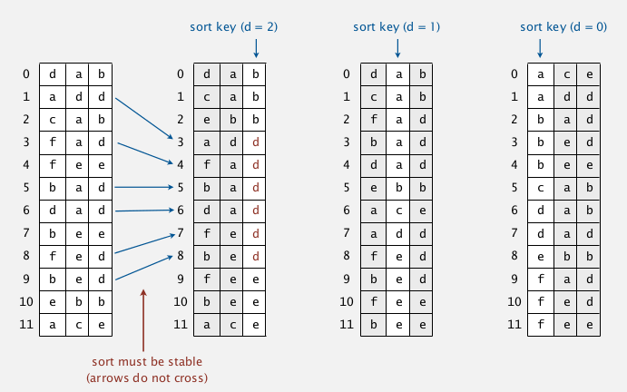  
  
### analysis  
time: W * N (W=length of string)  
  
correctness:  
**prop**. LSD sorting works  
pf. by induction on i  
prove that: after pass i, strings are sorted by last i characters.   
  
### implementation  
  
	public static LSDsort(String[] a, int W){//W=fixed width  
		int R = 256;//for ASCII chars  
		int N = a.length;  
		String[] aux = new String[N];  
		for(int d=W-1;d>=0;d--){//W passes  
			//key-indexed counting at digit d  
			int count = new int[R+1];  
			for(String s:a)  
				count[s.charAt[d]+1]++;  
			for(int i=0;i<N;i++)  
				count[i+1] += count[i];//count = cumsum(count), range of each key  
			for(String s:a)  
				aux[s.charAt[d]++]=s;//put each key in right place  
			for(int i=0;i<n;i++)  
				a[i]=aux[i];  
		}  
	}  
  
  
  
* if keys are binary numbers → break into bit characters then apply LSD.   
* if not fixed length → some fix..  
* sort 1 million 32-bit integers? (Google/Obama interview) ⇒ LSD string sort~   
  
  
  
4. MSD Radix Sort  
=================  
most-significant-digit first (from left to right)  
Idea.  
  
* partition array into R pieces according to first character (the count[] array is the partition)  
* *recursively* sort each subarrays  
  
  
variable length: end-of-string are treated as before any char  
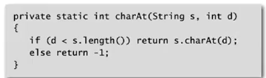  
  
### implementation  
	private static void sort(String[] a, String[] aux, int lo, int hi, int d){  
		if(hi<=lo) return;  
		//sort by dth character  
		int count = new int[R+2];// R+2 as we are taking account into the end-of-strings!!  
		for(int i=lo;i<=hi;i++) count[ a[i].charAt(d)+2 ]++;//charAt(end-of-string)=-1  
		for(int i=0;i<R;i++) count[i+1] += count[i]; //cumsum  
		for(int i=lo;i<=hi;i++) aux[count[a[i].charAt(d)+1]++] = a[i];  
		for(int i=lo;i<=hi;i++) a[i] = aux[i-lo];// attention: aux is filled from index 0 instead of lo  
		//recursively sort each subarray (R subarrays in total, ranges stored in count[])  
		for(int r=0;r<R;r++)  
			sort(a, aux,lo+count[r], lo+count[r+1]-1, d+1);  
	}  
  
  
### analysis  
  
* can recycle ``aux[]``, but *not* ``count[]``.   
* too slow for small subarrays (if len(subarray)<<R)  
* huge nb of subarrays because of recursion   
  
improvement ⇒ cutoff to insertion sort...   
  
characteristics of MSD sort:   
examines **just enough chars** to sort.   
→ can be sublinear in N.   
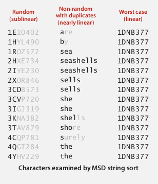  
  
### MSD vs. quicksort  
disadvantages for MSD:  
  
* random access of memory (cache inefficient)  
* too many instructions in inner loop   
* extra space for count[]  
* extra space for aux[]  
  
  
disadvantages for qsort:  
  
* NlgN nb of string compares  
* has to rescan many chars for keys with *long prefix matches*  
  
  
5. 3-way Radix Quicksort  
========================  
*⇒ combine benefits of qsort and MSD.*   
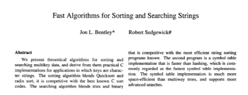  
idea: do **3-way partition by the dth character**.   
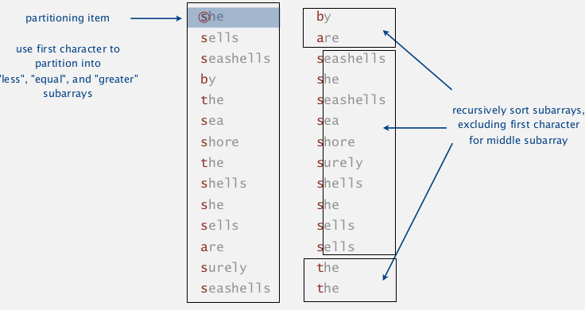  
  
* less overhead than *R-way* partitioning for MSD  
* do not re-examine chars equal to the partitioning char  
  
  
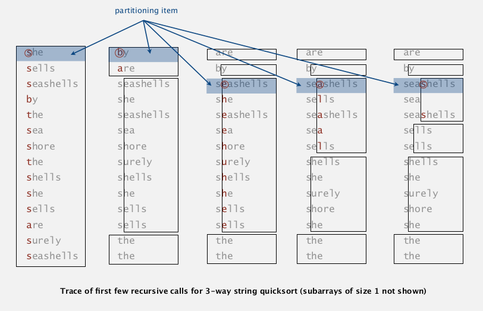  
  
### Implementation  
modification of the 3-way qsort.   

	private static sort(String[] a, int lo, int hi, int d){  
		if(hi<=lo) return;  
		int lt = lo, gt = hi, i=lo+1;// use 3 pointers: lt, i, gt  
		char pivot = a[lo].charAt(d);  
		while(i<=gt){//invariant: a[lo,lt)<pivot, a(gt,hi]>pivot, a[lt,i]=pivot  
			char c = a[i].charAt[d];  
			if(c<pivot) exch(a,lt++,i++);  
			else if(c>pivot) exch(a,i,gt--);  
			else: i++;  
		}//3-way partition  
		sort(a,lo,lt-1,d);  
		if(pivot>=0) sort(a,lt,gt,d+1);//pivot<0 means end-of-string  
		sort(a,gt+1,hi,d);  
	}  
  
  
### analysis  
**wrt. qsort:**  
  
* from NlgN **string** compares to NlgN **char** compares.  
* avoids re-comparing long common prefixes.  
  
  
**wrt. MSD:**  
  
* short inner loop  
* cache friendly  
* in-place  
  
  
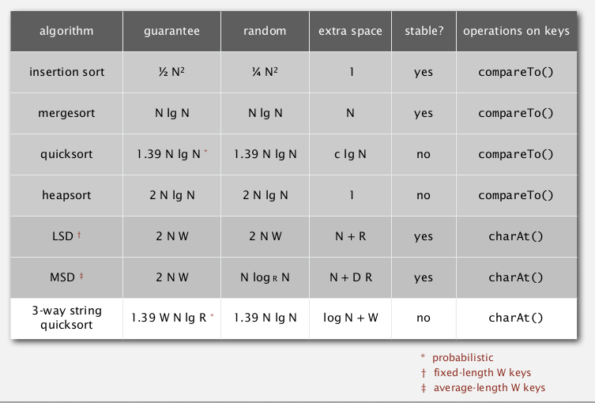  
  
6. Suffix Arrays  
================  
(*some applications of suffix array)*  
  
### keyword-in-context search  
given N chars (N huge), *preprocess* it to enable fast substring search.   
⇒ suffix sort  
  
* generate suffix array (linear time & space )  
* sort on the suffix ⇒ brings repeated suffixes together  
  
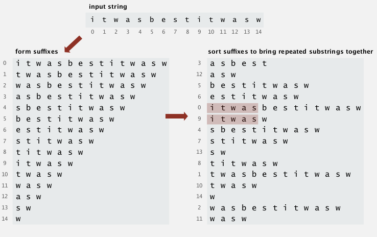  
  
### longest repeated substring  
  
* brute force algorithm  
  
try all i, j as starts of indices, then compute longest common prefix (LCP)  
→ O(D*N2) where D is length of longest repeated substring.   
  
* ⇒ use suffix array   
  
sorting suffix array will bring repeated substrings together  
java code:   
  
	//int lcp(String s1, String s2) defined  
	public static lrs(String s){  
		int N = s.length;  
		String[] suffix = new String[N];  
		for(int i=0;i<N;i++) suffix[i] = s.substring(i);//construct suffix array  
		Arrays.sort(suffix);// sort suffix array ==> using 3-way radix sort   
		// one pass to get longest repeated substring (bigest lcp)  
		String lrs = "";  
		for(int i=0;i<N-1;i++){  
			int lcp = lcp(suffix[i], suffix[i+1]);  
			if(lcp>lrs.length) lrs = suffix[i].substring(0, lcp);  
		}  
		return lrs;  
	}  
  
**lrs worst-case input**: *lrs very long* (say N/2).   
⇒ *quadratic* for lrs and for sorting.   
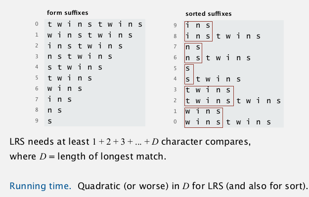  
  
→ *improvement of lrs for worst-case performance:*  
**Manber-Myers algo**  
sketch:   
  
* phase 0: sort suffix[] on 1st char   
* phase i: given suffix[] is sorted based on first 2^(i-1) chars → create suffix[] sorted on first 2^i chars.   
  
each phase: double the nb of chars sorted on.   
maintain an inverse[] array, to make comparisons constant time.   
performance: NlgN  
  
  
String sorting summery  
----------------------  
  
* can have linear sort: use chars as array index  
* sublinear sort: not all date need to be examined  
* 3-way radix qsort is *asymptotically optimal*  
  
