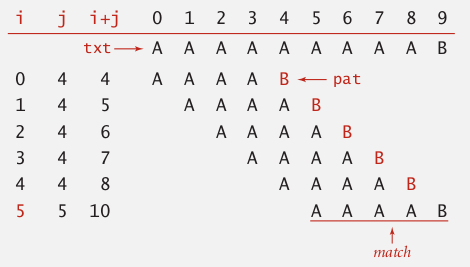
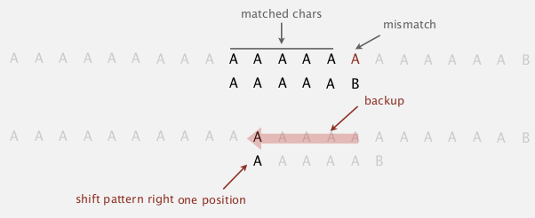
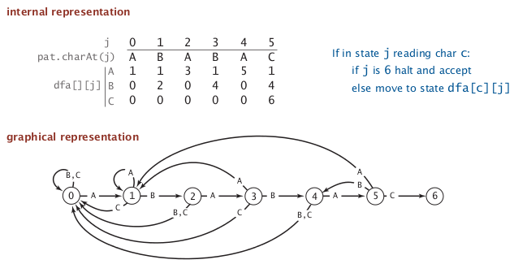
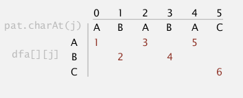
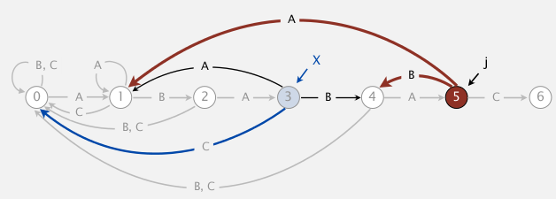
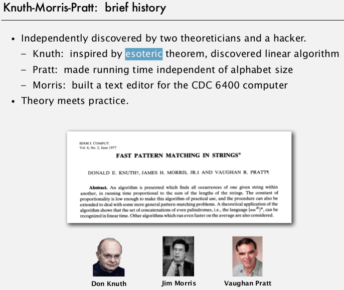
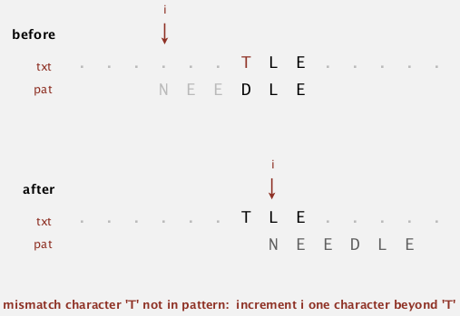
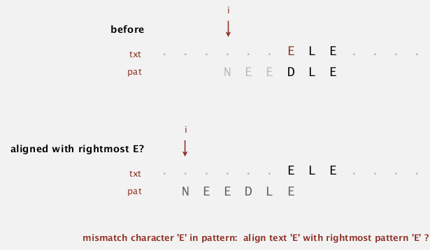
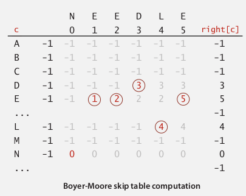
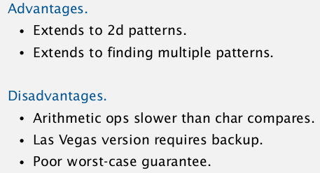

Title: [Algorithms II] Week 4-2 Substring Search  
Date: 2015-12-07    
Slug:  algoII_week4_2    
Tags: algorithm         
Series: Algorithms Princeton MOOC II 
 
[TOC] 
   
1. Introduction to substring search  
===================================  
"most ingenious algorithm we've seen so far"  
**pb. **having two strings, ``pattern`` and ``text``, len(pattern)=M << len(text)=N, try to find pattern in text.   
  
ex. ``indexOf`` method of String in java.   
  
2. Brute-Force Substring Search  
===============================  
function signature:   
``public static int search(String pat, String txt);``  
  
brute-force algo: look for ``pattern`` at every position of ``text``.   
  
	public static int search(String pat, String txt){  
		int N=txt.length(), M=pat.length();  
		for(int i=0; i<=N-M; i++){  
			int j;  
			for(j=0; j<M && pat.charAt(j)==txt.charAt(i+j); j++);  
			if(j==M) return i;  
		}  
		return N;// not found  
	}  
  
**worst case: **when txt/pat are repetitive → MN compares.   
  
problem with brute-force: always *backup* when mismatch.   
  
**brute-force alternative**  
  
* j := number of matched chars in pattern  
* i := index of the end of matched char in text  
  
⇒ do explicite backup when mismatch by ``i -= j``  
	  
	public static int search(String pat, String txt){  
		int N=txt.length(), M=pat.length(), i=0, j=0;  
		while(i<N && j<M){  
			if(pat.charAt(j)==txt.charAt(i))   
				{j=i++; j++;}  
			else   
				{i=i-j+1; j=0}// <==backup  
		}  
		return j==M ? i-M : N;  
	}  
  
challenge: want linear-time guarantee, and want to avoid backup.   
  
3. Knuth-Morris-Pratt  
=====================  
*"one of the coolest/trickiest algorithm covered in this course"*  
  
### intuition  
suppose pattern = "BAAAAA",   
if we matched 5 chars in pattern and get mismatch on 6th char ⇒ we know the previous 5 chars are "BAAAA"  → no need to backup the i pointer.   
  
KMP algorithm: clever method that *always* avoid backup !  
  
### Deterministic finite state automaton (DFA)  
  
* finite states ,including start and halt state, indexed by j in the subtring pb  
* for each state: exactly one transition for each char in alphabet  
  
ex.   
states are 0~6, pat="ABABAC", transitions are indexed by chars in alphabet = {A,B,C}, finish if we reach state-6.   
>``dfa[c][i]`` = the next state if we are currently in state-i and encoutered char-c.  
 
  

**interpretation of DFA for KMP algo**  
>in the DFA after reading ``txt[i]``, the index of state is the **number of matched chars** in pattern, or length of *longest prefix of pat that is a suffix of txt[0:i]. *  
  
  
* need to precompute the ``dfa[][]`` array from pattern  
* the pointer i *never* decrements (thus we can do it in a *streaming* manner)  
  
  
→ *if* ``dfa[][]`` *is precomputed*, java code is very very simple:  
  
	public static int search(String pat, String txt, int[][] dfa){  
		int N=txt.length(), M=pat.length(), i, j=0;  
		for(i=0; i<N && j<M; i++)  
			j = dfa[txt.charAt(i)][j];  
		return j==M ? i-M : N;  
	}  
  
running time: linear.  
→ key pb: *how to build dfa efficiently* ?  
  
### DFA construction  
  
* **match transition **(easy part)  
  
when at state j, for the char ``c0==pat.charAt(j+1)``, just go on matching: ``dfa[c0][j] = j+1``  
ex. (*pat="ABABAC"*)  
  
  
  
  
  
* **mismatch transition** (hard part)  
  
(for j==0, things are simple: ``dfa[c][0]=0`` for all ``c!=pat[0]``)  
  
>* *at state *``j`` (ie. j chars in pattern are matched)*, and for *``c!=pat.charAt(j+1)``  
* ⇒ we are in state j: we know *the ***last j chars in input*** are *``pat[0...j-1]``, *and followed by char =* ``c``, so the last j+1 chars of input string is: ``pat[0...j-1]+c``  
* ⇒ to compute dfa[c][j]: we can **simulate as if we backup***, ie. *``i=i-j+1, j=0``.   
* if we go back to set j=0, and set i = i-j+1, then i is pointing at ``pat[1]``, the text become ``pat[1...j-1]+c``. We then let this string go through our dfa, the state that it achieves is the value of ``dfa[c][j]``.   
  
*here is* *a concrete example:*   
pattern = ``"ABABAC"``, state ``j=5``, char ``c='B``'  
>* we know the last 6 chars of the input = ``pat[0...j-1]+c="ABABA"+"B"="ABABAB"``  
* if we backup, i will point to pat[1], the string is just ``pat[1...j-1]+c="BABAB"``  
* we use the string "BABAB" as input and go through the partially constructed dfa, and see that we will reach state 4  
* so we know ``dfa['B'][5]=4``  
  
  
similarly we can get ``dfa['A'][5]=1``, as indicated below:   
(*pat="ABABAC"*)  
  
  
one concern: seems this simulation needs ``j`` steps ?  
⇒ can be changed to be constant time if we maintain a **state X := the state of simulating of input=pat[1...j-1]**  
we maintain this state ``X``, then for each *mismatched* char c, we just need to look at ``dfa[c][X]``.   
(*pat="ABABAC"*)  
  
  
  
**[Algo]**  
>* set all matched transitions ``dfa[c0][j] = j+1`` for all ``c0==pat[j]``  
* fill first column (j==0): ``dfa[c][0]=0`` for all ``c!=pat[0]``  
* initialize ``X=0`` (state for empty input string)  
* for j=1 to M:  
	* for all ``c!=pat[0]``: set ``dfa[c][j] = dfa[c][X]`` (DP here...)  
	* update ``X=dfa[c0][X]`` ⇒ 注意, 此时X并**不等于**X+1(最开始``dfa[c0][j]=j+1``不适用于此), 为什么? 因为``c0==pat[j]`` 而不``是pat[X]``!! 比如说最开始, j=1的时候X是等于0的!!! (这个弯我饶了好几分钟...)  
  
  
java code (can be written to be more compate):   
  
	public int[][] constructDFA(String pat){  
		int R=256;//ASCII code	  
		int M=pat.length();  
		int[][] dfa = new int[R][M];  
		// 1. fill matched transitions: dfa[pat.charAt(j)][j] = j+1   
		for(int j=0;j<M;j++)  
			dfa[pat.charAt(j)][j] = j+1;  
		// 2. fill 1st column --> can be ignored as java int default val=0  
		// 3. fill mismatched transitions	  
		int X = 0;  
		for(int j=1;j<M;j++){  
			for(int c=0;c<R;c++)  
				if(c!=pat.charAt(j))  
					dfa[c][j] = dfa[c][X];  
			X = dfa[pat.charAt(j)][X];  
		}  
		return dfa;  
	}  
  
running time and space: **O(M*R)**.  
  
**prop.**   
KMP algorithm runs in O(M+N) time, and constructs the dfa in O(M*R) time/space.   
  
这个KMP算法, 我曾经想过好几个小时, 然后最后写出了特别复杂的代码, 虽然可以用但是基本写了就忘掉了. 但是经过老爷子这么一讲, 感觉这次印象深刻了好多. 老爷子NB...  
  
八卦时间:   
  
  
4. Boyer-Moore  
==============  
Heuristic in practice.  
i does not necessarily go through all txt chars ⇒ i may *skip* some chars.   
  
### intuition  
  
* for matching: scan chars *from right to left* (j will decrease when checking)  
* when encoutered a mismatch: we can skip <= M chars (if the char is not in pattern)  
  
ex. (pat="NEEDLE")  
  
  
→ pb: how to skip?   
  
### mismatch character heuristic  
*note*: the ``i`` always points to the *beginning* of the substring (``txt[i,...,i+M-1]``) to be checked for match.  
  
**case 1. mismatched char not in pattern**  
easy case → just move i to the right of this char.   
  
  
**case 2. mismatched char in pattern**  
>**heuristic:** line up i with the **rightmost*** char in pattern*.  
``i += skip``  
where *skip length = j - index of rightmost char in pattern*  

  
  
note: this does not always help, in the example below, i even *backups*:   
  
to avoid backup, in this case we just *increment i by 1* (heuristic doesn't help in this case).  
  
### implementation  
use an array ``right[]`` as *skip table*, ``right[c]`` is the index of rightmost occurrence of char c (-1 if c not in pat).   
  
  
	int[] right = new int[M];  
	for(int i=0;i<R;i++) right[i] = -1;//value for chars not in pattern  
	for(int j=0;j<M;j++){  
		right[pat.charAt(j)]=j;  
	}  
  
using this table we can implemente the heuristic algorithm:   
  
	public static int search(String pat, String txt, int[] right){  
		int N=txt.length(), M=pat.length();  
		int skip;  
		for(int i=0;i<N-M;i+=skip){  
			skip = 0;  
			for(int j=M-1;j>=0;j++)  
				if(pat.charAt(j)!=txt.charAt(i+j)){// when mismatch happens  
					skip = Math.max(1,j - right[txt.charAt(i+j)]);// skip if we can, else just increment i by 1  
					break;  
				}  
			if(skip==0)// if the above for loop finishes without changing skip --> we are done.    
				return i;  
		}  
		return N;// pattern not found  
	}  
  
  
### analysis  
**property**. the Boyer-Moore heuristic (in practice) takes about **N/M** (sublinear!) compares to search.   
  
好神奇, 比KMP还要简单的算法, 实际效率这么高...  
  
worst-case performance: **N*M**... 这一点不如KMP.   
  
→ can be improved...   
  
5. Rabin-Karp  
=============  
两个图灵奖的大神发明的算法..   
  
### intuition  
basic idea: **modular hashing**  
ex. for strings of numbers   
  
* compute hash fcn (for number strings is easy: take the string and treat it as a number, then %Q where Q is a big prime number).   
* for a pointer i →corresponds to the substring ``txt[i, ..., i+M-1]``  → check hash for match  
  
(below: text=3141592653589793, pattern=26535)  
  
  
### computing the hash function efficiently  
let ti be the ith char in txt, the hashcode for substring ``txt[i,...,i+M-1]`` is:   
  
⇒ just an M-digit base-R integer modulo Q ! ``poly(M, R) % Q``*. *  
  
  
* **Honor's method**  
  
linear time algorithm for evaluating polynomial.   
recursive equation: ``poly(i, R) = poly(i-1, R)*R+ti``  
  
ex. (R=10, M=5)  
  
  
	private long hash(String key, int M){  
		long h=0;  
		for(int i=0;i<M;i++)  
			h = ( h*R + key.charAt(i) ) % Q  
		return h;  
	}  
  
  
  
* if we know x_i, the x_i+1 can be infered:   
  
  
⇒ x_i+1 can be computed in constant time:   
  
⇒ we precompute R^(M-1) and maintain the hash number, and check for match !   
  
	public static int search(String txt, String pat){  
		int N=txt.length(), M=pat.length();  
		long pathash = hash(pat, M);	  
		int RM = R^(M-1);// <-- pseudo code, store value of R^(M-1)  
		long txthash = hash(txt, M);// txthash will be maintained  
		for(int i=0;i<N-M;i++){  
			if(txthash==pathash && checkMatch(i,txt,pat))   
				return i;  
			txthash = ( (txthash - txt.charAt(i)*RM)*R + txt.charAt(i+M) ) % Q;  
		}  
	}  
  
  
更新txthash的地方可能会有modulo造成的问题... 不过先这样写吧..   
  
for collisions: *Monte Carlo* vs. *Las Vegas*  
  
### analysis  
**Theory**: if Q is sufficiently large (~M*N^2), the probability of collision is ~1/N.   
**Practice**: choose Q to be sufficiently large, and collision probability is ~1/Q.   
  
  
  
Summery  
=======  
  
