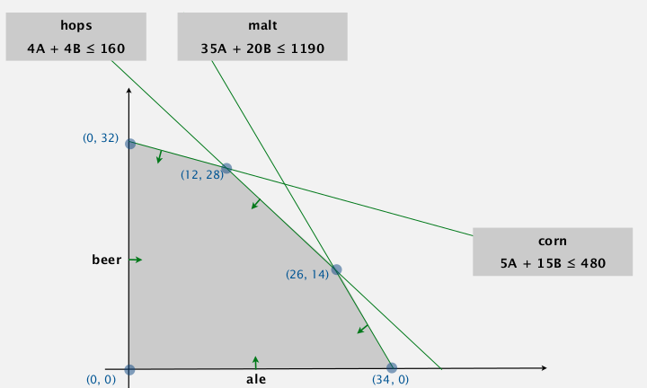

Title: [Algorithms II] Week 6-2 Linear Programming     
Date: 2016-02-21 17:00     
Slug:  algoII_week6_2_LP    
Tags: algorithm         
   
   
simplex algo: top 10 algo of the 20th century (ever?).   
   
what is linear programming:    
*a general problem-solving model* that works for:    
shortest-path, maxflow, MST, matching, assignment, ...   
   
   
   
   
1. Brewer-'s Problem   
====================   
toy example: choose products to maximize profit.    
...   
*feasible region*: a convex polygon.    
   
   
⇒ optimum solution appears at an extreme point.    
   
standard form of LP   
   
* n non-neg variables (j=1..n)   
* m linear euqations (i=1..m)   
* input: a_ij, c_j, b_i   
* output: x_j   
   
   
to convert *inequality* to *equality (as in the standard form above)*: add slack var!    
   
   
>def. convex set   
for any a and b in set ⇒ 1/2(a+b) is also in set.    
  
extreme point:    
>def. **extreme point**   
is a point in set that cannot be written as 1/2(a+b) with a b distinct.    
   
extreme point property:    
if there exists an potimal solution, then there exists one that is an extreme point.    
   
* nb of extreme point is finite   
* but this nb can be exponential   
   
   
greedy property:    
*extreme point is optimal iff no better adj extreme points.*    
   
   
   
2. Simplex Algorithm   
====================   
   
   
algo. simplex   
>* start at some point   
* **pivot** from one extreme point to an adj one (never decrease the obj fcn)   
* repeat until optimal   
   
We're using the "basis" and "pivoting" to solve LP. 

>def. **basis** (基变量) is a subset (size=m) of the n variables.    
   
vars in basis are always non-zero...   
   
basic feasible solution:   
   
* set n-m non-basis vars to 0   
* solve for remaining m vars (with m constraints)   
* if unique and feasible (matrix invertable)   
   
   
algo:   
   
* initial basic-feasible-solution: start slack vars as basis.    
* choose a non-basic var as **pivot**, add it into basis, take some basis var out   
   
   
ex. pick B as pivot var using constraint 2 (2nd equation):   
   
   
   
* why picking var B? → its obj coeff is positive   
* why pivot on 2nd constraint (5A+15B+Sc=480)? →    
	* RHS > 0 (preserves feasibility)   
	* minimum ratio rule: min(480/15, 160/4, 1190/20)   
   
   
stop when no obj-coeff is positive   
   
3. Simplex Implementations   
==========================   
encode standard LP formulation into java 2d array:    
   
   
	public class Simplex{   
		private double[][] a;   
		private int m,n;   
		public Simplex(double[][] A, double[] b, double[] c){   
			m = b.length;   
			n = c.length;   
			a = new double[m+1][n+m+1];   
			for(int i=0; i<m; i++)   
				for(int j=0; j<n; j++)   
					a[i][j] = A[i][j];   
		for(int j=n; j<m+n; j++) a[j-n][j] = 1;      
        for(int j=0; j<m; j++) a[j][n+m] = b[j];    
        for(int j=0; j<n; j++) a[m][j] = c[j];    
		}   
	}   
   
simplex algo: just transform initial 2d array into final solution.    
   
### choosing pivot variable (find entering column)   
**Bland's rule.** find the first column whose obj-coeff is positive.    
   
	private int bland(){   
		for(int q=0; q<m+n; q++)   
			if(a[m][q]>0) return q;   
		return -1;   
	}   
   
   
### choosing pivot constraint (find entering row)   
minimum ratio rule (if a tie, choose first row).    
   
    private int minRatioRule(int q){   
        int p = -1;   
        for(int i=0; i<m; i++){   
            if (a[i][q]<=0) continue;   
            else if (p==-1) p=i;   
            else if (a[i][m+n]/a[i][q] < a[p][m+n]/a[p][q])    
                p=i;   
        }   
        return p;   
    }   
   
   
### do the pivot (column q, row p)   
   
like Guassian elimination:    
   
make var q disappear on each row (except for row p);   
on row p: make var q's coeff become 1.   
   
   
    public void pivot(int p, int q){   
        for(int i=0; i<m; i++)   
            for(int j=0; j<m+n; j++)   
                if (i!=p && j!=q)   
                    a[i][j] -= a[p][j]*a[i][q]/a[p][q];   
        for(int i=0; i<m; i++)    
            if(i!=p) a[i][q] = 0;   
            for(int j=0; j<m+n; j++)   
            if(j!=q) a[p][j] /= a[p][q];   
        a[p][q] = 1;   
    }   

   
so the simplex algo is:    
   
    public void solve(){   
        while(true){   
            int q = bland();    
            if(q==-1) break; // optimal if -1   
            int p = minRatioRule(q);   
            if(p==-1) break; // unbounded if -1   
            pivot(p,q);   
        }   
    }   
   
final solution is just in the array:   
   
   
   
**remarkable property**   
*in typical applications*, simplex terminates after at most 2(m+n) pivots. — whereas nb of extreme points is exp in n !!   
ie. LINEAR time in practice!!   
   
other pivot rules:    
   
   
### degeneracy   
when choosing new basis, still stay in the same extreme point...    
   
→ might cause cycling   
→ bland's rule guarantees finite number of pivots   
   
further improvement:    
   
   
Best practice. *Don't implement it yourself......*   
   
   
(AMPL是个好东西...)   
   
算法的力量:    
   
   
   
   
4. Linear Programming Reductions   
================================   
   
### reduction to std form (equalities)   
   
* Minimization problem: max -1*obj   
* ineq constraints: add slack var   
* unbounded var X: replace with X=X0-X1, X0>=0, X1>=0   
   
   
### modeling of LP   
   
* identify variables   
* define constraints   
* define objective fcn   
* convert to std form   
   
   
### maxflow by LP   
   
* variables: x_uv = flow on edge uv   
* constraints: capacity, flow conservation   
* obj: net flow to t   
   
   
   
   
can use LP to solve mincost maxflow easily...   
   
### max cardinality bipartite matching by LP   
input: bipartite graph   
goal: max cardinatlity matching (set of vertex-disjoint edges)   
   
can be reduced to maxflow (见algolab...)   
   
   
* var: x_ij = indicator of person i assigned to job j (0<=x_ij<=1)   
* constraints: vertex-disjoint   
* obj: sum of all x_ij   
   
   
   
   
non-trival: cause this is an INTEGER LP...    
   
Th (Von Neumann) (and Poincare?..)    
if all RHS=1 ⇒ *all extreme points of the polyhedron have integer coord*.   
    
   
### and many others...   
   
   
   
**the profound question: Is there a universal problem-solving model ?**   
→ P/NP...   
   
   
>**"For the time being, the closest thing that we have to universal problem-solving model is LP "**   
   
   
   
