Title: [Algorithms II] Week 6-3 Intractability        
Date: 2016-02-23         
Slug:  algoII_week6_3_intractability     
Tags: algorithm            
Series: Algorithms Princeton MOOC II 
 
 
# 1. Introduction to Intractability   
     
   
recall model of computation: DFA   
a *univeral* model of computation: turing machine    
→ no more powerful model of computation.    
Turing machine can compute any function that can be computed by a physically harnessable process of the natural world.    
   
bottom line: turing machine is a simple and universal model of computation.    
   
   
Q. which algos are *useful in practice*?   
   
useful in practice = polynomial time for all inputs   
   
def. a pb is **intractable** if it cannot be solved in polynomial time.    
   
2 pbs that *can be proved* to require exp time:    
   
1. Given a constant-size programme, does it halt in <=K steps ?   
2. Given a N*N chess board position, can the first player force a win ?   
   
   
Bad news: very few pbs can be proved to require exp time...   
   
2. Search Problems   
==================   
**Four fundamental problems: **   
   
* **LSLOVE**   
   
Given a system of linear equations, find a solution   
var: real numbers   
→ guassian elimination   
   
* **LP**   
   
Given a system of linear inequaties, find a solution. (not necessarily find the opt)   
var: real numbers   
   
* **ILP**   
   
Given a system of linear inequaties, find a **0-1** solution.    
var: 0 or 1   
   
* **SAT**   
   
Given a system of *boolean equations*, find a binary solution.    
   
Which ones of the 4 foundamental pbs have poly-time solutions?   
   
* LSLOVE: Gaussian elimination works in O(n3)   
* LP: Ellipsoid works in poly-time (simplex also poly-time *in practice*..)   
* ILP, SAT: No poly-time algorithm known (or believed to exist) !   
   
   
All 4 pbs are examples of search problems.    
   
**Search pb**: given an instance ``I``, find a solution ``S`` / report there's no solution.    
*requirement*: able to efficiently (poly-time) *check* that ``S`` is a solution. (that's the case for the above 4 fundamental pbs)   
   
another example:    
**FACTOR**: given a n-bit integer, find a nontrival factor.    
(given a solution, simply need to long-divide to check...)   
   
   
   
3. P vs. NP     
========
   
   
def. **NP** is the class of all search pbs. (ie. solution be checked efficiently)    
NB: classical definition limits to yes-no pbs...   
Significance: NP pbs are what scientists and engineers *aspire to compute feasibly*.   
examples:    
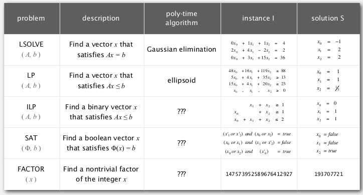   
   
   
def. **P** is the class of search pbs that *are solvable* in poly-time.    
   
(What scientists and engineers *do compute feasibly*.)   
   
examples:   
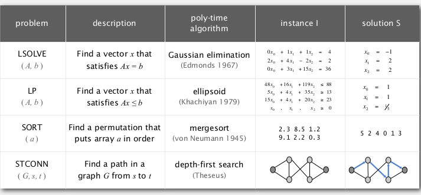   
   
**Nondeterminism**   
Nondeterminism machine can *guess* the solution (donot exist in natural world..). → NFA tries to simulate such a machine...   
Ex. ``int[] a = new int[N];``   
・ Java: initializes entries to 0 .   
・ Nondeterministic machine: *initializes entries to the solution!*   
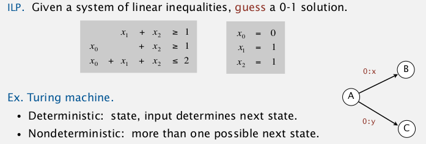   
   
NP: *Search problems solvable in poly time on a nondeterministic Turing machine*.    
   
Extended Church-Turing thesis:   
P: Search pbs solvable in poly time *in natural world*.    
   
do we have non-determinism in natural world? ---> natural computers ?    
ex. STEINER tree: set of segments connecting given N points.    
use soap → doesn't really work...   
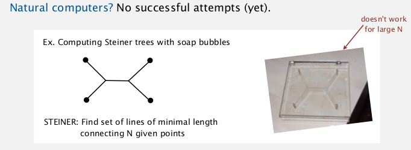   
   
   
another example for P/NP: automating creativity   
*being creative VS appreciating creativity*   
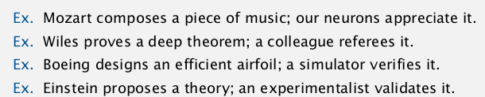   
   
The central question: does P=NP?    
(can you alway avoid brute-force searching and do better?)   
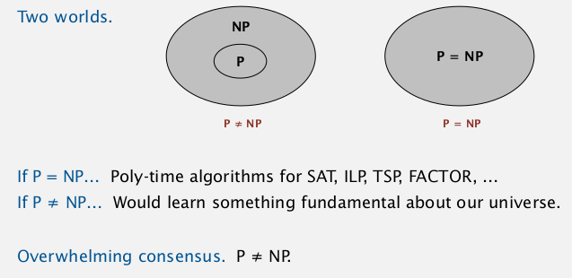   
Millennium prize by Clay instute.   
(among all ways of earning 1M dollars, this might be the most complicated way... @_@...)   
   
   
   
4. Classifying Problems  
=================   
   
classify pbs like classifying elements into perodic table.    
   
key pb: satisfiablity   
SAT. given a sys of boolean eq, find a solution.    
   
exhaustive search: try 2^n possible solutions.    
conjecture: no poly-time algo for SAT (ie. intractable)   
   
**Assumption**: assume the intractability for SAT.   
Tool: reduction   
def. pb X reduces to pb Y: we can solve pb X with the algo for pb Y.    
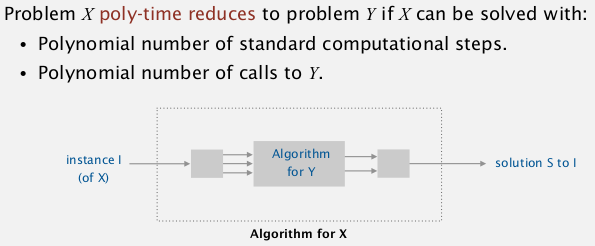   
   
> if SAT poly-reduces to pb Y ⇒ pb Y in (probably) intractable.   
   
### SAT poly-reduces to ILP   
   
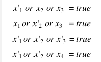   
(all SAT pb can be reduced to 3SAT)   
   
⇒ can be converted to an ILP pb:    
for each eq, introduce a var Ci:   
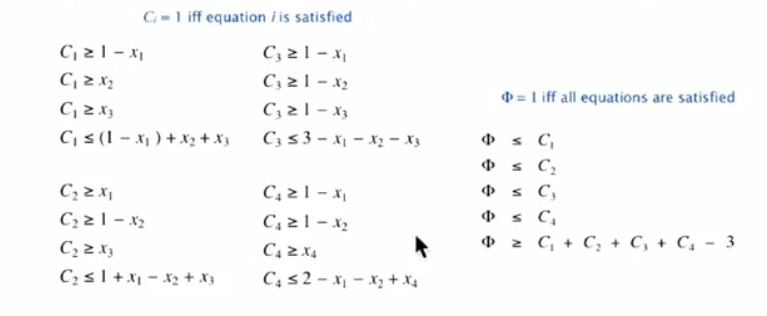   
   
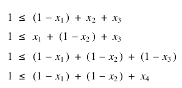   
   
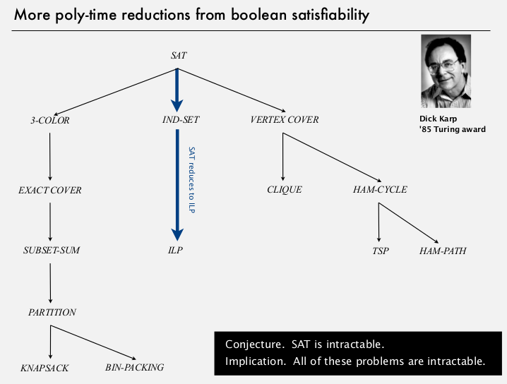   
   
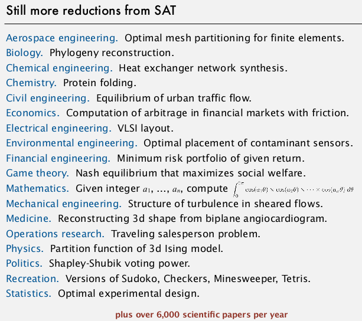   
   
5. NP-Completeness   
==================   
   
>def. an NP pb is **NP-complete** if all pbs in NP poly-reduces to it.    
   
prop. *SAT id NP-complete.*   
any pb in NP poly-reduces to SAT (reverse direction as last lecture)   
pf sketch: convert non-dertiministic turing machine notation to SAT notation...   
   
cor. poly time algo for SAT iff P=NP...   
   
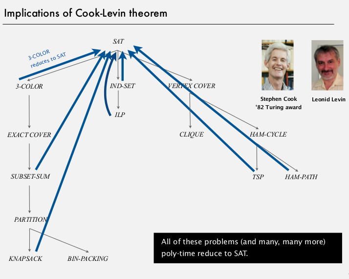   
   
⇒ there pbs are equivalent !    
   
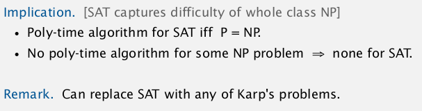   
   
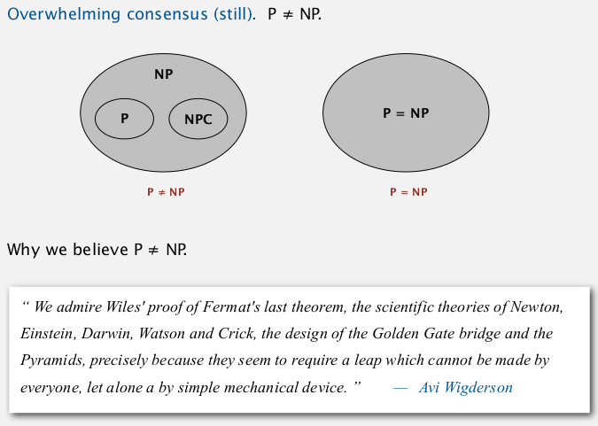   
summary:    
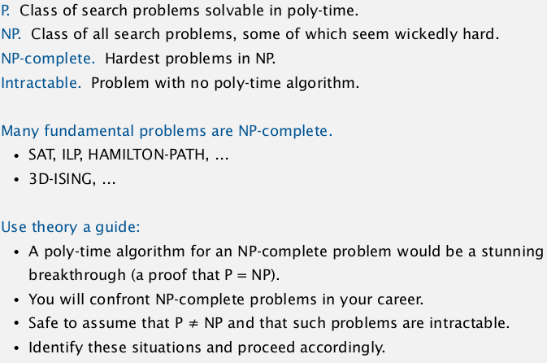   
   
==...   
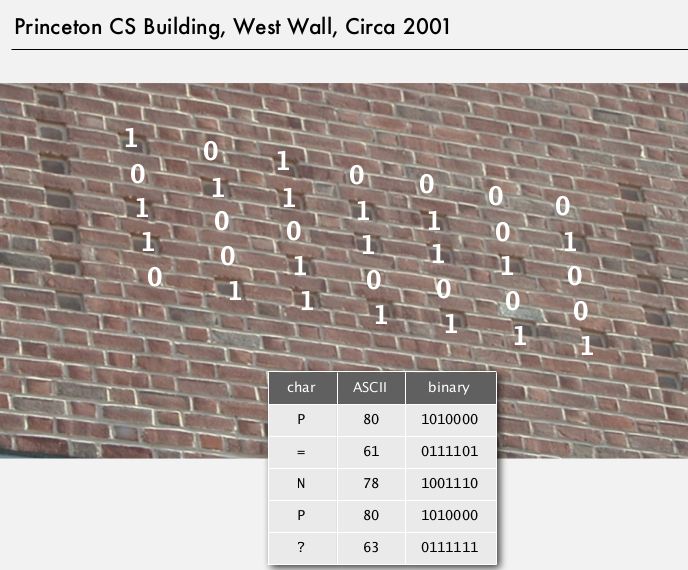   
   
6. Coping with Intractability   
=============================   
   
### exploit intractability   
cryptography ecopoits the hardness of FACTOR pb   
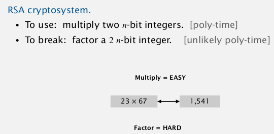   
   
Can factor an n-bit integer in n 3 steps on a "*quantum computer*.”   
   
### Coping with intractability   
relax one of desired features...   
   
* special cases   
   
   
   
* Develop a heuristic, and hope it produces a good solution.   
   
no guarantee   
ex. TSP   
   
   
* Approximation algorithm. Find solution of provably good quality.   
   
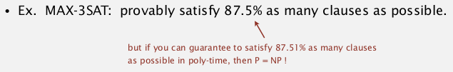   
   
### Halmiton path   
remark: Euler path (each edge once) easy, Halmiton path (each vertex once) NPC...   
dfs solution for Halmiton path:   
   
	public class Halmiton{   
		private boolean[] marked;   
		private int count=0; // nb of Halmiton paths   
		public Halmiton(Graph G){   
			marked = new boolean[G.V()];   
			for (int v=0; v<G.V(); v++)   
				dfs(G,1,1);	   
		}   
		private void dfs(Graph G, int v, int depth){   
			if(depth==G.V()) count++;   
			marked[v]=true;   
			for(int w: G.adj(v))    
				if(marked[w]==false) dfs(G, w, depth+1);   
			marked[v]=flase; // backtrack   
		}   
	}   
   
   
   
