Title: [Algorithms I] Week 1-1 Union-Find
Date: 2015-06-27
Slug:  algoI_week1_1
Tags: algorithm
Series: Algorithms Princeton MOOC I 
 

1. Dynamic Connectivity pb
==========================

### pb statement
a set of N obj, *indexed by 0,1,...,N-1*
⇒ 
* UNION: connect objects ``void union(int p, int q)``
* FIND: is there a path connecting 2 obj?  ``boolean connected(int p, int q)``

ex:   
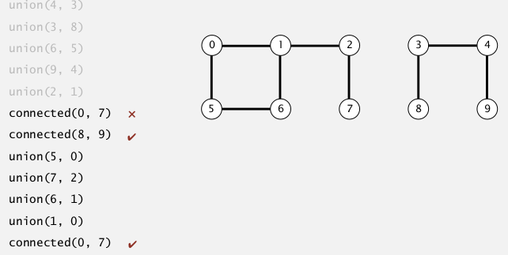

**connect components**(联通分支): max set of obj that are mutually connected. 

### UF API

* union(p,q): connect 2 obj
* connected(p,q): test if p and q are connected 
* **find(p)**: find the *component id* of p
* count(): nb of components

注意:
命名不是很好, 这里的``find()``函数不对应FIND query, ``connected()``函数才是真正的FIND query, find()函数是为了connected()函数而做的一个辅助函数(find(p): return the root of the node p )
在connected里就可以调用find: ``return find(p)==find(q)``

应该是interface更好一些... 

	public interface UF{
	void union(int p, int q);
	boolean connected(int p, int q);
	//int find(int p);
	//int count();
	}

测试client:   
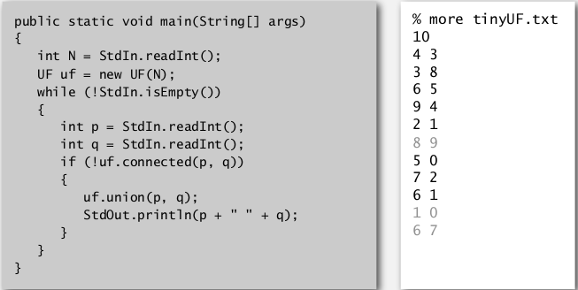

2. Quick Find
=============
*"eager approach"*

### data structure
⇒ an int array ``id[]``
initialized to *id[p]=p for all p*
interpretation: *id[p] = ***component id of obj p***
⇒ p and q are connected *iff* id[p]==id[q] (ie. find very fast)
没有用find()函数    
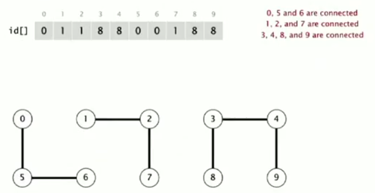  

### UF operations

* FIND:

``connected(p,q): `` very fast, just check id[p] and id[q]

* UNION:

when merging 2 components :
``union(p,q)``: ``id[p]=id[q]``(总是让第一个参数p的id变为第二个参数q的id),   
⇒ then have to modify *all entries* with id equal to ``id[p]`` !  
⇒ too many entries to change  

### implementation
*(class  QuickFindUF implements UF)*  
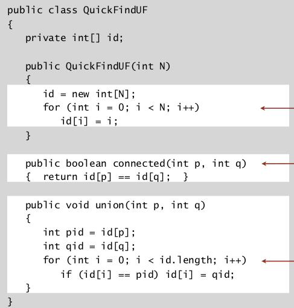

complexity: 

* FIND: cte
* UNION: lin...

if N obj + N unions ⇒ *quad time !*  
btw, 程序运行速度: **~10^9/s**

3. Quick Union
==============
*"lazy approach"*

### data structure
⇒ also an int array ``id[]``
considering a set of *trees, *此时每个联通分支都是一个tree  
interpretation: *id[p] = ***parent index of obj p **(觉得这个数组叫做father更好....)  
⇒ p is a root node *iff* id[p]==p
  

### UF operations

* FIND:

``connected(p,q): ``check if *root of p == root of q*

* UNION: 

``union(p,q): ``just set p's root to be *child* of q's root (把第一个参数p的那棵树放入第二个参数q的树的根节点作为子树)  

* root():

前两个的操作都需要一个函数查找一个节点的root,  需要写一个函数实现, 也很简单, 一路找parent即可:   

	private int root(int p){
        while (p!=id[p]) p=id[p];
        return p;
	}

### implementation   
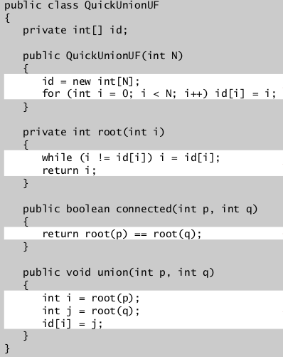

### complexity
in the worst case (all elements is in a list form), root() is ~N, so:

* FIND: lin
* UNION: lin

quick find和quick union的问题:   
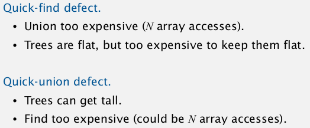

4. Quick Union Improvements
===========================

improvement1: weighting
-----------------------
*keep track of tree size* ⇒ balance by taking the small tree be a child of the large tree    
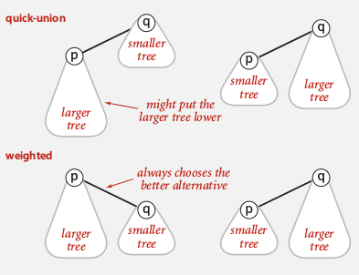

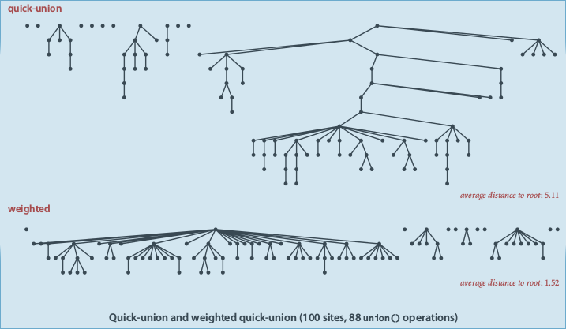

⇒ add an extra array: ``sz[]`` sz[i] is the size of the tree with root i

### implementation   
(数组``int  sz[]`` 初始全部为1)

* 依然需要``root()``函数.

	private int root(int p){
		while(p!=id[p]) p=id[p];
		return p;
	}

* FIND 

	public boolean connected(int p, int q){
		return root(p)==root(q);
	}

* UNION

	public void  union(int p, int q){
		int rp = root(p), rq=root(q);
		if(rp==rq) return; // 
		if (sz[rp]<sz[rq]){
			id[rp]=rq;
			sz[rq]+=sz[rp];
		}
		else{...}
	}

### complexity
FIND: proportional to *depth of p and* q in their tree
UNION: const if p and q are root

* **proposition**

the max depth of weightedQuickUnion is **lgN**
	
[pf] considering a node ``x``, in tree ``T1``, ``dep(x)`` is x's depth in its tree.    
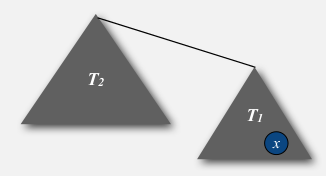   
→ 	``dep(x)`` will increase by 1, iff ``T1`` is merged into another tree ``T2`` (and by the algo, shoud have |T1|<=|T2| )  
→ 	x's tree's size become |T1|+|T2| >= 2*|T1| 
⇒ 	everytime dep(x) increased by 1, x's tree's size will *at least double*  
at first dep(x)=1, if dep(x) increases lgN times, the size of the tree will be >=  N   
CQFD.

so the ``root()`` function takes only lgN time. 
**conclusion**: both UNION and FIND will be in **lgN **time. 

improvement 2: path compression
-------------------------------

* imporve the root() function: 

when looking for root of a node ⇒ link *all nodes in the path *up to the root.   
⇒ just a constant extra time compared to old implementation. 

* 2 pass implementation: 

	private int root(int p){
		int r = p;
		while(r!=id[r]) r=id[r];
		while(p!=r){
			int t = p;
			p=id[p];
			id[t]=r;
		}
		return r;
	}

flatens the tree greatly. 

* single pass implementation: 

 just make all other node *point to its grandparent* (halving the path length)
⇒ not as flatening as before, but in practice will almost be the same. 
just one extra line of code: 
	private int root(int p){
		while(p!=id[p]){ 
			id[p] = id[ id[p] ];
			p=id[p];	
		}
		return p;
	}

### complexity
(for weighet quick union with path compression — *WQUPC*)  
very very small:   

**lg*()** function: "*iterated log function*", lg*(N) = the number of time to take log to get to 1
lg*()几乎可以看成常数了:    
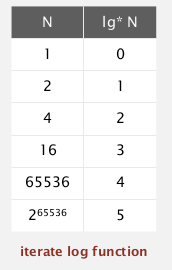   
ex. *lg*(65536) = 4* (x^16=65536)  
because: lg(65536)=16 ; lg(16) = 4; lg(4)=2; lg(2)=1.   
**⇒ N obj, M unions will take (almost) linear time**  

   
(有人证明了不存在*理论上*linear的算法. )

**conclusion**: both UNION and FIND will be in **constant time**.

summery
-------
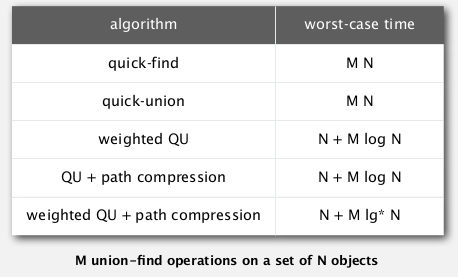   
上面这个表格好像quick union的部分有问题? 最坏情况下应该是N+MN吧??  
书上是这么写的:    

WQUCF reduce 30 years to 6 seconds. 

5. Union Find Application
===========================

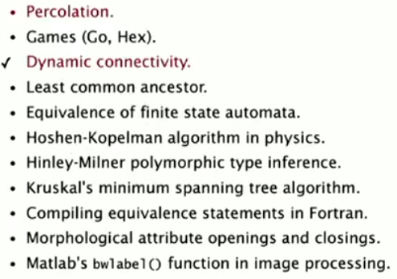

* percolation
* dynamic connectivity
* Kruskal MST algo
* Games (GO)
* .......

### percolation

* model: 

N*N grid of sites  
⇒ each site is open with proba=*p*  
⇒ sys **percolate** iff bottom and top are connected by open sites.    

* question: the *percolation probability* as a function of *p *(**phase transition**)

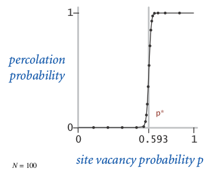   
nobody knows how to get the threshold mathematically  
⇒ run *simulations* to find out the phase transition *threshold*.   

* Monte Carlo simulation   

→ all sites initilized to be *closed*  
→ randomly open sites *one by one*   
→ when the sys percolates, the *vacancy percentage* is an estimate of *p*   
*(run above simulation for millions of times)   

### implementation

* N^2 sites, named 0 to N^2-1  

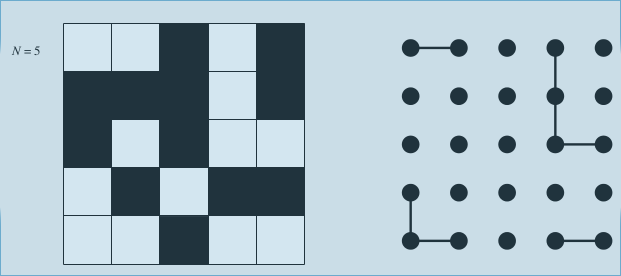  

* add 2 more vertual sites: one on top, one on bottom   

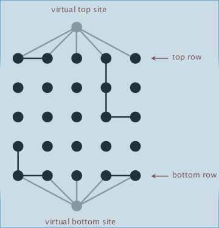  

* openning a site: union to adjcent open sites (at most 4 unions)

