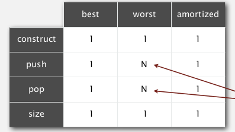
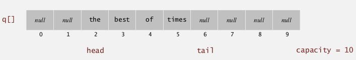
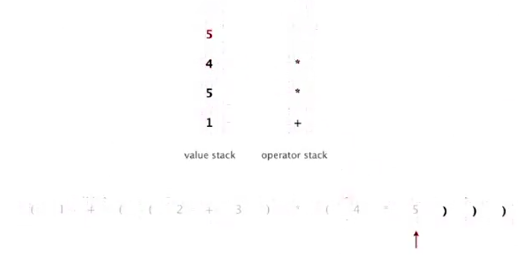

Title: [Algorithms I] Week 2-1 Stacks and Queues
Date: 2015-07-09
Slug:  algoI_week2_1
Tags: algorithm

fundamental data types: stacks and queues
operations: 
**insert, remove, test empy, iterate,**...    
  

module programming: seperate interface and implementation

1. Stacks
=========
ex. a stack of strings

* API: 

    public interface StackoOfStrings{
        void push(String item);
        String pop();
        boolean isEmpty();
        //int size();
    }

### implementation 1: using a linkedlist
insert/remove from the top of the linkedlist

* inner class

        class ListNode{
            String item;
            ListNode next;
        }

* implementation  

        public class LinkedStackOfStrings implements StackoOfStrings{
            class Node{
                String item;
                Node next;
                Node(String item, ListNode nxt){...}
            }
            private Node first;
            
            public LinkedStackOfStrings(){
                first = null;
            }
            public void push(String item){
                Node nd = new Node(item,first);
                first = nd;
            }
            public String pop(){
                String firstItem = first.item;
                first = first.next;
                return firstItem;
            }
            public boolean isEmpty(){
                return first==null;
            }
        }

* complexity: const time for every operation

### array implementation

* use array (of length N) to store items → defect: stack has limited capacity
* keep a pointer *top: ***pointing to the next empty space to push **(top 的定义很重要)

* problems of the array implementation: 
    1. underflow: pop from an empty stack  
    2. overflow: size larger than capacity ⇒ resizing  
    3. **loitering**: holding a ref to an obj which is no longer needed:
    ex. ``return s[top--]``
    java system will not know that s[top] is no longer needed ⇒ have to clear it explicitely
    ⇒   

        String item = s[top--]; 
        s[top]=null; 
        return item

* implementation (containg resizing array operations)  

        public class ArrayStackOfStrings implements StackOfStrings{
                private String[] s;
                private int top=0;
                public ArrayStackOfStrings(){// to be tuned
                    s = new String[1];//initial capacity=1
                }
                public boolean isEmpty(){
                    return top==0;
                }
                private vois resize(int capacity){//helper functoin
                    String[] s2 = new String[capacity];
                    for(int i=0;i<top;i++)
                        s2 = s[i];
                    s = s2;
                }
                public void push(String item){
                    if(top==s.length)//doubling size 
                        resize(s.lenth*2);
                    s[top++]=item;
                }
                public String pop(){
                    String item = s[--top];//NOT top--!
                    s[top]=null;
                    if(top>0 && top==s.length/4) //top>0 is necessary
                        resize(s.length/2);
                    return item;
                }
        }

2. Resizing Arrays
==================

resolving the overflow pb: grow and shrink the array
→ need to copy all items when changing array size
⇒ pb: *ensure that sizing happens infrequently*

### resizing strategy

* repeated doubling:

(initial capacity=1) when array is full, double the size

* *amortized* complexity for inserting N:

N+(2+4+8+...+N) ~3N

* shrinking array

⇒ shrink the array by half when array is **1/4 full**
not half full → *thrashing* will happen if push-pop-push-pop when array is full   
      

* **[invariant]**: array always 20%~100% full
* complexity:

*in an amortized sense*, will be constant   
    
**proposition**: from empty stack, M operations of push/pop taked time propotional to M

### comparison: resizable array vs linkedlist

* linkedlist implementation: 

operations takes const time even in worst time
extra time and space for dealing with linkes 

* resizing array implementation:

operation taked const *amortized* time
but in worst case takes linear time (ex. to be evited for critical systems)
less wasted space
	

3. Queues
---------

FIFO data structure
API

    public interface QueueOfStrings{
        void enqueue(String item);
        String dequeue();
        boolean isEmpty();
        //int size();
    }

### linked list implementation
maintain ``first`` and ``last`` node pointers: 
pointing to 2 points of queue (``first`` for dequeue, ``last`` for enqueue )   
     
→ *take care of corner cases*: 
- empty queue: first is null (and last is also null) 
- just one item in queue: first and last *point to the same node*
(总之first和last的定义很重要)

        public class LinkedQueueOfStrings implements QueueOfStrings{
            class Node{...	}
            private Node first,last;
            public LinkedQueueOfStrings(){
                first = null;
            }
            public void enqueue(String item){//same as push
                Node nd = new Node(item,null);
                if(isEmpty()){
                    last = nd;
                first = last;
                }
                else{
                    last.next = nd;
                    last = nd;
                }
            }
            public String dequeue(){//same as pop in stack
                String firstItem = first.item;
                first = first.next;
                if(isEmpty())
                    last=null;
                return firstItem;
            }
            public boolean isEmpty(){
                return first==null;
            }
        }

### resizing array implementation
maintain ``head`` and ``tail``: 
``head`` is the queue head, ``tail`` is the *next empty position* for the next element to enqueue
→ trick: head and tail should take *mod capacity + *resizing array   
   
不知道写的对不对: 

        public class ArrayQueueOfStrings implements QueueOfStrings{
            private String[] q;
            private head=0,tail=0;
            public LinkedQueueOfStrings(){
                q = new String[1];//init capacity
            }
            public boolean isEmpty(){
                return head==tail;
            }
            private void resize(newsz){
                q2 = new String[newsz];
                int i = head,j=0;
                while(i!=tail){
                    q2[j++] = q[i];
                    i=(i+1)%q.length;
                }
                q = q2;
                head=0;
                tail=j;
            }
            public void enqueue(String item){
                if( (tail+1)%q.length==head )
                    resize(q.length*2);
                q[tail] = item;
                tail = (tail+1)%q.length;
            }
            public String dequeue(){
                String firstItem = q[head];
                head = (head+1)%q.length;
                int sz = (tail-head)%q.length;
                if(sz>0 && sz==q.length/4)
                    resize(s.length/2);
                return firstItem;
            }
        }

4. Generics
===========

queues/stacks for other types of data ⇒ *generics 泛型*(java 1.5 才引进泛型机制...)
use *type paramater*→ avoid casting, and discover type mismatch errors *at compile time* 

        public interface Stack<Item>{
            public void push(Item item);
            public Item pop();
            public boolean isEmpty();
        }

### a pb with array implementation
**java不支持创立泛型数组**
generic array creation is not allowed. 不可以new 一个泛型数组!
``s = new Item[capacity];``会报错   
⇒ use an ugly *cast*:
``s = (Item[]) new Object[capacity];``
(will get warning: "unchecked cast" → java被黑了... )
	

### autoboxing for primitive types
each primitive type has a *wrapper class*
ex. int ↔ Integer
autoboxing: automatic cast between a primitive type and its wrapper class.   
   
(syntactic sugar 语法糖 i.e. 对语言功能没有影响只是方便使用)  
btw: <https://zh.wikipedia.org/wiki/%E8%AF%AD%E6%B3%95%E7%B3%96> (居然还有语法盐和语法糖精......)

5. Iterators
============

### Interface
support iteration over stacks and queues, *without revealing the internal representation* of stack/queue
⇒ implement the ``Iterable`` interface

* ``Iterable`` interface: can return an *Iterator *

        public interface Iterable{
            Iterator<Item> iterator();
        }

* Iterator interface: hasNext() and next() interface

        public interface Iterator<Item>{
            boolean hasNext();
            Item next();
            void remove();//optional, bad practice to use it
        }

* to make a data structure Interable → elegant client code   

   
**how-to:**

1. implement ``Iterable`` interface
2. write a *private inner class* XXIterator that implment the ``Iterator`` interface.

ex.   
   

### Bag data structure
Supports adding and iterating through without caring about the order.  
API: 

        public class<Item> Bag implements Iterable<Item>{
            public void add(Item);
            int size();	
        }

can be implemented by stack or queue(without pop/dequeue)

6. Applications
===============

### Java collections library
List interface: ``java.util.List``   
     
implementations: ``ArrayList``, ``LinkedList``. 

* pb with the java's implementation of stacks and queues:  

``Stack`` class also implements List interface (``get()``, ``remove()``, ``contains()`` are implemented);  
``Queue`` is an interface rather than a class...  
⇒ **poorly designed API  **

### Stacks applications

* function calls: 
  
    
recursion: can always use an explicit stack to remove recursion

* arithemic evaluation (Dijkstra)  

四种类型: 左括号, 右括号, 数字, 算子    
  
最后一行应该是value stack.    
   
	
⇒ 后缀表达式, 逆波兰式......
	
