Title: [Algorithms I] Week 2-2 Elementary Sorts
Date: 2015-08-18
Slug:  algoI_week2_2
Tags: algorithm

1. Introduction
===============
rearanging array of size N into ascending order   
test client code: ``Insertion.sort(a);``   

sort *any* datatype 

### callback
*callback = reference to executable code*   
i.e. passing functions as argument to sort() method  
sort() function calls object's ``compareTo()`` method    
   
→ implement the ``Comparable`` interface:    

        public class XX implements Comparable<XX>{
        ...
        }

the interface: 

        public interface Comparable<Item>{
            public int compareTo(Item that);
        }  
    
compareTo():  
return -1 (if this<that)/+1/0; 
needs a *total order.* 
→ in the sort() implementation:  
has not dependencies on type of data.  
 
        public static void sort(Comparable[] a){
            if(a[i].compareTo(a[j])>0)...
        }
    

### helper functions

* less

	private static boolean less(Comparable v, Comparable u){
	returnv.compareTo(u)<0;
	}

* exch

	private void exch(Comparable[] a, int i, int j) {
			Comparable swap = a[i];
			a[i] = a[j];
			a[j] = swap;
		}

* isSorted

test if sorted
if algo passes the test using only less ant swap, then it's correct. 

2. Selection Sort
=================

Idea: each time*: find the minimum from the remaining items.* 
**a[min] is the smallest element to right of a[i] ⇒ swap a[i] and a[min]** (elements to left of i are sorted)   
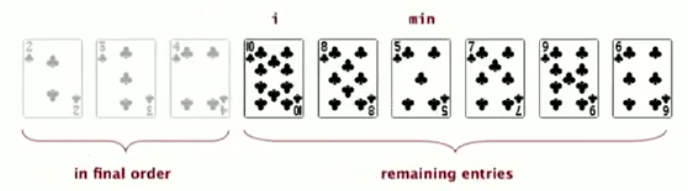    

invariants
----------

* entries to the left of i are in sorted order, and are fixed (*in final position*) ever since
* no entry to the right of i is smaller than any entry to the left of i

implementation
--------------

	public class SelectionSort extends AbstractSorting{
	//...
	public static void sort(Comparable[] a){
		for(int i = 0; i<a.length; i++){
			int min = i;
			for(int j = i+1; j<a.length; j++)
				if(less(a[j],a[min])) 
					min = j;
			exch(a,min,i);
		}
	}
	}

analysis
--------
**proposition:**
selection sort uses *N-1 + N-2 + ... + 1 = ~N^2/2* compares, and *N* exchanges. 
→ quadratic time

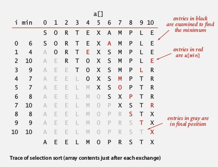

* **insensitive** to input: quadratic time *even if input is already sorted.* 
* data movement is *minimum*: linear time of exchanges (every exchange puts an item to its final position)

3. Insertion sort
=================

quite different performance characteritics than selection sort. 

Idea: **In iteration i: move all entries larger than a[i] to its left.**    
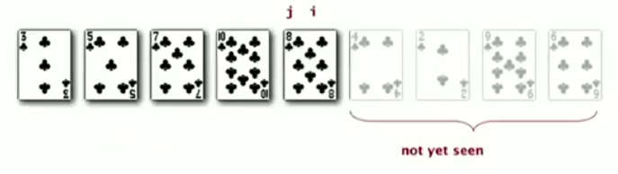   

invariants
----------

* entries to the left of i are in ascending order (but *not* in final position)
* entries to the right of i are not yet been seen   

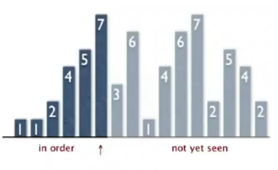   

implementation
--------------

	publc class InsertionSorting extends AbstractSorting{
		public static void sort(Comparable[] a){
			for(int i=1; i<a.length; i++)
				for(int j=i; j>0; j--){
					if(less(a[j],a[j-1]))
						exch(a,j,j-1);
					else break;
				}
		}
		//...
	}

analysis
--------
**proposition **(average case):   
(the performance *on average* — *for randomly sorted array* )   
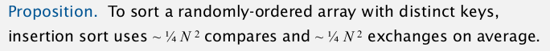   
*proof:*
*expect each entry to move halfway back*   
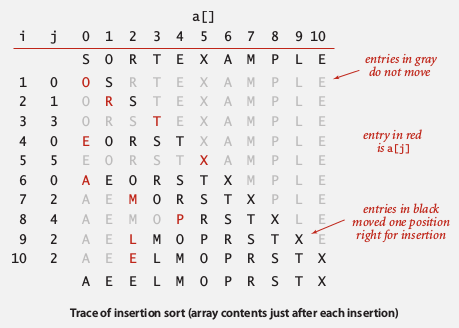   

### best case and worst case
**best case**
if array already sorted min ascending order: 
*N-1 compares, 0 exchanges.* 

**worst case**
if array sorted in descending order: 
every element goes all the way back → 1/2*N^2 compares,  1/2*N^2 exchanges

### partially  sorted arrays
def.**" inversion"**
an inversion is a pair of entries that are out of order. 

def. **"partially sorted"**  
An array is called partially sorted if the *number of inversions is <= c*N. *

**proposition. **  
**Insertion sort runs in linear time for partially sorted array.** 
*proof.* 
*number of exchanges = number of inversions. *
*number of compares = number of exchanges + N-1*

4. Shell Sort
=============
First non-trival sorting methode: an improvement of insertion sort. 

def. **"h-sorted array"**  
an array is h-sorted if every h-interleaved subarray is sorted. (h=1: just a sorted array)    
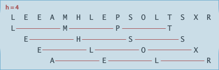     

Idea: move entries >1 position at a time by *h-sorting* the array, then decrease h.   

use decreasing sequences of value h:    
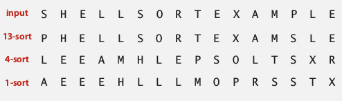     

implementation
--------------

**How to h -sort  **  
simply insertion sort with *stride length=h*.  
why insertion sort:   
for big h: small subarray   
for small h: nearly in order   

**proposition**  
A g-sorted array *remains g-sorted* after h-sorting it.    
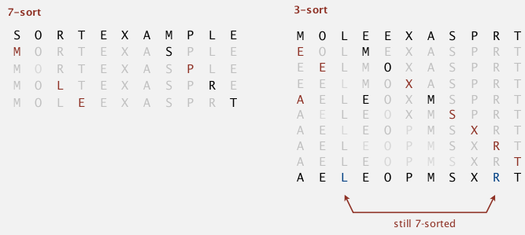    
(subtle to prove...)  

**which sequence of h to use**
``3x+1`` sequence proposed by Knuth. *1,4,13,40....*

	public class ShellSort extends AbstractSort{
		public static void sort(Comparable[] a){
			int h = 1, N=a.length;
			while(h<N/3) h = h*3+1;//find the beginning h (N>h>N/3)
			while(h>=1){//performs h-sort
				for(int i= h;i<N;i+=h)
					for(int j = i;j-h>=0;j-=h)
						if( less(a[j],a[j-h]) )
							exch(a,j,j-h)
						else break;
				h = h/3;
			}
		}
		//...
		private static boolean isHsorted(Comparable[] a, int h) {
			for (int i = h; i < a.length; i++)
				if (less(a[i], a[i-h])) return false;
			return true;
		}
	}

每次hsort, 外围的循环是``for(int i= h;i<N;i+=h)``, 需要理解一下: i移动一次以后, 进行的是另一个subarray 的插入排序, 当移动到N-1的时候所有subarray的插入排序才结束. (也就是说不是先完成一个subarray的插入排序再完成另一个, 这些是插入排序是同步进行的)

analysis
--------
**proposition (for worst case   )**  
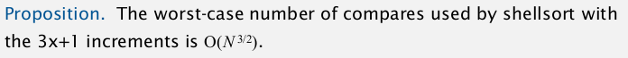     
→ better than quadratic time !     

**property  (found in practice)**
# of compares < Cte * N * (# of *h* used )   
 → #compares < NlgN * Cte   
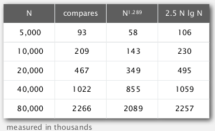   
*accurate model has not been discovered  *

(所以shellsort在实际使用中几乎和快速排序一样快! — 尽管没有数学证明来保证)

**why we are interested in shell sort**
useful in practice: 

* fast for medium sized arrays (beat even the classical sophistiated algorithms)  
* tiny code volumn (used in embeded systems)  

lead to interesting questions for 50 years: 

* asymptotic growth rate ?
* best sequence of h ?
* average case performance ?

5. shuffling
============

shuffle array using sort
------------------------
one way to shuffle an array: 

1. for each array entry, generate a random real number
2. sort the array of real numbers
3. ⇒ the original array is shuffled !

**proposition  **  
this shuffle sort produces a uniformly random permutation of input array   
*drawback:  cost for sorting...*

Goal: get uniformly random permutation in *linear time*.   

Knuth shuffle  
-------------
algo:  
>for i = [0,N):  
    - r = rand( [0~i**]** ) or rand( **[**i, N-1] )   
    - swap a[r] and a[i]   

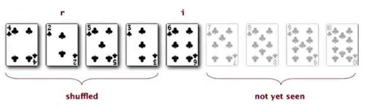

implementation: 

	public static void shuffle(Object[] a){
		for(int i=0;i<a.length;i++){
			int r = StdRandom.uniform(i+1);
			exch(a,r,i);
		}	
	}

   
**proposition**  
Knuth algo produces an uniformly random permutation of input array. 

*proof.*  
Sufficient to prove that, for card i and position j, the proba(card i comes to position j) = 1/N. 

1. if i<=j, P = 1/j * j/(j+1) * (j+1)/(j+2) * ... * (N-1)/N
2. if j<i, P = 1/i * i/(i+1) * (i+1)/(i+2) * ... * (N-1)/N

CQFD.

example: online poker  
--------------------- 
<https://www.cigital.com/papers/download/developer_gambling.php>  ←那个扑克网站已经被黑出翔了...    
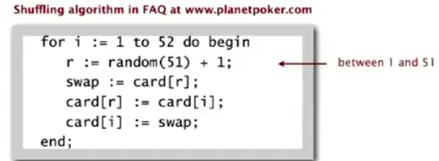    
bugs: 

1. r never get 52 (52th card never moved)
2. r = rand(N) instead of rand(0~i), → shuffle not uniform
3. random() uses 32bit seed: only 2^32 possible shuffles, *2^32<52!*
4. seed = millisec from midnight, ~86*10^6 suffles

6. Convex Hull
==============
application of sorting for the field of computational geometry.  

convex hull
-----------
smallest polygoneenclosing all N points.   
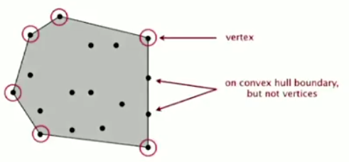      

* input: N points
* output: sequence of *vertices* in counterclockwise (*ccw*) order. 

application: robot motion planning; farest pair.   

**geometric properties**:   

* can traverse convex hull by making only ccw turns
* let p be the point with lowest y-coord, wrt p, vertices appear in increasing order of polar angle.   

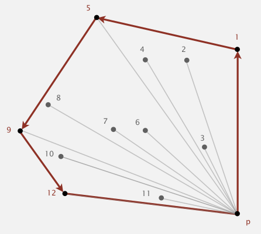   

Algo
----
>**Graham scan algorithm:**  
    * choose p with smallest y coord   
    * *sort points by polar angle* with p   
    * consider points in order (stack is used), *discard unless creates a ccw turn*.   

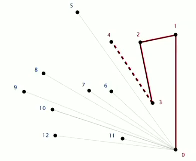   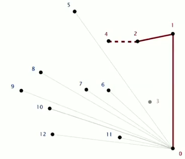    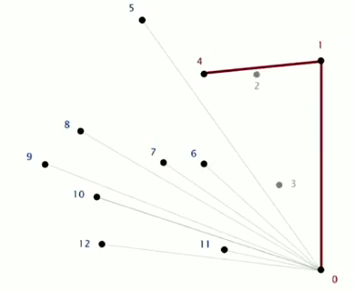   

**CCW**   
given three points a b c, returns if a→b→c is a CCW turn.    
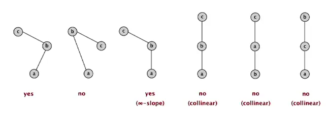      
(assumption: no 3 points on a line)  
 ⇒ calculate *cross product of ab and bc ⇒ determinants!*   
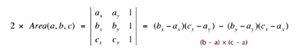     
area>0 ⇔ CCW   

implementation
--------------

	public class Point2D{
	private double x,y;
	public static boolean ccw(Point2D a,Point2D b,Point2D c){
		double area2 = (b.x-a.x)*(c.y-a.y) - (b.y-a.y)*(c.x-a.x);
		return area2>0;
	}

	}
   

convex hull:   

	public static Stack<Point2D> GrahamScan(Point2D[] p){
		//* assumes that points are sorted by polar angle in p[]
		Stack<Point2D> hull = new Stack<Point2D>();
		hull.push(p[0]);
		hull.push(p[1]);
		for(int i=2;i<p.length;i++){
			Point2D b = hull.pop(), a = hull.peek(), c = p[i];
			while(!Point2D.ccw(a,b,c)){
				b = hull.pop();
				a = hull.peek();
			}
			//now a,b,c makes a ccw turn:
			hull.push(b);
			hull.push(c);
		}
	}

running time: *NlgN for sorting and linear for the rest.* 
