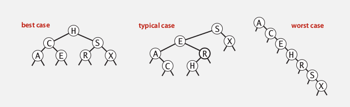
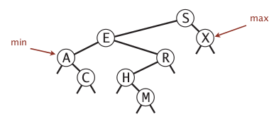
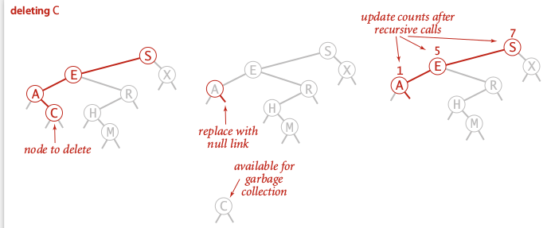

Title: [Algorithms I] Week 4-2b Binary Search Trees   
Date: 2015-08-26   
Slug:  algoI_week4_2b      
Tags: algorithm   
Series: Algorithms Princeton MOOC I 
 
 
(BST是锻炼递归代码的好题目)   
   
1. Binary Search Trees   
======================   
def. **BST**   
A binary tree where each node has a key:    
for every node, the key is larger than *all nodes in left* subtree, smaller than *all nodes in right* subtree.    
   
Fields: key, val, left, right   
   
Implementation   
--------------   
An inner class of BST nodes:    
   
	private class Node{   
		private Key key;   
		private Value val;   
		private Node left, right;   
		public Node(Key k, Value v){...}   
	}   
   
   
skeleton implementation of BST:    
   
	public class BST<Key implements Comparable<Key>, Value>{   
	private Node root;   
	private class Node{...}   
	public Value get(Key k){...}   
	public void put(Key k, Value v){}   
	public void delete(Key k){}   
	public Iterable<Key> iterator(){}   
	}   
   
   
**search**   
recursive version:    
(或者把这个函数写到Node类里面也可以. )   
   
	private Value get(Node nd, Key k){   
		if(nd==null) return null; // search miss   
		int cmp = k.compareTo(nd.key);   
		if(cmp==0) return nd.val; // search hit   
		else if (cmp>0) return get(nd.right, k);   
		else return get(nd.left, k);   
	}   
   
non-recursive version:   
   
	public Value get(Key k){   
		Node nd=root;   
		while(root!=null){   
			int cmp = k.compareTo(nd.key);   
			if (cmp==0) return nd.val;   
			else if(cmp>0) nd = nd.right;   
			else nd = nd.left;   
		}   
		return null;   
	}   
   
   
   
**insert**   
recursive version:    
(注意这个recursive函数的返回值不是void! 这里是一个trick: 返回的是在分叉以前的那个节点)   
   
	private Node put(Node nd, Key k, Value v){   
		if(nd==null) return new Node(k, v);   
		int cmp = k.compareTo(nd.key);   
		if(cmp==0) nd.val = v;   
		else if(cmp>0) nd.right = put(nd.right, k, v);   
		else nd.left = put(nd.left, k, v);   
		return nd;   
	}   
   
   
non-recursive version:   
不如递归版本优美...   
 
	public void put(Key k, Value v){   
		Node nd = root;   
		while(true){   
			int cmp = k.compareTo(nd.key);   
			if(cmp==0) {   
				nd.val = v; break;   
			}   
			else if(cmp>0){    
				if(nd.right!=null) nd = nd.right;   
				else {nd.right = new Node(k,v); break;}   
			}   
			else if (nd.left!=null) {    
				if(nd.left!=null) nd = nd.left;   
			 	else {nd.left = new Node(k,v); break;}   
			}   
		}   
	}   
   
Analysis   
--------   
complexity: depth of the BST.    
   
shape of BST: depends on how the keys come in (order of insertion).    
   
if keys come in *random* order: could be pretty well balanced.    
   
**BST and quick-sort partitionning**   
*The root of BST is just the pivot in quick sort partitioning  *   
if all keys are distinct ⇒ one-to-one correspondence between quick sort and BST.    
    
⇒ **proposition**   
if all keys are distinct and come in randome order, the average number of compares for a search/insert is ~2lnN (or 1.39lgN).    
*proof.*   
证明见quicksort那里的数学推导...    
   
**proposition **(Reed, 2003)   
N distinct keys come in random order, average tree height = 4.300lnN   
   
**Worst-case:**   
The tree becomes just like a linked list: ~N for insertion and search   
   
2. Oredered Operations in BST   
=============================   
task: ordered opeartions   
   
* ``min()/max()``: min/max key   
* ``deleteMin()/deleteMax()``   
* ``floor(Key k)/ceiling(Key k)``: largest key <=k / smallest key >=k   
* ``rank(Key k)``: nb of keys < key   
* ``select(int i)``: key with rank=i   
* ``Iterator<Key> keys(lo, hi)``: iterates through [lo, hi]   
   
   
min/max   
-------   
easy   
min: left-most   
max: right-most   
   
   
floor/ceiling   
-------------   
a little more complexed...    
   
**floor (ceiling is similar)**   
   
* if k==nd.key   
   
return nd.val   
   
* if k<nd.key   
   
the floor *must* be in the left subtree   
   
* if k>nd.key   
	* 如果min(nd.right) > k: 返回nd.val   
	* 如果min(nd.right) <= k: go to right   

            public Value floor(Node nd, Key k){// largest element with key <= k       
            int cmp = k.compareTo(nd.key);		   
            if(cmp==0) return nd.val;//case 1   
            else if(cmp<0) return floor(nd.left, k);//case 2   
            if (nd.right==null || min(nd.right).compareTo(k)>0) //case 3   
                return nd.val;   
            else return floor(nd.right);   
            }   
   
   
他提供的版本和我写的不一样: 递归函数floor返回的也是一个Node:    
   
   
   
rank/select   
-----------   
In each node, store the number of nodes in the subtree: *add an extra field*.   
   
**size**   
   
	private class Node{   
		private int count;   
		//...   
	}    
	public int size(){   
		return size(root);   
	}   
	public int size(Node nd){   
		if(nd==null) return 0;// this is why we do not put size() inside the class Node!   
		return nd.count;   
	}   
	public void put(Node nd, Key k, Value v){   
		//.....   
		nd.count = size(nd.left)+size(nd.right)+1;//maintain count for each node   
		return nd;   
	}   
   
   
**rank**   
(return nb of keys < k)   
   
* if nd.key==k   
   
return size(nd.left)   
   
* if nd.key>k   
   
return rank(nd.left, k)   
   
* if nd.key<k   
   
return size(nd.left)+1+rank(nd,right, k)   
   
	private int rank(Node nd, Key k){   
		if(nd==null) return 0;//remember null case   
		int cmp = k.compareTo(nd.key);   
		if(cmp==0) return size(nd.left)   
		else if (cmp<0) return rank(nd.left, k);   
		else return size(nd.left)+1+rank(nd.right,k);   
	}   
   
   
select() similar...   
   
iteration   
---------   
**Inorder traversal 中序遍历**   
   
	public Iterable<Key> keys(){   
		Queue<Key> q = new Queue<Key>();   
		inorder(root, q);   
		return q;   
	}    
	private void inorder(Node nd, Queue<Key> q){   
		if(nd==null) return;   
		inorder(nd.left);   
		q.enqueue(nd.key);   
		inorder(nd.right);   
	}   
   
   
   
**property**   
inorder-traversal gives the keys *in ascending order*.    
(proof by induction)   
   
3. Deletions in BST   
===================   
one final function to implement: delete(Key k), deleteMin(), deleteMax()   
→ and remember to update the count field...   
   
(感觉这篇文章其实就讲的很清楚了: <http://www.algolist.net/Data_structures/Binary_search_tree/Removal>   这个在递归函数里使用了parent这个参数)   
   
lazy approch   
------------   
``put(k, null)``, and leave the key in the tree (tombstone)   
→ not good if have large number of tombstons...    
   
deleteMin/Max   
-------------   
go the the left-most node → replace it with its right node.    
Recusive function with the *returning-node trick*:    
   
	private Node deleteMin(Node nd){   
		if(nd==null) return null; // this might not happen   
		if(nd.left==null) return nd.right;   
		else nd.left = deleteMin(nd.left);   
		nd.count = size(nd.left)+1+size(right);//remember to maintain the count field   
		return nd;   
	}   
   
这个递归的技巧又一次使用了.   
   
Hibbard deletion   
----------------   
first find node with the key to delete, 3 cases:    
   
* 0 children:    
   
simply set parent link to null   
   
   
* 1 child:    
   
replace parent link with the child   
   
   
* **2 children (most subtle)**   
	* first replace node key with smallest key in right subtree   
	* remove the smallest key in right subtree   
   
   
   
**code of Hibbard deletion**   
Again (for the 3rd time) use the *return-nd trick*...   
   
	private Node delete(Node nd, Key k){   
		if(nd==null) return null;// search miss   
		int cmp = k.compareTo(nd.key);   
		if(cmp>0) nd.right = delete(nd.right, k);   
		else if(cmp<0) nd.left = delete(nd.left,k);   
		else{   
			//if nd is the node to delete   
			if(nd.left==null) return nd.right;   
			if(nd.right==null) return nd.left;   
			Key k2 = min(nd.right);   
			nd.key = k2;   
			nd.right = delete(nd.right, k2);   
	 	}   
		nd.count = size(nd.left)+1+size(nd.right);   
		return nd;   
	}    
	public void delete(Key k){   
		root = delete(root, k);   
	}   
   
感觉用了recursive return-nd 这个trick的实现很漂亮.... 比那篇博客里放一个参数进递归函数以及用auxroot的办法要好不少...    
    
   
Analysis   
--------   
problem: *not symmetric*   
If random insert and delete for a while ⇒ tree become much less balanced ! Tree height tend to be sqrt(N).    
   
**summery**   
BST is much better in average case, but not guaranteed for worst case.    
   
   
   
   
