Title: [Algorithms I] Week 5-1 Balanced Search Trees   
Date: 2015-08-26   16:00     
Slug:  algoI_week5_1         
Tags: algorithm        
Series: Algorithms Princeton MOOC I 
 
   
goal: lgN for insert/search/delete operations (not necessarily *binary* trees..)   
3 algo: 2-3 tree, (left leaning) red-black tree, B-tree   
   
1. 2-3 Search Trees   
===================   
def. **2-3 tree**   
   
* allow 1 or 2 keys per node, & 2 or 3 children per node:    
	* 2-node: one key, 2 children (ordinary BST node)   
	* 3-node: 2 keys, 3 children (3 children: *less, between, more*)   
* **perfect balance**: every path from root to null link has the same length (2-3 tree的一个超好的性质, *类似于一个满二叉树*!)   
* symmetric order: inorder traversal gives ascending order (和BST类似)   
   
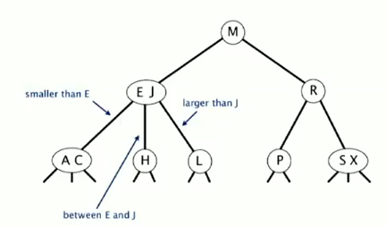   
**search**   
Just follow the correct link... Natural generalization of search in BST...    
   
**insert**   
   
* case 1: insert into a 2-node at bottom   
   
just convert a 2-node into a 3-node   
   
* case 2: insert into a 3-node at bottom   
	* create a temporary 4-node (three keys)   
	* move middle key in 4-node into parent, split the rest two keys into two 2-nodes   
   
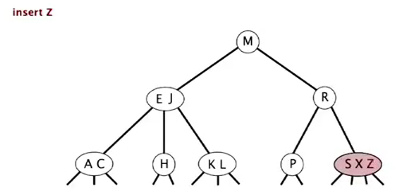   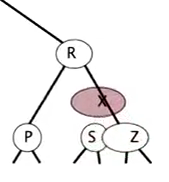    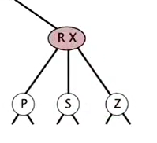   
   
* if parent becom a 3-node → continue the process   
* if arrived at the root (root is a 4-node with three keys): split it into three 2-nodes   
   
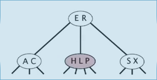 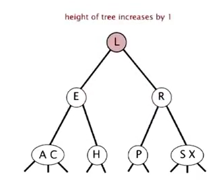   
   
**splitting a 4-node**: can be done in constant time (*local transformation*).    
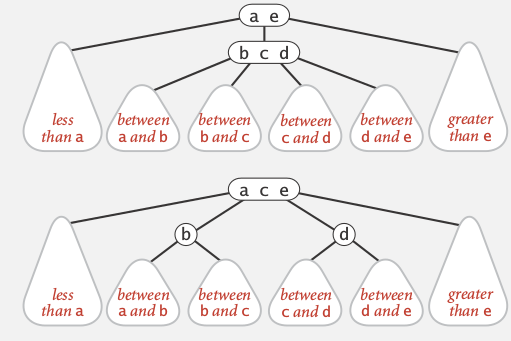   
   
Analysis   
--------   
Invariant: maintains symmetric order and perfect balance.    
*proof.*    
each transformation maintains the order and the balance, all possible transformations:    
这个图很好, 3-node的插入一共有三种情况: 自身是root/父亲是2-node/父亲是3-node   
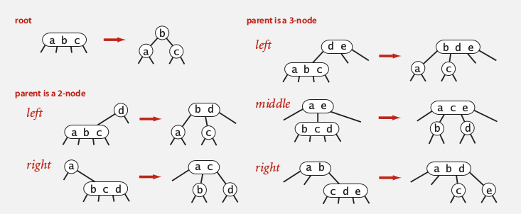   
   
**performance**   
every path from root to null link has the same length.    
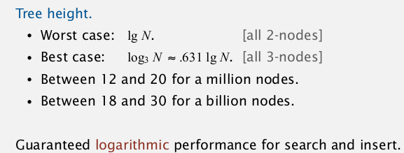   
   
Implementation   
--------------   
   
* direct implementation is complicated:    
* bottom line: *Could do it, but there's a better way.*   
   
   
2. Red-Black BST   
================   
LLRB tree: left-leaning red-black tree.    
   
>*BST representation of the 2-3 trees*   
**use internal left-leaning links for 3 nodes**   
   
红色link即为internal left leaning link (红黑树就是这么来的), 用红色link连接起来的组成一个(虚拟的)3-node 或4-node.    
   
* 3-node用一个red link表示:    
   
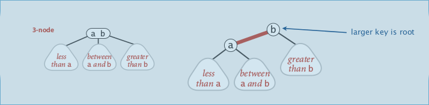   
   
* 4-node用两个red link表示:    
   
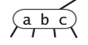 ⇒ 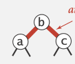 or 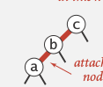 or 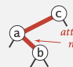   
   
example:    
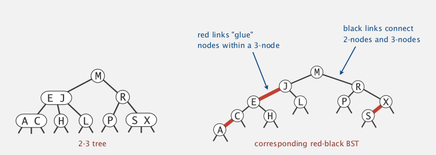   
   
properties   
----------   
   
* no node has two red links (不可以一个节点连两个red link)   
* every path from path to null link has the same number of *black* links (想象所有red link都变为horizontal)   
* all red links lean left   
   
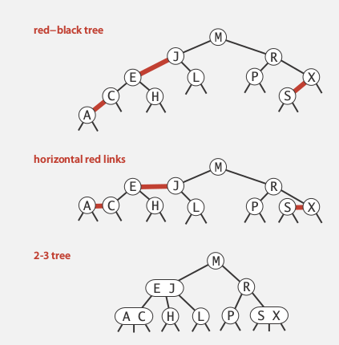   
   
   
representation   
--------------   
Each node has only one link from parent    
⇒ add a boolean to encode color of links (the color of the link *from parent*).    
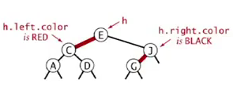   
   
	private class Node{   
		private Key key;   
		private Value val;   
		Node left, right;   
		boolean color;//true means red	   
	}    
	private boolean isRed(Node nd){   
		if (nd==null) return false;   
		return nd.color;   
	}   
   
   
insert to parent 操作: 只需把color变为RED即表示该节点 被变成了和父节点一起的一个(虚拟)节点.    
   
elementary operations   
---------------------   
**left-rotation**   
(def: *convert a right-learning red link to left.* )   
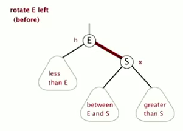   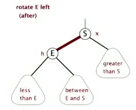   
(symmetric ordering and perfect black balance are maintained)    
   
	private Node rotateLeft(Node h){    
		Node s = h.right;   
		h.right = s.left;   
		s.left = h;   
		s.color = h.color;	 // not = BLACK   
		h.color = RED;   
		return s;   
	}   
   
   
**right-rotation**   
(temporarily turn a left-leaning red link to right)   
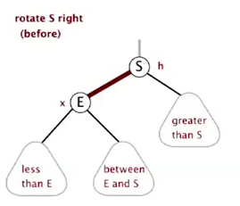 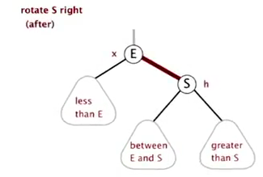   
   
``private Node rotateRight(Node h){...}``   
   
right rotation 是为了应对这种情况:    
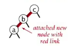 rotateRight(c) ⇒ 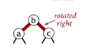   
   
**color-flip**   
(split a 4-node, with three kyes — two red links)   
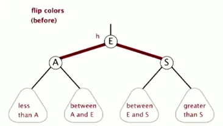  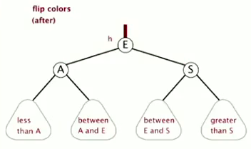   

	private void filpColor(Node h){   
		h.color = RED;   
		h.left.color = BLACK;   
		h.right.color = BLACK;   
	}   
   
   
Implementation   
--------------   
**Basic strategy**   
Maintain *one-to-one correspondence* with 2-3 tree by applying elementary operations.    
   
   
* **search**   
   
*Exactly* the same as elementary BST. ( ⇒ The same code for floor and ceiling)   
   
* **insert**   
   
**Each insert will generate a red link** (then should rotate to make it legal)   
   
插入的时候有两种可能:    
   
1. insert into a 2-node at the bottom   
   
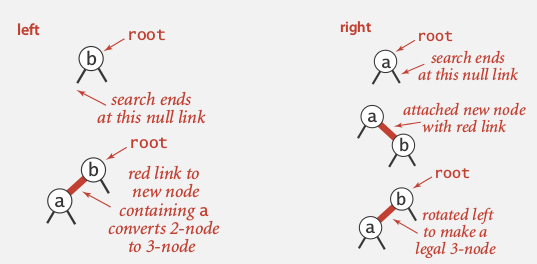   
   
* standart BST insert   
* if have red right link: rotateLeft   
   
ex:    
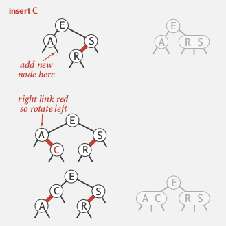   
   
2. insert into a 3-node    
   
有三种可能: insert into left/middle/right, right最简单, left捎复杂, middle最复杂, 见下图:    
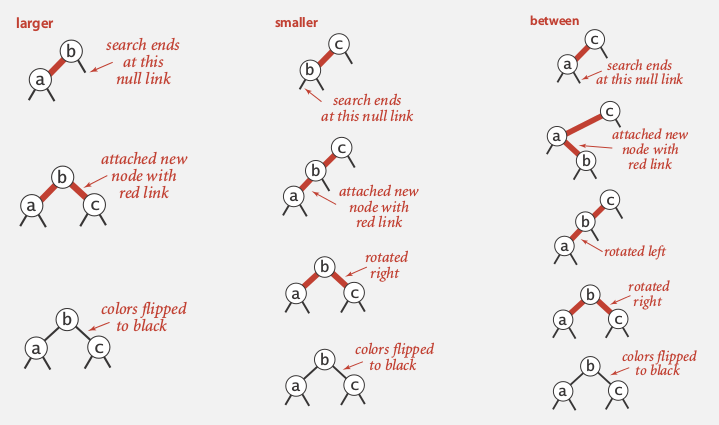   
   
* standard BST insert and color nodes   
* if necessary, rotate to balance 4-node, 比如:    
   
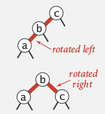   
   
* flip colors to pass red link to upper level   
* if necessary, rotate to make all links left-leaning    
   
ex:   
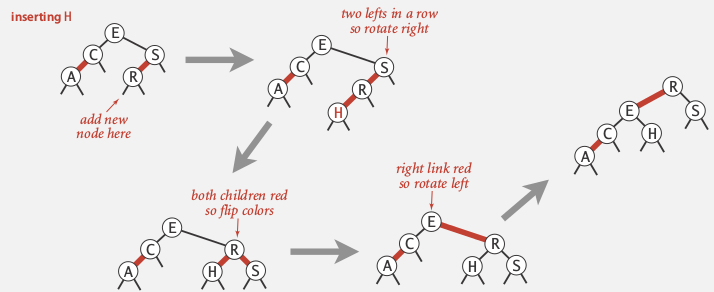   
ex2:   
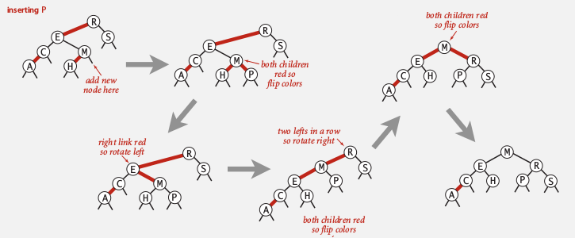    
   
视频最后一段的demo太帅了! 叹为观止!!   
   
Code   
----   
原来**只有4种(其实是3种)情况要调整**:    
   
1. *left = black, right = red*   
   
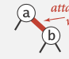	⇒ rotateLeft(a)   
   
2. *left =red, left.right = red [这个不会出现, 因为这对于下一层来说是case 1..]*   
   
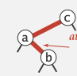 	⇒ rotateLeft(e) ⇒ 变为case 3    
   
3. *left = red, left.left = red*   
   
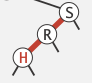	⇒ rotateRight(s) ⇒ 变为case 4   
	   
   
4. *left = red. right = red*   
   
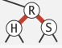		⇒ flipColor(r)   
   
几个状态之间的转化:    
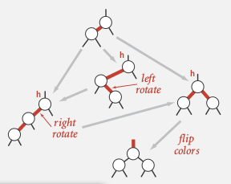   
   
**只要三行代码即可处理LLRB tree !! 老爷子牛逼...... **   
(这个也是在2007年algo第四版的时候才刚刚弄出来的, 以前的代码要复杂)   
   
	private Node put(Node nd, Key k, Value v){   
		if(nd==null) return new Node(k,v,RED);   
		int cmp = k.compareTo(nd.key);   
		if(cmp==0) nd.val = v; // 这里不急着返回 -- same trick as for BSTs..   
		else if(cmp<0) nd.left = put(nd.left, k, v);   
		else nd.right = put(nd.right, k, v);   
		// modifications to maintain LLRB tree property:    
		if( isRed(nd.right) && !isRed(nd.left) ) nd = rotateLeft(nd);//case 1   
		//if( isRed(nd.left) && isRed(nd.left.right) ) nd.left = rotateLeft(nd.left);// case 2 -- never happen...   
		if( isRed(nd.left) && isRed(nd.left.right) ) nd = rotateRight(nd);// case 3   
		if( isRed(nd.left) && isRed(nd.right) ) flipColor(nd);//case 4   
		return nd;   
	}   
   
   
这三行代码越看越精妙......    
   
Analysis   
--------   
   
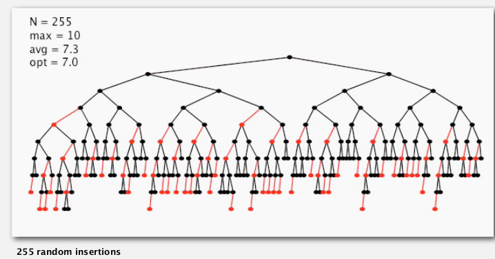   
   
**worst case**: the left path is *alternating red and black*.   
⇒ longest path <= 2 * shortest path  (height<= 2lgN)   
   
practical applications: height ~ 1.0 lgN   
   
summery:    
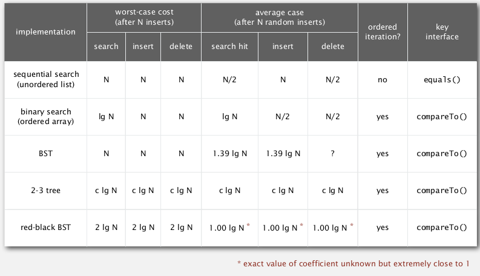   
   
3. B-trees   
==========   
setting: data access in file system.    
*Probe is much expensive than accessing data within a page.*    
   
Goal: access data using a minimum number of probes.   
   
B-tree   
------   
**def.**   
external nodes: contain just keys, not links   
internal nodes: contain key-link pairs   
   
**def. B-tree**   
Generalize 2-3 trees by allowing up to M-1 keys per node:   
   
* >= 2 keys in root   
* >= M/2 keys in other nodes   
* external nodes contain client keys   
* internal nodes contain copies of keys to guide search   
   
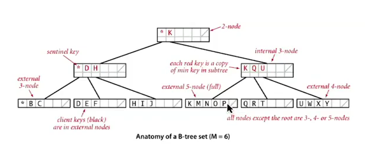   
   
Searching   
---------   
similar to BST/2-3tree   
ex.   
 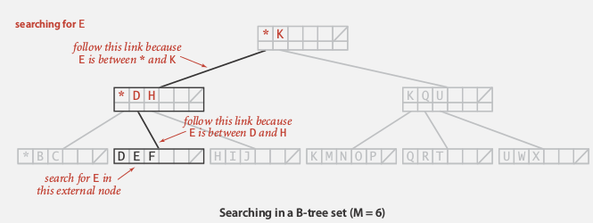   
   
(Choose M as large as possible so that M links fit into a page)   
   
Insertion   
---------   
similar to 2-3 tree   
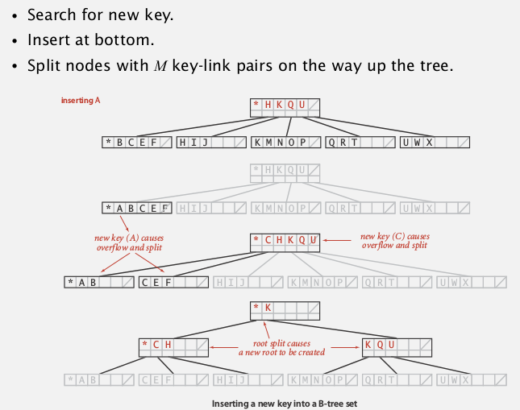   
   
Analysis   
--------   
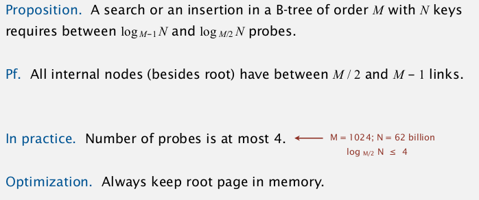   
   
System implementations   
----------------------   
system implementations of RBtree.   
java:    
``java.util.TreeMap``, ``java.util.TreeSet``.   
   
八卦1: 
   
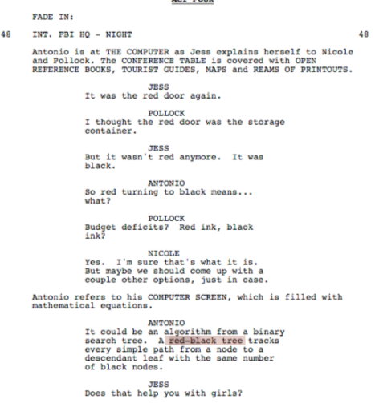     
  
八卦2: 
Sedgewick 的朋友, [Philippe Flajolet](https://fr.wikipedia.org/wiki/Philippe_Flajolet), 是一个X!    
