Title: [Algorithms I] Week 5-2 Geometric Applications of BSTs   
Date: 2015-08-29   
Slug:  algoI_week5_2    
Tags: algorithm       
Series: Algorithms Princeton MOOC I 
 
[TOC]   
   
1. 1d Range Search   
==================   
Goal: *intersections* of geometric objects.    
   
Solution: **BST**   
   
1d range search   
---------------   
operations required:    
   
* insert   
* search   
* delete   
* *range search*: all keys between k1 and k2   
* *range count*: how many keys are between k1 and k2   
   
→ find points on an interval    
   
   
implementation by BST   
---------------------   
**range count**   
using the ``rank()`` function for the BST (or use the size of a tree)   
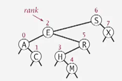   
注意什么时候要加1...   
   
	public int size(Key hi, Key lo){   
		if(contains(hi)) return rank(hi)-rank(lo)+1;   
		else return rank(hi) - rank(lo);   
	}   
   
   
**range search**   
类似inorder traversal的方式:    
   
* find in left subtree (if could fall into range)   
* check current node   
* find in right subtree   
   
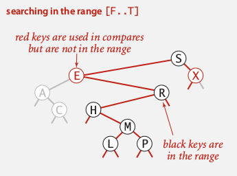   
running time: R+lgN (R=nb of nodes in range)   
   
2. Line Segment Intersection   
============================   
>*Orthognal line segment intersection search*:    
find all intersections given N horizontal/vertical lines   
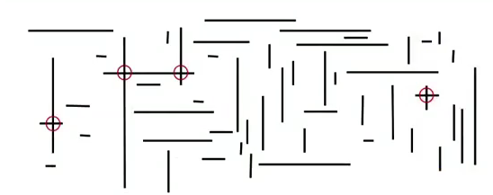   
   
Non-degeneracy assumption: all x-coord and y-coord are distinct.    
   
naive algo: check all pairs...   
   
Sweep-line algorithm   
--------------------   
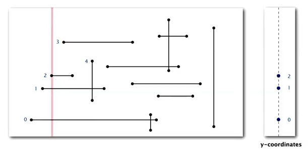   
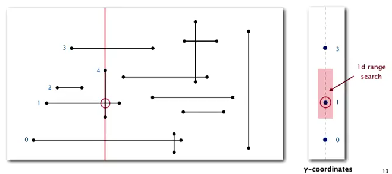   
   
   
* sweep a vertical line from left to right.    
	* when hit the left end of horizontal-segment (h-seg) → insert into a BST   
	* when hit the right end of a h-seg → delete from BST   
	* when hit a vertical-seg: ⇒ 1d range search !    
   
   
**关于怎么sweep的:**   
没有仔细讲, 不过我觉得就是把所有的x坐标排好序, 有个[skyline问题](https://leetcode.com/problems/the-skyline-problem/)也是涉及如何sweep的.   
   
**proposition**   
running time is NlgN+R (R=nb of intersections).    
*proof.*   
   
* Sort by x-coord (or use PQ) → NlgN   
* insert/delete y-coord to BST → NlgN   
* range search → NlgN + R   
   
   
3. Kd-trees   
===========   
An extension of BST: *2d-keys*.    
   
* insert: insert 2d points   
* search   
* range search: *find all keys lying in a 2d rectangle (h-v rectangle)*   
* range count   
   
   
gird implementation   
-------------------   
divide space into a M-by-M grid (uniform squares).   
space: N + M^2   
time: 1 + N/M^2    
→ choose square to balance space and time.    
problem: points are not uniformly distributed.    
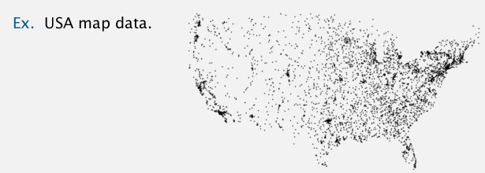   
   
2d tree   
-------   
Use a tree to represent the subdivision of the space.    
   
**2d tree**: recursively divide the space into 2 halfplanes   
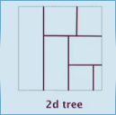   
   
construct the 2d tree by adding points: *alternating between horizontal and vertical partitioning for each level of tree*.    
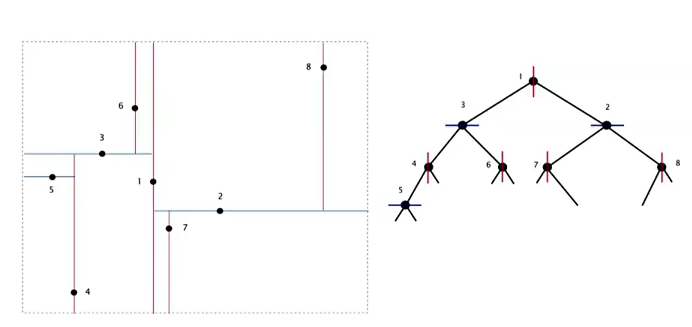   
   
Data structure: BST alternating x and y-coords as key.    
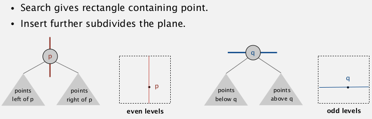   
   
   
Range search for 2d tree   
------------------------   
find all points lying in a rectangle.    
依然类似tree traversal算法:   
   
* check point in node   
* find in left subtree (if could be in range — the rectangle *intersects* the splitting line)   
* find in right subtree   
   
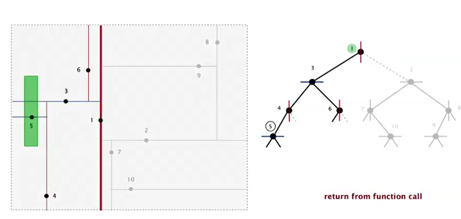   
   
**analysis**   
Typical case: R + lgN   
worst case: R+ sqrt(N) (even if tree is balanced)   
(proof is hard)   
   
Nearest Neighbour seach   
-----------------------   
find closest point to a query point.    
   
* check dist from query point to node   
* check in left tree (*if could contain a closer point — 和两点连线与splitting line的角度有关系*)   
* check in right tree   
   
   
**analysis**   
typical case: lgN   
worst case: N   
   
**Flocking boids**   
3 simple rules to get a simulation of flocking.    
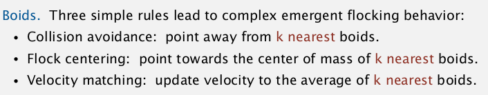   
   
Kd tree   
-------   
partition the k-dim space into 2 halfspaces.    
cycle through k dimensions.   
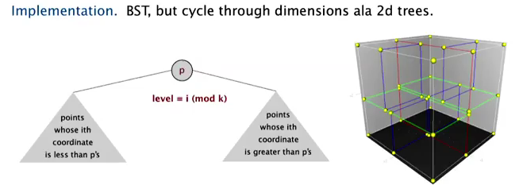   
(居然时一个本科生发现的!)   
   
Nbody simulation:   
treat clusters as an aggregated node   
   
4. Interval search tree   
=======================   
1d interval search:　data are intervals   
   
* insert interval    
* search interval   
* delete interval   
* intersection query: find all intervals that intersects (lo,hi)   
   
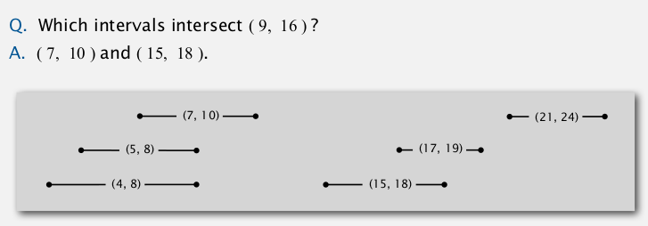   
Nondegeneracy assumption: all left endpoint of intervals are distinct.    
   
API:   
   
	put(Key lo, Key hi, Value val)   
	get(Key lo, Key hi)   
	delete(Key lo, Key hi)   
	Iterable<Key> intersects(Key lo, Key hi)   
   
   
Interval search tree:   
---------------------   
   
* BST using left endpoint as key   
* in each node: store the *max right endpoint of the subtree*   
   
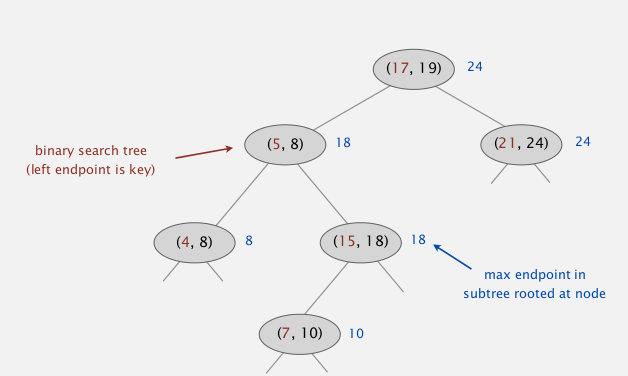   
   
**insert**   
类似BST, 加上维护一下maxendpoint即可.   
   
**search**   
search *any one* interval that intersects (lo,hi)   
   
* if node intersects, return   
* if left.maxendpoint < lo: go right   
* else: go left   
   
*proof. *   
主要证明一点: if no intersection to left ⇒ then no intersection to the right   
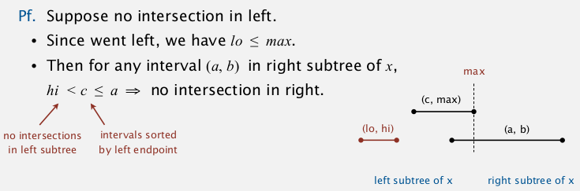   
   
5. Rectangle intersection   
=========================   
Goal:  find all intersection among N rectangles.    
(non degeneracy assumption: all x and y are distinct)    
   
bottom line: linearithmic algo.    
   
**sweep-line algorithm:**   
sweep vertical line from left to right.    
   
* when hit left part of a rect ⇒ put into an interval search tree   
* when hit right part of a rect ⇒ remove interval   
* every time befor adding ⇒ check intersection   
   
   
*reduces the 2d rect intersection pb to 1d interval search pb.*    
   
complexity:    
NlgN+RlgN   
   
summery:    
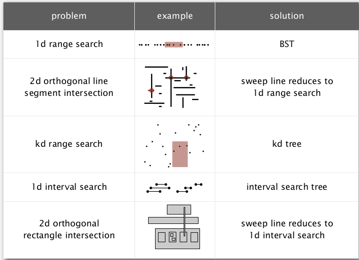   
