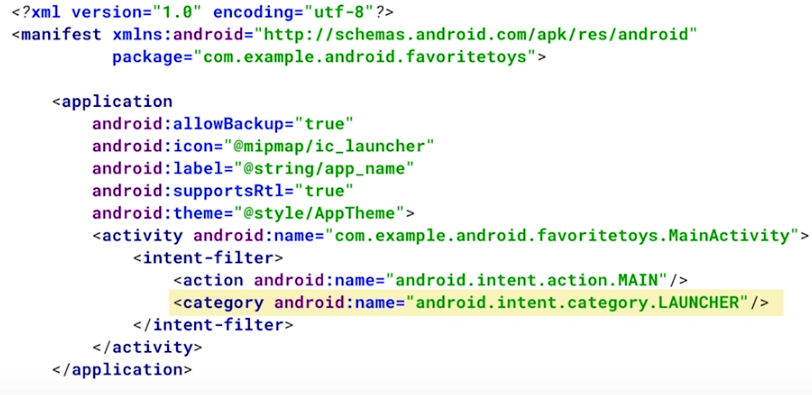
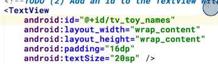

Title: [Android Dev] 1.1 Create Project Sunshine  
Date: 2017-02-06
Slug:  andev_p1e1_basics
Tags: android    
Series: Associate Android Developer Fast Track 
 
[TOC]

1 create project sunshine
=========================
Created 星期一 06 二月 2017

minSDK vs targetSDK
-------------------
The ``minSDK`` is the lowest SDK level that your app can run on. You can choose what level of devices to support. 

By comparison, the ``targetSDK`` is NOT a high pass filter -- it’s used only to declare which platform version you've tested your app on. 

Enable VT-x and installing kvm
------------------------------
this is necessary for running AVD devices. 

<http://stackoverflow.com/questions/37087365/how-to-enable-vt-x-in-bios-and-kvm-modules-on-linux>

Components of an android app
----------------------------

4 main components of an app: 

* ``Activity``: responsible for most user interaction
* Service
* ContentProvider
* BroadcaseReceiver

Activity
--------
Android keeps the activities in a stack, when press back button → stack pops. 
Define the launcher of the activity in ``manifests/AndroidManifest.xml``:

*application → activity → intent-filter*

 
``res`` folder contains layouts/images/values
in ``res/layout/activity_main.xml``: xml file that defines the layout view

Activities and Layouts
----------------------
An **activity** is a single focused thing that the user can do. Activities are responsible for creating the window that your application uses to draw and receive events from the system. Activities are written in Java, extending from the ``Activity`` class.

An activity creates **views** to show the user information, and to let the user interact with the activity. ``View``s are a class in the Android UI framework. *They occupy a rectangular area on the screen and are responsible for drawing and handling events.* An activity determines what views to create (and where to put them), by reading an XML layout file. These XML files, are stored in the res folder inside the folder labeled ``layouts``. 

2 types of views
----------------

### type1: UI components (widgets)
UI components that are often interactive elements. 

example: ``TextView, EditView, Buttom, ImageView,``... 
most of UI view classes: in android.widgets package <https://developer.android.com/reference/android/widget/package-summary.html>

### type2: container view
The second are views called "Layout" or "Container" views. They extend from a class called [ViewGroup](https://developer.android.com/reference/android/view/ViewGroup.html). They are primarily responsible for containing a group of views and determining where they are on screen. Layout views can be nested in one another. 

example: ``LinearLayout, RelativeLayout, ConstraintLayout,`` ...

relate XML layout to java activities
------------------------------------

### use xml layout in java activity
in ``onCreate`` method of an activity, using the ``setContentView(R.layout.name_of_layout)``
the setContentView method: Android reads your XML file and generates Java objects for each of the tags in your layout file. You can then edit these objects in the Java code by calling methods on the Java objects.

### refer to widgets defined in xml in java
in the xml file, give an id to the view:

