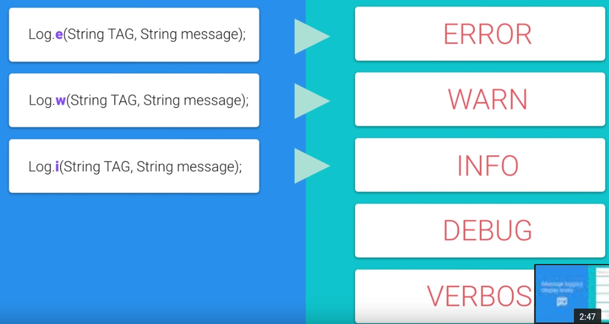
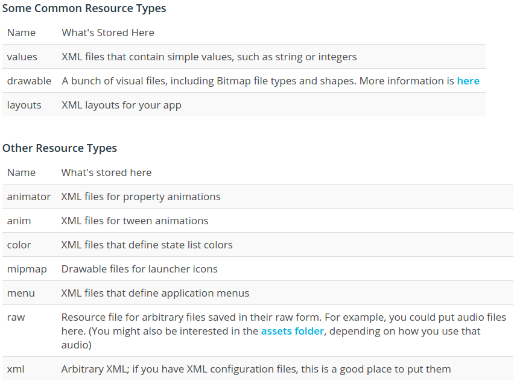
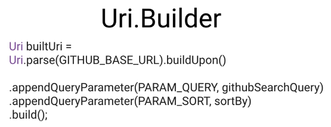
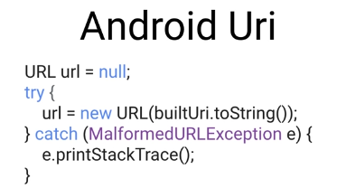
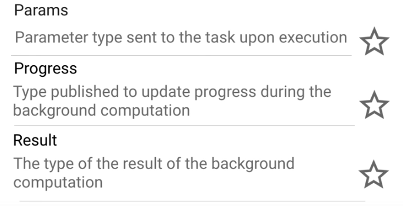
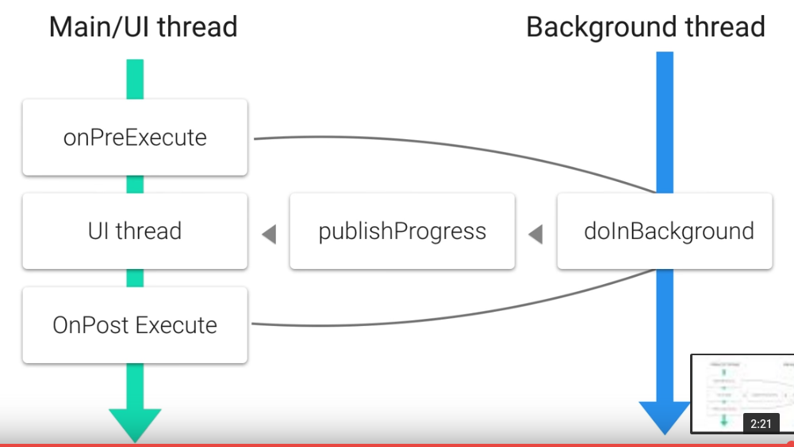

Title: [Android Dev] 1.2 Connect to the Internet  
Date: 2017-02-07
Slug:  andev_p1e2_internet
Tags: android    
Series: Associate Android Developer Fast Track 
 
[TOC]

logging
-------

<https://developer.android.com/reference/android/util/Log.html>

* 5 log levels: ``error/warning/info/debug/verbose``
* error/warning/info are preserved in the release of app
* use class name as tag: ``MyClass.class.getSimpleName()``

the Resources folder
--------------------
<https://developer.android.com/guide/topics/resources/providing-resources.html>

### working with res/values/strings.xml

the strings defined in this xml file can be got from java activity using ``getString(R.string._the_id)`` method. 

example:

in string.xml: ``<string name="today">Today</string>``  
in java: ``String myString = getString(R.string.today)``  
in other xmls files: use ``@string/today`` to access it.  

ref: <https://developer.android.com/guide/topics/resources/string-resource.html>

Menu and ActionBar
------------------

a menu item in the xml file (res folder→ create new android resource directory → menu): 

    // TODO (2) Create a menu in res/menu called main.xml
    // TODO (3) Add one menu item to your menu
    // TODO (4) Give the menu item an id of @+id/action_search
    // TODO (5) Set the orderInCategory to 1
    // TODO (6) Show this item if there is room (use app:showAsAction, NOT android:showAsAction)
    // TODO (7) Set the title to the search string ("Search") from strings.xml
    <menu xmlns:android="http://schemas.android.com/apk/res/android"
        xmlns:app="http://schemas.android.com/apk/res-auto">
        <item
            android:id="@+id/action_search"
            android:orderInCategory="1"
            android:title="@string/search"
            app:showAsAction="ifRoom" />
    </menu>

shoule also set MainActivity as singleTop mode: 

    <activity android:name=".MainActivity"
              android:launchMode="singleTop">

To create menu: override ``onCreateMenu``: 

    // TODO (8) Override onCreateOptionsMenu
    // TODO (9) Within onCreateOptionsMenu, use getMenuInflater().inflate to inflate the menu
    // TODO (10) Return true to display your menu
    @Override
    public boolean onCreateOptionsMenu(Menu menu) {
        getMenuInflater().inflate(R.menu.main, menu);
        return true;
    }

To handle menu item clicks: ``onOptionsItemSelected`` 

    // TODO (11) Override onOptionsItemSelected
    // TODO (12) Within onOptionsItemSelected, get the ID of the item that was selected
    // TODO (13) If the item's ID is R.id.action_search, show a Toast and return true to tell droid that you've handled this menu click
    // TODO (14) Don't forgot to call .show() on your Toast
    // TODO (15) If you do NOT handle the menu click, return super.onOptionsItemSelected to let droid handle the menu click
    @Override
    public boolean onOptionsItemSelected(MenuItem item) {
        int itemid = item.getItemId();
        if(itemid==R.id.action_search) {
    // use MainActivity.this as context, instead of using just this
            Toast.makeText(MainActivity.this, "search action selected!", Toast.LENGTH_SHORT).show(); 
            return true;
        }
        return super.onOptionsItemSelected(item);
    }

Another way to set menuitem action: ``menuitem.setIntent``

    @Override
    public boolean onCreateOptionsMenu(Menu menu) {
        getMenuInflater().inflate(R.menu.detail, menu);
        MenuItem menuitem = menu.findItem(R.id.action_share);
        Intent intent = ShareCompat.IntentBuilder.from(this)
                .setType("text/plain")
                .setChooserTitle("choose which app to share")
                .setText(mForecast)
                .getIntent();
        menuitem.setIntent(intent);
        return true;
    }

Build the query URL
-------------------

the request url for github repo search: ``https://api.github.com/search/repositories?q=android&sort=stars``

use Uri Builder:  

convert Uri to java URL:   

    public static URL buildUrl(String githubSearchQuery) {
        Uri.Builder uribuilder = Uri.parse(GITHUB_BASE_URL).buildUpon();
        uribuilder = uribuilder.appendQueryParameter(PARAM_QUERY, githubSearchQuery);
        uribuilder = uribuilder.appendQueryParameter(PARAM_SORT, sortBy);
        Uri uri = uribuilder.build();
        URL url = null;
        try{
            url = new URL(uri.toString());
        } catch (MalformedURLException e) {
            e.printStackTrace();
        }
        return url;
    }

Fetching http request
---------------------

<http://stackoverflow.com/questions/309424/read-convert-an-inputstream-to-a-string>

    public static String getResponseFromHttpUrl(URL url) throws IOException {
        HttpURLConnection urlConnection = (HttpURLConnection) url.openConnection();
        try {
            InputStream in = urlConnection.getInputStream();

            Scanner scanner = new Scanner(in);
            scanner.useDelimiter("\\A");

            boolean hasInput = scanner.hasNext();
            if (hasInput) {
                return scanner.next();
            } else {
                return null;
            }
        } finally {
            urlConnection.disconnect();
        }
    }

or use external library: <http://square.github.io/okhttp/>

Permission
----------
declear permissions required in android manifest.xml  
<https://developer.android.com/guide/topics/permissions/index.html>

in AndroidManifest.xml, under the manifest root: 

``<uses-permission android:name="android.permission.INTERNET"/>``

NetworkOnMainThread exception
-----------------------------
android has a **single** user interface thread responsible for user interaction: 60FPS — want to *do as little as possible on this main thread*. 

⇒ run the network on a secondary execusion thread, when finished, modify the user interface on UI thread. 

⇒ **AsyncTask**

AsyncTask
---------
allows running a task on background thread while publishing results to the UI thread. 
The UI thread has a **message queue** and a **handler**: to process messages from other threads. — AsyncTask wraps this into a simpler interface. 

``AsyncTask`` is generic, the **type parameters** include: ``AsyncTask<Params, Progress, Result>``

These 3 type parameters correspond to 4 function to override: ``doInBackgroud, onProgressUpdate, onPostExecute, onPreEcecute``. 

Once this (sub)class is defined, on UI thread, just create an ``AysncTask task``, and use ``task.execute(params..)`` to make it run on background thread. 

ref: <https://developer.android.com/reference/android/os/AsyncTask.html>

AsyncTask Example code
----------------------
First create an inner class that extends AyncTask<> class, and add the job to do here:

    // TODO (1) Create a class called GithubQueryTask that extends AsyncTask<URL, Void, String>
    class GithubQueryTask extends AsyncTask<URL, Void, String> {
        @Override
        // TODO (2) Override the doInBackground method to perform the query. Return the results.
        protected String doInBackground(URL... params) {
            URL url = params[0];
            try {
                String res = NetworkUtils.getResponseFromHttpUrl(url);
                return res;
            } catch (IOException e) {
                e.printStackTrace();
            }
            return null;
        }

        @Override // TODO (3) Override onPostExecute to display the results in the TextView
        protected void onPostExecute(String s) {
            if (s != null && !s.equals(""))
                mSearchResultsTextView.setText(s);
            else
                super.onPostExecute(s);
        }
    }

Then in UI thread, create a such class object, call execute method on it: 

    private void makeGithubSearchQuery() {
        String githubQuery = mSearchBoxEditText.getText().toString();
        URL githubSearchUrl = NetworkUtils.buildUrl(githubQuery);
        mUrlDisplayTextView.setText(githubSearchUrl.toString());
        // TODO (4) Create a new GithubQueryTask and call its execute method, passing in the url to query
        GithubQueryTask task = new GithubQueryTask();
        task.execute(githubSearchUrl);
    }

To show a progress bar when running in background ? 
⇒ put textview and progressbar into the same ``FrameLayout``, when running, make the progressbar visible, when finished, make it invisible. 

Parsing JSON
------------
json file content: 

    {
        "temp": {
            "min":"11.34",
            "max":"19.01"
        }
        "weather": {
            "id":"801",
            "condition":"Clouds",
            "description":"few clouds"
        }
        "pressure":"1023.51",
        "humidity":"87"
    }

the funtion to get the condition from the above json:

    String getCondition(String JSONString) {
        JSONObject forecast = new JSONObject(JSONString);
        JSONObject weather = forecast.getJSONObject("weather");
        return weather.getString("condition");
    }

