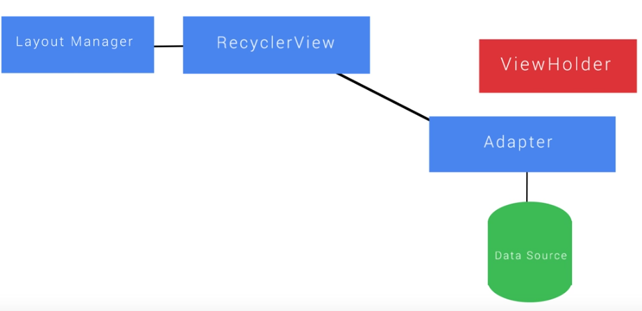
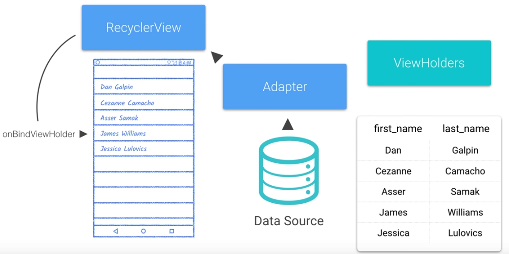

Title: [Android Dev] 1.3 RecyclerView  
Date: 2017-02-07
Slug:  andev_p1e3_recyclerview
Tags: android    
Series: Associate Android Developer Fast Track 
 
[TOC]

Recycler View, Adaper, ViewHolder
---------------------------------
rather than creating list items as we scroll, keep them in a queue (recycling bin)
→ when scrolling, the list items are *recycled and re-bind* to new content. RecyclerView is better version of ListView. 

**Adaper**: bind data from data source, and provide the RecyclerView with new views when needed. 
Adapter uses a **ViewHolder** to send views to RecyclerView. — each ``findViewById`` wil be only called once, and *cached* in the ViewHolder. 
And the RecyclerView uses a **LayoutManager** to manage the appearance of the items. 

RecyclerView code example: a list of numbers
--------------------------------------------

### 1. add gradle dependency
in build.gradle file, add in dependencies: 

``compile 'com.android.support:recyclerview-v7:25.1.0``'

and re-sync project, now we can use ``android.support.v7.widget.RecyclerView`` in the layout files. 

### 2. create item layout

This is what each of the items in RecyclerView should like. 

    <FrameLayout xmlns:android="http://schemas.android.com/apk/res/android"
        android:layout_width="match_parent"
        android:layout_height="wrap_content"
        android:padding="16dp"
        android:orientation="vertical">

        <!--// TODO (8) Align the TextView to the start of the parent-->
        <!--// TODO (9) Center the TextView vertically in the layout-->
        <TextView
            android:layout_width="wrap_content"
            android:layout_height="wrap_content"
            android:id="@+id/tv_item"
            style="@style/TextAppearance.AppCompat.Caption"
            android:fontFamily="monospace"
            android:textSize="42sp"
            android:layout_gravity="center_vertical|start"
            />
    </FrameLayout>

### 3. subclass RecyclerView.ViewHolder

Create an inner class (**inside the Adapter class**), define class variables, override the **constructor**(takes a ``View`` as parameter), and add functions.  

    // TODO (12) Create a class called NumberViewHolder that extends RecyclerView.ViewHolder
    class NumberViewHolder extends RecyclerView.ViewHolder {
        // TODO (13) Within NumberViewHolder, create a TextView variable called listItemNumberView
        TextView listItemNumverView;

        // TODO (14) Create a constructor for NumberViewHolder that accepts a View called itemView as a parameter
        // TODO (15) Within the constructor, call super(itemView) and then find listItemNumberView by ID
        public NumberViewHolder(View itemView) {
            super(itemView);
            listItemNumverView = (TextView) itemView.findViewById(R.id.tv_item); // this view is cached in ViewHolder
        }

        // TODO (16) Within the NumberViewHolder class, create a void method called bind that accepts an int parameter called listIndex
        // TODO (17) Within bind, set the text of listItemNumberView to the listIndex
        // TODO (18) Be careful to get the String representation of listIndex, as using setText with an int does something different
        // calling setText() with an integer, android will use the int as a string resource id
        void bind(int listIndex) {
            listItemNumverView.setText(String.valueOf(listIndex));
        }
    }

### 4. subclass RecyclerView.Adapter

The ``Adapter`` will

* create a viewholder for each recycler view item (``onCreateViewHolder``)
* inflat each item that will be displayed (``onCreateViewHolder``)
* bind data from data source to each item (``getItemCount``)
* return the number of items in data source (``onBindViewHolder)``

⇒ create a class that extends ``RecyclerView.Adapter<MyViewHolder>``, and implement methods.

    public class GreenAdapter extends RecyclerView.Adapter<GreenAdapter.NumberViewHolder> {

        int mNumberItems;
        public GreenAdapter(int nitems){
            this.mNumberItems = nitems;
        }

        // TODO (5) Override the onCreateViewHolder method
        // TODO (6) Create and return a new NumberViewHolder within this method
        @Override
        public NumberViewHolder onCreateViewHolder(ViewGroup parent, int viewType) {
            Context context = parent.getContext();
            LayoutInflater inflater = LayoutInflater.from(context);
            boolean shouldAttachToParentImmediatelly = false;
            View view = inflater.inflate(R.layout.number_list_item, parent, shouldAttachToParentImmediatelly);
            return new NumberViewHolder(view);
        }

        // TODO (7) Override onBindViewHolder
        // TODO (8) Within onBindViewHolder, call holder.bind and pass in the position
        @Override
        public void onBindViewHolder(NumberViewHolder holder, int position) {
            holder.bind(position);
        }

        // TODO (9) Override getItemCount and return the number of items to display
        @Override
        public int getItemCount() {
            return mNumberItems;
        }
        
        /**
            * Cache of the children views for a list item.
            */
        class NumberViewHolder extends RecyclerView.ViewHolder {

            // Will display the position in the list, ie 0 through getItemCount() - 1
            TextView listItemNumberView;

            /**
                * Constructor for our ViewHolder. Within this constructor, we get a reference to our
                * TextViews and set an onClickListener to listen for clicks. Those will be handled in the
                * onClick method below.
                * @param itemView The View that you inflated in
                *                 {@link GreenAdapter#onCreateViewHolder(ViewGroup, int)}
                */
            public NumberViewHolder(View itemView) {
                super(itemView);

                listItemNumberView = (TextView) itemView.findViewById(R.id.tv_item_number);
            }
            
            /**
                * A method we wrote for convenience. This method will take an integer as input and
                * use that integer to display the appropriate text within a list item.
                * @param listIndex Position of the item in the list
                */
            void bind(int listIndex) {
                listItemNumberView.setText(String.valueOf(listIndex));
            }
        }
    }

<https://www.youtube.com/watch?v=ns3WC8HFx90>

<https://github.com/udacity/ud851-Exercises/blob/student/Lesson03-Green-Recycler-View/T03.03-Solution-RecyclerViewAdapter/app/src/main/java/com/example/android/recyclerview/GreenAdapter.java>

### 5. use LayoutManager, putting things together

layoutmanager determines when an item is recycled. 

3 implementation of LayoutManager: ``LinearLayoutManager, GridLayoutManager, StaggeredGridLayoutManager``. 

In the MainActivity, create a LinearLayoutManager, and set the recycler view's manager to it. Then create an Adapter, and set recycler's adapter to it. 

In the onCreate method: 

    mNumbersList = (RecyclerView) findViewById(R.id.rv_numbers);
    // TODO (5) Create a LinearLayoutManager variable called layoutManager
    // TODO (6) Use setLayoutManager on mNumbersList with the LinearLayoutManager we created above
    LinearLayoutManager layoutManager = new LinearLayoutManager(this);
    mNumbersList.setLayoutManager(layoutManager);

    // TODO (7) Use setHasFixedSize(true) to designate that the contents of the RecyclerView won't change an item's size
    mNumbersList.setHasFixedSize(true);
    // TODO (8) Store a new GreenAdapter in mAdapter and pass it NUM_LIST_ITEMS
    mAdapter = new GreenAdapter(NUM_LIST_ITEMS);
    // TODO (9) Set the GreenAdapter you created on mNumbersList
    mNumbersList.setAdapter(mAdapter);

### 6. handle item click reciept
To handle the click on items: 

a. define a Listener interface

    // TODO (1) Add an interface called ListItemClickListener
    // TODO (2) Within that interface, define a void method called onListItemClick that takes an int as a parameter
    interface ListItemClickListener{
        void onListItemClick(int index);
    }

b. make this Listener a private meber of the ``Adapter`` class, passed as constructor parameter. 
c. make the ``Adapter``'s inner ``ViewHolder`` to implement ``View.OnClickListener`` interface, and override the onClick method:

    // TODO (6) Override onClick, passing the clicked item's position (getAdapterPosition()) to mOnClickListener via its onListItemClick method
    @Override
    public void onClick(View v) {
        int pos = this.getAdapterPosition();
        mOnClickListener.onListItemClick(pos);
    }

d. in the inner ``ViewHolder`` class' constructor, set onclicklistner of the passed item to the viewholder itself: 

    public NumberViewHolder(View itemView) {
        super(itemView);
        listItemNumberView = (TextView) itemView.findViewById(R.id.tv_item_number);
        viewHolderIndex = (TextView) itemView.findViewById(R.id.tv_view_holder_instance);
        // TODO (7) Call setOnClickListener on the View passed into the constructor (use 'this' as the OnClickListener)
        itemView.setOnClickListener(this);
    }

e. make ``MainActivity`` implments the Adapter.ItemClickListener, and provide the onclick method: 

    public class MainActivity extends AppCompatActivity implements GreenAdapter.ListItemClickListener {
        //...
        // TODO (10) Override ListItemClickListener's onListItemClick method
        // TODO (11) In the beginning of the method, cancel the Toast if it isn't null
        // TODO (12) Show a Toast when an item is clicked, displaying that item number that was clicked
        @Override
        public void onListItemClick(int index) {
            if(mToast!=null) mToast.cancel();
            mToast.setText(String.format("item %d is clicked!", index));
            mToast.show();
        }
    }

f. when creating Adapter in MainActivity, pass this as second constructor parameter

