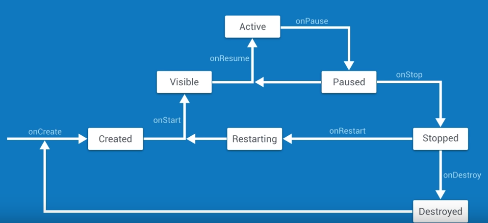
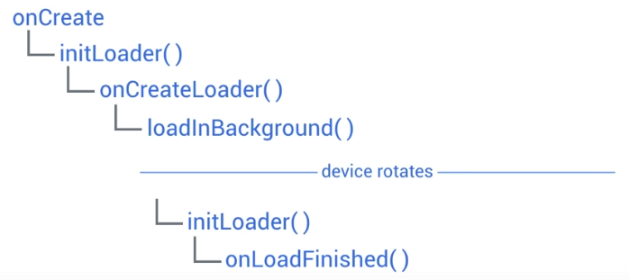

Title: [Android Dev] 2.1 Lifecycles  
Date: 2017-02-11  
Slug:  andev_p2e1_lifecycle  
Tags: android    
Series: Associate Android Developer Fast Track 
 

Android kills background apps !! 

→ ``onCreate()`` → **Created** →``onStart()`` →  **Visible(**can be seen on screen) → ``onResume()`` → **Active**(get focus, can interact with)

**Active** → ``onPause()`` → **Paused**(lose focus — same thing as Visible?) → ``onStop()`` → **Stopped**(disappeared) → ``onDestroy()`` → **Destroyed**(lifecycle ends)

when rotate screen, the function calling is: 

``onPause --> onStop --> onDestroy --> onCreate --> onStart --> onResume``

note: activity will be **destroyed** when device configuration is changed ! 

onSavedInstanceState()
----------------------
so that the app states can be saved when device configuration changes (ex. rotate). 

parameter: a ``Bundle`` to keep state into key-value pairs. 
to pass objects via Bundle: implement the ``Parcelble`` interface. 

Override this ``onSavedInstanceState()`` function → put useful objects into the bundle parameter. 

    // TODO (3) Override onSaveInstanceState to persist data across Activity recreation
    // Do the following steps within onSaveInstanceState
    // TODO (4) Make sure super.onSaveInstanceState is called before doing anything else

    // TODO (5) Put the contents of the TextView that contains our URL into a variable
    // TODO (6) Using the key for the query URL, put the string in the outState Bundle

    // TODO (7) Put the contents of the TextView that contains our raw JSON search results into a variable
    // TODO (8) Using the key for the raw JSON search results, put the search results into the outState Bundle

    @Override
    public void onSaveInstanceState(Bundle outState) {
        super.onSaveInstanceState(outState);
        outState.putString(QUERYURL_KEY, mUrlDisplayTextView.getText().toString());
        outState.putString(RAW_JSON_KEY, mSearchResultsTextView.getText().toString());
    }

in ``onCreate``: try to extract objects form bundle ``savedInstanceState`` (if it's not null). 

    @Override
    protected void onCreate(Bundle savedInstanceState) {
        super.onCreate(savedInstanceState);
        setContentView(R.layout.activity_main);
        mSearchBoxEditText = (EditText) findViewById(R.id.et_search_box);
        mUrlDisplayTextView = (TextView) findViewById(R.id.tv_url_display);
        mSearchResultsTextView = (TextView) findViewById(R.id.tv_github_search_results_json);
        mErrorMessageDisplay = (TextView) findViewById(R.id.tv_error_message_display);
        mLoadingIndicator = (ProgressBar) findViewById(R.id.pb_loading_indicator);
        // TODO (9) If the savedInstanceState bundle is not null, set the text of the URL and search results TextView respectively
        if(savedInstanceState!=null && savedInstanceState.containsKey(QUERYURL_KEY))
            mUrlDisplayTextView.setText(savedInstanceState.getString(QUERYURL_KEY));
        if(savedInstanceState!=null && savedInstanceState.containsKey(RAW_JSON_KEY))
            mSearchResultsTextView.setText(savedInstanceState.getString(RAW_JSON_KEY));
    }

AsyncTasks and Loader
---------------------
edgecase: rotate when async task is performing → asynctask runs on separate thread → the zombie activities will not be killed !!
⇒ ``Loader``
Loader is identified by a loader ID, thus preventing several loaders running in the same time. 

``AsyncTaskLoader`` lifecycle: 
it is bounded to an Activity instead of an async task ⇒ when device rotates, the loader will feed the results of tasks to the right activity. 

Using Loaders
-------------

1. create loader id: ``private static final GITHUB_SEARCH_LOADER = 22;``
2. implement ``LoaderCallbacks`` interface functions in ``MainActivity``
3. init loader with a ``LoaderManager``, and start the loader

let ``MainActivty`` implement ``LoaderManager.LoaderCallbacks<String>``

### implement onCreateLoader — onPreExecute and onDoInBackground for AsyncTask

    // TODO (3) Override onCreateLoader
    @Override
    public Loader<String> onCreateLoader(int id, final Bundle bundle) {// !make bundle final so that can access it below
        // TODO (4) Return a new AsyncTaskLoader<String> as an anonymous inner class with this as the constructor's parameter
        return new AsyncTaskLoader<String>(this) {
            @Override
            public String loadInBackground() {
                return null;
            }
            // TODO (5) Override onStartLoading
            @Override
            protected void onStartLoading() {
                super.onStartLoading();
                // TODO (6) If bundle is null, return.
                if (bundle==null) return;
                // TODO (7) move the content of onPrecuter in the AsyncTask class
                mLoadingIndicator.setVisibility(View.VISIBLE);
                // TODO (8) Force a load
                forceLoad();
            }

            // TODO (9) Override loadInBackground
            @Override
            protected String onLoadInBackground() {
                // TODO (10) Get the String for our URL from the bundle passed to onCreateLoader
                String searchUrlstr= bundle.getString(SEARCH_QUERY_URL_EXTRA);
                // TODO (11) If the URL is null or empty, return null
                if(searchUrlstr==null || TextUtils.isEmpty(searchUrlstr)) return null;
                // TODO (12) Copy the try / catch block from the AsyncTask's doInBackground method
                String githubSearchResults = null;
                try {
                    githubSearchResults = NetworkUtils.getResponseFromHttpUrl(new URL(searchUrlstr));
                } catch (IOException e) {
                    e.printStackTrace();
                }
                return githubSearchResults;
            }
        };
    }

### implement onLoadFinished — onPostExecute for AsyncTask

    // TODO (13) Override onLoadFinished
    @Override
    public void onLoadFinished(Loader<String> loader, String githubSearchResults) {
        // TODO (15) Use the same logic used in onPostExecute to show the data or the error message
        mLoadingIndicator.setVisibility(View.INVISIBLE);
        if (githubSearchResults != null && !githubSearchResults.equals("")) {
            showJsonDataView();
            mSearchResultsTextView.setText(githubSearchResults);
        } else {
            showErrorMessage();
        }
    }

    // TODO (16) Override onLoaderReset as it is part of the interface we implement, but don't do anything in this method
    @Override
    public void onLoaderReset(Loader<String> loader) {

    }

### in makeGithubSearchQuery(): create bundle, create a loder, start it
instead of staring an ``AsyncTask``, we get a Loader and re-run it via a loader manager. 

    // TODO (19) Create a bundle called queryBundle
    Bundle queryBundle = new Bundle();
    // TODO (20) Use putString with SEARCH_QUERY_URL_EXTRA as the key and the String value of the URL as the value
    queryBundle.putString(SEARCH_QUERY_URL_EXTRA, githubSearchUrl.toString());
    // TODO (21) Call getSupportLoaderManager and store it in a LoaderManager variable
    LoaderManager loaderManager = getSupportLoaderManager();
    // TODO (22) Get our Loader by calling getLoader and passing the ID we specified
    Loader loader = loaderManager.getLoader(GITHUB_SEARCH_LOADER);
    // TODO (23) If the Loader was null, initialize it. Else, restart it.
    if(loader==null) loader = loaderManager.initLoader(GITHUB_SEARCH_LOADER, queryBundle, this);
    else loaderManager.restartLoader(GITHUB_SEARCH_LOADER, queryBundle, this);

Caching with loaders
--------------------
Loaders will reload if activity is destroyed and re-created. This overhead can be avoided by caching the results in the ``AsyncTaskLoader`` (created in ``onCreateLoader()``). 

    // TODO (1) Create a String member variable called mGithubJson that will store the raw JSON
    String mGithubJson; // cached results
    @Override
    protected void onStartLoading() {
        /* If no arguments were passed, we don't have a query to perform. Simply return. */
        if (args == null) {
            return;
        }

        /*
            * When we initially begin loading in the background, we want to display the
            * loading indicator to the user
            */
        mLoadingIndicator.setVisibility(View.VISIBLE);

        // TODO (2) If mGithubJson is not null, deliver that result. Otherwise, force a load
        if(mGithubJson!=null) deliverResult(mGithubJson);
        else forceLoad();
    }
    // TODO (3) Override deliverResult and store the data in mGithubJson
    @Override
    public void deliverResult(String data) {
        mGithubJson = data;
    // TODO (4) Call super.deliverResult after storing the data
        super.deliverResult(data);
    }
