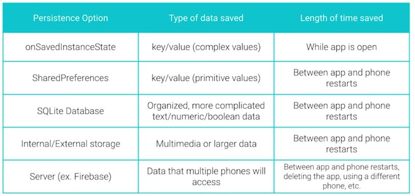
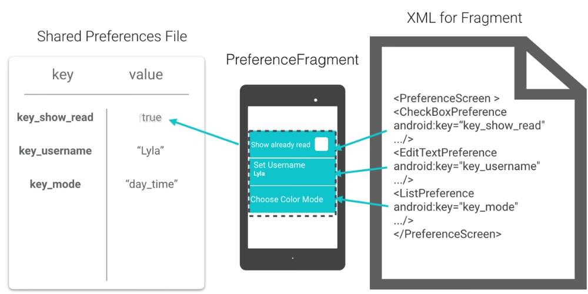
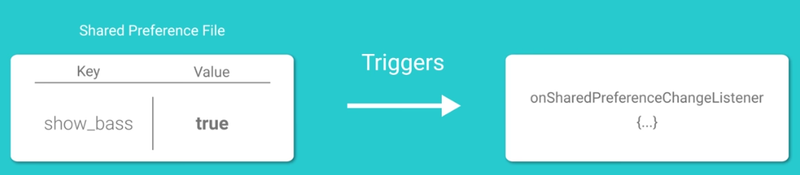

Title: [Android Dev] 2.2 Preference  
Date: 2017-02-12  
Slug:  andev_p2e2_pref  
Tags: android    
Series: Associate Android Developer Fast Track 
 
[TOC]

Save settings and configurations. 

Data Persistance
----------------
5 different ways of data persistance: 

* ``onSavedInstanceState()``: store state of views in k-v pairs (Bundles), used when screen rotates / app killed by system, **temperary.**
* ``SharedPreferences``: save k-v pairs to a file, can save **primitive types**.
* SQLite database: complicated data types
* Internal / External Storage: save large files to local phone, ex. podcast app / camera app.
* Server: ex. leaderboard for a game (Firebase)

PreferenceFragments
-------------------
PreferenceFragment is a class to handle the storing of user preferences. 

### Fragment
``Fragment`` is a class that represents a modular and reusable piece of an ``Activity``. 
ex. a booklist-bookdetail app, for tablets want both screens (list/detail) on the same screen ⇒ put the 2 screens into ``Fragment``s, and re-use them. 

### PreferenceFragment
populated with preferences defined in an XML, 
and (automatically) update k-v pairs in a sharedpref file. 

in the pref XML file: define what are in the preferences, keys(names) and default values, and summary of a pref item. 

Adding a settings screen from a pref-xml file Recipe
----------------------------------------------------

### 1. create a settings activity

* add a menu xml, in the xml, add a menu item
* show menu in mian activity
* when "settings" item is clicked: open settings activity

### 2. create a preferences xml

* setup gradle dependency (build.gradle):

``compile 'com.android.support:preference-v7:25.1.0``'

* create a xml file in ``res/xml`` folder, add CheckBoxPreference. 

    <?xml version="1.0" encoding="utf-8"?>
    <PreferenceScreen xmlns:android="http://schemas.android.com/apk/res/android"
        xmlns:app="http://schemas.android.com/apk/res-auto">
        <CheckBoxPreference
            android:defaultValue="true"
            android:key="show_base"
            android:summaryOff="not shown"
            android:summaryOn="shown"
            app:title="@string/show_base" />
    </PreferenceScreen>

### 3. create a class that extends PreferenceFragment

    // TODO (2) Create a class called SettingsFragment that extends PreferenceFragmentCompat
    public class SettingsFragment extends PreferenceFragmentCompat{
    // TODO (5) In SettingsFragment's onCreatePreferences method add the preference file using the
    // addPreferencesFromResource method
        @Override
        public void onCreatePreferences(Bundle savedInstanceState, String rootKey) {
            addPreferencesFromResource(R.xml.pref_visualizer);
        }
    }

### 4. change root element of settings activity to a fragment

    <?xml version="1.0" encoding="utf-8"?>
    <fragment xmlns:android="http://schemas.android.com/apk/res/android"
        xmlns:tools="http://schemas.android.com/tools"
        android:id="@+id/activity_settings"
        android:name="android.example.com.visualizerpreferences.SettingsFragment"
        android:layout_width="match_parent"
        android:layout_height="match_parent">
    </fragment>

### 5. add a preferenceTheme

in ``res/values/styles.xml``:

``<item name="preferenceTheme">@style/PreferenceThemeOverlay</item>``

### 6. read from SharedPreferences and update

in ``onStart`` or ``onResume`` of main activity: 

    // TODO (2) Get a reference to the default shared preferences from the PreferenceManager class
    SharedPreferences pref = PreferenceManager.getDefaultSharedPreferences(this);
    // TODO (3) Get the value of the show_bass checkbox preference and use it to call setShowBass
    
    mVisualizerView.setShowBass(pref.getBoolean("show_bass", true));

### best practice: using resources instead of using constant iterals everywhere.
i.e. extract strings/bools into strings.xml or bools.xml: 

    <string name="pref_show_bass_title">Show Bass</string>
    <string name="pref_show_bass_key" translatable="false">show_bass</string>
    <string name="pref_show_bass_summaryon">Shown</string>
    <string name="pref_show_bass_summaryoff">Hidden</string>
    <bool name="pref_show_bass_default">true</bool>

in other xml files: 

    <CheckBoxPreference
            android:defaultValue="@bool/pref_show_bass_default"
            android:key="@string/pref_show_bass_key"
            android:summaryOff="@string/pref_show_bass_summaryoff"
            android:summaryOn="@string/pref_show_bass_summaryon"
            android:title="@string/perf_show_bass_title" />

in java files: 

    mVisualizerView.setShowBass(perf.getBoolean(getString(R.string.pref_show_bass_key),
                        getResources().getBoolean(R.bool.pref_show_bass_default)));

PreferenceChangeListener
------------------------
instead of updating preferences in onStart/onResume of main activity, use ``onPreferenceChangeListener``, this is called whenever a sharedpref is changed.  

### Reciept

**step 1**: determine the activity who's UI needs to be changed when pref changes 
— in our case, is the main activity

**step 2**: let this activity implement this Listener (``onSharedPreferenceChange``)

  
    @Override
    public void onSharedPreferenceChanged(SharedPreferences sharedPreferences, String key) {
        if(key.equals(getString(R.string.pref_show_bass_key))){
            mVisualizerView.setShowBass(sharedPreferences.getBoolean(key, true));
        }
    }

**step 3**: link this Listener to the SharedPreference object that it listens to, using ``registerOnSharedPreferenceChangeListener``
in onCreate(): 

    SharedPreferences sharedPreferences = PreferenceManager.getDefaultSharedPreferences(this);
    sharedPreferences.registerOnSharedPreferenceChangeListener(this);

**step 4**: unregister the Listener when activity is shut down
in onDestroy(): 

    @Override
    protected void onDestroy() {
        super.onDestroy();
        PreferenceManager.getDefaultSharedPreferences(this)
                .unregisterOnSharedPreferenceChangeListener(this);
    }

List Preference
---------------
Compared to ``CheckBoxPreference``, ``ListPreference`` offers an array of possible choices. 

### ListPreference Recipe

define options labels/values in ``res/values/strings.xml``:

    <string name="pref_color_key">pref_color</string>
    <string name="pref_color_title">Pick a color</string>
    <string name="pref_color_red_label">Red</string>
    <string name="pref_color_blue_label">Blue</string>
    <string name="pref_color_green_label">Green</string>

    <string name="pref_color_red_value" translatable="false">color_red</string>
    <string name="pref_color_blue_value" translatable="false">color_blue</string>
    <string name="pref_color_green_value" translatable="false">color_green</string>

(note: ``xx_value`` is for internal usage, ``xx_lablel`` is what is shown on screen to users)

create ``res/values/arrays.xml``: 

    <?xml version="1.0" encoding="utf-8"?>
    <!-- TODO (3) Add a res->values->arrays.xml file which contains two arrays, one for
            labels and one for values. The arrays should contain strings found in this file-->
    <resources>
        <array name="pref_color_option_labels">
            <item>@string/pref_color_red_label</item>
            <item>@string/pref_color_blue_label</item>
            <item>@string/pref_color_green_label</item>
        </array>
        <array name="pref_color_option_values">
            <item>@string/pref_color_red_value</item>
            <item>@string/pref_color_blue_value</item>
            <item>@string/pref_color_green_value</item>
        </array>
    </resources>

in preference xml: add a ListPreference element

    <ListPreference
            android:defaultValue="@string/pref_color_red_value"
            android:entries="@array/pref_color_option_labels"
            android:entryValues="@array/pref_color_option_values"
            android:key="@string/pref_color_key"
            android:title="@string/pref_color_title"/>

finally in main activity: 

    String default_color_value = getString(R.string.pref_color_red_value);
    mVisualizerView.setColor(sharedPreferences.getString(getString(R.string.pref_color_key),
                    default_color_value) );

### add summary for list preference
we have to this programatically in the java code. 

Here is the recipe: 

**step 1**: let the SettingsFragment class implement OnSharedPreferenceChangeListener:

    // TODO (1) Implement OnSharedPreferenceChangeListener
    public class SettingsFragment extends PreferenceFragmentCompat implements OnSharedPreferenceChangeListener

**step 2**:set preference's summary by ``setSummary()``:

    // TODO (2) Create a setPreferenceSummary which takes a Preference and String value as parameters.
    // This method should check if the preference is a ListPreference and, if so, find the label
    // associated with the value. You can do this by using the findIndexOfValue and getEntries methods
    // of Preference.
    private void setPreferenceSummary(Preference sharedPref, String value) {
        if (sharedPref instanceof ListPreference) {
            ListPreference listPref = (ListPreference) sharedPref;
            int idx = listPref.findIndexOfValue(value);
            listPref.setSummary(listPref.getEntries()[idx]);
        }
    }

**step 3**: set pref summary in onCreatePreferences: 

    @Override
    public void onCreatePreferences(Bundle bundle, String s) {

        // Add visualizer preferences, defined in the XML file in res->xml->pref_visualizer
        addPreferencesFromResource(R.xml.pref_visualizer);

        // TODO (3) Get the preference screen, get the number of preferences and iterate through
        // all of the preferences if it is not a checkbox preference, call the setSummary method
        // passing in a preference and the value of the preference
        PreferenceScreen prefScreen = getPreferenceScreen();
        int nPrefs = prefScreen.getPreferenceCount();
        for(int i=0; i<nPrefs; i++){
            Preference p = prefScreen.getPreference(i);
            if(p instanceof CheckBoxPreference) continue;
            else {
                String value = prefScreen.getSharedPreferences().getString(p.getKey(), "");
                setPreferenceSummary(p, value);
            }
        }
    }

**step 4**: implement onSharedPreferenceChanged listener: 

    // TODO (4) Override onSharedPreferenceChanged and, if it is not a checkbox preference,
    // call setPreferenceSummary on the changed preference
    @Override
    public void onSharedPreferenceChanged(SharedPreferences sharedPreferences, String key) {
        if (sharedPreferences instanceof CheckBoxPreference) return;
        else{
            Preference pref = findPreference(key);
            String value = sharedPreferences.getString(key, "");
            setPreferenceSummary(pref, value);
        }

    }

**step 5**: finally register/unregister the listener in oncreate/ondestroy: 

    // TODO (5) Register and unregister the OnSharedPreferenceChange listener (this class) in
    // onCreate and onDestroy respectively.
    @Override
    public void onCreate(Bundle savedInstanceState) {
        super.onCreate(savedInstanceState);
        getPreferenceScreen().getSharedPreferences()
                .registerOnSharedPreferenceChangeListener(this);
    }

    @Override
    public void onDestroy() {
        super.onDestroy();
        getPreferenceScreen().getSharedPreferences()
                .unregisterOnSharedPreferenceChangeListener(this);
    }
