title:  (DeepLearning MOOC) Lesson 1: From Machine Learning to Deep Learning        
Date: 2016-06-05     
Slug: dlMOOC_L1    
Tags: deep learning 
Series: Deep Learning udacity MOOC
 

这是udacity上deeplearning的笔记, 做得非常粗糙, 而且这门课也只是介绍性质的... 
<https://www.udacity.com/course/deep-learning--ud730>

Softmax function
----------------
socres ``yi`` ⇒ probabilities ``pi``
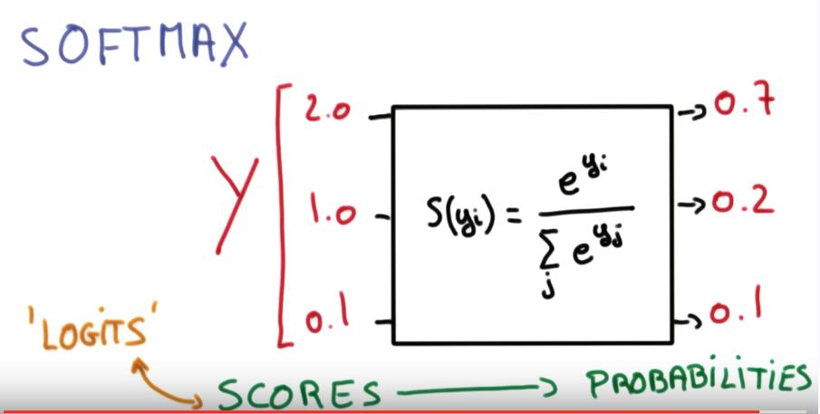

property: **smaller scores ⇒ less certain about result**

Onehot encoding
---------------
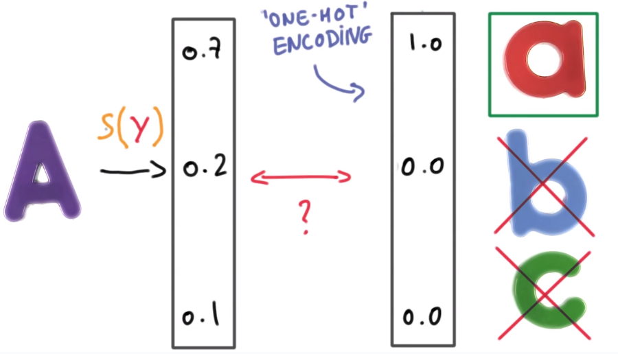

Cross entropy
-------------
*measure how well the probability vector *``S``* corresponds to the label vector *``L``*.* 
⇒ cross entropy ``D(S,L) ``*( D>=0, the smaller the better)*
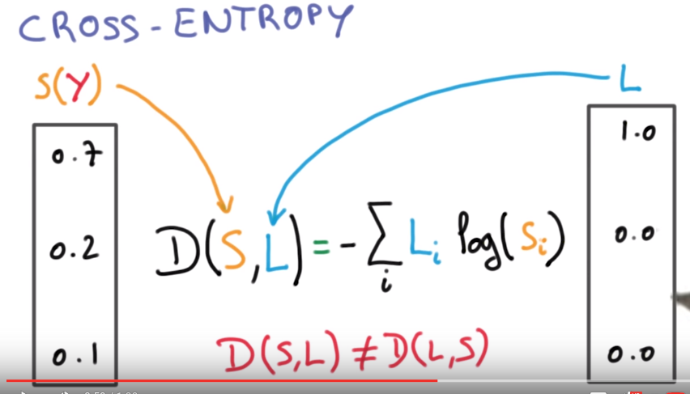

N.B. ``D(S,L)`` is not symmetric (never log 0 ) 

recap ("multinominal logistic classificaton"): 
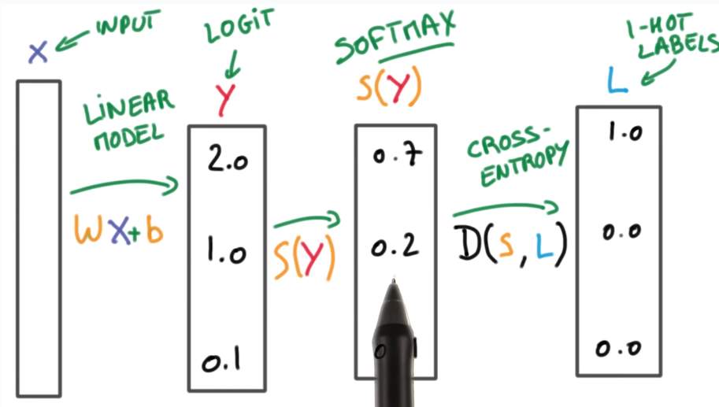

Minimizing cross entropy
------------------------
take avg D as loss function: 
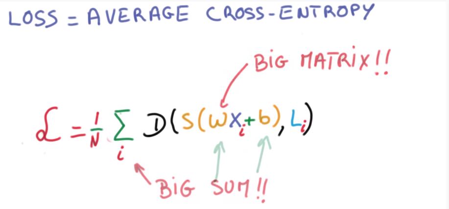
⇒ optimization, for example, by grad-desc: 
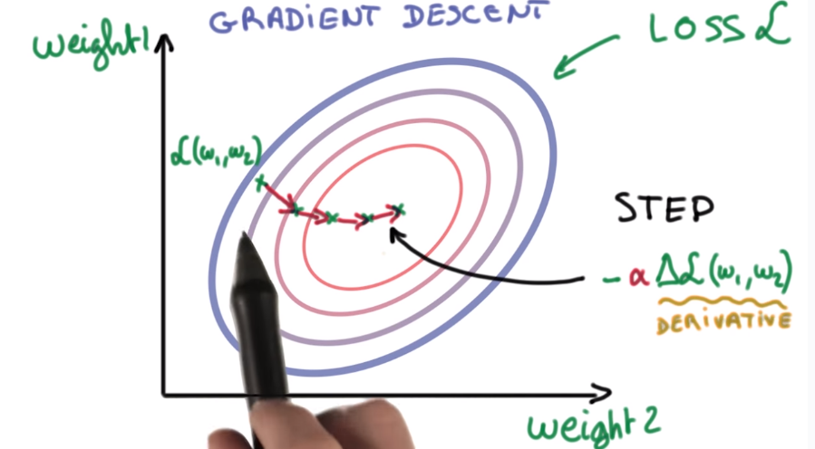

for the moment, take the optimizer as black box. 

two practical problems: 

1. how to feed img pixels to classifiers 
2. how to initialize the optimization

numerical stability
-------------------
adding very small values to very large values will introduce a lot of errors ! 
ex. 

	>>> a = 1e9
	>>> for _ in xrange(1000000):
	...     a += 1e-6
	>>> a - 1e9
	0.95367431640625

⇒ the result is not 1... 

⇒ normalize input ! ⇒ **0 mean, 1 variance**

this make optimizers easier to find optimum. 
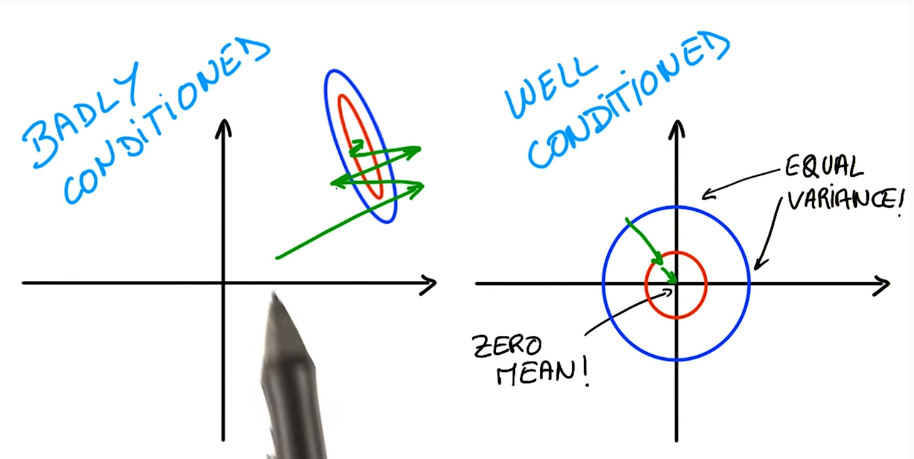

normalization for images: 
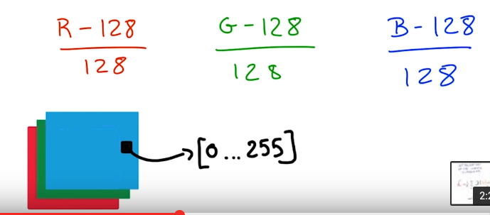

weight initialization
---------------------
draw init w/b from a ``Gaussian(0, sigma)``, sigma → magtitude of initial output. 
small sigma means small outputs → uncertain about result. 
⇒ take small sigma for initialization 
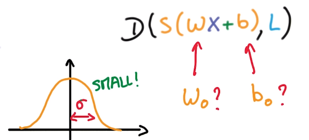

recap: 

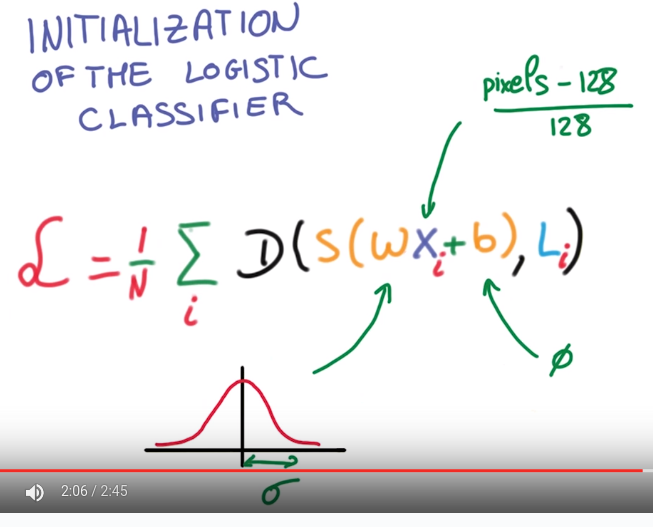
⇒ feed this loss fcn to the optimizer 

training, validation and test dataset
-------------------------------------
**rule of thumb (30)**: 
a change that affects 30 examples in the validation set is statically significant. 
⇒ in most cases use >30000 samples in validation set → changes in 0.1% is significant. 

SGD
---
rule of thumb: computing ``grad(L)`` takes 3x time than computing loss fcn ``L``. → pb for scaling.. 

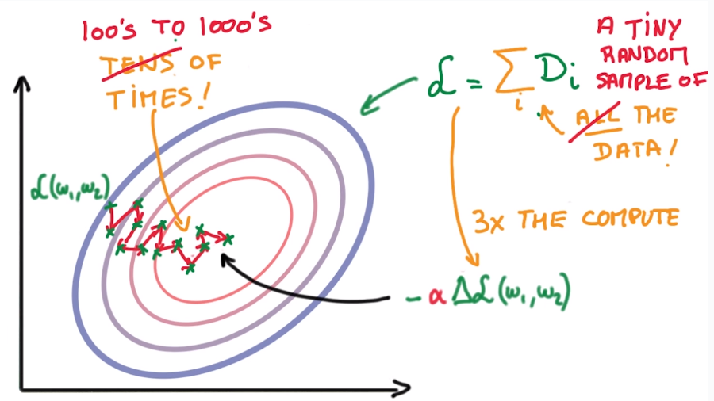
SGD is the only fast enough model in practice. 

tricks to help SGD: 

1. normalize data (0 mean, uni-var)
2. randomly initialize weights
3. **momentum**
4. **learning rate decay**

Momentum
--------
SGD: many small steps in random directions → general direction is more accurate. 
⇒ keep a running average of the gradients

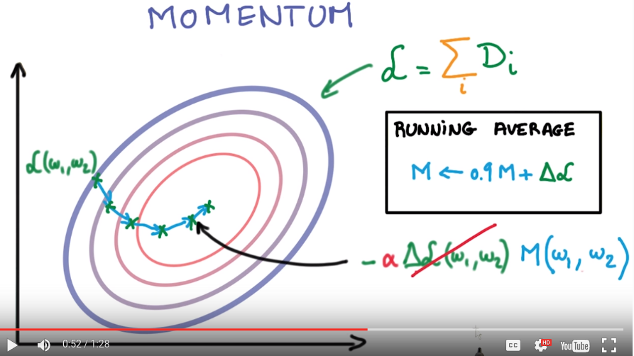

Learning rate decay
-------------------
take smaller and smaller steps (alpha decays)
e.g. alpha decays exponentially...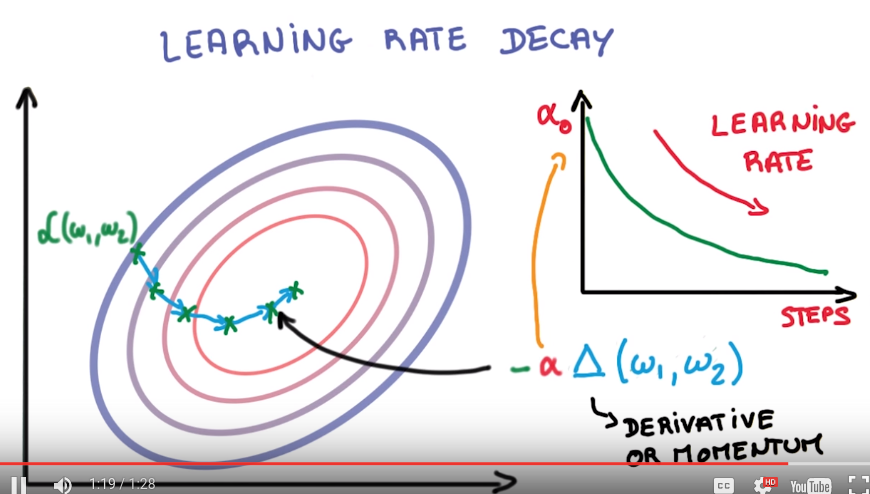

parameter tuning
----------------
how quickly you learning != how well you train.. 
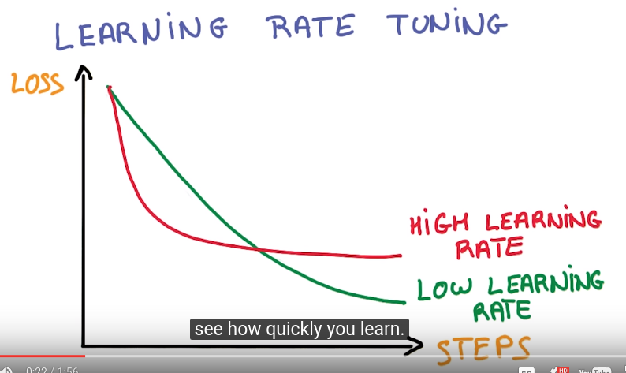
balck magics in deep learning: 
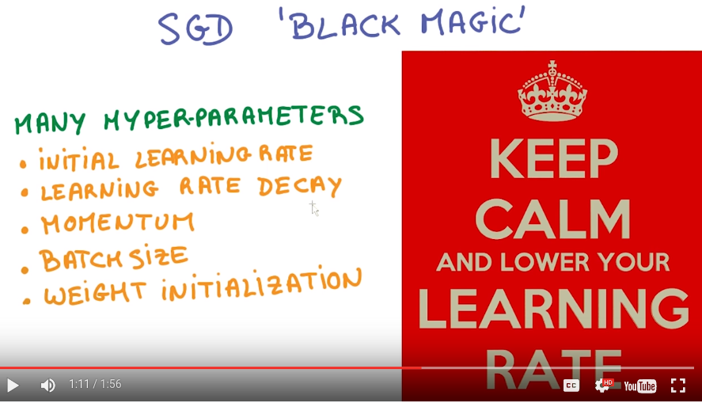

**Adagrad**
variant of SGD, implicitly decays momentum and learning rate. 

recap: 
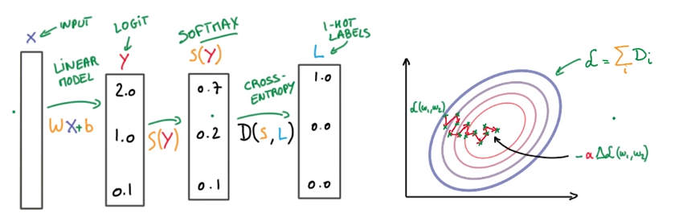
