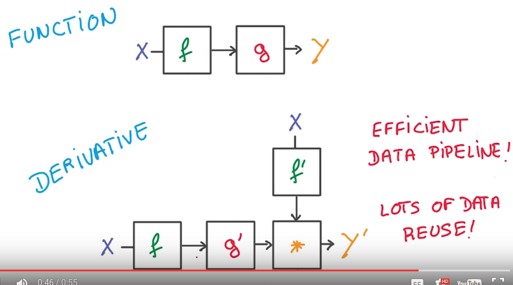
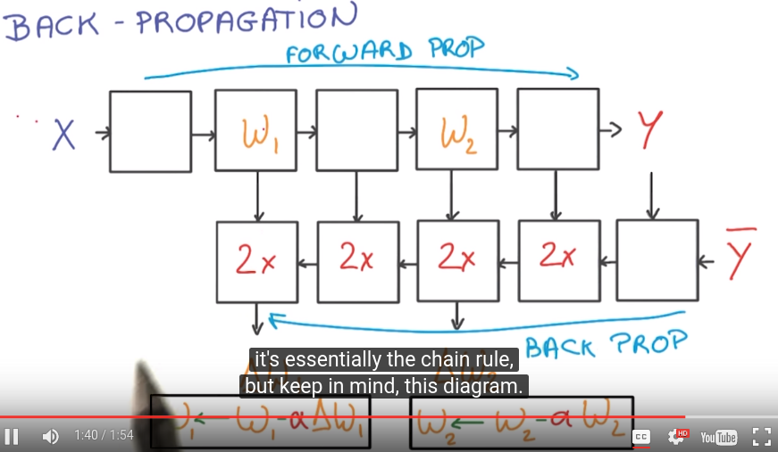
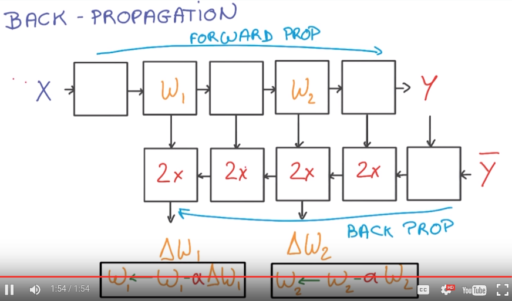
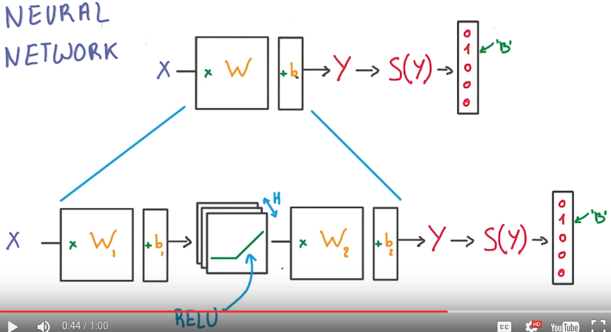
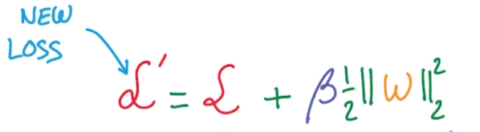
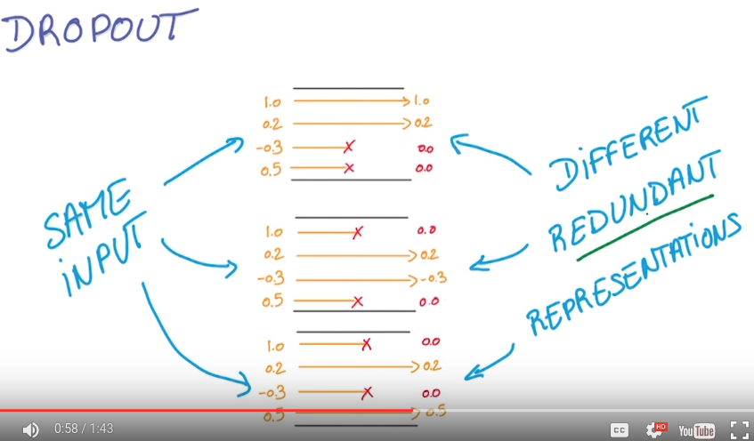
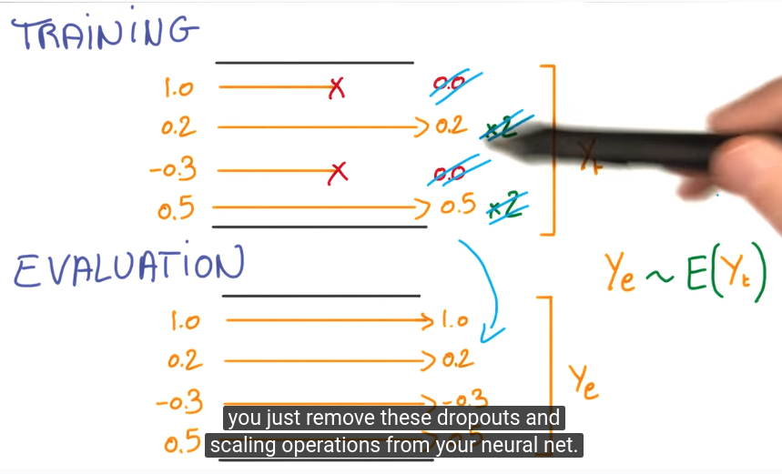

title: (DeepLearning MOOC) Lesson 2: Deep Neural Networks          
Date: 2016-06-05 18:00     
Slug: dlMOOC_L2      
Tags: deep learning   
Series: Deep Learning udacity MOOC
 
[TOC]
  
  
Linear models  
-------------  
matrix multiplication: fast with GPU  
numerically stable  
cannot cocatenate linear units → equivalent to one big matrix...  
  
⇒ add non-linear units in between   
  
  
rectified linear units (RELU)  
-----------------------------  
  
  
  
  
chain rule: efficient computationally  
  
  
  
  
back propagation  
----------------  
easy to compute the gradient as long as the function Y(X) is made of simple blocks with simple deritivates.   
most deep-learning framework can do it automatically for you.   
  
N.B. The backprop block takes 2x memory/compute wrt the forward prop blocks.   
  
  
first neural network: RELU units between linear classifiers:   
  
  
Tensor flow  
-----------  
``tensors`` define computations, and they are nodes in a computation ``graph``.   
To actually run the optimization, use ``sessions``...  
  
define a computation graph:   
  
	batch_size = 128  
	num_hidden = 1024  
	  
	graph = tf.Graph()  
	with graph.as_default():  
	  
	  # Input data. For the training data, we use a placeholder that will be fed  
	  # at run time with a training minibatch.  
	  tf_train_dataset = tf.placeholder(tf.float32,  
										shape=(batch_size, image_size * image_size))  
	  tf_train_labels = tf.placeholder(tf.float32, shape=(batch_size, num_labels))  
	  tf_valid_dataset = tf.constant(valid_dataset)  
	  tf_test_dataset = tf.constant(test_dataset)  
	    
	  # Variables for linear layer 1  
	  W1 = tf.Variable(  
		tf.truncated_normal([image_size * image_size, num_hidden]))  
	  b1 = tf.Variable(tf.zeros([num_hidden]))  
	    
	  # Hidden RELU input computation  
	  y1 = tf.matmul(tf_train_dataset, W1) + b1  
	  # Hidden RELU output computation  
	  X1 = tf.nn.relu(y1)   
	  
	  # Variables for linear layer 2  
	  W2 = tf.Variable(  
		tf.truncated_normal([num_hidden, num_labels]))#W2  
	  b2 = tf.Variable(tf.zeros([num_labels])) #b2  
	  # logit (y2) output  
	  logits = tf.matmul(X1, W2) + b2  
	  loss = tf.reduce_mean(  
		tf.nn.softmax_cross_entropy_with_logits(logits, tf_train_labels))  
	    
	  def getlogits(X):  
		y1 = tf.matmul(X, W1) + b1  
		X1 = tf.nn.relu(y1)  
		return tf.matmul(X1, W2) + b2  
	  
	  # Optimizer.  
	  optimizer = tf.train.GradientDescentOptimizer(0.5).minimize(loss)  
	    
	  # Predictions for the training, validation, and test data.  
	  train_prediction = tf.nn.softmax(logits)  
	  valid_prediction = tf.nn.softmax( getlogits(tf_valid_dataset) )  
	  test_prediction = tf.nn.softmax( getlogits(tf_test_dataset))  
  
run sgd optimization:   
  
	num_steps = 3001  
	  
	with tf.Session(graph=graph) as session:  
	  tf.initialize_all_variables().run()  
	  print("Initialized")  
	  for step in range(num_steps):  
		# Pick an offset within the training data, which has been randomized.  
		# Note: we could use better randomization across epochs.  
		offset = (step * batch_size) % (train_labels.shape[0] - batch_size)  
		# Generate a minibatch.  
		batch_data = train_dataset[offset:(offset + batch_size), :]  
		batch_labels = train_labels[offset:(offset + batch_size), :]  
		# Prepare a dictionary telling the session where to feed the minibatch.  
		# The key of the dictionary is the placeholder node of the graph to be fed,  
		# and the value is the numpy array to feed to it.  
		feed_dict = {tf_train_dataset : batch_data, tf_train_labels : batch_labels}  
		_, l, predictions = session.run(  
		  [optimizer, loss, train_prediction], feed_dict=feed_dict)  
		if (step % 500 == 0):  
		  print("Minibatch loss at step %d: %f" % (step, l))  
		  print("Minibatch accuracy: %.1f%%" % accuracy(predictions, batch_labels))  
		  print("Validation accuracy: %.1f%%" % accuracy(  
			valid_prediction.eval(), valid_labels))  
	  print("Test accuracy: %.1f%%" % accuracy(test_prediction.eval(), test_labels))  
  
  
Regularization  
--------------  
  
* early termination: stop when cannot improve in validation performance.   
* L2 regularization: adding L2 norm of   
  
  
  
Dropout  
-------  
def. **activation** is the output of last layer that flows into the next layer.   
dropout: *randomly set half of activations to 0*.  
  
rational: forcing your model to learn reduadant representations (consus over an ensemble of nns...)...   
  
  
N.B.  
for evaluation no longer dropout, ``ye`` = average of activations, trick to let ``ye=E(yt)``, in training, multiply the remaining activations by 2.  
  
  
  
