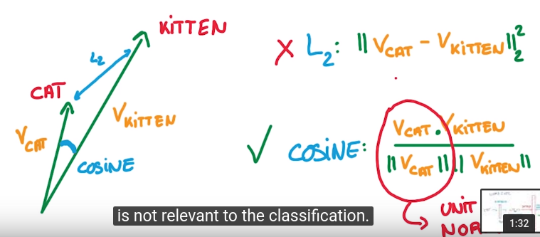
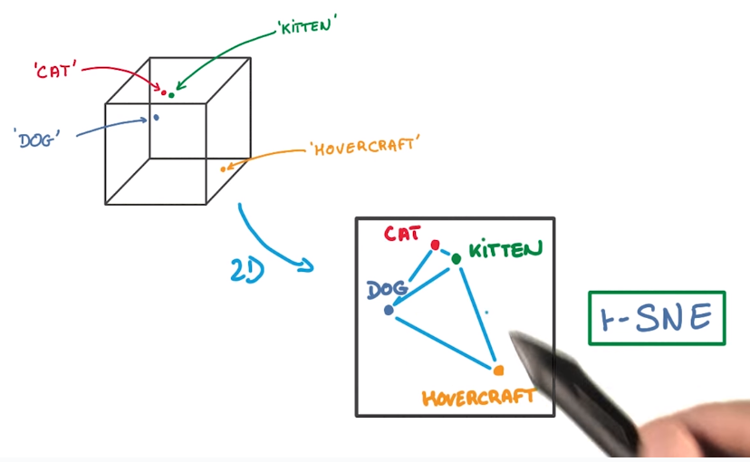

title: (DeepLearning MOOC) Lesson 4: Deep Models for Text and Sequences     
Date: 2016-06-07           
Slug: dlMOOC_L4          
Tags: deep learning    
  
problems with text:   
  
1. often very rare word is important, e.g. *retinopathy*  
2. ambiguity: e.g. *cat* and *kitty*  
  
→ need a lot of labeled data ⇒ not realistic.   
⇒ **unsupervised learning**  
  
similar words appear in similar context.   
embedding: map words to small vectors  
  
measure the closeness by cosine distance:   
  
  
word2vec  
--------  
initial: random vector  
→ train model to predict nearby word.   
  
  
pb: too many words in dictionary → softmax too slow  
⇒ random sample the non-target words   
  
  
  
  
  
tSNE  
----  
dimension reduction (not PCA) that preserves the neighborhood structure (close vector → close in 2d as well).   
  
  
  
RNN  
---  
treat varaible length sequences of words.   
use the current word (Xi) and the last prediction as input.   
  
  
backprop for RNN  
----------------  
apply highly correlated derivatives to W → not good for SGD.   
  
  
pb if we use highly correlated updates: grad either explod or it disappear quickly.   
  
  
  
fix grad-exploding: *clip*  
  
  
grad-vanishing: memory loss in RNN  
⇒ LSTM  
  
LSTM  
----  
in RNN: replace the NN by a LSTM cell  
  
  
  
represent the system with memory by a diagram with logical gates:   
  
  
change the decision variables to continous:  
  
a logistic regression in each gate: controls when to remember and when to forget things.   
  
<http://blog.csdn.net/dark_scope/article/details/47056361>  
  
  
  
  
regularization for LSTM:  
  
* L2 regularization: OK  
* dropout: OK when used for input/output (X and Y), but NOT use to the recurrent in/out.  
  
  
beam search  
-----------  
beam search is for *generating* sequences by RNN.   
  
Greedy approach: at each step, *sample* from the predicted distribution of the RNN.   
  
smarter approach:   
predict more steps and pick the seq with largest proba.   
  
pb with this: the number of possible seq grows exponentially   
⇒ just keep the few most promising seqs → "**Beam search"**  
  
  
seq to seq  
----------  
RNN: model to map vaiable length seq to fix-length vectors.   
  
Beam search: sequence generation (map fix-length vectors to seq)  
  
  
concat them together: seq to seq system  
  
  
e.g.   
translation, speech recognation, image captionning  
