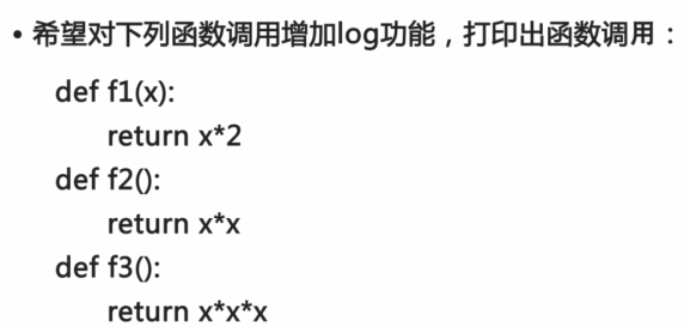
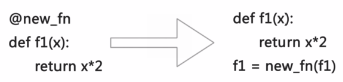
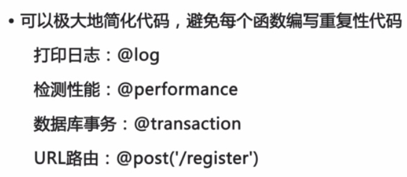

Title: [python进阶课程] 函数式编程  
Date: 2016-02-17   
Slug:  imooc_py_functional  
Tags: python  
Series: python进阶课程
 
[TOC]  
   
<http://www.imooc.com/learn/317>
  
  
函数式编程: 更抽象, 更脱离指令(计算机), 更贴近计算(数学).   
  
* 不需要变量 (python允许有变量, 所以python非纯函数式)  
* 高阶函数  
* 闭包: 返回函数  
* 匿名函数  
  
  
高阶函数  
-------  
  
* 变量可以指向函数 ``f=abs; f(-10)``  
* 函数名: 就是指向函数的变量 ``abs=len``  
* 高阶函数: 接收函数作为参数的函数  
  
	def add(x,y,f):   
		return f(x)+f(y)  
	add(-5, 9, abs)  
  
  
### map()  
``map()``是 Python 内置的高阶函数，它接收一个函数 f 和一个 list，并通过把函数 f 依次作用在 list 的每个元素上，得到一个新的 list 并返回。map()函数不改变原有的 list，而是返回一个新的 list。  
  
	def format_name(s):  
	    return s.title()  
	print map(format_name, ['adam', 'LISA', 'barT'])  
  
  
### reduce()  
``reduce()``函数也是Python内置的一个高阶函数。reduce()函数接收的参数和 map()类似，一个函数 f，一个list，但行为和 map()不同，reduce()传入的函数 f 必须接收两个参数，reduce()对list的每个元素反复调用函数f，并返回最终结果值。  

>``reduce(function, iterable[, initializer])``  
Apply function of two arguments cumulatively to the items of iterable, from left to right, so as to reduce the iterable to a single value.  If the optional initializer is present, it is placed before the items of the iterable in the calculation, and serves as a default when the iterable is empty. If initializer is not given and iterable contains only one item, the first item is returned.   
  
### filter()  
filter()函数接收一个函数 f 和一个list，这个函数 f 的作用是对每个元素进行判断，返回 True或 False，filter()根据判断结果自动过滤掉不符合条件的元素，返回由符合条件元素组成的新list。  
  
### 自定义sorted()  
sorted()也是一个高阶函数，它可以接收一个比较函数``cmp``来实现自定义排序，比较函数的定义是，传入两个待比较的元素 x, y，如果 x 应该排在 y 的前面，返回 -1，如果 x 应该排在 y 的后面，返回 1。如果 x 和 y 相等，返回 0。  
  
### 返回函数  
在函数内部定义一个函数 然后返回这个内部定义的函数.   
*返回函数可以把一些计算延迟执行*  

	def calc_sum(lst):  
	    def lazy_sum():  
	        return sum(lst)  
	    return lazy_sum  
  
调用``calc_sum()``并没有计算出结果，而是返回函数:  

	>>> f = calc_sum([1, 2, 3, 4])  
	>>> f  
	<function lazy_sum at 0x1037bfaa0>  
  
对返回的函数进行调用时，才计算出结果:  

	>>> f()  
	10  
  
  
### 闭包  
函数``f``内部定义的函数``g``无法被外部访问 → 可以防止其他代码调用``g``. 
  
	def calc_sum(lst):  
	    def lazy_sum():  
	        return sum(lst)  
	    return lazy_sum  
  
注意: 发现没法把 ``lazy_sum`` 移到 ``calc_sum`` 的外部，因为它*引用了 calc_sum 的参数* ``lst``。  
像这种**内层函数引用了外层函数的变量（参数也算变量），然后返回内层函数**的情况，称为闭包（Closure）。  
  
闭包的特点是返回的函数还引用了外层函数的局部变量，所以，要正确使用闭包，就要*确保引用的局部变量在函数返回后不能变*。  
ex:   

	# 希望一次返回3个函数，分别计算1x1,2x2,3x3:  
	def count():  
	    fs = []  
	    for i in range(1, 4):  
	        def f():  
	             return i*i  
	        fs.append(f)  
	    return fs  
	f1, f2, f3 = count()  
  
以为调用f1()，f2()和f3()结果应该是1，4，9，但实际结果全部都是 9 !  原因就是当count()函数返回了3个函数时，这3个函数所引用的变量 i 的值已经变成了3。*函数只在执行时才去获取外层参数i*, 由于f1、f2、f3并没有被调用，所以，此时他们并未计算 i*i，当 f1 被调用时i已经变为3...   
上面的正确写法是:   

	def count():  
	    fs = []  
	    for i in range(1, 4):  
	        def f(j=i):   
	            return j*j  
	        fs.append(f)  
	    return fs  
	f1, f2, f3 = count()  
	print f1(), f2(), f3()  
  
**因此，返回函数不要引用任何循环变量，或者后续会发生变化的变量。**  
  
### 匿名函数  
Python中，对匿名函数提供了有限支持。   
关键字``lambda`` 表示匿名函数，冒号前面的 x 表示函数参数。匿名函数有个限制，就是只能有一个表达式，不写return，返回值就是该表达式的结果。  
  
	map(lambda x: x * x, [1, 2, 3, 4, 5, 6, 7, 8, 9])  
	myabs = lambda x: -x if x < 0 else x   
	>>> myabs(-1)  
	1  
  
  
装饰器  
-------  
  
问题: 定义了函数, 想在运行时增加函数功能同时不改动函数代码.  
ex. 希望函数调用时打印调用日志  
  
⇒ 方法: 高阶函数: **接收要修改的函数, 进行包装后返回包装过的新函数.**    
  
	def new_f(f):  
		def fn(x):  
			print 'call %s()' % f.__name__  
			return f(x)  
		return fn  
  
函数``new_fn``就是所谓装饰器函数. python的@语法可以简化装饰器调用:   
  
(注意: 右边代码, 原本未装饰的f1函数已经被彻底隐藏了. )  
优点: 极大简化代码.    
  
  
### 无参数decorator  
上面例子里面的``new_fn``函数只能装饰接收一个参数x的函数, 想要处理接收任意参数的函数 ⇒ 利用Python的 ``*args`` 和 ``**kw``  
	def log(f):  
	    def fn(*args, **kw):  
	        print 'call %s() in %s'%( f.__name__, time.ctime() )  
	        return f(*args, **kw)  
	    return fn  
  
  
### 带参数decorator  
接上面的log函数, 如果有的函数非常重要，希望打印出'[INFO] call xxx()...'，有的函数不太重要，希望打印出'[DEBUG] call xxx()...'，这时，log函数本身就需要传入'INFO'或'DEBUG'这样的参数，类似这样：  
  
	@log('DEBUG')  
	def my_func():  
	    pass  
  
把上面的定义翻译成高阶函数的调用，就是：  
``my_func = log('DEBUG')(my_func)``  
再展开一下：  
  
	log_decorator = log('DEBUG')  
	my_func = log_decorator(my_func)  
  
相当于:   
  
	log_decorator = log('DEBUG')  
	@log_decorator  
	def my_func():  
	    pass  
          
所以，带参数的log函数*首先***返回一个decorator函数***，再让这个decorator函数接收my_func并返回新函数*：  
  
	def log(prefix):  
	    def log_decorator(f):  
	        def wrapper(*args, **kw):  
	            print '[%s] %s()...' % (prefix, f.__name__)  
	            return f(*args, **kw)  
	        return wrapper  
	    return log_decorator  
	@log('DEBUG')  
	def test():  
	    pass  
	print test()  

这里用到了闭包: 最里层wrapper函数(即修饰过个函数)用到了prefix参数.   
  
### 完善decorator  
上面的decorator会修改函数名:   
  
* 在没有decorator的情况下，打印函数名：  
      
        def f1(x):  
            pass  
        print f1.__name__  
      
⇒ 输出： f1  
  
* 有decorator的情况下，再打印函数名：  
  
        def log(f):  
            def wrapper(*args, **kw):  
                print 'call...'  
                return f(*args, **kw)  
            return wrapper  
        @log  
        def f2(x):  
            pass  
        print f2.__name__  
  
⇒ 输出： wrapper  
  
这对于那些依赖函数名的代码就会失效。decorator还改变了函数的``__doc__``等其它属性。如果要让调用者看不出一个函数经过了@decorator的“改造”，就需要*把原函数的一些属性复制到新函数中*：  

	def log(f):  
	    def wrapper(*args, **kw):  
	        print 'call...'  
	        return f(*args, **kw)  
	    wrapper.__name__ = f.__name__  
	    wrapper.__doc__ = f.__doc__  
	    return wrapper  

这样写很不方便, Python内置的``functools``可以用来自动化完成这个“复制”的任务：  
  
	import functools  
	def log(f):  
	    @functools.wraps(f)  
	    def wrapper(*args, **kw):  
	        print 'call...'  
	        return f(*args, **kw)  
	    return wrapper  
  
``functools.wraps(f)``是一个装饰器函数, 目的是为了把最后返回的函数再次装饰(复制f的属性进去)... 所以对于带参数的装饰器, 应该在最里面返回的wrapper函数前加上``@functools.wraps(f)``  
  
	import time, functools  
	def performance(unit):  
	    def perf_decorator(f):  
	        @functools.wraps(f)  
	        def wrapper(*args, **kw):  
	            print 'call %s() in %s %s'%( f.__name__, time.time(), unit ) #closure  
	            return f(*args, **kw)  
	        return wrapper  
	    return perf_decorator  
	@performance('ms')  
	def factorial(n):  
	    return reduce(lambda x,y: x*y, range(1, n+1))  
	print factorial.__name__  
  
  
### 偏函数  
假设要转换大量的二进制字符串，每次都传入``int(x, base=2)``非常麻烦，于是，我们想到，可以定义一个int2()的函数，默认把base=2传进去：  
  
	def int2(x, base=2):  
	    return int(x, base)  
	  
  
``functools.partial``可以把一个参数多的函数变成一个参数少的新函数，少的参数需要在创建时指定默认值，这样，新函数调用的难度就降低了。  

>``functools.partial(func[,*args][, **keywords])``  
Return a new partial object which when called will behave like func called with the positional arguments args and keyword arguments keywords.  

	import functools  
	int2 = functools.partial(int, base=2)  
	>>> int2('1000000')  
	64  
	>>> int2('1010101')  
	85  
	  
	sorted_ignore_case = functools.partial(sorted, key=lambda s:s.lower())  
	print sorted_ignore_case(['bob', 'about', 'Zoo', 'Credit'])  
