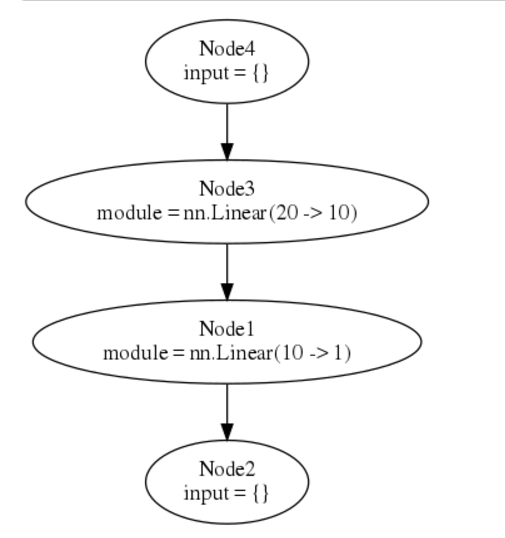

Title: [learning torch] 5. nngraph (another way to construct nn)   
Date: 2016-10-08  15:00 
Slug: learn-torch-5-nngraph 
Tags: torch   
Series: torch学习笔记 
 
[TOC]
      
 
ref: <http://rnduja.github.io/2015/10/07/deep_learning_with_torch_step_4_nngraph/>   
doc: <https://github.com/torch/nngraph/> 
 
The aim of this library is to provide users of nn package with tools to easily create complicated architectures.  
 
``luarocks install nngraph`` 
 
optionally can install ``graphvis`` for graph visualization.  
 
From previous posts, to build networks, there are 2 important classes:  
 
 
* ``Module`` as a nn layer, can do forward and backward prop 
* ``Container`` to combine several ``Module``s 
 
 
>The nngraph library provides a way to build any complex network focusing on the network graph and avoiding the use of Containers.  
 
nngraph.Node 
------------ 
 
Any ``Module`` can be wrapped into a ``nngraph.Node``.  
 
For all ``nn.Module``, nngraph overrides the ``__call__`` meta method (the function call operator ``()``), by *calling* a module, a ``Node`` is returned:  
 
	th> require 'nngraph'; 
	                                                                      [0.0000s]	 
	th> module = nn.Identity() 
	                                                                      [0.0001s]	 
	th> module 
	nn.Identity 
	                                                                      [0.0000s]	 
	th> module() 
	nngraph.Node 
	                                                                      [0.0000s] 
	 
 
The arguments of  ``__call__`` are other (parent) nodes that come into this node, in this way we specify which module(s) will feed into the current node/module: 
 
	th> h1 = nn.Linear(20, 10)() 
	                                                                      [0.0001s]	 
	th> h2 = nn.Linear(10, 1)(h1) -- h1 is input of h2  
	                                                                      [0.0001s] 

 
Simple sequential example 
------------------------- 
 
We make a network by calling ``nn.gModulet()``, this takes 2 arguments: a table of ``inputs``, and a table of ``outputs``:  
 
	th> mlp = nn.gModule({h1}, {h2}) 
	                                                                      [0.0002s] 

 
Then we can plot the model using graphviz:  
 
	-- draw graph (the forward graph, '.fg'), use it with itorch notebook 
	graph.dot(model.fg, 'MLP') 
	-- or save graph to file MLP.svg and MLP.dot 
	graph.dot(model.fg, 'MLP', 'MLP') 
 
  
 
(The first and last nodes are dummy nodes and regroup all inputs and outputs of the graph.) 
 
DAG example 
----------- 
 
<https://github.com/torch/nngraph#a-network-with-2-inputs-and-2-outputs> 
 
Here is an example to build a model with 2 inputs and 2 outputs:  
 
	h1 = nn.Linear(20, 20)() 
	h2 = nn.Linear(10, 10)() 
	hh1 = nn.Linear(20, 1)(nn.Tanh()(h1)) 
	hh2 = nn.Linear(10, 1)(nn.Tanh()(h2)) 
	madd = nn.CAddTable()({hh1, hh2}) 
	oA = nn.Sigmoid()(madd) 
	oB = nn.Tanh()(madd) 
	gmod = nn.gModule({h1, h2}, {oA, oB}) 
	 
	x1 = torch.rand(20) 
	x2 = torch.rand(10) 
	 
	gmod:updateOutput({x1, x2}) 
	gmod:updateGradInput({x1, x2}, {torch.rand(1), torch.rand(1)}) 
	graph.dot(gmod.fg, 'Big MLP') 
 
alternatively, **use **``-``** to make your code looks like the data flow**: 
 
	h1 = - nn.Linear(20,20) 
	h2 = - nn.Linear(10,10) 
	hh1 = h1 - nn.Tanh() - nn.Linear(20,1) 
	hh2 = h2 - nn.Tanh() - nn.Linear(10,1) 
	madd = {hh1,hh2} - nn.CAddTable() 
	oA = madd - nn.Sigmoid() 
	oB = madd - nn.Tanh() 
	gmod = nn.gModule( {h1,h2}, {oA,oB} ) 
 
 
Annotations of nodes 
-------------------- 
 
<https://github.com/torch/nngraph#annotations> 
 
Use ``node::annotate()`` to annotated nodes, can add name/description, or change node color. 
 
WIth annotation, can enable debugging too:  
 
<https://github.com/torch/nngraph#debugging> 
