Title: lin-reg = max-likelihood: 贝叶斯视角看线性回归   
date: 2015-09-26   
Slug: linreg-bayes   
Tags: ml   
   
   
几乎所有的ml课都是从线性回归讲起, ETH的课也不例外. 不过这次老师用了贝叶斯的视角讲这个问题, 自从高中接触丁老师讲的线性回归以来 第一次听到一个不同于最小二乘的解读, 感觉很有意思. 又想起来刘未鹏那篇非常棒的[博客](http://mindhacks.cn/2008/09/21/the-magical-bayesian-method/), 于是想记录一下.    
   
notation   
--------   
首先有n个数据点:    
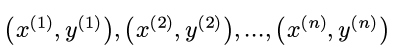   
其中y是实数, 每个x有d个维度, 为了方便表示截距, 再给x加入一个始终等于1的维度:    
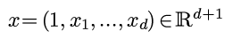   
例子: y代表房价, x代表了房子的面积, 使用时间, 距离市中心的距离等因素.   
   
least square viewpoint   
----------------------   
在最小二乘的视角里, 线性回归是用一个x的线性函数拟合y:    
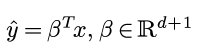   
使得拟合结果和观测结果的误差尽量小.    
不过这次不说最小二乘, 所以接下来不讨论这个思路...   
   
assumptions in Bayes viewpoint   
------------------------------   
在贝叶斯视角里, 我们假设:   
**假设1. y = 某个x的线性函数 + 观测噪音**   
即:    
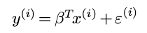   
其中εi是一个*随机变量*, 所以y也是一个随机变量.    
另外再有一个比较强的假设:   
**假设2.  ε服从centered高斯分布, iid.**   
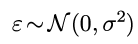   
(btw, 对一个随机变量建模, 一般来说, 连续随机变量就用高斯, 离散随机变量用泊松)   
   
Bayes formula   
-------------   
贝叶斯公式长这个样子:    
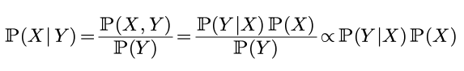   
只看最左边和最右边的内容, 表达为:    
>posterior = likelihood * prior   
后验概率 = 可能性 * 先验概率   

(上面其实应该是"正比于"而不是等号, 由于P(Y)我们并不关心, 所以可以直接忽略之)   
   
公式里Y代表可以观察到结果, X代表结果背后不能直接观察的量(*不要和数据里的XY混淆...*).    
贝叶斯公式的意义在于, 让我们从可观测的Y反推不可观测的X的概率. 既然我们已经得到了观测结果Y, 那么找到使得后验概率最大的X就说明我们在观测基础上得到了最可信的X的估计.    
   
那么在我们这个问题里, X代表模型, 即某一个β的取值; Y代表观测结果, 即我们看到的n个数据点.    
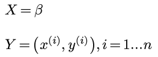   
所以我们的问题就是: 在已经有了这些观测点的基础之上, 应该选那个β的取值, 使得后验概率最大?   
   
lin-reg = max-likelihood   
------------------------   
线性回归认为, 对于任意的β的取值, 其先验概率都是一样的, 所以在贝叶斯公式里可以忽略ℙ(X), 只需要考虑最大化likelihood ℙ(Y|​X)即可 — 再一次, 不要把贝叶斯的XY和数据的X和Y混淆...    
即选择β:   
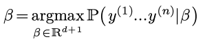    
由于随机变量y只是随机变量ε的一个函数(且给定β, ε和y一一对应):    
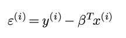   
所以可以最大化ε的likelihood:    
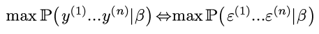   
由于之前对ε有假设:    
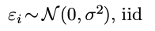   
那么:    
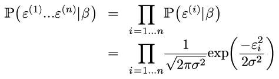   
(不要以为ε独立于β: ε=y - βt x, 所以上面表达式里其实还是有β的. )   
⇒ 两边取log并加上负号:    
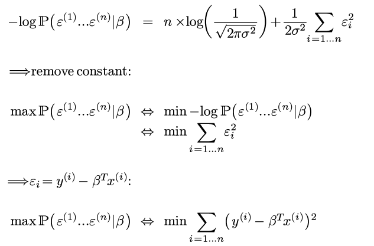   
Voila, 所以极大似然=最小二乘!    
对, 饶了一圈还是最小二乘, 但是这样的意义变了, 明白了为什么要最小化平方误差这个值.   
   
precise solution to linreg   
--------------------------   
(notation有点混乱了, 之前贝叶斯里面应该用AB而不是用XY的orz...)   
每个x是一个列向量, 这里, 把所有数据用矩阵形式表示:    
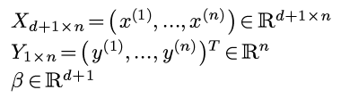   
矩阵表示的好处是平方误差可以用矩阵表示:    
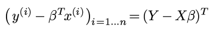   
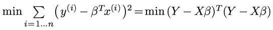   
对矩阵运算求偏导, 偏导为0的时候即可得到最优的β:   
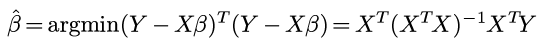   
   
