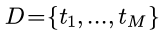
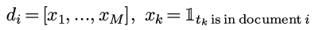
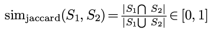
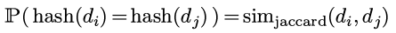
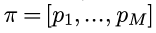
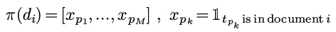
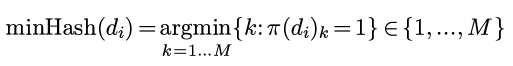
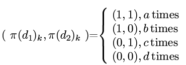
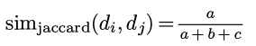
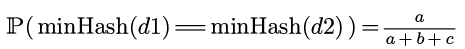

title: minHash: 一种快速approximate retrieval方法   
Date: 2015-09-27 11:00
Slug: minhash
Tags: ml

**approximate retrieval**(相似搜索)这个问题之前实习的时候就经常遇到: 如何快速在大量数据中如何找出相近的数据.    
   
问题描述: 假设有N个数据, 并且对于他们有一个相似度(或距离)的度量函数``sim(i,j)``, 我们的问题就是如何快速找出所有N个点中相似度较大的i和j组合.    
   
乍一看这个问题必须要对所有的(i,j)计算相似度, 但是N^2的复杂度在N太大的情况下是不能够忍受的.    
   
   
kdtree   
------   
之前在algo-note里面遇到过[kdtree](http://x-wei.github.io/algoI_week5_2.html), 用它可以使得寻找nearest neighbor的复杂度减少到logN. 但是这种情况对于维度低一点(比如二三维)的情况合适, 维度到了成千上万的时候并不是很好的选择, 所以这里不多讨论.    
   
simhash   
-------   
另一个思路是, 使用某个hash函数, 对于每一个数据计算一个哈希值. 这个hash函数要满足: **当i和j的相似度很高的时候, hash(i)和hash(j)的值(很可能)相同.** 这次介绍的minHash就是这样的一种方法.    
   
Jaccard similarity   
------------------   
明确问题含义, 首先需要定义相似度. 这里主要考虑文本相似度的问题, 假设字典D有M个term(term可以是单词, 也可以是n-gram或叫shingle):   
   
   
一段文本(document i)可以用binary vectorization变为一个binary的向量:    
   
(这里没有用TF或者TFIDF, 只用一个简单的binary向量化, 因为只有binary的时候才适合我们接下来的推导...)   
   
每个document可以看作一些term的*集合*, 集合之间的相似度有一个经典的度量: jaccard similarity.   
对集合S1和S2, 他们的相似度定义为:    
   
也很好理解, 重合部分比例越高相似度就越高, 另外jaccard-sim取值在0到1之间.    
   
对于document i和j, 他们的向量形式分别是di和dj. 现在我们希望计算hash(di)和hash(dj), 使得:    
   
   
   
minHash   
-------   
min hash的思路是这样的, 首先生成一个随机的(1...M)的排序(permutation)π:    
   
   
然后, 对于每个document d, 都按照这个permutation, 把d的分量从新排列:    
   
   
然后定义``minHash(di)``为permutation以后的di里的第一个不为0的位置:    
   
(上面个公式里d的下标只是代表第i个文本, 并不代表分量... 我应该写上标的..)   
所以``minHash()``返回1到M之间的一个数.    
   
proof   
-----   
现在证明一下为什么这样选择minHash函数可以保证两个文本的哈希值相等的概率为他们的jaccard similarity.    
   
对于d2和d2, 我们分别查看π(d1)和π(d2)的每个分量, 这两个数有(11), (10), (01), (00)这四种可能, 分别记每种可能性的出现次数为a,b,c,d:    
   
那么jaccard similarity可以表示为:    
   
再看``minHash()``是如何计算的, 当π(d1)_k和π(d2)_k都为0的时候会继续增加k, 一直到π(d1)_k和π(d2)_k中某一个为1.    
那么``minHash(d1)==minHash(d2)``的情况就是二者都为1的情况, 这种情况的可能性为:    
   
这个概率恰好就是jaccard similarity.    
   
   
   
